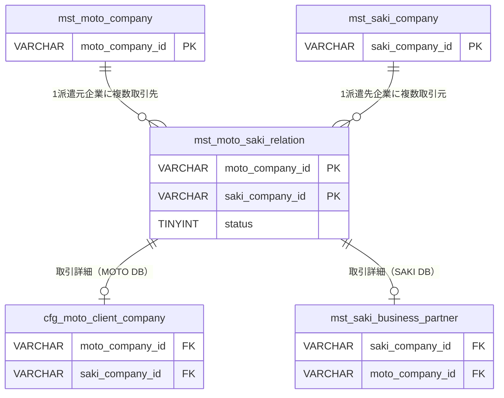
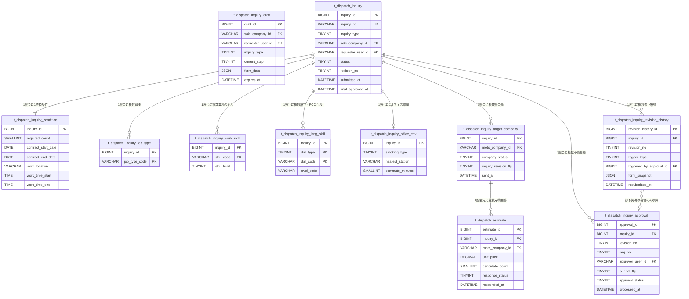
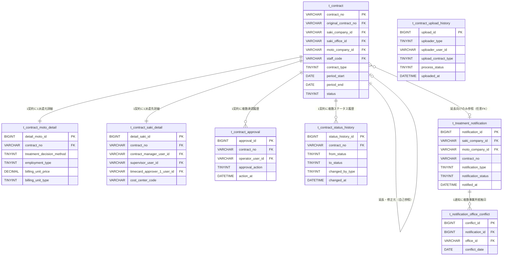
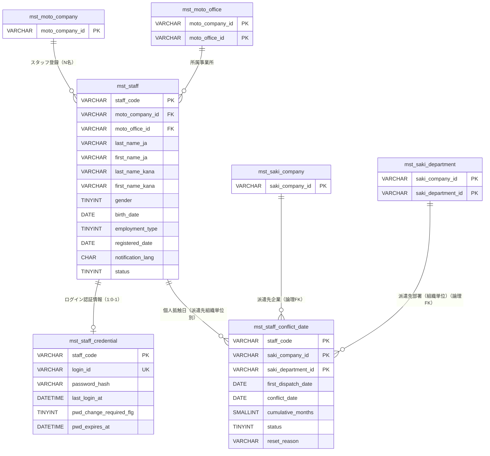
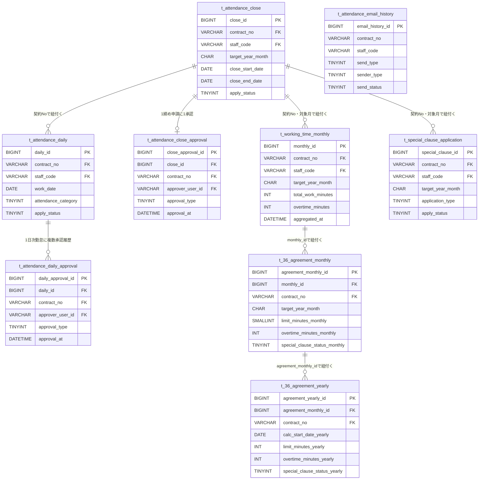
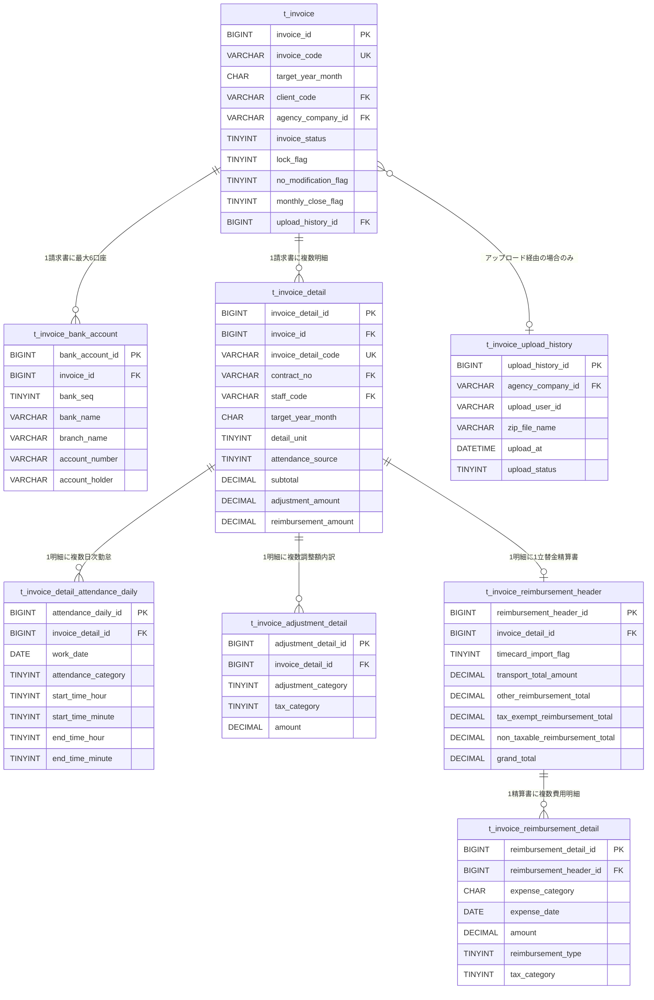

```mermaid
erDiagram
    mst_saki_company {
        VARCHAR company_id PK
        VARCHAR official_name_ja
        TINYINT treatment_priority_master
    }
    mst_saki_office {
        VARCHAR company_id PK
        VARCHAR office_id PK
        TINYINT conflict_date_type
        DATE conflict_date
    }
    mst_saki_department {
        VARCHAR company_id PK
        VARCHAR department_id PK
        VARCHAR approval_group_id FK
    }
    mst_saki_user {
        VARCHAR company_id PK
        VARCHAR user_id PK
        VARCHAR office_id FK
        VARCHAR department_id FK
        TINYINT reference_scope
    }
    mst_saki_user_scope {
        BIGINT scope_id PK
        VARCHAR user_id FK
        TINYINT scope_type
        VARCHAR target_id
    }
    mst_saki_approval_group {
        VARCHAR company_id PK
        VARCHAR approval_group_id PK
    }
    mst_saki_approval_group_user {
        VARCHAR company_id PK
        VARCHAR approval_group_id PK
        VARCHAR user_id PK
    }
    mst_saki_custom_job_type {
        VARCHAR company_id PK
        VARCHAR custom_job_type_id PK
    }
    mst_saki_custom_job_type_skill {
        VARCHAR company_id PK
        VARCHAR custom_job_type_id PK
        VARCHAR skill_code PK
        TINYINT skill_level
    }
    mst_saki_conflict_date_office {
        VARCHAR company_id PK
        VARCHAR conflict_date_office_id PK
        DATE conflict_date
    }
    cfg_saki_work_schedule_default {
        BIGINT schedule_default_id PK
        VARCHAR company_id FK
        TINYINT parent_type
        VARCHAR parent_id
    }
    cfg_saki_treatment_info {
        BIGINT treatment_info_id PK
        VARCHAR company_id FK
        TINYINT parent_type
        VARCHAR parent_id
    }
    t_saki_opinion_hearing {
        BIGINT hearing_id PK
        VARCHAR company_id FK
        TINYINT parent_type
        VARCHAR parent_id
    }
    cfg_saki_contract_item_control {
        VARCHAR company_id PK
    }
    cfg_saki_contract_remarks_control {
        BIGINT remarks_ctrl_id PK
        VARCHAR company_id FK
        TINYINT remarks_type
        TINYINT seq_no
    }
    mst_saki_business_partner {
        VARCHAR company_id PK
        BIGINT partner_auto_id PK
    }
    cfg_saki_permission_setting {
        VARCHAR company_id PK
        TINYINT role_type PK
        TINYINT feature_type PK
    }
    cfg_saki_alarm_setting {
        BIGINT alarm_setting_id PK
        VARCHAR company_id FK
        TINYINT alarm_type
        TINYINT send_flg
    }
    cfg_saki_alarm_send_condition {
        BIGINT condition_id PK
        BIGINT alarm_setting_id FK
        TINYINT send_condition_type
    }
    cfg_saki_alarm_specified_user {
        BIGINT specified_user_id PK
        BIGINT alarm_setting_id FK
        VARCHAR user_id FK
    }
    cfg_saki_36_agreement_alarm {
        VARCHAR company_id PK
    }
    cfg_saki_holiday {
        BIGINT holiday_setting_id PK
        VARCHAR company_id FK
    }
    cfg_saki_specified_date {
        BIGINT specified_date_id PK
        BIGINT holiday_setting_id FK
        TINYINT date_type
        DATE target_date
    }

    mst_saki_company ||--o{ mst_saki_office : "事業所"
    mst_saki_company ||--o{ mst_saki_department : "部署"
    mst_saki_company ||--o{ mst_saki_user : "ユーザ"
    mst_saki_user ||--o{ mst_saki_user_scope : "参照範囲（任意設定時）"
    mst_saki_company ||--o{ mst_saki_approval_group : "承認グループ"
    mst_saki_approval_group ||--o{ mst_saki_approval_group_user : "所属ユーザ"
    mst_saki_company ||--o{ mst_saki_custom_job_type : "カスタム職種"
    mst_saki_custom_job_type ||--o{ mst_saki_custom_job_type_skill : "スキル設定"
    mst_saki_company ||--o{ mst_saki_conflict_date_office : "抵触日適用事業所"
    mst_saki_company ||--o{ cfg_saki_work_schedule_default : "勤務形態初期値（企業・部署を多態参照）"
    mst_saki_company ||--o{ cfg_saki_treatment_info : "待遇情報（企業・事業所・抵触日事業所を多態参照）"
    mst_saki_company ||--o{ t_saki_opinion_hearing : "意見聴取結果（事業所・抵触日事業所を多態参照）"
    mst_saki_company ||--o| cfg_saki_contract_item_control : "契約項目制御"
    mst_saki_company ||--o{ cfg_saki_contract_remarks_control : "契約備考欄制御"
    mst_saki_company ||--o{ mst_saki_business_partner : "取引先企業"
    mst_saki_company ||--o{ cfg_saki_permission_setting : "権限設定（ロール×機能）"
    mst_saki_company ||--o{ cfg_saki_alarm_setting : "アラーム設定（個人・事業所抵触日）"
    cfg_saki_alarm_setting ||--o| cfg_saki_alarm_send_condition : "送信条件（A:間隔 / B:日付）"
    cfg_saki_alarm_setting ||--o{ cfg_saki_alarm_specified_user : "宛先指定ユーザ"
    mst_saki_company ||--o| cfg_saki_36_agreement_alarm : "36協定アラーム"
    mst_saki_company ||--o{ cfg_saki_holiday : "休日設定"
    cfg_saki_holiday ||--o{ cfg_saki_specified_date : "指定休日・指定出勤日"
```

```mermaid
erDiagram
    mst_moto_company {
        VARCHAR company_id PK
        VARCHAR official_name_ja
        TINYINT qualified_invoice_status
    }
    mst_moto_company_contact {
        VARCHAR company_id PK
        TINYINT seq_no PK
    }
    mst_moto_office {
        VARCHAR company_id PK
        VARCHAR office_id PK
    }
    mst_moto_department {
        VARCHAR company_id PK
        VARCHAR department_id PK
    }
    mst_moto_user {
        VARCHAR company_id PK
        VARCHAR user_id PK
        VARCHAR office_id FK
        VARCHAR department_id FK
        VARCHAR client_code FK
    }
    mst_moto_attendance_category {
        VARCHAR company_id PK
        INT category_code PK
    }
    cfg_moto_client_company {
        VARCHAR company_id PK
        VARCHAR client_code PK
    }
    cfg_moto_client_company_user {
        VARCHAR company_id PK
        VARCHAR client_code PK
        VARCHAR user_id PK
    }
    mst_moto_contract_company {
        VARCHAR company_id PK
        VARCHAR contract_company_code PK
    }
    cfg_moto_contract_default {
        VARCHAR company_id PK
    }
    cfg_moto_contract_additional_text {
        VARCHAR company_id PK
    }
    cfg_moto_contract_text_per_client {
        VARCHAR company_id PK
        VARCHAR contract_company_code PK
    }
    cfg_moto_invoice_default {
        VARCHAR company_id PK
    }
    cfg_moto_invoice_calculation {
        VARCHAR company_id PK
        TINYINT invoice_format
    }
    cfg_moto_invoice_fraction {
        VARCHAR company_id PK
        TINYINT fraction_type PK
        TINYINT method
    }
    cfg_moto_bank_account {
        VARCHAR company_id PK
        TINYINT account_seq PK
    }
    cfg_moto_seal {
        VARCHAR company_id PK
        TINYINT invoice_seal_output_type
    }
    cfg_moto_seal_per_client {
        VARCHAR company_id PK
        VARCHAR client_code PK
    }
    cfg_moto_advance_payment_screen {
        VARCHAR company_id PK
        TINYINT apply_seq PK
    }
    cfg_moto_36_agreement {
        VARCHAR company_id PK
        TINYINT agreement_seq PK
        TINYINT special_clause_flg
    }
    cfg_moto_36_agreement_free {
        VARCHAR company_id PK
    }
    cfg_moto_36_overtime_start {
        VARCHAR company_id PK
        TINYINT overtime_yearly_start_month
    }
    cfg_moto_legal_holiday {
        VARCHAR company_id PK
        TINYINT legal_holiday_type
    }
    cfg_moto_compensatory_holiday {
        VARCHAR company_id PK
    }
    cfg_moto_alarm_conflict {
        VARCHAR company_id PK
        TINYINT send_flg
    }
    cfg_moto_alarm_36 {
        VARCHAR company_id PK
        TINYINT send_flg
    }
    cfg_moto_alarm_36_recipient {
        VARCHAR company_id PK
        TINYINT recipient_type PK
        VARCHAR user_id FK
    }

    mst_moto_company ||--o{ mst_moto_company_contact : "担当者（最大2件）"
    mst_moto_company ||--o{ mst_moto_office : "事業所"
    mst_moto_company ||--o{ mst_moto_department : "部署"
    mst_moto_company ||--o{ mst_moto_user : "ユーザ"
    mst_moto_company ||--o{ mst_moto_attendance_category : "勤怠区分"
    mst_moto_company ||--o{ cfg_moto_client_company : "取引派遣先"
    cfg_moto_client_company ||--o{ cfg_moto_client_company_user : "担当ユーザ紐付け"
    mst_moto_company ||--o{ mst_moto_contract_company : "契約先企業名"
    mst_moto_company ||--o| cfg_moto_contract_default : "契約書初期値"
    mst_moto_company ||--o| cfg_moto_contract_additional_text : "契約書追加文言（全社）"
    mst_moto_company ||--o{ cfg_moto_contract_text_per_client : "契約書追加文言（契約先別）"
    mst_moto_company ||--o| cfg_moto_invoice_default : "請求書初期値"
    mst_moto_company ||--o| cfg_moto_invoice_calculation : "請求書計算方法"
    cfg_moto_invoice_calculation ||--o{ cfg_moto_invoice_fraction : "端数処理設定（最大6種）"
    mst_moto_company ||--o{ cfg_moto_bank_account : "振込先口座（最大6件）"
    mst_moto_company ||--o| cfg_moto_seal : "印影設定"
    cfg_moto_seal ||--o{ cfg_moto_seal_per_client : "印影（派遣先別）"
    mst_moto_company ||--o{ cfg_moto_advance_payment_screen : "立替金画面設定"
    mst_moto_company ||--o{ cfg_moto_36_agreement : "36協定（最大20件）"
    mst_moto_company ||--o| cfg_moto_36_agreement_free : "36協定（自由入力）"
    mst_moto_company ||--o| cfg_moto_36_overtime_start : "時間外集計開始月"
    mst_moto_company ||--o| cfg_moto_legal_holiday : "法定休日設定"
    mst_moto_company ||--o| cfg_moto_compensatory_holiday : "振替休日設定"
    mst_moto_company ||--o| cfg_moto_alarm_conflict : "個人抵触日アラーム"
    mst_moto_company ||--o| cfg_moto_alarm_36 : "36協定アラーム"
    cfg_moto_alarm_36 ||--o{ cfg_moto_alarm_36_recipient : "アラーム宛先（受信者種別別）"
```

# Data Properties

Created by: anannnnn
Created time: April 23, 2026 2:44 PM
Last edited by: anannnnn
Last updated time: June 1, 2026 12:57 PM

## 凡例

| 記号 | 説明 |
| --- | --- |
| PK | 主キー |
| FK | 外部キー |
| UQ | ユニーク制約 |
| IDX | インデックス |
| NN | NOT NULL |
| ✓ | 該当 |
| TBD | 未確定（要確認） |

**入力可能文字タイプ**

| タイプ | 説明 |
| --- | --- |
| 半角カナ以外 | 半角カナを除く全文字（全角日本語含む） |
| 半角英数字 | a-z / A-Z / 0-9 |
| 半角英数字記号 | 禁止文字（`' = % _`）以外の半角文字 |
| 数字のみ | 0-9 の半角数字 |

**共通システムカラム（全テーブル共通付与）**

| 論理名 | 物理名 | データ型 | NN |
| --- | --- | --- | --- |
| 作成日時 | created_at | DATETIME | ✓ |
| 更新日時 | updated_at | DATETIME | ✓ |
| 作成者ID | created_by | VARCHAR(100) | ✓ |
| 更新者ID | updated_by | VARCHAR(100) | ✓ |

---

## **SAKI情報**

### テーブル一覧

ja

| No. | 論理名 | 物理名 | 概要 |
| --- | --- | --- | --- |
| 1 | SAKI_初期設定認証情報 | saki_init_setup_credential | 企業初回セットアップ用の一時認証情報 |
| 2 | SAKI_企業マスタ | mst_saki_company | 基本情報 + 待遇設定メタ情報のみ |
| 3 | SAKI_事業所マスタ | mst_saki_office | 基本情報 + 抵触日設定のみ |
| 4 | SAKI_部署マスタ | mst_saki_department | 基本情報 + 承認設定 + 契約担当者初期値のみ |
| 5 | SAKI_ユーザマスタ | mst_saki_user | 基本情報 + 権限 + 承認設定（参照範囲は mst_saki_user_scope へ） |
| 6 | SAKI_ユーザ参照範囲 | mst_saki_user_scope | ユーザ個別参照事業所・部署（JSON廃止） |
| 7 | SAKI_承認グループマスタ | mst_saki_approval_group | 承認グループ情報 |
| 8 | SAKI_承認グループ所属ユーザ | mst_saki_approval_group_user | 承認グループとユーザの紐付け |
| 9 | SAKI_カスタム職種マスタ | mst_saki_custom_job_type | 自社カスタム職種の管理 |
| 10 | SAKI_カスタム職種スキル設定 | mst_saki_custom_job_type_skill | カスタム職種に紐づくスキルコードとレベル |
| 11 | SAKI_抵触日適用事業所マスタ | mst_saki_conflict_date_office | 基本情報 + 抵触日のみ |
| 12 | SAKI_勤務形態初期値 | cfg_saki_work_schedule_default | 企業・部署の勤務形態初期値を統合管理 |
| 13 | SAKI_待遇情報 | cfg_saki_treatment_info | 企業・事業所・抵触日適用事業所の待遇情報を統合管理 |
| 14 | SAKI_意見聴取結果 | t_saki_opinion_hearing | 事業所・抵触日適用事業所の意見聴取結果 |
| 15 | SAKI_契約項目制御情報 | cfg_saki_contract_item_control | コストセンター欄の制御のみ（備考欄は cfg_saki_contract_remarks_control へ） |
| 16 | SAKI_契約備考欄制御 | cfg_saki_contract_remarks_control | 備考欄・備考コード欄・選択式備考欄のN件制御 |
| 17 | SAKI_取引先企業情報 | mst_saki_business_partner | 取引先企業情報 |
| 18 | SAKI_権限設定 | cfg_saki_permission_setting | 28フラグ列 → ジャンクションテーブル |
| 19 | SAKI_アラーム設定 | cfg_saki_alarm_setting | 個人・事業所抵触日アラームを1テーブルに統合 |
| 20 | SAKI_アラーム送信条件 | cfg_saki_alarm_send_condition | アラーム送信条件（A:間隔回数 / B:日付指定）を分離 |
| 21 | SAKI_アラーム宛先指定ユーザ | cfg_saki_alarm_specified_user | ユーザ指定宛先（JSON廃止） |
| 22 | SAKI_36協定アラーム設定 | cfg_saki_36_agreement_alarm | 36協定アラームメール設定 |
| 23 | SAKI_休日設定 | cfg_saki_holiday | 企業の休日情報（適用期間単位） |
| 24 | SAKI_指定休日・指定出勤日 | cfg_saki_specified_date | 指定休日・指定出勤日の個別日付管理 |

en

| No. | Logical Name | Physical Name | Overview |
| --- | --- | --- | --- |
| 1 | SAKI Temporary setup credential | tmp_saki_setup_credential | Temporary credential information for setup of the company |
| 2 | Company master | mst_saki_company | Basic info + treatment settings metadata only |
| 3 | Office master | mst_saki_office | Basic info + conflict date settings only |
| 4 | Department master | mst_saki_department | Basic info + approval settings + contract manager defaults only |
| 5 | User master | mst_saki_user | Basic info + permissions + approval settings (reference scope moved to mst_saki_user_scope) |
| 6 | User reference scope | mst_saki_user_scope | Per-user accessible offices/departments (replaces JSON) |
| 7 | Approval group master | mst_saki_approval_group | Approval group information |
| 8 | Approval group members | mst_saki_approval_group_user | Mapping of approval groups and users |
| 9 | Custom Job type master | mst_saki_custom_job_type | 自社カスタム職種の管理 |
| 10 | Custom Job type skill settings | mst_saki_custom_job_type_skill | カスタム職種に紐づくスキルコードとレベル |
| 11 | Conflict-date-applicable office master | mst_saki_conflict_date_office | Basic info + conflict date only |
| 12 | Work schedule defaults | cfg_saki_work_schedule_default | Consolidated management of company/department work schedule defaults |
| 13 | Treatment/benefit information | cfg_saki_treatment_info | Consolidated management of treatment info for company/office/conflict-date-applicable office |
| 14 | Opinion hearing results | t_saki_opinion_hearing | Opinion hearing results for offices and conflict-date-applicable offices |
| 15 | Contract item control | cfg_saki_contract_item_control | Cost center field control only (remarks fields moved to cfg_saki_contract_remarks_control) |
| 16 | Contract remarks field control | cfg_saki_contract_remarks_control | N-row control for remarks fields, remarks code fields, and selectable remarks fields |
| 17 | Business partner information | mst_saki_business_partner | Business partner company information |
| 18 | Permission settings | cfg_saki_permission_setting | 28 flag columns → junction table |
| 19 | Alarm settings | cfg_saki_alarm_setting | Personal and office conflict date alarms consolidated into 1 table |
| 20 | Alarm send conditions | cfg_saki_alarm_send_condition | Alarm send conditions (A: interval/count / B: date-specified) separated out |
| 21 | Alarm specified recipient users | cfg_saki_alarm_specified_user | User-specified recipients (replaces JSON) |
| 22 | Article 36 agreement alarm settings | cfg_saki_36_agreement_alarm | Article 36 agreement alarm email settings |
| 23 | Holiday settings | cfg_saki_holiday | Company holiday information (per application period) |
| 24 | Designated holidays / designated workdays | cfg_saki_specified_date | Individual date management for designated holidays and designated workdays |

### **ER構成（テキスト）**

```
tmp_saki_setup_credential

mst_saki_company (1)
  ├── (1) cfg_saki_work_schedule_default [parent_type=1]
  ├── (1) cfg_saki_treatment_info        [parent_type=1]
  ├── (N) mst_saki_office                [company_id]
  │     ├── (1) cfg_saki_treatment_info  [parent_type=2]
  │     └── (N) t_saki_opinion_hearing   [parent_type=1]
  ├── (N) mst_saki_department            [company_id]
  │     └── (1) cfg_saki_work_schedule_default [parent_type=2]
  ├── (N) mst_saki_user                  [company_id]
  │     └── (N) mst_saki_user_scope      [user_id]
  ├── (N) mst_saki_approval_group        [company_id]
  │     └── (N) mst_saki_approval_group_user
  ├── (N) mst_saki_custom_job_type       [company_id]
  │     └── (N) mst_saki_custom_job_type_skill
  ├── (N) mst_saki_conflict_date_office  [company_id]
  │     ├── (1) cfg_saki_treatment_info  [parent_type=3]
  │     └── (N) t_saki_opinion_hearing   [parent_type=2]
  ├── (1) cfg_saki_contract_item_control [company_id]
  ├── (N) cfg_saki_contract_remarks_control [company_id]
  ├── (N) mst_saki_business_partner      [company_id]
  ├── (N) cfg_saki_permission_setting    [company_id]
  ├── (N) cfg_saki_alarm_setting         [company_id]
  │     ├── (1) cfg_saki_alarm_send_condition
  │     └── (N) cfg_saki_alarm_specified_user
  ├── (1) cfg_saki_36_agreement_alarm    [company_id]
  └── (N) cfg_saki_holiday               [company_id]
        └── (N) cfg_saki_specified_date  [holiday_setting_id]
```



### テーブル定義

#### **SAKI初期設定認証情報 / tmp_saki_setup_credential**

ja

概要: 企業の初回セットアップ前に発行する一時認証情報。ユーザーはこのID/パスワードでログインし、企業・事業所・部署・ユーザー情報を登録する。セットアップ完了後は `setup_completed_flg=1` に更新し無効化する。

| No. | 論理名 | 物理名 | データ型 | 桁数 | バイト数 | NN | PK | FK先 | デフォルト | 備考 |
| --- | --- | --- | --- | --- | --- | --- | --- | --- | --- | --- |
| 1 | 企業ID | company_id | VARCHAR(16) | 16 | 16 | ✓ | ✓ | FK制約なし |  | 予約発行された企業ID。セットアップ完了後に mst_saki_company へ登録する |
| 2 | 一時ユーザーID | temp_user_id | VARCHAR(16) | 16 | 16 | ✓ |  |  |  | ログインID。4バイト以上。半角英数字 |
| 3 | パスワードハッシュ | password_hash | VARCHAR(255) | 255 | 255 | ✓ |  |  |  | bcrypt等のハッシュ値 |
| 4 | セットアップ完了フラグ | setup_completed_flg | TINYINT(1) | 1 | 1 | ✓ |  |  | 0 | 0:未完了（セットアップ画面へ強制遷移） 1:完了（無効化） |
| 5 | 有効期限 | expires_at | DATETIME | - | - | ✓ |  |  |  | 期限切れ後はログイン不可 |

en

TODO

#### **SAKI企業マスタ / mst_saki_company**

ja

| No. | 論理名 | 物理名 | データ型 | 桁数 | バイト数 | NN | PK | FK先 | デフォルト | 備考 |
| --- | --- | --- | --- | --- | --- | --- | --- | --- | --- | --- |
| 1 | 企業ID | company_id | VARCHAR(16) | 16 | 16 | ✓ | ✓ |  |  |  |
| 2 | 正式企業名（日本語） | official_name_ja | VARCHAR(100) | 100 | 100 | ✓ |  |  |  |  |
| 3 | 正式企業名（カナ） | official_name_kana | VARCHAR(200) | 200 | 200 | ✓ |  |  |  |  |
| 4 | システム表示企業名（日本語） | display_name_ja | VARCHAR(24) | 24 | 24 | ✓ |  |  |  |  |
| 5 | 郵便番号 | postal_code | CHAR(7) | 7 | 7 | ✓ |  |  |  |  |
| 6 | 住所１ | address_ja | VARCHAR(50) | 50 | 50 | ✓ |  |  |  |  |
| 7 | 住所２ | address2_ja | VARCHAR(50) | 50 | 50 |  |  |  | NULL | 住所1に文字数が入らない場合、または改行して表示したい場合に入力 |
| 8 | 正式企業名（英字） | official_name_en | VARCHAR(100) | 100 | 100 |  |  |  | NULL | 半角英数字記号 |
| 9 | システム表示企業名（英字） | display_name_en | VARCHAR(24) | 24 | 24 |  |  |  | NULL |  |
| 10 | 待遇情報設定優先マスタ | treatment_priority_master | TINYINT | 1 | 1 |  |  |  | NULL | 0:企業マスタ優先 1:事業所マスタ優先 |
| 11 | 派遣先均等均衡方式 | equal_pay_method | TEXT | 7000 | 7000 |  |  |  | NULL | 横100文字(全角50)×縦70行。企業固有のため移動対象外 |

en

TODO

#### **SAKI事業所マスタ / mst_saki_office**

ja

| No. | 論理名 | 物理名 | データ型 | 桁数 | バイト数 | NN | PK | FK先 | デフォルト | 備考 |
| --- | --- | --- | --- | --- | --- | --- | --- | --- | --- | --- |
| 1 | 企業ID | company_id | VARCHAR(16) | 16 | 16 | ✓ | ✓ | mst_company |  |  |
| 2 | 事業所ID | office_id | VARCHAR(16) | 16 | 16 | ✓ | ✓ |  |  | 企業内ユニーク。ハイフン可。4バイト以上 |
| 3 | 正式事業所名（日本語） | official_name_ja | VARCHAR(100) | 100 | 100 | ✓ |  |  |  | 全角50文字相当 |
| 4 | システム表示事業所名（日本語） | display_name_ja | VARCHAR(24) | 24 | 24 | ✓ |  |  |  | 全角12文字相当 |
| 5 | 住所（日本語） | address_ja | VARCHAR(100) | 100 | 100 | ✓ |  |  |  | 全角50文字相当 |
| 6 | 正式事業所名（英字） | official_name_en | VARCHAR(100) | 100 | 100 |  |  |  | NULL | 半角英数字記号 |
| 7 | システム表示事業所名（英字） | display_name_en | VARCHAR(24) | 24 | 24 |  |  |  | NULL |  |
| 8 | 住所（英字） | address_en | VARCHAR(100) | 100 | 100 |  |  |  | NULL |  |
| 9 | 状態 | status | TINYINT(1) | 1 | 1 | ✓ |  |  | 1 | 0:無効 1:有効 |
| 10 | 抵触日設定区分 | conflict_date_type | TINYINT | 1 | 1 | ✓ |  |  | 0 | 0:設定なし 1:事業所で設定 2:抵触日適用事業所を使用 |
| 11 | 事業所抵触日 | conflict_date | DATE | - | 3 |  |  |  | NULL | conflict_date_type=1 のとき設定 |
| 12 | 抵触日適用事業所ID | conflict_date_office_id | VARCHAR(16) | 16 | 16 |  |  | mst_conflict_date_office | NULL | conflict_date_type=2 のとき設定 |
| 13 | 待遇情報設定方法 | treatment_setting_method | TINYINT | 1 | 1 |  |  |  | NULL | 0:マスタ設定 1:抵触日適用事業所の待遇情報を利用 |

en

TODO

#### **SAKI部署マスタ / mst_saki_department**

ja

| No. | 論理名 | 物理名 | データ型 | 桁数 | バイト数 | NN | PK | FK先 | デフォルト | 備考 |
| --- | --- | --- | --- | --- | --- | --- | --- | --- | --- | --- |
| 1 | 企業ID | company_id | VARCHAR(16) | 16 | 16 | ✓ | ✓ | mst_saki_company |  |  |
| 2 | 部署ID | department_id | VARCHAR(16) | 16 | 16 | ✓ | ✓ |  |  | 企業内ユニーク。ハイフン可。3バイト以上 |
| 3 | 正式部署名（日本語） | official_name_ja | VARCHAR(400) | 400 | 400 | ✓ |  |  |  | 全角200文字相当 |
| 4 | システム表示部署名（日本語） | display_name_ja | VARCHAR(24) | 24 | 24 | ✓ |  |  |  | 全角12文字相当 |
| 5 | 正式部署名（英字） | official_name_en | VARCHAR(100) | 100 | 100 |  |  |  | NULL | 半角英数字記号 |
| 6 | システム表示部署名（英字） | display_name_en | VARCHAR(24) | 24 | 24 |  |  |  | NULL |  |
| 7 | 部署TEL | tel | VARCHAR(15) | 15 | 15 |  |  |  | NULL | 半角英数字記号 |
| 8 | 補助コード | sub_code | VARCHAR(16) | 16 | 16 |  |  |  | NULL | 半角英数字。契約ダウンロード並び順制御用 |
| 9 | 状態 | status | TINYINT(1) | 1 | 1 | ✓ |  |  | 1 | 0:無効 1:有効 |
| 10 | 承認依頼先グループID | approval_group_id | VARCHAR(16) | 16 | 16 | ✓ |  | mst_saki_approval_group |  |  |
| 11 | 回答受領先グループID | reply_group_id | VARCHAR(16) | 16 | 16 | ✓ |  | mst_saki_approval_group |  |  |
| 12 | 組織単位の名称 | org_unit_name | VARCHAR(400) | 400 | 400 |  |  |  | NULL | 全角200文字相当 |
| 13 | 組織の長の職名 | org_head_title | VARCHAR(200) | 200 | 200 |  |  |  | NULL | 全角100文字相当 |
| 14 | 契約担当者（初期値） | default_contract_person_id | VARCHAR(100) | 100 | 100 |  |  | mst_saki_user | NULL |  |
| 15 | 派遣先責任者（初期値） | default_dispatch_supervisor_id | VARCHAR(100) | 100 | 100 |  |  | mst_saki_user | NULL |  |
| 16 | 指揮命令者（初期値） | default_commander_id | VARCHAR(100) | 100 | 100 |  |  | mst_saki_user | NULL |  |
| 17 | 請求書送付先（初期値） | default_invoice_recipient_id | VARCHAR(100) | 100 | 100 |  |  | mst_saki_user | NULL |  |
| 18 | 苦情申出先（初期値） | default_complaint_person_id | VARCHAR(100) | 100 | 100 |  |  | mst_saki_user | NULL |  |

en

TODO

#### **SAKIユーザーマスタ / mst_saki_user**

ja

| No. | 論理名 | 物理名 | データ型 | 桁数 | バイト数 | NN | PK | FK先 | デフォルト | 備考 |
| --- | --- | --- | --- | --- | --- | --- | --- | --- | --- | --- |
| 1 | ユーザID | user_id | VARCHAR(100) | 100 | 100 | ✓ | ✓ |  |  | ログインID。4バイト以上。半角英数字記号（' " , を除く） |
| 2 | 企業ID | company_id | VARCHAR(16) | 16 | 16 | ✓ |  | mst_saki_company |  |  |
| 3 | 事業所ID | office_id | VARCHAR(16) | 16 | 16 | ✓ |  | mst_saki_office |  | 所属事業所 |
| 4 | 部署ID | department_id | VARCHAR(16) | 16 | 16 | ✓ |  | mst_saki_department |  | 所属部署 |
| 5 | 氏名_姓（日本語） | last_name_ja | VARCHAR(24) | 24 | 24 | ✓ |  |  |  | 全角12文字相当 |
| 6 | 氏名_名（日本語） | first_name_ja | VARCHAR(24) | 24 | 24 | ✓ |  |  |  |  |
| 7 | 氏名_カナ姓 | last_name_kana | VARCHAR(24) | 24 | 24 | ✓ |  |  |  |  |
| 8 | 氏名_カナ名 | first_name_kana | VARCHAR(24) | 24 | 24 | ✓ |  |  |  |  |
| 9 | 氏名_英字FamilyName | last_name_en | VARCHAR(24) | 24 | 24 |  |  |  | NULL | 半角英数字記号 |
| 10 | 氏名_英字MiddleName | middle_name_en | VARCHAR(12) | 12 | 12 |  |  |  | NULL |  |
| 11 | 氏名_英字GivenName | first_name_en | VARCHAR(24) | 24 | 24 |  |  |  | NULL |  |
| 12 | 役職（日本語） | position_ja | VARCHAR(50) | 50 | 50 |  |  |  | NULL | 全角25文字相当 |
| 13 | 役職（英字） | position_en | VARCHAR(50) | 50 | 50 |  |  |  | NULL | 半角英数字記号 |
| 14 | TEL | tel | VARCHAR(15) | 15 | 15 | ✓ |  |  |  | 半角英数字記号 |
| 15 | FAX | fax | VARCHAR(15) | 15 | 15 |  |  |  | NULL |  |
| 16 | E-mail | email | VARCHAR(128) | 128 | 128 | ✓ |  |  |  | アンダーバー可 |
| 17 | 通知メール言語 | mail_language | CHAR(2) | 2 | 2 | ✓ |  |  | 'ja' | ja / en |
| 18 | 参照範囲 | reference_scope | TINYINT | 1 | 1 | ✓ |  |  |  | 1:自分担当 2:所属部署 3:所属事業所 4:所属事業所または部署 5:全て 6:任意設定(→mst_saki_user_scope) |
| 19 | 実行権限ID | execution_role_id | VARCHAR(TBD) | TBD | TBD | ✓ |  |  |  | 機能実行権限ロールID（権限マスタはTBD） |
| 20 | 契約承認時情報編集フラグ | edit_on_approval_flg | TINYINT(1) | 1 | 1 | ✓ |  |  | 0 | 0:不可 1:可 |
| 21 | グループ企業情報参照フラグ | view_group_company_flg | TINYINT(1) | 1 | 1 | ✓ |  |  | 0 |  |
| 22 | 契約書表示部署編集フラグ | edit_contract_dept_flg | TINYINT(1) | 1 | 1 | ✓ |  |  | 0 |  |
| 23 | 承認依頼先グループID | approval_group_id | VARCHAR(16) | 16 | 16 |  |  | mst_saki_approval_group | NULL |  |
| 24 | 承認依頼先候補表示フラグ | show_as_approver_flg | TINYINT(1) | 1 | 1 | ✓ |  |  | 0 | 0:されない 1:される |
| 25 | 最終承認フラグ | final_approver_flg | TINYINT(1) | 1 | 1 | ✓ |  |  | 0 |  |
| 26 | 提出先派遣会社選択フラグ | select_dispatch_company_flg | TINYINT(1) | 1 | 1 | ✓ |  |  | 0 |  |
| 27 | 勤怠承認者1 | attendance_approver1_id | VARCHAR(100) | 100 | 100 |  |  | mst_saki_user | NULL | 指揮命令者から自動設定（業務ロジック） |
| 28 | 勤怠承認者2 | attendance_approver2_id | VARCHAR(100) | 100 | 100 |  |  | mst_saki_user | NULL |  |
| 29 | 勤怠承認者3 | attendance_approver3_id | VARCHAR(100) | 100 | 100 |  |  | mst_saki_user | NULL |  |
| 30 | コストセンタコード | cost_center_code | VARCHAR(20) | 20 | 20 |  |  |  | NULL | 半角カナ以外 |
| 31 | コストセンタコードコメント | cost_center_comment | VARCHAR(500) | 500 | 500 |  |  |  | NULL | 全角250文字相当 |
| 32 | 状態 | status | TINYINT(1) | 1 | 1 | ✓ |  |  | 1 | 0:無効 1:有効 |

en

TODO

#### **SAKIユーザー参照マスタ / mst_saki_user_scope**

ja

| No. | 論理名 | 物理名 | データ型 | 桁数 | バイト数 | NN | PK | FK先 | デフォルト | 備考 |
| --- | --- | --- | --- | --- | --- | --- | --- | --- | --- | --- |
| 1 | スコープID | scope_id | BIGINT AUTO_INCREMENT | - | 8 | ✓ | ✓ |  |  |  |
| 2 | ユーザID | user_id | VARCHAR(100) | 100 | 100 | ✓ |  | mst_saki_user |  |  |
| 3 | スコープ種別 | scope_type | TINYINT | 1 | 1 | ✓ |  |  |  | 1:事業所 2:部署 |
| 4 | 対象ID | target_id | VARCHAR(16) | 16 | 16 | ✓ |  |  |  | scope_type=1→office_id、scope_type=2→department_id |

en

TODO

#### **SAKI承認グループマスタ / mst_saki_approval_group**

ja

| No. | 論理名 | 物理名 | データ型 | 桁数 | バイト数 | NN | PK | FK先 | デフォルト | 備考 |
| --- | --- | --- | --- | --- | --- | --- | --- | --- | --- | --- |
| 1 | 企業ID | company_id | VARCHAR(16) | 16 | 16 | ✓ | ✓ | mst_saki_company |  |  |
| 2 | 承認グループID | approval_group_id | VARCHAR(16) | 16 | 16 | ✓ | ✓ |  |  | 企業内ユニーク。ハイフン可 |
| 3 | 承認グループ名（日本語） | group_name_ja | VARCHAR(24) | 24 | 24 | ✓ |  |  |  | 全角12文字相当 |
| 4 | 承認グループ名（英字） | group_name_en | VARCHAR(24) | 24 | 24 |  |  |  | NULL |  |
| 5 | 状態 | status | TINYINT(1) | 1 | 1 | ✓ |  |  | 1 | 0:無効 1:有効 |

en

TODO

#### **SAKI承認グループ所属ユーザ / mst_saki_approval_group_user**

ja

| No. | 論理名 | 物理名 | データ型 | 桁数 | バイト数 | NN | PK | FK先 | デフォルト | 備考 |
| --- | --- | --- | --- | --- | --- | --- | --- | --- | --- | --- |
| 1 | 企業ID | company_id | VARCHAR(16) | 16 | 16 | ✓ | ✓ | mst_saki_company |  |  |
| 2 | 承認グループID | approval_group_id | VARCHAR(16) | 16 | 16 | ✓ | ✓ | mst_saki_approval_group |  |  |
| 3 | ユーザID | user_id | VARCHAR(100) | 100 | 100 | ✓ | ✓ | mst_saki_user |  |  |

en

TODO

#### **SAKIカスタム職種マスタ / mst_saki_custom_job_type**

ja

| No. | 論理名 | 物理名 | データ型 | 桁数 | バイト数 | NN | PK | FK先 | デフォルト | 備考 |
| --- | --- | --- | --- | --- | --- | --- | --- | --- | --- | --- |
| 1 | 企業ID | company_id | VARCHAR(16) | 16 | 16 | ✓ | ✓ | mst_saki_company |  |  |
| 2 | カスタム職種ID | custom_job_type_id | VARCHAR(16) | 16 | 16 | ✓ | ✓ |  |  | 企業内ユニーク。半角英数字記号（ハイフン可）。1〜16バイト |
| 3 | カスタム職種名（日本語） | job_type_name_ja | VARCHAR(50) | 50 | 50 | ✓ |  |  |  | 帳票未反映。自由に設定可能 |
| 4 | カスタム職種名（英字） | job_type_name_en | VARCHAR(50) | 50 | 50 |  |  |  | NULL | 半角英数字記号 |
| 5 | 状態 | status | TINYINT(1) | 1 | 1 | ✓ |  |  | 1 | 0:無効 1:有効 |

en

TODO

#### **SAKIカスタム職種スキル設定 / mst_saki_custom_job_type_skill**

ja

| No. | 論理名 | 物理名 | データ型 | 桁数 | バイト数 | NN | PK | FK先 | デフォルト | 備考 |
| --- | --- | --- | --- | --- | --- | --- | --- | --- | --- | --- |
| 1 | 企業ID | company_id | VARCHAR(16) | 16 | 16 | ✓ | ✓ | mst_saki_company |  |  |
| 2 | カスタム職種ID | custom_job_type_id | VARCHAR(16) | 16 | 16 | ✓ | ✓ | mst_saki_custom_job_type |  |  |
| 3 | スキルコード | skill_code | VARCHAR(6) | 6 | 6 | ✓ | ✓ |  |  | 別紙スキルコード参照。半角英数字記号 |
| 4 | スキルレベル | skill_level | TINYINT(1) | 1 | 1 | ✓ |  |  |  | 1:不要 2:尚可 3:要 4:必須 |

en

TODO

#### **SAKI抵触日適用事業所マスタ / mst_saki_conflict_date_office**

ja

| No. | 論理名 | 物理名 | データ型 | 桁数 | バイト数 | NN | PK | FK先 | デフォルト | 備考 |
| --- | --- | --- | --- | --- | --- | --- | --- | --- | --- | --- |
| 1 | 企業ID | company_id | VARCHAR(16) | 16 | 16 | ✓ | ✓ | mst_saki_company |  |  |
| 2 | 抵触日適用事業所ID | conflict_date_office_id | VARCHAR(16) | 16 | 16 | ✓ | ✓ |  |  | 企業内ユニーク。ハイフン可。4バイト以上 |
| 3 | 表示事業所名 | display_name_ja | VARCHAR(24) | 24 | 24 | ✓ |  |  |  | 全角12文字相当 |
| 4 | 住所（日本語） | address_ja | VARCHAR(100) | 100 | 100 | ✓ |  |  |  | 全角50文字相当 |
| 5 | 状態 | status | TINYINT(1) | 1 | 1 | ✓ |  |  | 1 | 0:無効 1:有効 |
| 6 | 編集内容メモ | edit_note | VARCHAR(200) | 200 | 200 |  |  |  | NULL | 抵触日情報の編集操作種別メモ |
| 7 | 事業所抵触日 | conflict_date | DATE | - | 3 | ✓ |  |  |  |  |
| 8 | 管理対象事業所ID | managed_office_id | VARCHAR(16) | 16 | 16 |  |  | mst_saki_office | NULL | 抵触日を管理する事業所 |

en

TODO

#### SAKI**勤務形態初期値 / cfg_saki_work_schedule_default**

ja

| No. | 論理名 | 物理名 | データ型 | 桁数 | バイト数 | NN | PK | FK先 | デフォルト | 備考 |
| --- | --- | --- | --- | --- | --- | --- | --- | --- | --- | --- |
| 1 | 勤務形態初期値ID | schedule_default_id | BIGINT AUTO_INCREMENT | - | 8 | ✓ | ✓ |  |  |  |
| 2 | 企業ID | company_id | VARCHAR(16) | 16 | 16 | ✓ |  | mst_saki_company |  |  |
| 3 | 親テーブル区分 | parent_type | TINYINT | 1 | 1 | ✓ |  |  |  | 1:企業マスタ 2:部署マスタ |
| 4 | 親ID | parent_id | VARCHAR(16) | 16 | 16 | ✓ |  |  |  | parent_type=1→company_id、parent_type=2→department_id |
| 5 | 月曜勤務フラグ | work_day_mon_flg | TINYINT(1) | 1 | 1 | ✓ |  |  | 0 | 0:休日 1:出勤 |
| 6 | 火曜勤務フラグ | work_day_tue_flg | TINYINT(1) | 1 | 1 | ✓ |  |  | 0 |  |
| 7 | 水曜勤務フラグ | work_day_wed_flg | TINYINT(1) | 1 | 1 | ✓ |  |  | 0 |  |
| 8 | 木曜勤務フラグ | work_day_thu_flg | TINYINT(1) | 1 | 1 | ✓ |  |  | 0 |  |
| 9 | 金曜勤務フラグ | work_day_fri_flg | TINYINT(1) | 1 | 1 | ✓ |  |  | 0 |  |
| 10 | 土曜勤務フラグ | work_day_sat_flg | TINYINT(1) | 1 | 1 | ✓ |  |  | 0 |  |
| 11 | 日曜勤務フラグ | work_day_sun_flg | TINYINT(1) | 1 | 1 | ✓ |  |  | 0 |  |
| 12 | 祝日勤務フラグ | work_day_holiday_flg | TINYINT(1) | 1 | 1 | ✓ |  |  | 0 |  |
| 13 | シフトフラグ | work_shift_flg | TINYINT(1) | 1 | 1 |  |  |  | NULL | 0:なし 1:あり |
| 14 | 勤務開始時刻 | work_start_time | TIME | - | 3 |  |  |  | NULL | HH:MM形式（00:00〜47:59） |
| 15 | 勤務終了時刻 | work_end_time | TIME | - | 3 |  |  |  | NULL |  |
| 16 | 休憩開始時刻 | break_start_time | TIME | - | 3 |  |  |  | NULL |  |
| 17 | 休憩時間（分） | break_duration | SMALLINT | 3 | 2 |  |  |  | NULL | 0〜180分 |
| 18 | 喫煙区分 | smoking_type | TINYINT | 1 | 1 |  |  |  | NULL | 0:禁煙 1:分煙 2:喫煙タイムあり 3:喫煙 |
| 19 | 制服区分 | uniform_type | TINYINT | 1 | 1 |  |  |  | NULL | 0:なし 1:あり |
| 20 | 社員食堂区分 | cafeteria_type | TINYINT | 1 | 1 |  |  |  | NULL | 0:なし 1:あり |
| 21 | 車通勤区分 | car_commute_type | TINYINT | 1 | 1 |  |  |  | NULL | 0:不可 1:可 2:必須 |

en

TODO

#### SAKI**待遇情報 / cfg_saki_treatment_info**

ja

| No. | 論理名 | 物理名 | データ型 | 桁数 | バイト数 | NN | PK | FK先 | デフォルト | 備考 |
| --- | --- | --- | --- | --- | --- | --- | --- | --- | --- | --- |
| 1 | 待遇情報ID | treatment_info_id | BIGINT AUTO_INCREMENT | - | 8 | ✓ | ✓ |  |  |  |
| 2 | 企業ID | company_id | VARCHAR(16) | 16 | 16 | ✓ |  | mst_saki_company |  |  |
| 3 | 親テーブル区分 | parent_type | TINYINT | 1 | 1 | ✓ |  |  |  | 1:企業マスタ 2:事業所マスタ 3:抵触日適用事業所マスタ |
| 4 | 親ID | parent_id | VARCHAR(16) | 16 | 16 | ✓ |  |  |  | parent_type対応テーブルのPK |
| 5 | 教育訓練フラグ | training_flg | TINYINT | 1 | 1 |  |  |  | NULL | 0:なし 1:あり 9:設定なし |
| 6 | 教育訓練_業務手順OJT | training_ojt_procedure_flg | TINYINT | 1 | 1 |  |  |  | NULL | 0:なし 1:あり |
| 7 | 教育訓練_業界知識OJT | training_ojt_industry_flg | TINYINT | 1 | 1 |  |  |  | NULL |  |
| 8 | 教育訓練_社内システムOJT | training_ojt_system_flg | TINYINT | 1 | 1 |  |  |  | NULL |  |
| 9 | 教育訓練_その他 | training_other | VARCHAR(500) | 500 | 500 |  |  |  | NULL |  |
| 10 | 給食施設 | cafeteria_facility_flg | TINYINT | 1 | 1 |  |  |  | NULL | 0:なし 1:あり 9:設定なし |
| 11 | 休憩室 | rest_room_flg | TINYINT | 1 | 1 |  |  |  | NULL | 0:なし 1:あり 9:設定なし |
| 12 | 更衣室 | changing_room_flg | TINYINT | 1 | 1 |  |  |  | NULL | 0:なし 1:あり 9:設定なし |
| 13 | 便宜供与_診療施設 | benefit_clinic_flg | TINYINT | 1 | 1 |  |  |  | NULL | 0:なし 1:あり |
| 14 | 便宜供与_制服の貸与 | benefit_uniform_rental_flg | TINYINT | 1 | 1 |  |  |  | NULL |  |
| 15 | 便宜供与_保養施設 | benefit_resort_flg | TINYINT | 1 | 1 |  |  |  | NULL |  |
| 16 | 便宜供与_物品販売所 | benefit_shop_flg | TINYINT | 1 | 1 |  |  |  | NULL |  |
| 17 | 便宜供与_その他1 | benefit_other1 | VARCHAR(100) | 100 | 100 |  |  |  | NULL | 全角50文字相当 |
| 18 | 便宜供与_その他2 | benefit_other2 | VARCHAR(100) | 100 | 100 |  |  |  | NULL |  |
| 19 | 便宜供与_その他3 | benefit_other3 | VARCHAR(100) | 100 | 100 |  |  |  | NULL |  |

en

TODO

#### **SAKI契約項目制御情報 / cfg_saki_contract_item_control**

ja

| No. | 論理名 | 物理名 | データ型 | 桁数 | バイト数 | NN | PK | FK先 | デフォルト | 備考 |
| --- | --- | --- | --- | --- | --- | --- | --- | --- | --- | --- |
| 1 | 企業ID | company_id | VARCHAR(16) | 16 | 16 | ✓ | ✓ | mst_saki_company |  |  |
| 2 | コストセンター入力必須フラグ | cost_center_required_flg | TINYINT(1) | 1 | 1 | ✓ |  |  | 0 | 0:任意 1:必須 |
| 3 | コストセンター派遣会社向け表示フラグ | cost_center_visible_to_vendor_flg | TINYINT(1) | 1 | 1 | ✓ |  |  | 0 | 0:非表示 1:表示 |

en

TODO

#### **SAKI契約備考欄制御 / cfg_saki_contract_remarks_control**

ja

| No. | 論理名 | 物理名 | データ型 | 桁数 | バイト数 | NN | PK | FK先 | デフォルト | 備考 |
| --- | --- | --- | --- | --- | --- | --- | --- | --- | --- | --- |
| 1 | 備考欄制御ID | remarks_ctrl_id | BIGINT AUTO_INCREMENT | - | 8 | ✓ | ✓ |  |  |  |
| 2 | 企業ID | company_id | VARCHAR(16) | 16 | 16 | ✓ |  | mst_saki_company |  |  |
| 3 | 備考欄種別 | remarks_type | TINYINT | 1 | 1 | ✓ |  |  |  | 1:備考欄 2:備考(コード)欄 3:選択式備考欄 |
| 4 | 連番 | seq_no | TINYINT | 2 | 1 | ✓ |  |  |  | 同一remarks_type内の表示順（1始まり） |
| 5 | 表示名 | label | VARCHAR(28) | 28 | 28 |  |  |  | NULL | 全角14文字相当。NULLの場合デフォルト名称表示 |
| 6 | 入力必須フラグ | required_flg | TINYINT(1) | 1 | 1 | ✓ |  |  | 0 | 0:任意 1:必須 |
| 7 | 派遣会社向け表示フラグ | visible_to_vendor_flg | TINYINT(1) | 1 | 1 | ✓ |  |  | 0 | 0:非表示 1:表示 |
| 8 | 派遣会社向け編集可能フラグ | editable_by_vendor_flg | TINYINT(1) | 1 | 1 | ✓ |  |  | 0 | 0:不可 1:可 |
| 9 | 文字種（コード欄のみ） | code_char_type | TINYINT | 1 | 1 |  |  |  | NULL | remarks_type=2の場合のみ使用。0:指定なし 1:半角数字 2:半角英数字 3:半角英数記号 |
| 10 | 最大桁数（コード欄のみ） | code_max_length | SMALLINT | 3 | 2 |  |  |  | NULL | remarks_type=2の場合のみ使用。1〜999 |

en

TODO

#### **SAKI取引先企業情報 / mst_saki_business_partner**

ja

| No. | 論理名 | 物理名 | データ型 | 桁数 | バイト数 | NN | PK | FK先 | デフォルト | 備考 |
| --- | --- | --- | --- | --- | --- | --- | --- | --- | --- | --- |
| 1 | 企業ID | company_id | VARCHAR(16) | 16 | 16 | ✓ | ✓ | mst_saki_company |  |  |
| 2 | 取引先自動採番ID | partner_auto_id | BIGINT AUTO_INCREMENT | - | 8 | ✓ | ✓ |  |  |  |
| 3 | 取引先企業名 | partner_company_name | VARCHAR(TBD) | TBD | TBD | ✓ |  |  |  | 参照元テーブルはTBD |
| 4 | 取引先ID | partner_id | VARCHAR(20) | 20 | 20 |  |  |  | NULL | 社内決定の識別ID。ハイフン可 |

en

TODO

#### SAKI**権限設定 / cfg_saki_permission_setting**

ja

| No. | 論理名 | 物理名 | データ型 | 桁数 | バイト数 | NN | PK | FK先 | デフォルト | 備考 |
| --- | --- | --- | --- | --- | --- | --- | --- | --- | --- | --- |
| 1 | 企業ID | company_id | VARCHAR(16) | 16 | 16 | ✓ | ✓ | mst_saki_company |  |  |
| 2 | ロール種別 | role_type | TINYINT | 1 | 1 | ✓ | ✓ |  |  | 1:契約担当者 2:派遣先責任者 3:指揮命令者 4:請求書送付先 5:苦情申出先 6:勤怠承認者1 7:勤怠承認者2 8:勤怠承認者3 |
| 3 | 機能種別 | feature_type | TINYINT | 1 | 1 | ✓ | ✓ |  |  | 1:契約 2:請求紐付勤怠 3:請求 4:勤怠（WebTimeCard） |

| role_type | feature_type 1:契約 | feature_type 2:請求紐付勤怠 | feature_type 3:請求 | feature_type 4:勤怠 |
| --- | --- | --- | --- | --- |
| 1:契約担当者 | ○ | ○ | ○ | ○ |
| 2:派遣先責任者 | ○ | ○ | ○ | ○ |
| 3:指揮命令者 | ○ | ○ | ○ | ○ |
| 4:請求書送付先 | ○ | ○ | - | ○ |
| 5:苦情申出先 | ○ | ○ | ○ | ○ |
| 6:勤怠承認者1 | ○ | ○ | ○ | - |
| 7:勤怠承認者2 | ○ | ○ | ○ | - |
| 8:勤怠承認者3 | ○ | ○ | ○ | - |

en

TODO

#### SAKIアラーム設定 /  **cfg_saki_alarm_setting**

ja

| No. | 論理名 | 物理名 | データ型 | 桁数 | バイト数 | NN | PK | FK先 | デフォルト | 備考 |
| --- | --- | --- | --- | --- | --- | --- | --- | --- | --- | --- |
| 1 | アラーム設定ID | alarm_setting_id | BIGINT AUTO_INCREMENT | - | 8 | ✓ | ✓ |  |  |  |
| 2 | 企業ID | company_id | VARCHAR(16) | 16 | 16 | ✓ |  | mst_saki_company |  |  |
| 3 | アラーム種別 | alarm_type | TINYINT | 1 | 1 | ✓ |  |  |  | 1:個人抵触日アラーム 2:事業所抵触日アラーム |
| 4 | 送信フラグ | send_flg | TINYINT(1) | 1 | 1 | ✓ |  |  | 0 | 0:送信しない 1:送信する |
| 5 | 宛先_e-staffing担当者1フラグ | dest_estaffing1_flg | TINYINT(1) | 1 | 1 | ✓ |  |  | 0 | 0:対象外 1:対象 |
| 6 | 宛先_e-staffing担当者2フラグ | dest_estaffing2_flg | TINYINT(1) | 1 | 1 | ✓ |  |  | 0 |  |
| 7 | 宛先_契約確認者フラグ | dest_contract_confirmer_flg | TINYINT(1) | 1 | 1 | ✓ |  |  | 0 | alarm_type=1のみ有効 |
| 8 | 宛先_最終承認者フラグ | dest_final_approver_flg | TINYINT(1) | 1 | 1 | ✓ |  |  | 0 | alarm_type=1のみ有効 |
| 9 | 宛先_契約担当者フラグ | dest_contract_person_flg | TINYINT(1) | 1 | 1 | ✓ |  |  | 0 | alarm_type=1のみ有効 |
| 10 | 宛先_派遣先責任者フラグ | dest_dispatch_supervisor_flg | TINYINT(1) | 1 | 1 | ✓ |  |  | 0 | alarm_type=1のみ有効 |
| 11 | 宛先_指揮命令者フラグ | dest_commander_flg | TINYINT(1) | 1 | 1 | ✓ |  |  | 0 | alarm_type=1のみ有効 |
| 12 | 代理1ユーザID | proxy1_user_id | VARCHAR(100) | 100 | 100 |  |  | mst_saki_user | NULL | 受信者無効化時の代替送信先 |
| 13 | 代理2ユーザID | proxy2_user_id | VARCHAR(100) | 100 | 100 |  |  | mst_saki_user | NULL |  |

en

TODO

#### **SAKIアラーム送信条件 / cfg_saki_alarm_send_condition**

ja

| No. | 論理名 | 物理名 | データ型 | 桁数 | バイト数 | NN | PK | FK先 | デフォルト | 備考 |
| --- | --- | --- | --- | --- | --- | --- | --- | --- | --- | --- |
| 1 | 送信条件ID | condition_id | BIGINT AUTO_INCREMENT | - | 8 | ✓ | ✓ |  |  |  |
| 2 | アラーム設定ID | alarm_setting_id | BIGINT | - | 8 | ✓ |  | cfg_saki_alarm_setting |  |  |
| 3 | 送信条件種別 | send_condition_type | TINYINT | 1 | 1 | ✓ |  |  |  | 1:A（間隔・回数指定） 2:B（日付指定） |
| 4 | [条件A] 抵触日まで日数 | cond_a_days_before | SMALLINT | 3 | 2 |  |  |  | NULL | 1〜999。send_condition_type=1 かつ 必須 |
| 5 | [条件A] アラーム回数種別 | cond_a_repeat_type | TINYINT | 1 | 1 |  |  |  | NULL | 0:1回のみ 1:くり返し |
| 6 | [条件A] くり返し間隔日数 | cond_a_interval_days | TINYINT | 2 | 1 |  |  |  | NULL | 1〜99。くり返し選択時 |
| 7 | [条件A] くり返し回数 | cond_a_repeat_count | TINYINT | 1 | 1 |  |  |  | NULL | 1〜9。くり返し選択時 |
| 8 | [条件B] 送信月前数 | cond_b_months_ahead | TINYINT | 2 | 1 |  |  |  | NULL | 1〜37。send_condition_type=2 かつ 必須 |
| 9 | [条件B] 送信日種別 | cond_b_send_day_type | TINYINT | 1 | 1 |  |  |  | NULL | 0:毎月くり返し 1:最初の1回のみ |
| 10 | [条件B] 送信日（複数可） | cond_b_send_days_multi | VARCHAR(100) | 100 | 100 |  |  |  | NULL | 毎月くり返し時。カンマ区切り日番号（0=月末）例:5,10,15,0 |
| 11 | [条件B] 送信日（単一） | cond_b_send_day_single | TINYINT | 2 | 1 |  |  |  | NULL | 最初の1回時。1〜31または0（月末） |

en

TODO

#### **SAKIアラーム宛先指定ユーザ / cfg_saki_alarm_specified_user**

ja

| No. | 論理名 | 物理名 | データ型 | 桁数 | バイト数 | NN | PK | FK先 | デフォルト | 備考 |
| --- | --- | --- | --- | --- | --- | --- | --- | --- | --- | --- |
| 1 | 指定ユーザID | specified_user_id | BIGINT AUTO_INCREMENT | - | 8 | ✓ | ✓ |  |  |  |
| 2 | アラーム設定ID | alarm_setting_id | BIGINT | - | 8 | ✓ |  | cfg_saki_alarm_setting |  |  |
| 3 | ユーザID | user_id | VARCHAR(100) | 100 | 100 | ✓ |  | mst_saki_user |  |  |

en

TODO

#### **SAKI36協定アラーム設定 / cfg_saki_36_agreement_alarm**

ja

| No. | 論理名 | 物理名 | データ型 | 桁数 | バイト数 | NN | PK | FK先 | デフォルト | 備考 |
| --- | --- | --- | --- | --- | --- | --- | --- | --- | --- | --- |
| 1 | 企業ID | company_id | VARCHAR(16) | 16 | 16 | ✓ | ✓ | mst_saki_company |  |  |
| 2 | 時間外労働時間アラームフラグ | overtime_alarm_flg | TINYINT(1) | 1 | 1 | ✓ |  |  | 0 | 0:送信しない 1:送信する |
| 3 | 複数月平均時間アラームフラグ | avg_month_alarm_flg | TINYINT(1) | 1 | 1 | ✓ |  |  | 0 |  |
| 4 | 年間時間外労働アラームフラグ | annual_overtime_alarm_flg | TINYINT(1) | 1 | 1 | ✓ |  |  | 0 |  |
| 5 | 70%通知フラグ | threshold_70_flg | TINYINT(1) | 1 | 1 | ✓ |  |  | 0 | 限度時間の70%超過時に通知 |
| 6 | 90%通知フラグ | threshold_90_flg | TINYINT(1) | 1 | 1 | ✓ |  |  | 0 |  |
| 7 | 100%通知フラグ | threshold_100_flg | TINYINT(1) | 1 | 1 | ✓ |  |  | 0 |  |
| 8 | 特別条項適用時通知フラグ | special_clause_notify_flg | TINYINT(1) | 1 | 1 | ✓ |  |  | 0 |  |

en

TODO

#### **SAKI休日設定 / cfg_saki_holiday**

ja

| No. | 論理名 | 物理名 | データ型 | 桁数 | バイト数 | NN | PK | FK先 | デフォルト | 備考 |
| --- | --- | --- | --- | --- | --- | --- | --- | --- | --- | --- |
| 1 | 休日設定ID | holiday_setting_id | BIGINT AUTO_INCREMENT | - | 8 | ✓ | ✓ |  |  |  |
| 2 | 企業ID | company_id | VARCHAR(16) | 16 | 16 | ✓ |  | mst_saki_company |  |  |
| 3 | 月曜休日フラグ | holiday_mon_flg | TINYINT(1) | 1 | 1 |  |  |  | NULL | 0:出勤 1:休日 |
| 4 | 火曜休日フラグ | holiday_tue_flg | TINYINT(1) | 1 | 1 |  |  |  | NULL |  |
| 5 | 水曜休日フラグ | holiday_wed_flg | TINYINT(1) | 1 | 1 |  |  |  | NULL |  |
| 6 | 木曜休日フラグ | holiday_thu_flg | TINYINT(1) | 1 | 1 |  |  |  | NULL |  |
| 7 | 金曜休日フラグ | holiday_fri_flg | TINYINT(1) | 1 | 1 |  |  |  | NULL |  |
| 8 | 土曜休日フラグ | holiday_sat_flg | TINYINT(1) | 1 | 1 |  |  |  | NULL |  |
| 9 | 日曜休日フラグ | holiday_sun_flg | TINYINT(1) | 1 | 1 |  |  |  | NULL |  |
| 10 | 祝日休日フラグ | holiday_national_flg | TINYINT(1) | 1 | 1 |  |  |  | NULL |  |
| 11 | 適用開始日 | apply_start_date | DATE | - | 3 | ✓ |  |  |  |  |
| 12 | 適用終了日 | apply_end_date | DATE | - | 3 | ✓ |  |  |  |  |

en

TODO

#### **SAKI指定休日・指定出勤日 / cfg_saki_specified_date**

ja

| No. | 論理名 | 物理名 | データ型 | 桁数 | バイト数 | NN | PK | FK先 | デフォルト | 備考 |
| --- | --- | --- | --- | --- | --- | --- | --- | --- | --- | --- |
| 1 | 指定日ID | specified_date_id | BIGINT AUTO_INCREMENT | - | 8 | ✓ | ✓ |  |  |  |
| 2 | 企業ID | company_id | VARCHAR(16) | 16 | 16 | ✓ |  | mst_saki_company |  |  |
| 3 | 休日設定ID | holiday_setting_id | BIGINT | - | 8 | ✓ |  | cfg_saki_holiday |  |  |
| 4 | 日付区分 | date_type | TINYINT | 1 | 1 | ✓ |  |  |  | 0:指定休日 1:指定出勤日 |
| 5 | 対象日付 | target_date | DATE | - | 3 | ✓ |  |  |  |  |

en

TODO

---

## **MOTO情報**

### テーブル一覧

ja

| No. | 論理名 | 物理名 | 概要 |
| --- | --- | --- | --- |
| 1 | MOTO設定一時認証情報 | tmp_moto_setup_credential | 企業初回セットアップ用の一時認証情報 |
| 2 | MOTO企業マスタ | mst_moto_company | 派遣元企業の基本情報 |
| 3 | MOTOe-staffing担当者 | mst_moto_company_contact | 企業マスタに紐づく担当者（最大2件） |
| 4 | MOTO事業所マスタ | mst_moto_office | 派遣元企業の事業所情報 |
| 5 | MOTO部署マスタ | mst_moto_department | 派遣元企業の部署情報 |
| 6 | MOTOユーザマスタ | mst_moto_user | ユーザ基本情報・権限・初期値 |
| 7 | MOTO勤怠区分管理マスタ | mst_moto_attendance_category | WebTC/eTC用勤怠区分 |
| 8 | MOTO取引派遣先設定 | cfg_moto_client_company | 取引派遣先の設定情報 |
| 9 | MOTO取引派遣先担当者 | cfg_moto_client_company_user | 取引派遣先担当ユーザー紐付け |
| 10 | MOTO契約先企業名設定 | mst_moto_contract_company | 帳票PDF記載の契約先企業名 |
| 11 | MOTO契約書初期値設定 | cfg_moto_contract_default | 帳票表示設定＋契約入力初期値 |
| 12 | MOTO契約書追加文言（全社共通） | cfg_moto_contract_additional_text | 全社共通の契約書追加文言 |
| 13 | MOTO契約書追加文言（契約先別） | cfg_moto_contract_text_per_client | 契約先企業ごとの契約書追加文言 |
| 14 | MOTO請求書初期値設定 | cfg_moto_invoice_default | 請求書の住所・担当者等の初期値 |
| 15 | MOTO請求書計算方法 | cfg_moto_invoice_calculation | 割増率・消費税等の計算設定 |
| 16 | MOTO請求書端数処理設定 | cfg_moto_invoice_fraction | 計算種別別の端数処理方法（正規化） |
| 17 | MOTO振込先口座 | cfg_moto_bank_account | 請求書記載の振込先口座（最大6件） |
| 18 | MOTO印影設定 | cfg_moto_seal | 請求書印影の位置・サイズ設定 |
| 19 | MOTO_影表示（派遣先別） | cfg_moto_seal_per_client | 派遣先別の請求書印影表示設定 |
| 20 | MOTOスタッフ立替金入力画面設定 | cfg_moto_advance_payment_screen | 立替金入力画面の種別・適用期間 |
| 21 | MOTO36協定（新様式） | cfg_moto_36_agreement | 36協定の上限時間・特別条項設定 |
| 22 | MOTO36協定（自由入力） | cfg_moto_36_agreement_free | 36協定の自由記述内容 |
| 23 | MOTO時間外労働年間集計開始月 | cfg_moto_36_overtime_start | 年間時間外労働の集計開始月 |
| 24 | MOTO法定休日設定 | cfg_moto_legal_holiday | 法定休日の判定方式設定 |
| 25 | MOTO振替休日設定 | cfg_moto_compensatory_holiday | 振替休日の有効期間設定 |
| 26 | MOTO個人抵触日アラーム設定 | cfg_moto_alarm_conflict | 個人抵触日アラームメール設定 |
| 27 | MOTO36協定アラーム設定 | cfg_moto_alarm_36 | 36協定アラームメールの基本設定 |
| 28 | MOTO36協定アラーム宛先設定 | cfg_moto_alarm_36_recipient | 36協定アラームの宛先種別ごとの設定 |

en

| No. | Logical Name | Physical Name | Overview |
| --- | --- | --- | --- |
| 1 | MOTO Temporary Setup Credential | tmp_moto_setup_credential | Temporary credential information for setup of the company |
| 2 | MOTO Company Master | mst_moto_company | Basic information of the staffing agency company |
| 3 | MOTO e-staffing Contact Person | mst_moto_company_contact | Contact persons linked to the company master (up to 2 records) |
| 4 | MOTO Office Master | mst_moto_office | Office information of the staffing agency company |
| 5 | MOTO Department Master | mst_moto_department | Department information of the staffing agency company |
| 6 | MOTO User Master | mst_moto_user | User basic info, permissions, and default values |
| 7 | MOTO Attendance Category Management Master | mst_moto_attendance_category | Attendance categories for WebTC/eTC |
| 8 | MOTO Client Company Settings | cfg_moto_client_company | Settings for client companies (trading partners) |
| 9 | MOTO Client Company Contact User | cfg_moto_client_company_user | Linking users in charge of client companies |
| 10 | MOTO Contracted Company Name Settings | mst_moto_contract_company | Contracted company name to be printed on form PDFs |
| 11 | MOTO Contract Default Settings | cfg_moto_contract_default | Form display settings + contract input default values |
| 12 | MOTO Contract Additional Text (Company-wide) | cfg_moto_contract_additional_text | Company-wide additional contract text |
| 13 | MOTO Contract Additional Text (Per Contracted Company) | cfg_moto_contract_text_per_client | Additional contract text per contracted company |
| 14 | MOTO Invoice Default Settings | cfg_moto_invoice_default | Default values for invoice address, contact person, etc. |
| 15 | MOTO Invoice Calculation Method | cfg_moto_invoice_calculation | Calculation settings for premium rates, consumption tax, etc. |
| 16 | MOTO Invoice Rounding Settings | cfg_moto_invoice_fraction | Rounding method per calculation type (normalized) |
| 17 | MOTO Bank Account for Transfer | cfg_moto_bank_account | Bank accounts for invoice remittance (up to 6 records) |
| 18 | MOTO Company Seal Settings | cfg_moto_seal | Position and size settings for company seal impression on invoices |
| 19 | MOTO Company Seal Display (Per Client Company) | cfg_moto_seal_per_client | Invoice seal display settings per client company |
| 20 | MOTO Staff Advance Payment Input Screen Settings | cfg_moto_advance_payment_screen | Screen type and application period for advance payment input |
| 21 | MOTO Article 36 Agreement (New Format) | cfg_moto_36_agreement | Upper limit hours and special clause settings for Article 36 Agreement |
| 22 | MOTO Article 36 Agreement (Free Input) | cfg_moto_36_agreement_free | Free-text content of the Article 36 Agreement |
| 23 | MOTO Overtime Work Annual Aggregation Start Month | cfg_moto_36_overtime_start | Aggregation start month for annual overtime work |
| 24 | MOTO Statutory Holiday Settings | cfg_moto_legal_holiday | Determination method settings for statutory holidays |
| 25 | MOTO Compensatory Holiday Settings | cfg_moto_compensatory_holiday | Valid period settings for compensatory holidays |
| 26 | MOTO Personal Conflict Date Alarm Settings | cfg_moto_alarm_conflict | Email alarm settings for personal conflict dates |
| 27 | MOTO Article 36 Agreement Alarm Settings | cfg_moto_alarm_36 | Basic settings for Article 36 Agreement alarm emails |
| 28 | MOTO Article 36 Agreement Alarm Recipient Settings | cfg_moto_alarm_36_recipient | Settings per recipient type for Article 36 Agreement alarms |

### ER図

```
tmp_moto_setup_credential

mst_moto_company (1)
  ├── (N) mst_moto_company_contact       [company_id]  up to 2 records
  ├── (N) mst_moto_office                [company_id]
  ├── (N) mst_moto_department            [company_id]
  ├── (N) mst_moto_user                  [company_id]
  ├── (N) mst_moto_attendance_category   [company_id]
  ├── (N) cfg_moto_client_company        [company_id]
  │     └── (N) cfg_moto_client_company_user [client_code × user_id]
  ├── (N) mst_moto_contract_company      [company_id]
  ├── (1) cfg_moto_contract_default      [company_id]
  ├── (1) cfg_moto_contract_additional_text [company_id]
  ├── (N) cfg_moto_contract_text_per_client [company_id × contract_company_code]
  ├── (1) cfg_moto_invoice_default       [company_id]
  ├── (1) cfg_moto_invoice_calculation   [company_id]
  │     └── (N) cfg_moto_invoice_fraction [company_id × fraction_type]
  ├── (N) cfg_moto_bank_account          [company_id]  up to 6 records
  ├── (1) cfg_moto_seal                  [company_id]
  │     └── (N) cfg_moto_seal_per_client [company_id × client_code]
  ├── (N) cfg_moto_advance_payment_screen [company_id]
  ├── (N) cfg_moto_36_agreement          [company_id]  up to 20 records
  ├── (1) cfg_moto_36_agreement_free     [company_id]
  ├── (1) cfg_moto_36_overtime_start     [company_id]
  ├── (1) cfg_moto_legal_holiday         [company_id]
  ├── (1) cfg_moto_compensatory_holiday  [company_id]
  ├── (1) cfg_moto_alarm_conflict        [company_id]
  └── (1) cfg_moto_alarm_36              [company_id]
        └── (N) cfg_moto_alarm_36_recipient [company_id × recipient_type]
```



### テーブル定義

#### **MOTO初期設定認証情報 / tmp_moto_setup_credential**

ja

概要: 企業の初回セットアップ前に発行する一時認証情報。ユーザーはこのID/パスワードでログインし、企業・事業所・部署・ユーザー情報を登録する。セットアップ完了後は `setup_completed_flg=1` に更新し無効化する。

| No. | 論理名 | 物理名 | データ型 | 桁数 | バイト数 | NN | PK | FK先 | デフォルト | 備考 |
| --- | --- | --- | --- | --- | --- | --- | --- | --- | --- | --- |
| 1 | 企業ID | company_id | VARCHAR(16) | 16 | 16 | ✓ | ✓ | FK制約なし |  | 予約発行された企業ID。セットアップ完了後に mst_moto_company へ登録する。 |
| 2 | 一時ユーザーID | tmp_user_id | VARCHAR(16) | 16 | 16 | ✓ |  | FK制約なし |  | ログインID。4バイト以上。半角英数字 |
| 3 | パスワードハッシュ | password_hash | VARCHAR(255) | 255 | 255 | ✓ |  |  |  | bcrypt等のハッシュ値。一時ユーザーIDと同じ値。 |
| 4 | セットアップ完了フラグ | setup_completed_flg | TINYINT(1) | 1 | 1 | ✓ |  |  | 0 | 0:未完了（セットアップ画面へ強制遷移） 1:完了（無効化） |
| 5 | 有効期限 | expires_at | DATETIME | - | - | ✓ |  |  |  | 期限切れ後はログイン不可 |

en

TODO

#### **MOTO企業マスタ / mst_moto_company**

ja

| No. | 論理名 | 物理名 | データ型 | 桁数 | バイト数 | NN | PK | FK先 | デフォルト | 備考 |
| --- | --- | --- | --- | --- | --- | --- | --- | --- | --- | --- |
| 1 | 企業ID | company_id | VARCHAR(16) | 16 | 16 | ✓ | ✓ |  |  | システム自動採番 |
| 2 | 正式企業名（日本語） | official_name_ja | VARCHAR(100) | 100 | 100 | ✓ |  |  |  | 全角50文字相当 |
| 3 | 正式企業名（カナ） | official_name_kana | VARCHAR(200) | 200 | 200 | ✓ |  |  |  | 全角100文字相当 |
| 4 | システム表示企業名（日本語） | display_name_ja | VARCHAR(24) | 24 | 24 | ✓ |  |  |  | 全角12文字相当 |
| 5 | 郵便番号 | postal_code | CHAR(7) | 7 | 7 | ✓ |  |  |  | 数字のみ7桁（ハイフンなし） |
| 6 | 住所（日本語）1 | address_ja | VARCHAR(50) | 50 | 50 | ✓ |  |  |  | 全角25文字相当 |
| 7 | 住所（日本語）2 | address2_ja | VARCHAR(50) | 50 | 50 |  |  |  | NULL | 住所1に文字数が入らない場合、または改行して表示したい場合に入力 |
| 8 | 正式企業名（英字） | official_name_en | VARCHAR(100) | 100 | 100 | ✓ |  |  |  | 半角英数字記号 |
| 9 | システム表示企業名（英字） | display_name_en | VARCHAR(24) | 24 | 24 | ✓ |  |  |  |  |
| 10 | 派遣許可番号（前半） | dispatch_permit_first | CHAR(2) | 2 | 2 |  |  |  | NULL | 数字のみ。企業単位で管理する場合 |
| 11 | 派遣許可番号（後半） | dispatch_permit_last | CHAR(6) | 6 | 6 |  |  |  | NULL | 数字のみ |
| 12 | 事業所ごと許可番号管理フラグ | manage_permit_by_office_flg | TINYINT(1) | 1 | 1 |  |  |  | 0 | 0:企業マスタで管理 1:事業所マスタで管理 |
| 13 | 適格請求書登録状況 | qualified_invoice_status | TINYINT(1) | 1 | 1 | ✓ |  |  | 0 | 0:登録番号なし 1:登録番号あり |
| 14 | 適格請求書発行事業者登録番号 | qualified_invoice_no | CHAR(13) | 13 | 13 |  |  |  | NULL | 数字のみ。qualified_invoice_status=1 のとき必須 |

en

TODO

#### MOTO**e-staffing担当者 / mst_moto_company_contact**

ja

| No. | 論理名 | 物理名 | データ型 | 桁数 | バイト数 | NN | PK | FK先 | デフォルト | 備考 |
| --- | --- | --- | --- | --- | --- | --- | --- | --- | --- | --- |
| 1 | 企業ID | company_id | VARCHAR(16) | 16 | 16 | ✓ | ✓ | mst_moto_company |  |  |
| 2 | 担当者連番 | seq_no | TINYINT | 1 | 1 | ✓ | ✓ |  |  | 1または2 |
| 3 | 所属 | department | VARCHAR(100) | 100 | 100 |  |  |  | NULL | 全角50文字相当 |
| 4 | 氏名（日本語） | name_ja | VARCHAR(48) | 48 | 48 | ✓ |  |  |  | 全角24文字相当 |
| 5 | 氏名（カナ） | name_kana | VARCHAR(48) | 48 | 48 |  |  |  | NULL |  |
| 6 | TEL | tel | VARCHAR(15) | 15 | 15 | ✓ |  |  |  | 半角英数字記号 |
| 7 | E-mail | email | VARCHAR(128) | 128 | 128 | ✓ |  |  |  |  |
| 8 | 備考 | remarks | VARCHAR(500) | 500 | 500 |  |  |  | NULL | 全角250文字相当 |

en

TODO

#### MOTO**事業所マスタ / mst_moto_office**

ja

| No. | 論理名 | 物理名 | データ型 | 桁数 | バイト数 | NN | PK | FK先 | デフォルト | 備考 |
| --- | --- | --- | --- | --- | --- | --- | --- | --- | --- | --- |
| 1 | 企業ID | company_id | VARCHAR(16) | 16 | 16 | ✓ | ✓ | mst_moto_company |  |  |
| 2 | 事業所ID | office_id | VARCHAR(16) | 16 | 16 | ✓ | ✓ |  |  | 企業内ユニーク。4バイト以上。ハイフン可 |
| 3 | 正式事業所名（日本語） | official_name_ja | VARCHAR(100) | 100 | 100 | ✓ |  |  |  | 全角50文字相当 |
| 4 | システム表示事業所名（日本語） | display_name_ja | VARCHAR(24) | 24 | 24 | ✓ |  |  |  | 全角12文字相当 |
| 5 | 住所（日本語） | address_ja | VARCHAR(100) | 100 | 100 | ✓ |  |  |  | 全角50文字相当 |
| 6 | 正式事業所名（英字） | official_name_en | VARCHAR(100) | 100 | 100 |  |  |  | NULL | 半角英数字記号 |
| 7 | システム表示事業所名（英字） | display_name_en | VARCHAR(24) | 24 | 24 |  |  |  | NULL |  |
| 8 | 住所（英字） | address_en | VARCHAR(100) | 100 | 100 |  |  |  | NULL |  |
| 9 | 派遣許可番号（前半） | dispatch_permit_first | CHAR(2) | 2 | 2 |  |  |  | NULL | mst_moto_company.manage_permit_by_office_flg=1 の場合使用 |
| 10 | 派遣許可番号（後半） | dispatch_permit_last | CHAR(6) | 6 | 6 |  |  |  | NULL |  |
| 11 | 状態 | status | TINYINT(1) | 1 | 1 | ✓ |  |  | 1 | 0:無効 1:有効 |

en

TODO

#### **MOTO部署マスタ / mst_moto_department**

ja

| No. | 論理名 | 物理名 | データ型 | 桁数 | バイト数 | NN | PK | FK先 | デフォルト | 備考 |
| --- | --- | --- | --- | --- | --- | --- | --- | --- | --- | --- |
| 1 | 企業ID | company_id | VARCHAR(16) | 16 | 16 | ✓ | ✓ | mst_moto_company |  |  |
| 2 | 部署ID | department_id | VARCHAR(16) | 16 | 16 | ✓ | ✓ |  |  | 企業内ユニーク。3バイト以上。ハイフン可 |
| 3 | 正式部署名（日本語） | official_name_ja | VARCHAR(100) | 100 | 100 | ✓ |  |  |  | 全角50文字相当 |
| 4 | システム表示部署名（日本語） | display_name_ja | VARCHAR(24) | 24 | 24 | ✓ |  |  |  | 全角12文字相当 |
| 5 | 正式部署名（英字） | official_name_en | VARCHAR(100) | 100 | 100 |  |  |  | NULL | 半角英数字記号 |
| 6 | システム表示部署名（英字） | display_name_en | VARCHAR(24) | 24 | 24 |  |  |  | NULL |  |
| 7 | 部署TEL | tel | VARCHAR(15) | 15 | 15 |  |  |  | NULL | 半角英数字記号 |
| 8 | 状態 | status | TINYINT(1) | 1 | 1 | ✓ |  |  | 1 | 0:無効 1:有効 |

en

TODO

#### MOTO**ユーザマスタ / mst_moto_user**

ja

| No. | 論理名 | 物理名 | データ型 | 桁数 | バイト数 | NN | PK | FK先 | デフォルト | 備考 |
| --- | --- | --- | --- | --- | --- | --- | --- | --- | --- | --- |
| 1 | ユーザID | user_id | VARCHAR(16) | 16 | 16 | ✓ | ✓ |  |  | ログインID。4バイト以上。半角英数字 |
| 2 | 企業ID | company_id | VARCHAR(16) | 16 | 16 | ✓ |  | mst_moto_company |  |  |
| 3 | 氏名_姓（日本語） | last_name_ja | VARCHAR(24) | 24 | 24 | ✓ |  |  |  | 全角12文字相当 |
| 4 | 氏名_名（日本語） | first_name_ja | VARCHAR(24) | 24 | 24 | ✓ |  |  |  |  |
| 5 | 氏名_カナ姓 | last_name_kana | VARCHAR(24) | 24 | 24 | ✓ |  |  |  |  |
| 6 | 氏名_カナ名 | first_name_kana | VARCHAR(24) | 24 | 24 | ✓ |  |  |  |  |
| 7 | 氏名_英字FamilyName | last_name_en | VARCHAR(24) | 24 | 24 | ✓ |  |  |  | 半角英数字記号 |
| 8 | 氏名_英字MiddleName | middle_name_en | VARCHAR(12) | 12 | 12 |  |  |  | NULL |  |
| 9 | 氏名_英字GivenName | first_name_en | VARCHAR(24) | 24 | 24 | ✓ |  |  |  |  |
| 10 | 事業所ID | office_id | VARCHAR(16) | 16 | 16 | ✓ |  | mst_moto_office |  | 所属事業所 |
| 11 | 部署ID | department_id | VARCHAR(16) | 16 | 16 | ✓ |  | mst_moto_department |  | 所属部署 |
| 12 | 役職（日本語） | position_ja | VARCHAR(50) | 50 | 50 |  |  |  | NULL | 全角25文字相当 |
| 13 | 役職（英字） | position_en | VARCHAR(50) | 50 | 50 |  |  |  | NULL | 半角英数字記号 |
| 14 | TEL | tel | VARCHAR(15) | 15 | 15 | ✓ |  |  |  | 半角英数字記号 |
| 15 | FAX | fax | VARCHAR(15) | 15 | 15 |  |  |  | NULL |  |
| 16 | E-mail | email | VARCHAR(128) | 128 | 128 | ✓ |  |  |  |  |
| 17 | 取引派遣先コード | client_code | VARCHAR(16) | 16 | 16 |  |  | cfg_moto_client_company | NULL | 担当派遣先を限定する場合 |
| 18 | 状態 | status | TINYINT(1) | 1 | 1 | ✓ |  |  | 1 | 0:無効 1:有効 |
| 19 | 参照範囲 | reference_scope | TINYINT(1) | 1 | 1 | ✓ |  |  |  | 0:取引派遣先のみ 5:全参照 |
| 20 | 実行権限 | execution_role | SMALLINT | 3 | 2 | ✓ |  |  |  | 権限ロールID（詳細はTBD） |
| 21 | 特別契約修正フラグ | special_contract_edit_flg | TINYINT(1) | 1 | 1 | ✓ |  |  | 0 | 0:できない 1:できる |
| 22 | 請求書ダウンロードフラグ | invoice_download_flg | TINYINT(1) | 1 | 1 | ✓ |  |  | 0 | 0:できない 1:できる |
| 23 | 派遣元営業担当者（初期値） | default_sales_user_id | VARCHAR(16) | 16 | 16 |  |  | mst_moto_user | NULL | 契約依頼時の初期値 |
| 24 | 派遣元責任者（初期値） | default_manager_user_id | VARCHAR(16) | 16 | 16 |  |  | mst_moto_user | NULL |  |
| 25 | 派遣元苦情申出先（初期値） | default_complaint_user_id | VARCHAR(16) | 16 | 16 |  |  | mst_moto_user | NULL |  |

en

TODO

#### MOTO**勤怠区分管理マスタ / mst_moto_attendance_category**

ja

en

TODO

#### MOTO取引派遣先設定 / cfg_moto_client_company

ja

| No. | 論理名 | 物理名 | データ型 | 桁数 | バイト数 | NN | PK | FK先 | デフォルト | 備考 |
| --- | --- | --- | --- | --- | --- | --- | --- | --- | --- | --- |
| 1 | 企業ID | company_id | VARCHAR(16) | 16 | 16 | ✓ | ✓ | mst_moto_company |  |  |
| 2 | クライアントコード | client_code | VARCHAR(16) | 16 | 16 | ✓ | ✓ |  |  | 半角英数字 |
| 3 | 取引先企業表示名 | display_name_ja | VARCHAR(TBD) | TBD | TBD | ✓ |  |  |  | 参照元テーブルはTBD（表示用） |
| 4 | 受信E-mail | receive_email | VARCHAR(128) | 128 | 128 | ✓ |  |  |  | 半角英数字記号 |
| 5 | テストメール送信フラグ | test_mail_send_flg | TINYINT(1) | 1 | 1 | ✓ |  |  | 0 | 0:送信しない 1:送信する |
| 6 | 備考 | remarks | VARCHAR(24) | 24 | 24 |  |  |  | NULL | 全角12文字相当 |

en

TODO

#### **MOTO取引派遣先担当者 / cfg_moto_client_company_user**

ja

| No. | 論理名 | 物理名 | データ型 | 桁数 | バイト数 | NN | PK | FK先 | デフォルト | 備考 |
| --- | --- | --- | --- | --- | --- | --- | --- | --- | --- | --- |
| 1 | 企業ID | company_id | VARCHAR(16) | 16 | 16 | ✓ | ✓ | mst_moto_company |  |  |
| 2 | クライアントコード | client_code | VARCHAR(16) | 16 | 16 | ✓ | ✓ | cfg_moto_client_company |  |  |
| 3 | ユーザID | user_id | VARCHAR(16) | 16 | 16 | ✓ | ✓ | mst_moto_user |  |  |

en

TODO

#### **MOTO契約先企業名設定 / mst_moto_contract_company**

ja

| No. | 論理名 | 物理名 | データ型 | 桁数 | バイト数 | NN | PK | FK先 | デフォルト | 備考 |
| --- | --- | --- | --- | --- | --- | --- | --- | --- | --- | --- |
| 1 | 企業ID | company_id | VARCHAR(16) | 16 | 16 | ✓ | ✓ | mst_moto_company |  |  |
| 2 | 契約先コード | contract_company_code | VARCHAR(16) | 16 | 16 | ✓ | ✓ |  |  | 半角英数字記号 |
| 3 | 正式契約先企業名（日本語） | official_name_ja | VARCHAR(100) | 100 | 100 | ✓ |  |  |  |  |
| 4 | 正式契約先企業名（英字） | official_name_en | VARCHAR(100) | 100 | 100 | ✓ |  |  |  | 半角英数字記号 |
| 5 | 状態 | status | TINYINT(1) | 1 | 1 | ✓ |  |  | 1 | 0:無効 1:有効 |

en

TODO

#### MOTO契約書初期値設定 / cfg_moto_contract_default

ja

| No. | 論理名 | 物理名 | データ型 | 桁数 | バイト数 | NN | PK | FK先 | デフォルト | 備考 |
| --- | --- | --- | --- | --- | --- | --- | --- | --- | --- | --- |
| 1 | 企業ID | company_id | VARCHAR(16) | 16 | 16 | ✓ | ✓ | mst_moto_company |  |  |
| 2 | 契約番号表示パターン | contract_no_display_pattern | TINYINT(1) | 1 | 1 | ✓ |  |  | 0 | 帳票表示設定。0:Jobコードのみ 1:Jobコード+スタッフコード |
| 3 | 派遣料金の表示フラグ | fee_display_flg | TINYINT(1) | 1 | 1 | ✓ |  |  | 0 | 帳票表示設定。0:非表示 1:表示 |
| 4 | 社会保険加入手続き日数 | social_insurance_days | TINYINT | 2 | 1 | ✓ |  |  |  | 入力初期値。数字のみ |
| 5 | 就業先住所（日本語） | work_address_ja | VARCHAR(100) | 100 | 100 |  |  |  | NULL | 入力初期値。全角50文字相当 |
| 6 | 待遇決定方式 | treatment_method | VARCHAR(100) | 100 | 100 |  |  |  | NULL | 入力初期値 |
| 7 | 教育訓練フラグ | training_flg | TINYINT(1) | 1 | 1 |  |  |  | NULL | 入力初期値。0:なし 1:あり |
| 8 | 教育訓練_業務手順OJTフラグ | training_ojt_procedure_flg | TINYINT(1) | 1 | 1 |  |  |  | NULL | 入力初期値 |
| 9 | 教育訓練_業界知識OJTフラグ | training_ojt_knowledge_flg | TINYINT(1) | 1 | 1 |  |  |  | NULL | 入力初期値 |
| 10 | 教育訓練_社内システムOJTフラグ | training_ojt_system_flg | TINYINT(1) | 1 | 1 |  |  |  | NULL | 入力初期値 |
| 11 | 教育訓練_その他 | training_other | VARCHAR(500) | 500 | 500 |  |  |  | NULL | 入力初期値。全角250文字相当 |
| 12 | 給食施設フラグ | cafeteria_flg | TINYINT(1) | 1 | 1 |  |  |  | NULL | 入力初期値。0:なし 1:あり |
| 13 | 休憩室フラグ | rest_room_flg | TINYINT(1) | 1 | 1 |  |  |  | NULL | 入力初期値 |
| 14 | 更衣室フラグ | changing_room_flg | TINYINT(1) | 1 | 1 |  |  |  | NULL | 入力初期値 |
| 15 | 便宜供与_診療施設フラグ | benefit_clinic_flg | TINYINT(1) | 1 | 1 |  |  |  | NULL | 入力初期値 |
| 16 | 便宜供与_制服の貸与フラグ | benefit_uniform_flg | TINYINT(1) | 1 | 1 |  |  |  | NULL | 入力初期値 |
| 17 | 便宜供与_保養施設フラグ | benefit_resort_flg | TINYINT(1) | 1 | 1 |  |  |  | NULL | 入力初期値 |
| 18 | 便宜供与_物品販売所フラグ | benefit_shop_flg | TINYINT(1) | 1 | 1 |  |  |  | NULL | 入力初期値 |
| 19 | 便宜供与_その他1 | benefit_other1 | VARCHAR(100) | 100 | 100 |  |  |  | NULL | 入力初期値。全角50文字相当 |
| 20 | 便宜供与_その他2 | benefit_other2 | VARCHAR(100) | 100 | 100 |  |  |  | NULL | 入力初期値 |
| 21 | 便宜供与_その他3 | benefit_other3 | VARCHAR(100) | 100 | 100 |  |  |  | NULL | 入力初期値 |

en

TODO

#### **MOTO契約書追加文言・全社共通 / cfg_moto_contract_additional_text**

ja

| No. | 論理名 | 物理名 | データ型 | 桁数 | バイト数 | NN | PK | FK先 | デフォルト | 備考 |
| --- | --- | --- | --- | --- | --- | --- | --- | --- | --- | --- |
| 1 | 企業ID | company_id | VARCHAR(16) | 16 | 16 | ✓ | ✓ | mst_moto_company |  |  |
| 2 | 苦情処理_追加文言 | complaint_text | TEXT | 2000 | 2000 |  |  |  | NULL | 全角1000文字相当 |
| 3 | 派遣契約中途解除_追加文言 | mid_cancel_text | TEXT | 2000 | 2000 |  |  |  | NULL |  |
| 4 | 紛争防止措置（一般派遣）_追加文言 | dispute_general_text | TEXT | 2000 | 2000 |  |  |  | NULL |  |
| 5 | 紹介予定派遣契約文言使用フラグ | dispute_referral_use_flg | TINYINT(1) | 1 | 1 | ✓ |  |  | 0 | 0:使用しない 1:使用する |
| 6 | 紛争防止措置（紹介予定）_追加文言 | dispute_referral_text | TEXT | 2000 | 2000 |  |  |  | NULL |  |
| 7 | 安全及び衛生_追加文言 | safety_text | VARCHAR(500) | 500 | 500 |  |  |  | NULL | 全角250文字相当 |
| 8 | その他特約事項_追加文言 | special_terms_text | TEXT | 30000 | 30000 |  |  |  | NULL | 全角15000文字（横150×縦200行） |

en

TODO

#### MOTO契約書追加文言・契約先企業別 / **cfg_moto_contract_text_per_client**

ja

| No. | 論理名 | 物理名 | データ型 | 桁数 | バイト数 | NN | PK | FK先 | デフォルト | 備考 |
| --- | --- | --- | --- | --- | --- | --- | --- | --- | --- | --- |
| 1 | 企業ID | company_id | VARCHAR(16) | 16 | 16 | ✓ | ✓ | mst_moto_company |  |  |
| 2 | 契約先コード | contract_company_code | VARCHAR(16) | 16 | 16 | ✓ | ✓ | mst_moto_contract_company |  |  |
| 3 | 苦情処理_優先フラグ | complaint_override_flg | TINYINT(1) | 1 | 1 | ✓ |  |  | 0 | 0:共通設定を使用 1:契約先設定を優先 |
| 4 | 苦情処理_追加文言 | complaint_text | TEXT | 2000 | 2000 |  |  |  | NULL |  |
| 5 | 中途解除_優先フラグ | mid_cancel_override_flg | TINYINT(1) | 1 | 1 |  |  |  | NULL |  |
| 6 | 中途解除_追加文言 | mid_cancel_text | TEXT | 2000 | 2000 |  |  |  | NULL |  |
| 7 | 紛争防止（一般）_優先フラグ | dispute_general_override_flg | TINYINT(1) | 1 | 1 |  |  |  | NULL |  |
| 8 | 紛争防止（一般）_追加文言 | dispute_general_text | TEXT | 2000 | 2000 |  |  |  | NULL |  |
| 9 | 紛争防止（紹介予定）_優先フラグ | dispute_referral_override_flg | TINYINT(1) | 1 | 1 |  |  |  | NULL |  |
| 10 | 紹介予定派遣契約文言使用フラグ | dispute_referral_use_flg | TINYINT(1) | 1 | 1 |  |  |  | NULL | 0:一般派遣と同じ 1:異なる文言 |
| 11 | 紛争防止（紹介予定）_追加文言 | dispute_referral_text | TEXT | 2000 | 2000 |  |  |  | NULL |  |
| 12 | 特約事項_優先フラグ | special_terms_override_flg | TINYINT(1) | 1 | 1 |  |  |  | NULL |  |
| 13 | その他特約事項_追加文言 | special_terms_text | TEXT | TBD | TBD |  |  |  | NULL |  |

en

TODO

#### **MOTO請求書初期値設定 / cfg_moto_invoice_default**

ja

| No. | 論理名 | 物理名 | データ型 | 桁数 | バイト数 | NN | PK | FK先 | デフォルト | 備考 |
| --- | --- | --- | --- | --- | --- | --- | --- | --- | --- | --- |
| 1 | 企業ID | company_id | VARCHAR(16) | 16 | 16 | ✓ | ✓ | mst_moto_company |  |  |
| 2 | 郵便番号 | postal_code | CHAR(7) | 7 | 7 | ✓ |  |  |  | 数字のみ |
| 3 | 住所（日本語）1 | address_ja | VARCHAR(50) | 50 | 50 | ✓ |  |  |  |  |
| 4 | 住所（日本語）2 | address2_ja | VARCHAR(50) | 50 | 50 |  |  |  | NULL |  |
| 5 | 問い合わせ先_表示名 | contact_display_name | VARCHAR(40) | 40 | 40 |  |  |  | NULL | 全角20文字相当 |
| 6 | 問い合わせ先_TEL | contact_tel | VARCHAR(15) | 15 | 15 |  |  |  | NULL | 半角英数字記号 |
| 7 | 請求年月日_初期値設定 | invoice_date_default | TBD | TBD | TBD |  |  |  | NULL | 初期表示設定値（TBD） |
| 8 | 請求対象年月_初期値設定 | invoice_target_month_default | TBD | TBD | TBD |  |  |  | NULL |  |
| 9 | 請求対象期間_初期値設定 | invoice_target_period_default | TBD | TBD | TBD |  |  |  | NULL |  |
| 10 | 支払期日_初期値設定 | payment_due_default | TBD | TBD | TBD |  |  |  | NULL |  |

en

TODO

#### **MOTO請求書計算方法 / cfg_moto_invoice_calculation**

ja

| No. | 論理名 | 物理名 | データ型 | 桁数 | バイト数 | NN | PK | FK先 | デフォルト | 備考 |
| --- | --- | --- | --- | --- | --- | --- | --- | --- | --- | --- |
| 1 | 企業ID | company_id | VARCHAR(16) | 16 | 16 | ✓ | ✓ | mst_moto_company |  |  |
| 2 | 請求書フォーマット | invoice_format | TINYINT(1) | 1 | 1 | ✓ |  |  | 0 | 0:従来フォーマット 1:適格請求書フォーマット |
| 3 | 仮計算フラグ | provisional_calc_flg | TINYINT(1) | 1 | 1 | ✓ |  |  | 0 | 0:なし 1:あり |
| 4 | 割増率_時間外（%） | premium_rate_overtime | SMALLINT | 3 | 2 |  |  |  | NULL | 数字のみ |
| 5 | 割増率_休出（%） | premium_rate_holiday | SMALLINT | 3 | 2 |  |  |  | NULL |  |
| 6 | 割増率_法定休出（%） | premium_rate_legal_holiday | SMALLINT | 3 | 2 |  |  |  | NULL |  |
| 7 | 割増率_深夜（%） | premium_rate_night | SMALLINT | 3 | 2 |  |  |  | NULL |  |
| 8 | 割増率表示フラグ | premium_rate_display_flg | TINYINT(1) | 1 | 1 | ✓ |  |  | 0 | 0:非表示 1:表示 |
| 9 | 就業時間計算方法 | work_time_calc_method | TINYINT(1) | 1 | 1 | ✓ |  |  |  | WebTC勤怠取込時の計算方法（選択肢はTBD） |
| 10 | 消費税計算フラグ | tax_calc_flg | TINYINT(1) | 1 | 1 | ✓ |  |  |  |  |
| 11 | 消費税端数処理（※1） | tax_fraction | TINYINT(1) | 1 | 1 |  |  |  | NULL | invoice_format=1のとき使用。0:切り上げ 1:切り捨て 2:四捨五入 |
| 12 | 交通費相当額消費税変換フラグ（※1） | transport_tax_convert_flg | TINYINT(1) | 1 | 1 |  |  |  | NULL | invoice_format=1のとき使用。0:変換なし 1:外税変換あり |
| 13 | 交通費相当額端数処理（※1） | transport_tax_fraction | TINYINT(1) | 1 | 1 |  |  |  | NULL | invoice_format=1のとき使用 |
| 14 | 交通費相当額_同一計算フラグ（※2） | transport_tax_same_flg | TINYINT(1) | 1 | 1 |  |  |  | NULL | invoice_format=0のとき使用 |
| 15 | 交通費相当額_端数処理（※2） | transport_tax_fraction2 | TINYINT(1) | 1 | 1 |  |  |  | NULL | invoice_format=0のとき使用 |
| 16 | 消費税率適用方法（※2） | tax_calc_method | TINYINT(1) | 1 | 1 |  |  |  | NULL | invoice_format=0のとき使用 |
| 17 | 計算対象_請求小計フラグ（※2） | tax_target_subtotal_flg | TINYINT(1) | 1 | 1 |  |  |  | NULL | invoice_format=0のとき使用 |
| 18 | 計算対象_特別調整額1フラグ（※2） | tax_target_adjustment1_flg | TINYINT(1) | 1 | 1 |  |  |  | NULL | invoice_format=0のとき使用 |
| 19 | 計算対象_特別調整額2フラグ（※2） | tax_target_adjustment2_flg | TINYINT(1) | 1 | 1 |  |  |  | NULL | invoice_format=0のとき使用 |
| 20 | 小計_消費税率適用方法（※2） | tax_item_subtotal_method | TBD | TBD | TBD |  |  |  | NULL | invoice_format=0のとき使用 |
| 21 | 端数処理_合計（※2） | tax_fraction_total | TINYINT(1) | 1 | 1 |  |  |  | NULL | invoice_format=0のとき使用 |
| 22 | 端数処理_小計（※2） | tax_fraction_subtotal | TINYINT(1) | 1 | 1 |  |  |  | NULL | invoice_format=0のとき使用 |

en

TODO

#### **MOTO請求書端数処理設定 / cfg_moto_invoice_fraction**

ja

| No. | 論理名 | 物理名 | データ型 | 桁数 | バイト数 | NN | PK | FK先 | デフォルト | 備考 |
| --- | --- | --- | --- | --- | --- | --- | --- | --- | --- | --- |
| 1 | 企業ID | company_id | VARCHAR(16) | 16 | 16 | ✓ | ✓ | mst_moto_company |  |  |
| 2 | 端数処理種別 | fraction_type | TINYINT | 1 | 1 | ✓ | ✓ |  |  | 1:契約内 2:時間外 3:休出 4:法定休出 5:深夜 6:控除 |
| 3 | 端数処理方法 | method | TINYINT(1) | 1 | 1 | ✓ |  |  |  | 0:切り上げ 1:切り捨て 2:四捨五入 |

en

TODO

#### **MOTO振込先口座（cfg_moto_bank_account**

ja

| No. | 論理名 | 物理名 | データ型 | 桁数 | バイト数 | NN | PK | FK先 | デフォルト | 備考 |
| --- | --- | --- | --- | --- | --- | --- | --- | --- | --- | --- |
| 1 | 企業ID | company_id | VARCHAR(16) | 16 | 16 | ✓ | ✓ | mst_moto_company |  |  |
| 2 | 口座連番 | account_seq | TINYINT | 1 | 1 | ✓ | ✓ |  |  | 1〜6 |
| 3 | 銀行名 | bank_name | VARCHAR(100) | 100 | 100 |  |  |  | NULL | 全角50文字相当 |
| 4 | 支店名 | bank_branch_name | VARCHAR(100) | 100 | 100 |  |  |  | NULL |  |
| 5 | 口座種別 | bank_account_type | TINYINT(1) | 1 | 1 |  |  |  | NULL | 0:普通 1:当座 |
| 6 | 口座番号 | bank_account_no | VARCHAR(7) | 7 | 7 |  |  |  | NULL | 半角英数字 |

en

TODO

#### **MOTO印影設定 / cfg_moto_seal**

ja

| No. | 論理名 | 物理名 | データ型 | 桁数 | バイト数 | NN | PK | FK先 | デフォルト | 備考 |
| --- | --- | --- | --- | --- | --- | --- | --- | --- | --- | --- |
| 1 | 企業ID | company_id | VARCHAR(16) | 16 | 16 | ✓ | ✓ | mst_moto_company |  |  |
| 2 | 縦位置（mm） | vertical_position | DECIMAL(4,1) | - | TBD |  |  |  | NULL | -10.0〜+10.0 |
| 3 | 横位置（mm） | horizontal_position | DECIMAL(4,1) | - | TBD |  |  |  | NULL | -10.0〜+10.0 |
| 4 | サイズ補正フラグ | size_correction_flg | TINYINT(1) | 1 | 1 | ✓ |  |  | 0 | 0:補正なし 1:自動補正 |
| 5 | 印影画像 | seal_image | BLOB | - | TBD |  |  |  | NULL | JPEG形式。ファイルパス管理も可（TBD） |
| 6 | 請求書印影出力区分 | invoice_seal_output_type | TINYINT | 1 | 1 | ✓ |  |  | 0 | 0:出力しない 1:すべての請求書 2:現在取引のある派遣先 |

en

TODO

#### **MOTO印影表示・派遣先別 / cfg_moto_seal_per_client**

ja

| No. | 論理名 | 物理名 | データ型 | 桁数 | バイト数 | NN | PK | FK先 | デフォルト | 備考 |
| --- | --- | --- | --- | --- | --- | --- | --- | --- | --- | --- |
| 1 | 企業ID | company_id | VARCHAR(16) | 16 | 16 | ✓ | ✓ | mst_moto_company |  |  |
| 2 | クライアントコード | client_code | VARCHAR(16) | 16 | 16 | ✓ | ✓ | cfg_moto_client_company |  |  |
| 3 | 印影設定適用フラグ | seal_override_flg | TINYINT(1) | 1 | 1 | ✓ |  |  | 0 | 0:共通設定を使用 1:契約先ごとの設定を優先 |
| 4 | 印影表示フラグ | seal_display_flg | TINYINT(1) | 1 | 1 | ✓ |  |  | 0 | 0:表示しない 1:表示する |

en

TODO

#### **MOTOスタッフ立替金入力画面設定 / cfg_moto_advance_payment_screen**

ja

| No. | 論理名 | 物理名 | データ型 | 桁数 | バイト数 | NN | PK | FK先 | デフォルト | 備考 |
| --- | --- | --- | --- | --- | --- | --- | --- | --- | --- | --- |
| 1 | 企業ID | company_id | VARCHAR(16) | 16 | 16 | ✓ | ✓ | mst_moto_company |  |  |
| 2 | 適用連番 | apply_seq | TINYINT | TBD | 1 | ✓ | ✓ |  |  |  |
| 3 | 画面種別 | screen_type | TINYINT(1) | 1 | 1 | ✓ |  |  | 0 | 0:通常画面 1:インボイス制度適用の画面 |
| 4 | 適用開始日 | apply_start_date | DATE | - | 3 | ✓ |  |  |  |  |
| 5 | 適用終了日 | apply_end_date | DATE | - | 3 | ✓ |  |  |  |  |

en

TODO

#### **MOTO36協定・新様式 / cfg_moto_36_agreement**

ja

| No. | 論理名 | 物理名 | データ型 | 桁数 | バイト数 | NN | PK | FK先 | デフォルト | 備考 |
| --- | --- | --- | --- | --- | --- | --- | --- | --- | --- | --- |
| 1 | 企業ID | company_id | VARCHAR(16) | 16 | 16 | ✓ | ✓ | mst_moto_company |  |  |
| 2 | 協定連番 | agreement_seq | TINYINT | 2 | 1 | ✓ | ✓ |  |  | 1〜20。連番1のみ必須 |
| 3 | 使用フラグ | agreement_use_flg | TINYINT(1) | 1 | 1 | ✓ |  |  | 0 | 0:使用しない 1:使用する |
| 4 | 事業所および業務の種類 | business_type | VARCHAR(140) | 140 | 140 | ✓ |  |  |  |  |
| 5 | 有効期間_開始年 | valid_period_start_year | CHAR(4) | 4 | 4 | ✓ |  |  |  | 数字のみ |
| 6 | 有効期間_終了年 | valid_period_end_year | CHAR(4) | 4 | 4 | ✓ |  |  |  |  |
| 7 | 上限規制の適用フラグ | overtime_limit_flg | TINYINT(1) | 1 | 1 | ✓ |  |  | 1 | 0:適用除外 1:適用 |
| 8 | 1日の限度時間_時 | overtime_daily_hour | TINYINT | 2 | 1 | ✓ |  |  |  | 数字のみ |
| 9 | 1日の限度時間_分 | overtime_daily_min | TINYINT | 2 | 1 | ✓ |  |  |  |  |
| 10 | 1ヶ月の限度時間_時 | overtime_monthly_hour | SMALLINT | 3 | 2 | ✓ |  |  |  | 100時間未満 |
| 11 | 1ヶ月の限度時間_分 | overtime_monthly_min | TINYINT | 2 | 1 | ✓ |  |  |  |  |
| 12 | 1年の限度時間_時 | overtime_yearly_hour | SMALLINT | 4 | 2 | ✓ |  |  |  | 720時間以内 |
| 13 | 1年の限度時間_分 | overtime_yearly_min | TINYINT | 2 | 1 | ✓ |  |  |  |  |
| 14 | 年間起算日_年 | calc_start_year | CHAR(4) | 4 | 4 | ✓ |  |  |  | 数字のみ |
| 15 | 起算日 | calc_start_day | CHAR(2) | 2 | 2 | ✓ |  |  |  | 数字のみ |
| 16 | 起算曜日 | calc_start_weekday | TINYINT(1) | 1 | 1 |  |  |  | NULL | 週単位の場合。0:日〜6:土 |
| 17 | 休日労働_適用期間 | holiday_work_period | SMALLINT | 3 | 2 | ✓ |  |  |  | 数字のみ |
| 18 | 休日労働_制限時間または日数 | holiday_work_limit | SMALLINT | 4 | 2 | ✓ |  |  |  |  |
| 19 | 特別条項設定フラグ | special_clause_flg | TINYINT(1) | 1 | 1 | ✓ |  |  | 0 | 0:設定しない 1:設定する |
| 20 | 特別条項_延長可能回数 | special_clause_count | TINYINT | 2 | 1 |  |  |  | NULL | 最大6回 |
| 21 | 特別条項_1ヶ月の限度時間_時 | special_clause_monthly_hour | SMALLINT | 3 | 2 |  |  |  | NULL | 100時間未満 |
| 22 | 特別条項_1ヶ月の限度時間_分 | special_clause_monthly_min | TINYINT | 2 | 1 |  |  |  | NULL |  |
| 23 | 特別条項_1年の限度時間_時 | special_clause_yearly_hour | SMALLINT | 4 | 2 |  |  |  | NULL | 720時間以内 |
| 24 | 特別条項_1年の限度時間_分 | special_clause_yearly_min | TINYINT | 2 | 1 |  |  |  | NULL |  |

en

TODO

#### **MOTO36協定・自由入力 / cfg_moto_36_agreement_free**

| No. | 論理名 | 物理名 | データ型 | 桁数 | バイト数 | NN | PK | FK先 | デフォルト | 備考 |
| --- | --- | --- | --- | --- | --- | --- | --- | --- | --- | --- |
| 1 | 企業ID | company_id | VARCHAR(16) | 16 | 16 | ✓ | ✓ | mst_moto_company |  |  |
| 2 | 事業所および業務の種類（自由入力） | free_business_type | VARCHAR(140) | 140 | 140 |  |  |  | NULL |  |
| 3 | 36協定自由入力内容 | free_agreement_content | TEXT | 450 | 450 |  |  |  | NULL | 横150文字×縦3行相当（全角225文字） |

#### **MOTO時間外労働年間集計開始月 / cfg_moto_36_overtime_start**

ja

| No. | 論理名 | 物理名 | データ型 | 桁数 | バイト数 | NN | PK | FK先 | デフォルト | 備考 |
| --- | --- | --- | --- | --- | --- | --- | --- | --- | --- | --- |
| 1 | 企業ID | company_id | VARCHAR(16) | 16 | 16 | ✓ | ✓ | mst_moto_company |  |  |
| 2 | 集計開始月 | overtime_yearly_start_month | TINYINT | 2 | 1 | ✓ |  |  |  | 1〜12 |

en

TODO

#### **MOTO法定休日設定 / cfg_moto_legal_holiday**

ja

| No. | 論理名 | 物理名 | データ型 | 桁数 | バイト数 | NN | PK | FK先 | デフォルト | 備考 |
| --- | --- | --- | --- | --- | --- | --- | --- | --- | --- | --- |
| 1 | 企業ID | company_id | VARCHAR(16) | 16 | 16 | ✓ | ✓ | mst_moto_company |  |  |
| 2 | 法定休日判定方式 | legal_holiday_type | TINYINT(1) | 1 | 1 | ✓ |  |  |  | 1:特定曜日 2:毎週1回 3:毎週1回または4週4回 |
| 3 | 法定休日_特定曜日 | legal_holiday_weekday | TINYINT(1) | 1 | 1 |  |  |  | NULL | 0:日〜6:土。legal_holiday_type=1 のとき |
| 4 | 週の起算曜日（特定曜日設定時） | week_start_weekday | TINYINT(1) | 1 | 1 |  |  |  | NULL | legal_holiday_type=1 のとき |
| 5 | 毎週1回_週の起算曜日 | weekly_start_weekday | TINYINT(1) | 1 | 1 |  |  |  | NULL | legal_holiday_type=2 のとき |
| 6 | 4週の起算日 | four_week_start_date | DATE | - | 3 |  |  |  | NULL | legal_holiday_type=2または3 のとき |
| 7 | 法定休日自動判定方法 | legal_holiday_judge_method | TINYINT(1) | 1 | 1 |  |  |  | NULL | legal_holiday_type=2または3 のとき（選択肢はTBD） |

en

TODO

#### **MOTO振替休日設定 / cfg_moto_compensatory_holiday**

ja

| No. | 論理名 | 物理名 | データ型 | 桁数 | バイト数 | NN | PK | FK先 | デフォルト | 備考 |
| --- | --- | --- | --- | --- | --- | --- | --- | --- | --- | --- |
| 1 | 企業ID | company_id | VARCHAR(16) | 16 | 16 | ✓ | ✓ | mst_moto_company |  |  |
| 2 | 振替休日設定期間 | compensatory_holiday_period | TBD | TBD | TBD | ✓ |  |  |  | 振替可能な有効期間の指定（詳細はTBD） |

en

TODO

#### **MOTO個人抵触日アラーム設定 / cfg_moto_alarm_conflict**

ja

| No. | 論理名 | 物理名 | データ型 | 桁数 | バイト数 | NN | PK | FK先 | デフォルト | 備考 |
| --- | --- | --- | --- | --- | --- | --- | --- | --- | --- | --- |
| 1 | 企業ID | company_id | VARCHAR(16) | 16 | 16 | ✓ | ✓ | mst_moto_company |  |  |
| 2 | 送信フラグ | send_flg | TINYINT(1) | 1 | 1 | ✓ |  |  | 0 | 0:送信しない 1:送信する |
| 3 | 送信条件種別 | send_condition_type | TINYINT(1) | 1 | 1 |  |  |  | NULL | 1:A（間隔・回数指定） 2:B（日付指定） |
| 4 | [条件A] 抵触日まで日数 | cond_a_days_before | SMALLINT | 3 | 2 |  |  |  | NULL | 1〜999 |
| 5 | [条件A] アラーム回数種別 | cond_a_repeat_type | TINYINT(1) | 1 | 1 |  |  |  | NULL | 0:1回のみ 1:くり返し |
| 6 | [条件A] くり返し間隔日数 | cond_a_interval_days | TINYINT | 2 | 1 |  |  |  | NULL | 1〜99 |
| 7 | [条件A] くり返し回数 | cond_a_repeat_count | TINYINT | 1 | 1 |  |  |  | NULL | 1〜9 |
| 8 | [条件B] 送信月前数 | cond_b_months_ahead | TINYINT | 2 | 1 |  |  |  | NULL | 1〜37 |
| 9 | [条件B] 送信日種別 | cond_b_send_day_type | TINYINT(1) | 1 | 1 |  |  |  | NULL | 0:最初の1回のみ 1:毎月くり返し |
| 10 | [条件B] 送信日（複数可） | cond_b_send_days_multi | VARCHAR(100) | 100 | 100 |  |  |  | NULL | 毎月くり返し時。カンマ区切り日番号（0=月末） |
| 11 | [条件B] 送信日（単一） | cond_b_send_day_single | TINYINT | 2 | 1 |  |  |  | NULL | 最初の1回時。1〜31または0（月末） |

en

TODO

#### **MOTO_36協定アラーム設定 / cfg_moto_alarm_36**

ja

| No. | 論理名 | 物理名 | データ型 | 桁数 | バイト数 | NN | PK | FK先 | デフォルト | 備考 |
| --- | --- | --- | --- | --- | --- | --- | --- | --- | --- | --- |
| 1 | 企業ID | company_id | VARCHAR(16) | 16 | 16 | ✓ | ✓ | mst_moto_company |  |  |
| 2 | 送信フラグ | send_flg | TINYINT(1) | 1 | 1 | ✓ |  |  | 0 | 0:送信しない 1:送信する |

en

TODO

#### **MOTO_36協定アラーム宛先設定 / cfg_moto_alarm_36_recipient**

ja

| No. | 論理名 | 物理名 | データ型 | 桁数 | バイト数 | NN | PK | FK先 | デフォルト | 備考 |
| --- | --- | --- | --- | --- | --- | --- | --- | --- | --- | --- |
| 1 | 企業ID | company_id | VARCHAR(16) | 16 | 16 | ✓ | ✓ | mst_moto_company |  |  |
| 2 | 受信者種別 | recipient_type | TINYINT | 1 | 1 | ✓ | ✓ |  |  | 1:営業担当者 2:派遣元責任者 3:苦情申出先 4:特定ユーザー |
| 3 | 送信フラグ | send_flg | TINYINT(1) | 1 | 1 | ✓ |  |  | 0 | 0:送信しない 1:送信する |
| 4 | 送信条件_閾値フラグ | threshold_flags | TINYINT | - | 1 |  |  |  | NULL | ビットマスク: bit0=50% bit1=60% bit2=70% bit3=80% bit4=90% bit5=100% |
| 5 | 送信頻度 | frequency_type | TINYINT(1) | 1 | 1 |  |  |  | NULL | 0:毎日 1:1回のみ |
| 6 | 指定ユーザID | user_id | VARCHAR(16) | 16 | 16 |  |  | mst_moto_user | NULL | recipient_type=4 のときのみ使用 |

en

TODO

---

## 取引情報 (Deal Management)

### テーブル一覧

ja

| No. | 論理名 | 物理名 | 概要 |
| --- | --- | --- | --- |
| 1 | 取引 | mst_moto_saki_relation | 派遣元企業と派遣先企業の取引関係を管理する多対多リレーションテーブル |

en

TODO

### ER図



### テーブル定義

#### **取引 / r_deal_moto_saki**

| No. | 論理名 | 物理名 | データ型 | 桁数 | バイト数 | NN | PK | FK先 | デフォルト | 備考 |
| --- | --- | --- | --- | --- | --- | --- | --- | --- | --- | --- |
| 1 | 派遣元企業ID | moto_company_id | VARCHAR(16) | 16 | 16 | ✓ | ✓ | mst_moto_company（論理FK） |  |  |
| 2 | 派遣先企業ID | saki_company_id | VARCHAR(16) | 16 | 16 | ✓ | ✓ | mst_saki_company（論理FK） |  |  |
| 3 | 取引状態 | status | TINYINT(1) | 1 | 1 | ✓ |  |  | 1 | 0:無効 1:有効 |

---

## 派遣照会・見積 (Request Job)

### 業務概要

派遣先（SAKI）が派遣元（MOTO）に対して「見積依頼」または「派遣照会」を起票し、社内承認を経て派遣会社に送信するフロー。

```
[派遣先] 起票（Step1〜6）
  Step1: 起票者プロファイル確認
  Step2: 条件入力（依頼条件 / 職種 / 業務レベル / 語学PCスキル / オフィス環境）
  Step3: 照会先派遣会社指定（複数選択可）
  Step4: 承認者選択
  Step5: 依頼内容確認
  Step6: 完了 → 承認者へメール送信
           ↑
           提出時に t_dispatch_inquiry_draft を正規化テーブル群へ変換・削除

[承認者]  承認 / 却下 → 最終承認者が承認 → 派遣会社へ送信

[派遣元]  見積・候補者数を回答

[派遣先]  回答確認・クローズ（契約確定時は自動クローズ）
```

### **一時保存の設計方針**

| 段階 | 保存先 | 説明 |
| --- | --- | --- |
| 作成中（Step1〜5途中） | `t_dispatch_inquiry_draft` | JSONで全フォーム状態を保持。保存日含め8日間有効 |
| 提出後（Step6以降） | `t_dispatch_inquiry` + 関連テーブル | 正規化済みデータ。NN制約を完全適用 |

提出（Step6）時にアプリがJSONをデシリアライズ → バリデーション → 正規化テーブル群へINSERT → draft DELETE。

### テーブル一覧

ja

| No. | 論理名 | 物理名 | 概要 |
| --- | --- | --- | --- |
| 1 | 派遣照会・見積依頼 下書き | t_dispatch_inquiry_draft | 作成中のフォーム状態をJSONで保持。提出時に正規化テーブルへ変換・削除 |
| 2 | 派遣照会・見積依頼 | t_dispatch_inquiry | 提出後のメインレコード。ステータス管理 |
| 3 | 依頼条件 | t_dispatch_inquiry_condition | Step2-1 の依頼条件詳細（1:1） |
| 4 | 職種選択 | t_dispatch_inquiry_job_type | Step2-2 の職種（1:N） |
| 5 | 業務・レベル | t_dispatch_inquiry_work_skill | Step2-3 の業務スキル・レベル（1:N） |
| 6 | 語学・PCスキル | t_dispatch_inquiry_lang_skill | Step2-4 の語学・PCスキル（1:N） |
| 7 | オフィス環境 | t_dispatch_inquiry_office_env | Step2-5 のオフィス環境情報（1:1） |
| 8 | 照会先派遣会社 | t_dispatch_inquiry_target_company | Step3 の依頼先派遣会社（1:N） |
| 9 | 承認フロー | t_dispatch_inquiry_approval | Step4 の承認フロー設定・承認履歴（1:N） |
| 10 | 見積回答 | t_dispatch_estimate | 派遣会社からの見積・候補者数回答（1:N） |

en

| **No.** | **Logical Name** | **Table Name** | Description | **Mô tả / Tổng quan** |
| --- | --- | --- | --- | --- |
| **1** | Dispatch Inquiry/Estimate Draft | `t_dispatch_inquiry_draft` | Holds the form state as JSON during creation. Converted to normalized tables and deleted upon submission. | Lưu trữ trạng thái form đang nhập dưới dạng JSON. Khi gửi (submit), dữ liệu sẽ được chuyển đổi sang các bảng chuẩn hóa và xóa bản nháp này. |
| **2** | Dispatch Inquiry/Estimate | `t_dispatch_inquiry` | Main record after submission. Used for status management. | Bản ghi chính sau khi đã gửi yêu cầu. Dùng để quản lý trạng thái (status). |
| **3** | Request Conditions | `t_dispatch_inquiry_condition` | Request condition details for Step 2-1 (Relation 1:1). | Chi tiết về các điều kiện yêu cầu trong Bước 2-1 (Quan hệ 1:1). |
| **4** | Job Type Selection | `t_dispatch_inquiry_job_type` | Job types selected in Step 2-2 (Relation 1:N). | Các loại công việc được chọn trong Bước 2-2 (Quan hệ 1:N). |
| **5** | Work Skills & Levels | `t_dispatch_inquiry_work_skill` | Business skills and proficiency levels in Step 2-3 (Relation 1:N). | Kỹ năng nghiệp vụ và cấp độ tương ứng trong Bước 2-3 (Quan hệ 1:N). |
| **6** | Language & PC Skills | `t_dispatch_inquiry_lang_skill` | Language and computer skills in Step 2-4 (Relation 1:N). | Kỹ năng ngoại ngữ và máy tính trong Bước 2-4 (Quan hệ 1:N). |
| **7** | Office Environment | `t_dispatch_inquiry_office_env` | Office environment information for Step 2-5 (Relation 1:1). | Thông tin về môi trường làm việc tại văn phòng trong Bước 2-5 (Quan hệ 1:1). |
| **8** | Target Dispatch Company | `t_dispatch_inquiry_target_company` | Dispatch companies to which the inquiry is sent in Step 3 (Relation 1:N). | Danh sách các công ty phái cử được gửi yêu cầu trong Bước 3 (Quan hệ 1:N). |
| **9** | Approval Flow | `t_dispatch_inquiry_approval` | Approval flow settings and approval history in Step 4 (Relation 1:N). | Thiết lập luồng phê duyệt và lịch sử phê duyệt trong Bước 4 (Quan hệ 1:N). |
| **10** | Estimate Response | `t_dispatch_estimate` | Quotations and number of candidates responded by dispatch companies (Relation 1:N). | Thông tin báo giá và số lượng ứng viên đề xuất từ phía công ty phái cử (Quan hệ 1:N). |

### ER図



### テーブル定義

#### **派遣照会・見積依頼 下書き / t_dispatch_inquiry_draft**

ja

概要: 

Step1〜5の入力途中状態をJSONで保持する一時保存テーブル。

提出（Step6）時にアプリがデシリアライズ → バリデーション → 正規化テーブル群へINSERT後、このレコードを削除する。

有効期限（保存日含め8日）を過ぎたレコードはバッチで削除する。

| No. | 論理名 | 物理名 | データ型 | 桁数 | バイト数 | NN | PK | FK先 | デフォルト | 備考 |
| --- | --- | --- | --- | --- | --- | --- | --- | --- | --- | --- |
| 1 | 下書きID | draft_id | BIGINT AUTO_INCREMENT | - | 8 | ✓ | ✓ |  |  |  |
| 2 | 派遣先企業ID | saki_company_id | VARCHAR(16) | 16 | 16 | ✓ |  | mst_saki_company |  |  |
| 3 | 起票者ユーザID | requester_user_id | VARCHAR(100) | 100 | 100 | ✓ |  | mst_saki_user |  |  |
| 4 | 照会種別 | inquiry_type | TINYINT(1) | 1 | 1 | ✓ |  |  |  | 0:見積依頼 1:派遣照会 |
| 5 | 現在のStep | current_step | TINYINT | 1 | 1 | ✓ |  |  | 1 | 再開時に表示するStep（1〜5） |
| 6 | フォームデータ | form_data | JSON | - | - | ✓ |  |  |  | Step1〜4の全入力状態をシリアライズ |
| 7 | 保存日時 | saved_at | DATETIME | - | - | ✓ |  |  |  | 一時保存実行日時 |
| 8 | 有効期限 | expires_at | DATETIME | - | - | ✓ |  |  |  | saved_at + 8日。期限超過レコードはバッチ削除 |

**form_data JSONの構造例**:

```json
{
  "step1": { "requester_tel": "03-XXXX-XXXX" },
  "step2": {
    "required_count": 2,
    "work_description": "経理補助業務",
    "contract_start_date": "2026-07-01",
    "contract_end_date": "2026-12-31",
    "work_location": "東京都千代田区...",
    "work_time_start": "09:00",
    "work_time_end": "18:00",
    "break_duration": 60,
    "job_types": ["code_001", "code_003"],
    "work_skills": [{"skill_code": "s001", "skill_level": 2}],
    "lang_skills": [{"skill_type": 1, "skill_code": "en", "level_code": "B2"}],
    "office_env": { "smoking_type": 0, "nearest_station": "XX駅" }
  },
  "step3": { "target_companies": ["moto_001", "moto_002"] },
  "step4": { "approvers": [{"approver_type": 1, "approver_user_id": "user_001", "is_final_flg": 1}] }
}
```

#### **派遣照会・見積依頼 / t_dispatch_inquiry**

ja

概要: 提出後の派遣照会・見積依頼のメインレコード。`t_dispatch_inquiry_draft` の提出時に生成される。処理済案件`display_hidden_flg=1`で状況画面から非表示にできる（検索からの復帰が可能）。

| No. | 論理名 | 物理名 | データ型 | 桁数 | バイト数 | NN | PK | FK先 | デフォルト | 備考 |
| --- | --- | --- | --- | --- | --- | --- | --- | --- | --- | --- |
| 1 | 照会ID | inquiry_id | BIGINT AUTO_INCREMENT | - | 8 | ✓ | ✓ |  |  |  |
| 2 | 依頼No | inquiry_no | VARCHAR(20) | 20 | 20 | ✓ |  |  |  | 画面表示用。システム自動採番。UQ |
| 3 | 照会種別 | inquiry_type | TINYINT(1) | 1 | 1 | ✓ |  |  |  | 0:見積依頼 1:派遣照会 |
| 4 | 派遣先企業ID | saki_company_id | VARCHAR(16) | 16 | 16 | ✓ |  | mst_saki_company |  |  |
| 5 | 起票者ユーザID | requester_user_id | VARCHAR(100) | 100 | 100 | ✓ |  | mst_saki_user |  | 起票者=依頼者 |
| 6 | 起票者所属部署ID | requester_department_id | VARCHAR(16) | 16 | 16 | ✓ |  | mst_saki_department |  |  |
| 7 | 起票者TEL（今回限り） | requester_tel | VARCHAR(15) | 15 | 15 |  |  |  | NULL | Step1で変更可。この照会のみ有効。NULLの場合はユーザマスタのTELを使用 |
| 8 | ステータス | status | TINYINT | 1 | 1 | ✓ |  |  | 1 | 1:提出済 2:承認中 3:見積中 4:見積済 5:派遣照会中 6:却下 7:引戻し 8:クローズ |
| 9 | 提出日時 | submitted_at | DATETIME | - | - | ✓ |  |  |  | 承認者への承認依頼送信日時 |
| 10 | 最終承認日時 | final_approved_at | DATETIME | - | - |  |  |  | NULL | 最終承認者が承認した日時（派遣会社への送信日時） |
| 11 | クローズ日時 | closed_at | DATETIME | - | - |  |  |  | NULL | 手動クローズまたは契約確定時の自動クローズ日時 |
| 12 | 処理済非表示フラグ | display_hidden_flg | TINYINT(1) | 1 | 1 | ✓ |  |  | 0 | 0:状況画面表示 1:非表示（「済」処理済）。検索からの復帰で0に戻る |

#### **依頼条件 / t_dispatch_inquiry_condition**

ja

概要: Step2-1「条件入力（依頼条件）」の詳細情報。※付き項目が必須入力。

| No. | 論理名 | 物理名 | データ型 | 桁数 | バイト数 | NN | PK | FK先 | デフォルト | 備考 |
| --- | --- | --- | --- | --- | --- | --- | --- | --- | --- | --- |
| 1 | 照会ID | inquiry_id | BIGINT | - | 8 | ✓ | ✓ | t_dispatch_inquiry |  |  |
| 2 | 必要人数 | required_count | SMALLINT | 4 | 2 | ✓ |  |  |  | ※必須 |
| 3 | 業務内容 | work_description | TEXT | TBD | TBD | ✓ |  |  |  | ※必須 |
| 4 | 契約開始日 | contract_start_date | DATE | - | 3 | ✓ |  |  |  | ※必須 |
| 5 | 契約終了日 | contract_end_date | DATE | - | 3 | ✓ |  |  |  | ※必須 |
| 6 | 就業場所 | work_location | VARCHAR(200) | 200 | 200 | ✓ |  |  |  | ※必須。全角100文字相当 |
| 7 | 勤務開始時刻 | work_time_start | TIME | - | 3 | ✓ |  |  |  | ※必須 |
| 8 | 勤務終了時刻 | work_time_end | TIME | - | 3 | ✓ |  |  |  | ※必須 |
| 9 | 休憩時間（分） | break_duration | SMALLINT | 3 | 2 | ✓ |  |  |  | ※必須 |
| 10 | 依頼背景 | request_background | TEXT | TBD | TBD |  |  |  | NULL | 任意 |
| 11 | 残業有無フラグ | overtime_flg | TINYINT(1) | 1 | 1 |  |  |  | NULL | 任意。0:なし 1:あり |
| 12 | 月残業時間目安 | overtime_hours_monthly | SMALLINT | 3 | 2 |  |  |  | NULL | overtime_flg=1 のとき |
| 13 | スキル要件 | skill_requirements | TEXT | TBD | TBD |  |  |  | NULL | 任意。フリーテキスト |
| 14 | その他備考 | remarks | TEXT | TBD | TBD |  |  |  | NULL | 任意 |

en

TODO

#### **職種選択 / t_dispatch_inquiry_job_type**

ja

概要: Step2-2「職種選択」で選択された職種。1照会に対して複数選択可能。

| No. | 論理名 | 物理名 | データ型 | 桁数 | バイト数 | NN | PK | FK先 | デフォルト | 備考 |
| --- | --- | --- | --- | --- | --- | --- | --- | --- | --- | --- |
| 1 | 照会ID | inquiry_id | BIGINT | - | 8 | ✓ | ✓ | t_dispatch_inquiry |  |  |
| 2 | 職種コード | job_type_code | VARCHAR(20) | 20 | 20 | ✓ | ✓ |  |  | 職種マスタはTBD |

en

TODO

#### **業務・レベル / t_dispatch_inquiry_work_skill**

ja

概要: Step2-3「業務・レベル選択」で選択された業務スキルとそのレベル。

| No. | 論理名 | 物理名 | データ型 | 桁数 | バイト数 | NN | PK | FK先 | デフォルト | 備考 |
| --- | --- | --- | --- | --- | --- | --- | --- | --- | --- | --- |
| 1 | 照会ID | inquiry_id | BIGINT | - | 8 | ✓ | ✓ | t_dispatch_inquiry |  |  |
| 2 | 業務スキルコード | skill_code | VARCHAR(20) | 20 | 20 | ✓ | ✓ |  |  | 業務スキルマスタはTBD |
| 3 | スキルレベル | skill_level | TINYINT | 1 | 1 |  |  |  | NULL | 1:必須 2:要 3:尚可 4:不要 |

#### **語学・PCスキル / t_dispatch_inquiry_lang_skill**

概要: Step2-4「語学・PCスキル」で選択されたスキル情報。

| No. | 論理名 | 物理名 | データ型 | 桁数 | バイト数 | NN | PK | FK先 | デフォルト | 備考 |
| --- | --- | --- | --- | --- | --- | --- | --- | --- | --- | --- |
| 1 | 照会ID | inquiry_id | BIGINT | - | 8 | ✓ | ✓ | t_dispatch_inquiry |  |  |
| 2 | スキル種別 | skill_type | TINYINT | 1 | 1 | ✓ | ✓ |  |  | 1:語学 2:PCスキル |
| 3 | スキルコード | skill_code | VARCHAR(20) | 20 | 20 | ✓ | ✓ |  |  | 語学コード（TOEIC等）またはPCスキルコード。マスタはTBD |
| 4 | レベルコード | level_code | VARCHAR(10) | 10 | 10 |  |  |  | NULL | レベル体系はTBD |

#### **オフィス環境 / t_dispatch_inquiry_office_env**

概要:  Step2-5「オフィス環境」で入力された就業環境情報。Step2-3以降と同様、入力せずStep3へスキップ可能。

| No. | 論理名 | 物理名 | データ型 | 桁数 | バイト数 | NN | PK | FK先 | デフォルト | 備考 |
| --- | --- | --- | --- | --- | --- | --- | --- | --- | --- | --- |
| 1 | 照会ID | inquiry_id | BIGINT | - | 8 | ✓ | ✓ | t_dispatch_inquiry |  |  |
| 2 | 喫煙区分 | smoking_type | TINYINT | 1 | 1 |  |  |  | NULL | 0:禁煙 1:分煙 2:喫煙タイムあり 3:喫煙。マスタはTBD |
| 3 | 最寄り駅・路線 | nearest_station | VARCHAR(100) | 100 | 100 |  |  |  | NULL | 全角50文字相当 |
| 4 | 駅からの所要時間（分） | commute_minutes | SMALLINT | 3 | 2 |  |  |  | NULL | 徒歩/バス等 |
| 5 | 駐車場フラグ | parking_flg | TINYINT(1) | 1 | 1 |  |  |  | NULL | 0:なし 1:あり |
| 6 | 服装規定 | dress_code | VARCHAR(200) | 200 | 200 |  |  |  | NULL | 全角100文字相当 |
| 7 | その他環境備考 | other_environment | TEXT | TBD | TBD |  |  |  | NULL |  |

#### **照会先派遣会社 / t_dispatch_inquiry_target_company**

概要: Step3「派遣会社指定」で選択された照会先派遣元企業の一覧。Ctrlキーで複数選択可能。

各社ごとに送信状況・回答状況・クローズ状況を個別管理する。

`inquiry_revision_flg`は SAKI側が内容変更・再送信した場合に 1 をセットし、MOTO側の回答一覧に「内容変更」として表示する。

| No. | 論理名 | 物理名 | データ型 | 桁数 | バイト数 | NN | PK | FK先 | デフォルト | 備考 |
| --- | --- | --- | --- | --- | --- | --- | --- | --- | --- | --- |
| 1 | 照会ID | inquiry_id | BIGINT | - | 8 | ✓ | ✓ | t_dispatch_inquiry |  |  |
| 2 | 派遣元企業ID | moto_company_id | VARCHAR(16) | 16 | 16 | ✓ | ✓ | mst_moto_saki_relation（論理FK） |  | SAKI側と取引関係にある派遣会社のみ選択可能 |
| 3 | 各社ステータス | company_status | TINYINT | 1 | 1 | ✓ |  |  | 0 | 0:未送信 1:未回答（送信済・MOTO未回答） 2:回答中（候補者数が定員未満） 3:回答済（定員到達） 4:クローズ 5:辞退 |
| 4 | 区分フラグ | inquiry_revision_flg | TINYINT(1) | 1 | 1 | ✓ |  |  | 0 | 0:新規 1:内容変更（SAKI側で内容変更・再送信済）。MOTO回答一覧の「区分」列に反映 |
| 5 | 派遣会社への送信日時 | sent_at | DATETIME | - | - |  |  |  | NULL | 最終承認完了時に設定 |
| 6 | クローズ日時 | closed_at | DATETIME | - | - |  |  |  | NULL | 手動または契約確定時の自動クローズ |
| 7 | クローズコメント | close_comment | VARCHAR(TBD) | TBD | TBD |  |  |  | NULL | クローズ時にSAKI側が入力。MOTO側の回答経過/結果画面 |

#### **承認フロー / t_dispatch_inquiry_approval**

概要: Step4「承認者選択」で設定された承認フローと、各承認者の処理結果・コメントを管理する。`seq_no`の順に承認を進める。最終承認者（`is_final_flg=1`）が承認した時点で派遣会社へ送信される。

| No. | 論理名 | 物理名 | データ型 | 桁数 | バイト数 | NN | PK | FK先 | デフォルト | 備考 |
| --- | --- | --- | --- | --- | --- | --- | --- | --- | --- | --- |
| 1 | 承認ID | approval_id | BIGINT AUTO_INCREMENT | - | 8 | ✓ | ✓ |  |  |  |
| 2 | 照会ID | inquiry_id | BIGINT | - | 8 | ✓ |  | t_dispatch_inquiry |  |  |
| 3 | 承認順序 | seq_no | TINYINT | 2 | 1 | ✓ |  |  |  | 1始まりの連番 |
| 4 | 承認者種別 | approver_type | TINYINT(1) | 1 | 1 | ✓ |  |  |  | 1:ユーザー指定 2:グループ指定 |
| 5 | 承認者ユーザID | approver_user_id | VARCHAR(100) | 100 | 100 |  |  | mst_saki_user | NULL | approver_type=1 のとき |
| 6 | 承認グループID | approver_group_id | VARCHAR(16) | 16 | 16 |  |  | mst_saki_approval_group | NULL | approver_type=2 のとき |
| 7 | 最終承認者フラグ | is_final_flg | TINYINT(1) | 1 | 1 | ✓ |  |  | 0 | 1:最終承認者。承認時に派遣会社へ送信 |
| 8 | 承認ステータス | approval_status | TINYINT(1) | 1 | 1 | ✓ |  |  | 0 | 0:未処理 1:承認済 2:却下 |
| 9 | 却下コメント | reject_comment | TEXT | TBD | TBD |  |  |  | NULL | 却下時に起票者へ伝えるコメント。派遣会社には送信されない |
| 10 | 処理日時 | processed_at | DATETIME | - | - |  |  |  | NULL | 承認または却下の実施日時 |

#### **見積回答 / t_dispatch_estimate**

概要: 派遣元（MOTO）からの見積・候補者数の回答を管理する。

- **見積依頼**: 1照会×1社につき1回答。見積金額・単価単位・有効期限を設定する。
- **派遣照会**: 複数回答が可能。`company_status=2`（回答中）の間は追加回答できる。候補者数の合計が定員に達すると `company_status=3`（回答済）となり追加不可。
- **回答キャンセル**: `cancel_count`・`cancel_comment`・`canceled_at` を設定し `response_status=3` にする。

| No. | 論理名 | 物理名 | データ型 | 桁数 | バイト数 | NN | PK | FK先 | デフォルト | 備考 |
| --- | --- | --- | --- | --- | --- | --- | --- | --- | --- | --- |
| 1 | 見積回答ID | estimate_id | BIGINT AUTO_INCREMENT | - | 8 | ✓ | ✓ |  |  | 画面上の「回答No」に対応 |
| 2 | 照会ID | inquiry_id | BIGINT | - | 8 | ✓ |  | t_dispatch_inquiry |  |  |
| 3 | 派遣元企業ID | moto_company_id | VARCHAR(16) | 16 | 16 | ✓ |  | t_dispatch_inquiry_target_company（論理FK） |  |  |
| 4 | 単価 | unit_price | DECIMAL(10,2) | 10 | 5 |  |  |  | NULL | 見積依頼：見積金額、派遣照会：請求単価 |
| 5 | 単価単位 | unit_type | TINYINT(1) | 1 | 1 |  |  |  | NULL | 0:時間 1:日 2:月。unit_price が設定されている場合に使用 |
| 6 | 見積有効期限 | estimate_valid_until | DATE | - | 3 |  |  |  | NULL | 見積依頼回答の有効期限。任意入力 |
| 7 | 候補者数 | candidate_count | SMALLINT | 3 | 2 |  |  |  | NULL | 派遣照会回答の場合に設定。この回答での提示人数 |
| 8 | コメント | response_comment | TEXT | TBD | TBD |  |  |  | NULL | 派遣会社からのコメント・条件等 |
| 9 | 回答ステータス | response_status | TINYINT(1) | 1 | 1 | ✓ |  |  | 1 | 1:回答済 2:辞退 3:キャンセル済 |
| 10 | 回答日時 | responded_at | DATETIME | - | - | ✓ |  |  |  |  |
| 11 | キャンセル人数 | cancel_count | SMALLINT | 3 | 2 |  |  |  | NULL | 回答キャンセル時に入力。取り下げる候補者数 |
| 12 | キャンセルコメント | cancel_comment | TEXT | TBD | TBD |  |  |  | NULL | 回答キャンセル時の任意コメント |
| 13 | キャンセル日時 | canceled_at | DATETIME | - | - |  |  |  | NULL | response_status=3 のとき設定 |

---

## 契約管理 (Contract Management)

### テーブル一覧

| No. | 論理名 | 物理名 | 概要 |
| --- | --- | --- | --- |
| 1 | コア契約 | t_contract | 契約の主体情報・就業期間・ステータスを管理する共有テーブル |
| 2 | 派遣元契約詳細 | t_contract_moto_detail | 派遣元が入力する請求単価・社会保険・雇用形態等 |
| 3 | 派遣先契約詳細 | t_contract_saki_detail | 派遣先が入力する担当者情報・勤怠承認者・備考等 |
| 4 | 契約承認履歴 | t_contract_approval | 派遣先による段階的承認・差し戻しの操作履歴 |
| 5 | 契約ステータス変更履歴 | t_contract_status_history | ステータス遷移の全履歴（監査ログ用途） |
| 6 | 待遇情報提供・抵触日通知 | t_treatment_notification | 派遣先から派遣元への待遇情報提供・事業所抵触日通知ヘッダ |
| 7 | 事業所抵触日明細 | t_notification_office_conflict | 通知単位の事業所・抵触日の明細 |
| 8 | アップロード履歴 | t_contract_upload_history | TSVファイル一括登録・一括確認の実行履歴 |

### ER図



### テーブル定義

#### **コア契約 / t_contract**

概要: 派遣元と派遣先が共有する契約の主体情報を管理する。就業期間・スタッフ・事業所・ステータスなど双方が参照する項目を集約する。ステータス遷移の実体はここで管理する。

| No. | 論理名 | 物理名 | データ型 | 桁数 | バイト数 | NN | PK | FK先 | デフォルト | 備考 |
| --- | --- | --- | --- | --- | --- | --- | --- | --- | --- | --- |
| 1 | 契約No | contract_no | VARCHAR(14) | 14 | 14 | ✓ | ✓ |  |  | e-staffingの契約番号。例：C00000000-000 |
| 2 | 元契約No | original_contract_no | VARCHAR(14) | 14 | 14 |  |  | t_contract | NULL | 延長・修正元の契約No。新規はNULL |
| 3 | 派遣先企業ID | saki_company_id | VARCHAR(20) | 20 | 20 | ✓ |  | mst_saki_company |  |  |
| 4 | 就業先事業所ID | saki_office_id | VARCHAR(20) | 20 | 20 | ✓ |  | mst_saki_office |  |  |
| 5 | 就業先部署ID | saki_department_id | VARCHAR(20) | 20 | 20 |  |  | mst_saki_department | NULL |  |
| 6 | 派遣元企業ID | moto_company_id | VARCHAR(20) | 20 | 20 | ✓ |  | mst_moto_company |  |  |
| 7 | 派遣元事業所ID | moto_office_id | VARCHAR(20) | 20 | 20 | ✓ |  | mst_moto_office |  |  |
| 8 | スタッフコード | staff_code | VARCHAR(16) | 16 | 16 | ✓ |  | mst_staff |  |  |
| 9 | 契約区分 | contract_type | TINYINT(1) | 1 | 1 | ✓ |  |  | 1 | 1:新規 2:延長 3:修正 4:終了 |
| 10 | 契約種別 | contract_category | TINYINT(1) | 1 | 1 | ✓ |  |  | 1 | 1:通常 2:期間制限対象外 3:製造業務 4:紹介予定派遣 |
| 11 | 初回契約開始日 | initial_start_date | DATE | - | 3 | ✓ |  |  |  | 延長を繰り返しても変わらない最初の就業開始日 |
| 12 | 就業開始日 | period_start | DATE | - | 3 | ✓ |  |  |  | 当該契約の就業開始日 |
| 13 | 就業終了日 | period_end | DATE | - | 3 | ✓ |  |  |  | 当該契約の就業終了日 |
| 14 | 事業所抵触日 | office_conflict_date | DATE | - | 3 |  |  |  | NULL | 期間制限対象外の場合はNULL |
| 15 | 個人抵触日 | individual_conflict_date | DATE | - | 3 |  |  |  | NULL | 有期雇用の場合に設定 |
| 16 | WebTimeCard使用フラグ | webtc_enabled_flg | TINYINT(1) | 1 | 1 | ✓ |  |  | 1 | 0:なし 1:あり |
| 17 | タイムカード締め単位 | timecard_close_unit | TINYINT(1) | 1 | 1 |  |  |  | NULL | 1:月末締め 2:15日締め 3:その他 TBD |
| 18 | 製造業務フラグ | is_manufacturing_flg | TINYINT(1) | 1 | 1 | ✓ |  |  | 0 | 0:非製造業務 1:製造業務 |
| 19 | 紹介予定派遣フラグ | is_referral_planned_flg | TINYINT(1) | 1 | 1 | ✓ |  |  | 0 | 0:通常 1:紹介予定派遣 |
| 20 | 求人票添付フラグ | has_job_posting_flg | TINYINT(1) | 1 | 1 | ✓ |  |  | 0 | 0:なし 1:あり。紹介予定派遣の場合のみ有効 |
| 21 | ステータス | status | TINYINT(1) | 1 | 1 | ✓ |  |  | 1 | 1:派遣先入力中 2:派遣先確認中 3:差戻 4:取下済 5:確定 6:取消 |
| 22 | 契約依頼者ユーザID | requestor_user_id | VARCHAR(16) | 16 | 16 | ✓ |  | mst_moto_user |  | 派遣元側の契約作成者 |
| 23 | 契約確認者ユーザID | confirmor_user_id | VARCHAR(16) | 16 | 16 | ✓ |  | mst_saki_user |  | 派遣先側の確認依頼送付先 |
| 24 | 提出日時 | submitted_at | DATETIME | - | - |  |  |  | NULL | 派遣元が「契約を提出する」した日時 |
| 25 | 確定日時 | confirmed_at | DATETIME | - | - |  |  |  | NULL | 派遣先が最終承認した日時。帳票生成のトリガー |

#### 派遣元契約詳細 / t_contract_moto_detail

概要: 派遣元のみが入力・更新できる項目を管理する。請求単価・社会保険加入状況・雇用形態・業務内容等を保持する。派遣先は参照のみ可。

| No. | 論理名 | 物理名 | データ型 | 桁数 | バイト数 | NN | PK | FK先 | デフォルト | 備考 |
| --- | --- | --- | --- | --- | --- | --- | --- | --- | --- | --- |
| 1 | 派遣元詳細ID | detail_moto_id | BIGINT | - | 8 | ✓ | ✓ |  |  | システム自動採番 |
| 2 | 契約No | contract_no | VARCHAR(14) | 14 | 14 | ✓ |  | t_contract |  |  |
| 3 | Jobコード | job_code | VARCHAR(20) | 20 | 20 |  |  |  | NULL | 派遣元が任意に設定する半角英数コード |
| 4 | 契約先コード | client_code | VARCHAR(20) | 20 | 20 |  |  |  | NULL | 派遣元が任意に設定する半角英数コード |
| 5 | 待遇決定方式 | treatment_decision_method | TINYINT(1) | 1 | 1 | ✓ |  |  | 1 | 1:派遣先均等均衡方式 2:労使協定方式 |
| 6 | 雇用形態 | employment_type | TINYINT(1) | 1 | 1 | ✓ |  |  | 1 | 1:有期雇用 2:無期雇用 |
| 7 | 請求単価 | billing_unit_price | DECIMAL(10,2) | - | 5 |  |  |  | NULL |  |
| 8 | 単価単位 | billing_unit_type | TINYINT(1) | 1 | 1 |  |  |  | NULL | 1:時間 2:日 3:月 |
| 9 | 割増単価 | overtime_unit_price | DECIMAL(10,2) | - | 5 |  |  |  | NULL |  |
| 10 | 交通費相当額 | transportation_fee | DECIMAL(10,2) | - | 5 |  |  |  | NULL |  |
| 11 | 請求書表示フラグ | show_billing_on_contract_flg | TINYINT(1) | 1 | 1 | ✓ |  |  | 1 | 0:非表示 1:個別契約書に請求単価等を表示する |
| 12 | 交通費個別契約書表示フラグ | show_transport_on_contract_flg | TINYINT(1) | 1 | 1 | ✓ |  |  | 0 | 0:非表示 1:表示 |
| 13 | 健康保険加入状況 | health_insurance_status | TINYINT(1) | 1 | 1 |  |  |  | NULL | 1:加入 2:未加入 3:申請中 4:手続中 TBD |
| 14 | 厚生年金加入状況 | welfare_pension_status | TINYINT(1) | 1 | 1 |  |  |  | NULL | 1:加入 2:未加入 3:申請中 4:手続中 TBD |
| 15 | 雇用保険加入状況 | employment_insurance_status | TINYINT(1) | 1 | 1 |  |  |  | NULL | 1:加入 2:未加入 3:申請中 4:手続中 TBD |
| 16 | 業務内容 | business_content | TEXT | - | - |  |  |  | NULL |  |
| 17 | 責任の程度 | responsibility_level | VARCHAR(500) | 500 | 500 |  |  |  | NULL |  |
| 18 | 期間制限対象外理由 | period_exempt_reason | VARCHAR(500) | 500 | 500 |  |  |  | NULL | contract_category=2の場合のみ入力 |
| 19 | 比較対象労働者の待遇情報 | comparison_worker_treatment | TEXT | - | - |  |  |  | NULL | treatment_decision_method=1（派遣先均等均衡方式）の場合のみ |
| 20 | 派遣先均衡待遇確保措置 | equal_treatment_measures | TEXT | - | - |  |  |  | NULL | TBD |
| 21 | 就業先住所追記内容 | extra_work_address | VARCHAR(500) | 500 | 500 |  |  |  | NULL | 在宅勤務等の場合の追記 |
| 22 | 就業先住所追記帳票表示フラグ | show_extra_address_flg | TINYINT(1) | 1 | 1 | ✓ |  |  | 0 | 0:非表示 1:表示 |

#### 派遣先契約詳細 / **t_contract_saki_detail**

概要: 派遣先のみが入力・更新できる項目を管理する。担当者情報・勤怠承認者・組織情報・備考等を保持する。派遣元は参照のみ可。

| No. | 論理名 | 物理名 | データ型 | 桁数 | バイト数 | NN | PK | FK先 | デフォルト | 備考 |
| --- | --- | --- | --- | --- | --- | --- | --- | --- | --- | --- |
| 1 | 派遣先詳細ID | detail_saki_id | BIGINT | - | 8 | ✓ | ✓ |  |  | システム自動採番 |
| 2 | 契約No | contract_no | VARCHAR(14) | 14 | 14 | ✓ |  | t_contract |  |  |
| 3 | 契約ご担当者ユーザID | contract_manager_user_id | VARCHAR(16) | 16 | 16 |  |  | mst_saki_user | NULL | 任意設定 |
| 4 | 派遣先責任者ユーザID | responsible_person_user_id | VARCHAR(16) | 16 | 16 |  |  | mst_saki_user | NULL | 派遣スタッフと同一事業所の方を設定 |
| 5 | 指揮命令者ユーザID | supervisor_user_id | VARCHAR(16) | 16 | 16 |  |  | mst_saki_user | NULL | スタッフに対し直接指揮命令する方 |
| 6 | 請求書送付先ユーザID | invoice_recipient_user_id | VARCHAR(16) | 16 | 16 |  |  | mst_saki_user | NULL | 請求書登録通知メールを受け取る方 |
| 7 | 苦情申出先ユーザID | complaint_contact_user_id | VARCHAR(16) | 16 | 16 |  |  | mst_saki_user | NULL | 派遣先責任者の兼任可 |
| 8 | タイムカード承認者1ユーザID | timecard_approver_1_user_id | VARCHAR(16) | 16 | 16 |  |  | mst_saki_user | NULL | 承認者1〜3の間で優先順位はない |
| 9 | タイムカード承認者2ユーザID | timecard_approver_2_user_id | VARCHAR(16) | 16 | 16 |  |  | mst_saki_user | NULL |  |
| 10 | タイムカード承認者3ユーザID | timecard_approver_3_user_id | VARCHAR(16) | 16 | 16 |  |  | mst_saki_user | NULL |  |
| 11 | 組織単位 | organization_unit | VARCHAR(100) | 100 | 200 |  |  |  | NULL | 部署マスタからコピー可 |
| 12 | 組織の長の職名 | organization_head_title | VARCHAR(100) | 100 | 200 |  |  |  | NULL | 部署マスタからコピー可 |
| 13 | コストセンターコード | cost_center_code | VARCHAR(20) | 20 | 20 |  |  |  | NULL | 企業マスタ設定で必須化可 |
| 14 | コストセンターコードコメント | cost_center_comment | VARCHAR(200) | 200 | 400 |  |  |  | NULL | 企業マスタ設定で必須化可 |
| 15 | 備考1 | remark_1 | VARCHAR(500) | 500 | 1000 |  |  |  | NULL | 項目名は企業設定で変更可 |
| 16 | 備考2 | remark_2 | VARCHAR(500) | 500 | 1000 |  |  |  | NULL |  |
| 17 | 備考3 | remark_3 | VARCHAR(500) | 500 | 1000 |  |  |  | NULL |  |
| 18 | 備考4 | remark_4 | VARCHAR(500) | 500 | 1000 |  |  |  | NULL |  |
| 19 | 備考5 | remark_5 | VARCHAR(500) | 500 | 1000 |  |  |  | NULL |  |
| 20 | 備考6 | remark_6 | VARCHAR(500) | 500 | 1000 |  |  |  | NULL |  |
| 21 | 備考7 | remark_7 | VARCHAR(500) | 500 | 1000 |  |  |  | NULL |  |
| 22 | 備考8 | remark_8 | VARCHAR(500) | 500 | 1000 |  |  |  | NULL |  |
| 23 | 備考9 | remark_9 | VARCHAR(500) | 500 | 1000 |  |  |  | NULL |  |
| 24 | 備考10 | remark_10 | VARCHAR(500) | 500 | 1000 |  |  |  | NULL |  |
| 25 | 備考コード1 | remark_code_1 | VARCHAR(20) | 20 | 20 |  |  |  | NULL |  |
| 26 | 備考コード2 | remark_code_2 | VARCHAR(20) | 20 | 20 |  |  |  | NULL |  |
| 27 | 備考コード3 | remark_code_3 | VARCHAR(20) | 20 | 20 |  |  |  | NULL |  |
| 28 | 備考コード4 | remark_code_4 | VARCHAR(20) | 20 | 20 |  |  |  | NULL |  |
| 29 | 備考コード5 | remark_code_5 | VARCHAR(20) | 20 | 20 |  |  |  | NULL |  |
| 30 | 選択式備考1 | select_remark_1 | VARCHAR(100) | 100 | 200 |  |  |  | NULL | マスタ選択式 TBD |
| 31 | 選択式備考2 | select_remark_2 | VARCHAR(100) | 100 | 200 |  |  |  | NULL |  |
| 32 | 選択式備考3 | select_remark_3 | VARCHAR(100) | 100 | 200 |  |  |  | NULL |  |

#### 契約承認履歴 / **t_contract_approval**

概要: 派遣先による段階的承認・差し戻しの操作を記録する。承認フローを何ステップ経て確定に至ったかの追跡に使用する。

| No. | 論理名 | 物理名 | データ型 | 桁数 | バイト数 | NN | PK | FK先 | デフォルト | 備考 |
| --- | --- | --- | --- | --- | --- | --- | --- | --- | --- | --- |
| 1 | 承認履歴ID | approval_id | BIGINT | - | 8 | ✓ | ✓ |  |  | システム自動採番 |
| 2 | 契約No | contract_no | VARCHAR(14) | 14 | 14 | ✓ |  | t_contract |  |  |
| 3 | 操作者ユーザID | operator_user_id | VARCHAR(16) | 16 | 16 | ✓ |  | mst_saki_user |  | 操作した派遣先ユーザ |
| 4 | 承認アクション | approval_action | TINYINT(1) | 1 | 1 | ✓ |  |  |  | 1:確認完了（次の承認者へ） 2:最終承認 3:差し戻し |
| 5 | 次の承認依頼先ユーザID | next_approver_user_id | VARCHAR(16) | 16 | 16 |  |  | mst_saki_user | NULL | approval_action=1の場合のみ設定 |
| 6 | 次の承認依頼先グループID | next_approver_group_id | VARCHAR(16) | 16 | 16 |  |  | mst_saki_group | NULL | グループ宛て承認依頼の場合 TBD |
| 7 | 差し戻しコメント | rejection_comment | VARCHAR(500) | 500 | 1000 |  |  |  | NULL | approval_action=3の場合のみ設定 |
| 8 | 操作日時 | action_at | DATETIME | - | - | ✓ |  |  |  |  |

#### 契約ステータス変更 / **t_contract_status_history**

概要: 契約ステータスの全遷移を記録する監査ログテーブル。誰がいつどの操作でステータスを変えたかを追跡する。システムのみが書き込む。

| No. | 論理名 | 物理名 | データ型 | 桁数 | バイト数 | NN | PK | FK先 | デフォルト | 備考 |
| --- | --- | --- | --- | --- | --- | --- | --- | --- | --- | --- |
| 1 | ステータス変更履歴ID | status_history_id | BIGINT | - | 8 | ✓ | ✓ |  |  | システム自動採番 |
| 2 | 契約No | contract_no | VARCHAR(14) | 14 | 14 | ✓ |  | t_contract |  |  |
| 3 | 変更前ステータス | from_status | TINYINT(1) | 1 | 1 |  |  |  | NULL | 初回登録時はNULL。t_contract.statusの値と対応 |
| 4 | 変更後ステータス | to_status | TINYINT(1) | 1 | 1 | ✓ |  |  |  | t_contract.statusの値と対応 |
| 5 | 操作者ユーザID | changed_by_user_id | VARCHAR(16) | 16 | 16 | ✓ |  |  |  | 派遣元・派遣先どちらのユーザIDも入りうる |
| 6 | 操作者種別 | changed_by_type | TINYINT(1) | 1 | 1 | ✓ |  |  |  | 1:派遣元 2:派遣先 3:システム |
| 7 | 変更理由・コメント | change_reason | VARCHAR(500) | 500 | 1000 |  |  |  | NULL | 差し戻しコメント等 |
| 8 | 変更日時 | changed_at | DATETIME | - | - | ✓ |  |  |  |  |

#### 待遇情報提供・抵触日通知 / t_treatment_notification

目的: 派遣先から派遣元への待遇情報提供・事業所抵触日通知の実施記録を管理する。通知の取消・再提出にも対応する。

| No. | 論理名 | 物理名 | データ型 | 桁数 | バイト数 | NN | PK | FK先 | デフォルト | 備考 |
| --- | --- | --- | --- | --- | --- | --- | --- | --- | --- | --- |
| 1 | 通知ID | notification_id | BIGINT | - | 8 | ✓ | ✓ |  |  | システム自動採番 |
| 2 | 派遣先企業ID | saki_company_id | VARCHAR(20) | 20 | 20 | ✓ |  | mst_saki_company |  |  |
| 3 | 派遣元企業ID | moto_company_id | VARCHAR(20) | 20 | 20 | ✓ |  | mst_moto_company |  |  |
| 4 | 参照契約No | contract_no | VARCHAR(14) | 14 | 14 |  |  |  | NULL | 契約情報選択方式の場合のみ設定。派遣会社選択方式はNULL |
| 5 | 通知種別 | notification_type | TINYINT(1) | 1 | 1 | ✓ |  |  |  | 1:待遇情報のみ 2:事業所抵触日のみ 3:両方 |
| 6 | 提供・通知方式 | notification_source | TINYINT(1) | 1 | 1 | ✓ |  |  |  | 1:派遣会社選択方式（新規向け） 2:契約情報選択方式（延長向け） |
| 7 | 待遇情報内容 | treatment_info | TEXT | - | - |  |  |  | NULL | 提供した待遇情報の本文。notification_type=1or3の場合 |
| 8 | 帳票企業名上書き | custom_company_name | VARCHAR(100) | 100 | 200 |  |  |  | NULL | 正式企業名以外を帳票に使用する場合 |
| 9 | 通知ステータス | notification_status | TINYINT(1) | 1 | 1 | ✓ |  |  | 1 | 1:提供済 2:提供取消 |
| 10 | 通知者ユーザID | notified_by_user_id | VARCHAR(16) | 16 | 16 | ✓ |  | mst_saki_user |  |  |
| 11 | 通知日時 | notified_at | DATETIME | - | - | ✓ |  |  |  |  |
| 12 | 取消者ユーザID | cancelled_by_user_id | VARCHAR(16) | 16 | 16 |  |  | mst_saki_user | NULL |  |
| 13 | 取消日時 | cancelled_at | DATETIME | - | - |  |  |  | NULL |  |
| 14 | 自動通知フラグ | is_auto_notified_flg | TINYINT(1) | 1 | 1 | ✓ |  |  | 0 | 0:手動 1:企業設定のメール設定による自動通知 |

#### 事業所抵触日明細 / t_notification_office_conflict

概要: 待遇情報提供・抵触日通知の単位で、通知対象の事業所ごとの抵触日を管理する。1通知に対して複数事業所を登録できる。

| No. | 論理名 | 物理名 | データ型 | 桁数 | バイト数 | NN | PK | FK先 | デフォルト | 備考 |
| --- | --- | --- | --- | --- | --- | --- | --- | --- | --- | --- |
| 1 | 抵触日明細ID | conflict_id | BIGINT | - | 8 | ✓ | ✓ |  |  | システム自動採番 |
| 2 | 通知ID | notification_id | BIGINT | - | 8 | ✓ |  | t_treatment_notification |  |  |
| 3 | 事業所ID | office_id | VARCHAR(20) | 20 | 20 | ✓ |  | mst_saki_office |  |  |
| 4 | 抵触日 | conflict_date | DATE | - | 3 | ✓ |  |  |  | 当該事業所の期間制限抵触日 |
| 5 | 有効開始日 | effective_start | DATE | - | 3 |  |  |  | NULL | 抵触日の適用開始日 TBD |
| 6 | 有効終了日 | effective_end | DATE | - | 3 |  |  |  | NULL | 抵触日の適用終了日 TBD |

#### アップロード履歴 / t_contract_upload_history

概要: 派遣元による契約一括登録・派遣先による契約一括確認のTSVファイルアップロード実行履歴を管理する。エラー内容の照会に使用する。システムのみが書き込む。

| No. | 論理名 | 物理名 | データ型 | 桁数 | バイト数 | NN | PK | FK先 | デフォルト | 備考 |
| --- | --- | --- | --- | --- | --- | --- | --- | --- | --- | --- |
| 1 | アップロードID | upload_id | BIGINT | - | 8 | ✓ | ✓ |  |  | システム自動採番 |
| 2 | アップロード者種別 | uploader_type | TINYINT(1) | 1 | 1 | ✓ |  |  |  | 1:派遣元 2:派遣先 |
| 3 | アップロード者ユーザID | uploader_user_id | VARCHAR(16) | 16 | 16 | ✓ |  |  |  | 派遣元・派遣先どちらのユーザIDも入りうる |
| 4 | 契約区分 | upload_contract_type | TINYINT(1) | 1 | 1 | ✓ |  |  |  | 派遣元：1:新規 2:延長 3:修正 4:回答から / 派遣先：1:新規 2:延長 |
| 5 | ファイル名 | file_name | VARCHAR(255) | 255 | 255 | ✓ |  |  |  | アップロードされたTSVファイル名 |
| 6 | 総件数 | total_count | INT | - | 4 | ✓ |  |  | 0 | TSVファイルのデータ行数 |
| 7 | 成功件数 | success_count | INT | - | 4 | ✓ |  |  | 0 |  |
| 8 | エラー件数 | error_count | INT | - | 4 | ✓ |  |  | 0 |  |
| 9 | 処理ステータス | process_status | TINYINT(1) | 1 | 1 | ✓ |  |  | 1 | 1:処理中 2:完了 3:エラー |
| 10 | エラー詳細 | error_detail | TEXT | - | - |  |  |  | NULL | バリデーションエラーの詳細内容（行番号・項目名・メッセージ） |
| 11 | アップロード日時 | uploaded_at | DATETIME | - | - | ✓ |  |  |  |  |
| 12 | 処理完了日時 | completed_at | DATETIME | - | - |  |  |  | NULL |  |

---

## 派遣スタッフ管理

### テーブル一覧

| No. | 論理名 | 物理名 | 概要 |
| --- | --- | --- | --- |
| 1 | スタッフマスタ | mst_staff | 派遣スタッフの基本情報・雇用情報・連絡先を管理 |
| 2 | スタッフ認証情報 | mst_staff_credential | WebTC・スタッフポータルのログイン認証情報を管理 |
| 3 | 個人抵触日管理 | mst_staff_conflict_date | スタッフ×派遣先組織単位ごとの個人抵触日を管理 |

### ER図



### テーブル定義

#### **スタッフマスタ / mst_staff**

概要: 派遣スタッフの基本情報を管理する。派遣元企業（`mst_moto_company`）に所属するスタッフ1名につき1レコード。契約・勤怠・請求の各モジュールからスタッフコードで参照される中心的マスタ。

| No. | 論理名 | 物理名 | データ型 | 桁数 | バイト数 | NN | PK | FK先 | デフォルト | 備考 |
| --- | --- | --- | --- | --- | --- | --- | --- | --- | --- | --- |
| 1 | スタッフコード | staff_code | VARCHAR(16) | 16 | 16 | ✓ | ✓ |  |  | システム内ユニーク。派遣元が任意設定 or システム採番（TBD）。半角英数字・ハイフン可 |
| 2 | 所属派遣元企業ID | moto_company_id | VARCHAR(16) | 16 | 16 | ✓ |  | mst_moto_company |  | スタッフを雇用する派遣会社 |
| 3 | 所属事業所ID | moto_office_id | VARCHAR(16) | 16 | 16 |  |  | mst_moto_office | NULL | 担当事業所がある場合に設定 |
| 4 | 氏名_姓（日本語） | last_name_ja | VARCHAR(24) | 24 | 24 | ✓ |  |  |  | 全角12文字相当 |
| 5 | 氏名_名（日本語） | first_name_ja | VARCHAR(24) | 24 | 24 | ✓ |  |  |  |  |
| 6 | 氏名_姓（カナ） | last_name_kana | VARCHAR(48) | 48 | 48 | ✓ |  |  |  | 全角24文字相当。カタカナ |
| 7 | 氏名_名（カナ） | first_name_kana | VARCHAR(48) | 48 | 48 | ✓ |  |  |  |  |
| 8 | 氏名_姓（英字） | last_name_en | VARCHAR(24) | 24 | 24 |  |  |  | NULL | 半角英字 |
| 9 | 氏名_ミドルネーム（英字） | middle_name_en | VARCHAR(12) | 12 | 12 |  |  |  | NULL |  |
| 10 | 氏名_名（英字） | first_name_en | VARCHAR(24) | 24 | 24 |  |  |  | NULL |  |
| 11 | 性別 | gender | TINYINT(1) | 1 | 1 |  |  |  | NULL | 1:男性 2:女性 3:その他/回答しない |
| 12 | 生年月日 | birth_date | DATE | - | 3 |  |  |  | NULL | 年齢計算・保険手続き等に使用 |
| 13 | 雇用形態 | employment_type | TINYINT(1) | 1 | 1 |  |  |  | NULL | 1:有期雇用 2:無期雇用。契約作成時の個人抵触日適用判定に使用 |
| 14 | 登録日 | registered_date | DATE | - | 3 |  |  |  | NULL | 派遣会社への登録日 |
| 15 | 通知メール言語 | notification_lang | CHAR(2) | 2 | 2 | ✓ |  |  | 'ja' | ja:日本語 en:英語 |
| 16 | 状態 | status | TINYINT(1) | 1 | 1 | ✓ |  |  | 1 | 0:無効（退職・登録抹消） 1:有効 |

#### **スタッフ認証情報 / mst_staff_credential**

**目的**: 派遣スタッフが WebTimeCard（WebTC）またはスタッフポータルにログインするための認証情報を管理する。`mst_staff` の補助テーブル。スタッフ全員がWebTC/ポータルを使用するわけではないため0-1の関係。

| No. | 論理名 | 物理名 | データ型 | 桁数 | バイト数 | NN | PK | FK先 | デフォルト | 備考 |
| --- | --- | --- | --- | --- | --- | --- | --- | --- | --- | --- |
| 1 | スタッフコード | staff_code | VARCHAR(16) | 16 | 16 | ✓ | ✓ | mst_staff |  |  |
| 2 | ログインID | login_id | VARCHAR(100) | 100 | 100 | ✓ |  |  |  | UQ制約あり。メールアドレス等。半角英数字記号 |
| 3 | パスワードハッシュ | password_hash | VARCHAR(255) | 255 | 255 | ✓ |  |  |  | bcrypt等のハッシュ値。平文保存禁止 |
| 4 | 最終ログイン日時 | last_login_at | DATETIME | - | - |  |  |  | NULL |  |
| 5 | パスワード変更要求フラグ | pwd_change_required_flg | TINYINT(1) | 1 | 1 | ✓ |  |  | 1 | 0:不要 1:次回ログイン時に変更要求（初回発行時は1） |
| 6 | パスワード有効期限 | pwd_expires_at | DATETIME | - | - |  |  |  | NULL | NULL:期限なし |
| 7 | ログイン失敗回数 | login_fail_count | TINYINT(3) | 3 | 1 | ✓ |  |  | 0 | アカウントロック判定に使用 |
| 8 | アカウントロックフラグ | account_locked_flg | TINYINT(1) | 1 | 1 | ✓ |  |  | 0 | 0:正常 1:ロック中 |
| 9 | ロック解除日時 | locked_until | DATETIME | - | - |  |  |  | NULL | NULL:ロック解除済 または ロックなし |

#### **個人抵触日管理 /mst_staff_conflict_date**

**目的**: 派遣法第35条の3（個人単位の期間制限）に基づく個人抵触日を、スタッフ × 派遣先企業 × 組織単位（部署）の組み合わせで管理する。`cfg_moto_alarm_conflict`（個人抵触日アラーム設定）と連携し、抵触日前にアラートメールを送信するために使用する。

**個人抵触日の算出ルール**:

- 同一の組織単位（部署）への最初の就業開始日から3年後の翌日が個人抵触日
- 同一組織単位への就業が3ヶ月超の空白期間を経て再開した場合はカウントがリセット
- リセット時は当レコードを status=0（リセット済）で無効化し、新規レコードを追加する

| No. | 論理名 | 物理名 | データ型 | 桁数 | バイト数 | NN | PK | FK先 | デフォルト | 備考 |
| --- | --- | --- | --- | --- | --- | --- | --- | --- | --- | --- |
| 1 | スタッフコード | staff_code | VARCHAR(16) | 16 | 16 | ✓ | ✓ | mst_staff |  |  |
| 2 | 派遣先企業ID | saki_company_id | VARCHAR(20) | 20 | 20 | ✓ | ✓ | 論理FK(mst_saki_company) |  | SAKI DBへの論理FK。物理制約なし |
| 3 | 就業先部署ID（組織単位） | saki_department_id | VARCHAR(20) | 20 | 20 | ✓ | ✓ | 論理FK(mst_saki_department) |  | 個人抵触日は組織単位単位で管理。SAKI DB論理FK |
| 4 | 初回就業開始日 | first_dispatch_date | DATE | - | 3 | ✓ |  |  |  | 当組織単位への最初の就業開始日。抵触日算出の起点 |
| 5 | 個人抵触日 | conflict_date | DATE | - | 3 | ✓ |  |  |  | first_dispatch_date + 3年の翌日。派遣法の制限日 |
| 6 | 通算就業月数 | cumulative_months | SMALLINT | 5 | 2 | ✓ |  |  | 0 | 当組織単位への通算就業月数（36ヶ月で抵触）。契約更新時にアプリが更新 |
| 7 | 状態 | status | TINYINT(1) | 1 | 1 | ✓ |  |  | 1 | 0:リセット済（3ヶ月超空白等） 1:有効 |
| 8 | リセット事由 | reset_reason | VARCHAR(200) | 200 | 200 |  |  |  | NULL | status=0 の場合に記録。例：「3ヶ月超空白期間あり（YYYY-MM-DD〜）」 |

---

## 勤怠管理 (Attendance Management)

### テーブル一覧

| No. | 論理名 | 物理名 | 概要 |
| --- | --- | --- | --- |
| 1 | 日次勤怠実績 | t_attendance_daily | スタッフが申請する日次の勤怠実績（出退勤・休憩・区分） |
| 2 | 日次勤怠承認 | t_attendance_daily_approval | 派遣先による日次勤怠の承認・却下履歴 |
| 3 | 締め勤怠申請 | t_attendance_close | スタッフが行う締め期間単位の申請 |
| 4 | 締め勤怠承認 | t_attendance_close_approval | 派遣先による締め勤怠の承認・却下履歴 |
| 5 | 月間労働時間集計 | t_working_time_monthly | スタッフの月間労働時間・36協定関連の集計データ |
| 6 | 36協定月間管理 | t_36_agreement_monthly | 36協定の月間時間外労働・上限・残り時間の管理 |
| 7 | 36協定年間集計 | t_36_agreement_yearly | 36協定の年間時間外労働・上限・残り時間の管理 |
| 8 | 特別条項申請 | t_special_clause_application | 月間・年間の特別条項適用申請 |
| 9 | メール送信履歴 | t_attendance_email_history | 未申請・未承認催促メールの送信履歴 |

### ER図



### テーブル定義

#### 日次勤怠実績 / t_attendance_daily

概要: スタッフが日次申請する勤務実績を管理する。区分（通常/年休/休出/欠勤/半休/振替出勤）・申請状況・出退勤時刻・労働時間内訳を保持する。

| No. | 論理名 | 物理名 | データ型 | 桁数 | バイト数 | NN | PK | FK先 | デフォルト | 備考 |
| --- | --- | --- | --- | --- | --- | --- | --- | --- | --- | --- |
| 1 | 日次勤怠ID | daily_id | BIGINT | - | 8 | ✓ | ✓ |  |  | システム自動採番 |
| 2 | 契約No | contract_no | VARCHAR(14) | 14 | 14 | ✓ |  | contracts |  | e-staffingの契約No.（例：C00000000-000） |
| 3 | スタッフコード | staff_code | VARCHAR(16) | 16 | 16 | ✓ |  | mst_staff |  |  |
| 4 | 勤務日 | work_date | DATE | - | 3 | ✓ |  |  |  |  |
| 5 | 勤務開始時刻 | start_time | TIME | - | 3 |  |  |  | NULL |  |
| 6 | 勤務終了時刻 | end_time | TIME | - | 3 |  |  |  | NULL | 翌日またぎは24時超え（例：29:30）→ SMALLINT での管理を検討 TBD |
| 7 | 休憩時間 | break_minutes | SMALLINT | - | 2 |  |  |  | NULL | 分単位で管理 |
| 8 | 深夜休憩時間 | night_break_minutes | SMALLINT | - | 2 |  |  |  | NULL | 分単位で管理。22:00〜翌5:00の休憩 |
| 9 | 法定内時間 | legal_work_minutes | SMALLINT | - | 2 |  |  |  | NULL | 分単位で管理。1日8時間以内の就業時間 |
| 10 | 時間外労働時間 | overtime_minutes | SMALLINT | - | 2 |  |  |  | NULL | 分単位で管理 |
| 11 | 総就業時間 | total_work_minutes | SMALLINT | - | 2 |  |  |  | NULL | 分単位で管理 |
| 12 | 時間外超過時間 | overtime_excess_minutes | SMALLINT | - | 2 |  |  |  | NULL | 分単位で管理。36協定の1日あたり許容時間を超えた時間外労働時間 |
| 13 | 勤怠区分 | attendance_category | TINYINT(1) | 1 | 1 | ✓ |  |  | 1 | 1:通常 2:年休 3:休出 4:欠勤 5:半休 6:振替出勤 |
| 14 | 申請状況 | apply_status | TINYINT(1) | 1 | 1 | ✓ |  |  | 1 | 1:申請中 2:承認済 3:引戻し 4:却下 5:承認取消 6:代理申請 |
| 15 | 振替休日 | compensatory_date | DATE | - | 3 |  |  |  | NULL | 振替出勤に対する振替休日 |
| 16 | 法定休日出勤フラグ | legal_holiday_work_flg | TINYINT(1) | 1 | 1 | ✓ |  |  | 0 | 0:法定休日出勤でない 1:法定休日出勤である |
| 17 | 深夜労働時間 | night_work_minutes | SMALLINT | - | 2 |  |  |  | NULL | 分単位で管理。22:00〜翌5:00の就業時間 |

#### 日次勤怠承認 / t_attendance_daily_approval

概要: 派遣先担当者による日次勤怠の承認・却下操作の履歴を管理する。承認取消も本テーブルに記録する。

| No. | 論理名 | 物理名 | データ型 | 桁数 | バイト数 | NN | PK | FK先 | デフォルト | 備考 |
| --- | --- | --- | --- | --- | --- | --- | --- | --- | --- | --- |
| 1 | 日次承認ID | daily_approval_id | BIGINT | - | 8 | ✓ | ✓ |  |  | システム自動採番 |
| 2 | 日次勤怠ID | daily_id | BIGINT | - | 8 | ✓ |  | t_attendance_daily |  |  |
| 3 | 契約No | contract_no | VARCHAR(14) | 14 | 14 | ✓ |  | contracts |  |  |
| 4 | スタッフコード | staff_code | VARCHAR(16) | 16 | 16 | ✓ |  | mst_staff |  |  |
| 5 | 勤務日 | work_date | DATE | - | 3 | ✓ |  |  |  |  |
| 6 | 承認者ユーザID | approver_user_id | VARCHAR(16) | 16 | 16 | ✓ |  | mst_saki_user |  | 派遣先の承認担当者 |
| 7 | 承認種別 | approval_type | TINYINT(1) | 1 | 1 | ✓ |  |  |  | 1:承認 2:却下 3:承認取消 |
| 8 | 承認日時 | approval_at | DATETIME | - | - | ✓ |  |  |  |  |
| 9 | 却下コメント | rejection_comment | VARCHAR(500) | 500 | 500 |  |  |  | NULL | 却下時にスタッフへ伝えるコメント |

#### **締め勤怠申請 / t_attendance_close**

概要: スタッフが行う締め期間単位の申請を管理する。日次勤怠の承認完了後にのみ締め申請可能。

| No. | 論理名 | 物理名 | データ型 | 桁数 | バイト数 | NN | PK | FK先 | デフォルト | 備考 |
| --- | --- | --- | --- | --- | --- | --- | --- | --- | --- | --- |
| 1 | 締め申請ID | close_id | BIGINT | - | 8 | ✓ | ✓ |  |  | システム自動採番 |
| 2 | 契約No | contract_no | VARCHAR(14) | 14 | 14 | ✓ |  | contracts |  |  |
| 3 | スタッフコード | staff_code | VARCHAR(16) | 16 | 16 | ✓ |  | mst_staff |  |  |
| 4 | 対象年月 | target_year_month | CHAR(7) | 7 | 7 | ✓ |  |  |  | YYYY/MM形式 |
| 5 | 締め開始日 | close_start_date | DATE | - | 3 | ✓ |  |  |  | 締め期間の開始日 |
| 6 | 締め終了日 | close_end_date | DATE | - | 3 | ✓ |  |  |  | 締め期間の終了日 |
| 7 | 申請状況 | apply_status | TINYINT(1) | 1 | 1 | ✓ |  |  | 1 | 1:申請中 2:承認済 3:却下 4:承認取消 |
| 8 | 申請日時 | apply_at | DATETIME | - | - | ✓ |  |  |  |  |

#### **締め勤怠承認 / t_attendance_close_approval**

概要: 派遣先担当者による締め勤怠の承認・却下操作の履歴を管理する。締め承認取消も本テーブルに記録する。

| No. | 論理名 | 物理名 | データ型 | 桁数 | バイト数 | NN | PK | FK先 | デフォルト | 備考 |
| --- | --- | --- | --- | --- | --- | --- | --- | --- | --- | --- |
| 1 | 締め承認ID | close_approval_id | BIGINT | - | 8 | ✓ | ✓ |  |  | システム自動採番 |
| 2 | 締め申請ID | close_id | BIGINT | - | 8 | ✓ |  | t_attendance_close |  |  |
| 3 | 契約No | contract_no | VARCHAR(14) | 14 | 14 | ✓ |  | contracts |  |  |
| 4 | スタッフコード | staff_code | VARCHAR(16) | 16 | 16 | ✓ |  | mst_staff |  |  |
| 5 | 対象年月 | target_year_month | CHAR(7) | 7 | 7 | ✓ |  |  |  | YYYY/MM形式 |
| 6 | 承認者ユーザID | approver_user_id | VARCHAR(16) | 16 | 16 | ✓ |  | mst_saki_user |  | 派遣先の承認担当者 |
| 7 | 承認種別 | approval_type | TINYINT(1) | 1 | 1 | ✓ |  |  |  | 1:承認 2:却下 3:承認取消 |
| 8 | 承認日時 | approval_at | DATETIME | - | - | ✓ |  |  |  |  |
| 9 | 却下コメント | rejection_comment | VARCHAR(500) | 500 | 500 |  |  |  | NULL | 却下時にスタッフへ伝えるコメント |

#### **月間労働時間集計 / t_working_time_monthly**

概要: スタッフごとの月間労働時間を集計・管理する。1日1回バッチで当月・前月を集計する（リアルタイム更新なし）。労働時間管理画面・ダウンロードファイルのデータソース。

| No. | 論理名 | 物理名 | データ型 | 桁数 | バイト数 | NN | PK | FK先 | デフォルト | 備考 |
| --- | --- | --- | --- | --- | --- | --- | --- | --- | --- | --- |
| 1 | 集計ID | monthly_id | BIGINT | - | 8 | ✓ | ✓ |  |  | システム自動採番 |
| 2 | 契約No | contract_no | VARCHAR(14) | 14 | 14 | ✓ |  | contracts |  |  |
| 3 | スタッフコード | staff_code | VARCHAR(16) | 16 | 16 | ✓ |  | mst_staff |  |  |
| 4 | 対象年月 | target_year_month | CHAR(7) | 7 | 7 | ✓ |  |  |  | YYYY/MM形式 |
| 5 | 就業先事業所名 | work_site_office_name | VARCHAR(100) | 100 | 100 |  |  |  | NULL |  |
| 6 | 就業先部署名 | work_site_department_name | VARCHAR(100) | 100 | 100 |  |  |  | NULL |  |
| 7 | 取引先ID | partner_id | VARCHAR(20) | 20 | 20 |  |  |  | NULL | 派遣会社ごとに設定したコード |
| 8 | 派遣会社名 | agency_name | VARCHAR(24) | 24 | 24 |  |  |  | NULL |  |
| 9 | 総就業時間 | total_work_minutes | INT | - | 4 | ✓ |  |  | 0 | 分単位で管理 |
| 10 | 法定内労働時間 | legal_work_minutes | INT | - | 4 | ✓ |  |  | 0 | 分単位で管理。1日8時間以内の就業時間合計 |
| 11 | 1日8時間超時間 | overtime_daily_8h_minutes | INT | - | 4 | ✓ |  |  | 0 | 分単位で管理 |
| 12 | 週40時間超時間 | overtime_weekly_40h_minutes | INT | - | 4 | ✓ |  |  | 0 | 分単位で管理 |
| 13 | 時間外労働時間 | overtime_minutes | INT | - | 4 | ✓ |  |  | 0 | 分単位で管理。1日8時間超＋週40時間超の合計 |
| 14 | 深夜労働時間 | night_work_minutes | INT | - | 4 | ✓ |  |  | 0 | 分単位で管理。22:00〜翌5:00 |
| 15 | 法定休日労働時間 | legal_holiday_work_minutes | INT | - | 4 | ✓ |  |  | 0 | 分単位で管理 |
| 16 | 月60時間超時間 | monthly_60h_excess_minutes | INT | - | 4 | ✓ |  |  | 0 | 分単位で管理 |
| 17 | 時間外・休日労働時間 | safety_overtime_minutes | INT | - | 4 | ✓ |  |  | 0 | 分単位で管理。労働安全衛生法の計算式による時間 |
| 18 | 出勤日数 | work_days | TINYINT | 2 | 1 | ✓ |  |  | 0 |  |
| 19 | 欠勤日数 | absence_days | TINYINT | 2 | 1 | ✓ |  |  | 0 |  |
| 20 | 年休日数 | annual_leave_days | TINYINT | 2 | 1 | ✓ |  |  | 0 |  |
| 21 | 暦日日数 | calendar_days | TINYINT | 2 | 1 | ✓ |  |  | 0 | 対象年月の日数 |
| 22 | 非労働日数 | non_work_days | TINYINT | 2 | 1 | ✓ |  |  | 0 | 暦日日数－出勤日数 |
| 23 | ダウンロード時点の職種 | job_type_snapshot | VARCHAR(160) | 160 | 160 |  |  |  | NULL | ダウンロード時点の依頼職種 |
| 24 | ダウンロード時点の承認者 | approver_snapshot | VARCHAR(149) | 149 | 149 |  |  |  | NULL | 締め承認を行った担当者名 |
| 25 | 集計日時 | aggregated_at | DATETIME | - | - | ✓ |  |  |  | バッチ集計実行日時 |

#### **36協定月間管理 / t_36_agreement_monthly**

概要: 36協定に基づく月間時間外労働の上限・残り時間・特別条項申請状況を管理する。月間労働時間集計と連動し、アラートや特別条項申請のデータソースとなる。

| No. | 論理名 | 物理名 | データ型 | 桁数 | バイト数 | NN | PK | FK先 | デフォルト | 備考 |
| --- | --- | --- | --- | --- | --- | --- | --- | --- | --- | --- |
| 1 | 月間36協定ID | agreement_monthly_id | BIGINT | - | 8 | ✓ | ✓ |  |  | システム自動採番 |
| 2 | 月間労働時間集計ID | monthly_id | BIGINT | - | 8 | ✓ |  | t_working_time_monthly |  |  |
| 3 | 契約No | contract_no | VARCHAR(14) | 14 | 14 | ✓ |  | contracts |  |  |
| 4 | スタッフコード | staff_code | VARCHAR(16) | 16 | 16 | ✓ |  | mst_staff |  |  |
| 5 | 対象年月 | target_year_month | CHAR(7) | 7 | 7 | ✓ |  |  |  | YYYY/MM形式 |
| 6 | 集計対象期間開始日 | calc_start_date_monthly | DATE | - | 3 | ✓ |  |  |  | 月間。36協定の1ヶ月の起算日 |
| 7 | 集計対象期間終了日 | calc_end_date_monthly | DATE | - | 3 | ✓ |  |  |  | 月間。36協定の1ヶ月の集計期間終了日 |
| 8 | 限度時間 | limit_minutes_monthly | SMALLINT | - | 2 |  |  |  | NULL | 月間。分単位で管理。36協定の1ヶ月の時間外労働許容時間 |
| 9 | 時間外労働時間 | overtime_minutes_monthly | INT | - | 4 | ✓ |  |  | 0 | 月間。分単位で管理 |
| 10 | 時間外労働時間うち前職分 | overtime_minutes_monthly_prev | INT | - | 4 |  |  |  | NULL | 月間。分単位で管理 |
| 11 | 法定休日労働時間 | legal_holiday_minutes_monthly | INT | - | 4 | ✓ |  |  | 0 | 月間。分単位で管理 |
| 12 | 法定休日労働時間うち前職分 | legal_holiday_minutes_monthly_prev | INT | - | 4 |  |  |  | NULL | 月間。分単位で管理 |
| 13 | 特別条項限度時間 | special_clause_limit_monthly | SMALLINT | - | 2 |  |  |  | NULL | 月間。分単位で管理。特別条項適用時の1ヶ月許容時間 |
| 14 | 時間外＋法定休日 | overtime_plus_holiday_monthly | INT | - | 4 | ✓ |  |  | 0 | 月間。分単位で管理 |
| 15 | 上限までの残り時間 | remaining_minutes_monthly | INT | - | 4 |  |  |  | NULL | 月間。分単位で管理 |
| 16 | 今月の残り時間 | remaining_minutes_current | INT | - | 4 |  |  |  | NULL | 分単位で管理。月間・年間・複数月のうち最も迫っている残り時間 |
| 17 | 特別条項限度回数 | special_clause_limit_count | TINYINT | 1 | 1 |  |  |  | NULL | 年間最大6回 |
| 18 | 特別条項適用回数 | special_clause_applied_count | TINYINT | 2 | 1 | ✓ |  |  | 0 |  |
| 19 | 特別条項適用回数うち前職分 | special_clause_applied_prev | TINYINT | 2 | 1 |  |  |  | NULL |  |
| 20 | 限度時間超過回数 | limit_exceeded_count | TINYINT | 2 | 1 | ✓ |  |  | 0 |  |
| 21 | 特別条項の状況 | special_clause_status_monthly | TINYINT(1) | 1 | 1 | ✓ |  |  | 0 | 月間。0:未申請 1:未適用 2:適用 3:見送り |
| 22 | 36協定様式 | agreement_format | TINYINT(1) | 1 | 1 |  |  |  | NULL | 0:旧様式 1:新様式 |
| 23 | 36協定有効期間開始日 | agreement_valid_start | DATE | - | 3 |  |  |  | NULL |  |
| 24 | 36協定有効期間終了日 | agreement_valid_end | DATE | - | 3 |  |  |  | NULL |  |
| 25 | 36協定起算日 | agreement_calc_start_monthly | TINYINT | 2 | 1 |  |  |  | NULL | 月間。1〜31（日） |
| 26 | 複数月平均上限までの残り時間 | remaining_minutes_multi_month | INT | - | 4 |  |  |  | NULL | 分単位で管理。36協定の複数月平均上限までの残り時間 |

#### **36協定年間集計 / t_36_agreement_yearly**

概要: 36協定に基づく年間時間外労働の上限・残り時間・超過回数を管理する。年間の特別条項申請の判断データとなる。

| No. | 論理名 | 物理名 | データ型 | 桁数 | バイト数 | NN | PK | FK先 | デフォルト | 備考 |
| --- | --- | --- | --- | --- | --- | --- | --- | --- | --- | --- |
| 1 | 年間36協定ID | agreement_yearly_id | BIGINT | - | 8 | ✓ | ✓ |  |  | システム自動採番 |
| 2 | 月間36協定ID | agreement_monthly_id | BIGINT | - | 8 | ✓ |  | t_36_agreement_monthly |  |  |
| 3 | 契約No | contract_no | VARCHAR(14) | 14 | 14 | ✓ |  | contracts |  |  |
| 4 | スタッフコード | staff_code | VARCHAR(16) | 16 | 16 | ✓ |  | mst_staff |  |  |
| 5 | 集計対象期間開始日 | calc_start_date_yearly | DATE | - | 3 | ✓ |  |  |  | 年間。新様式：36協定設定日付。旧様式：最古の有効開始日 |
| 6 | 集計対象期間終了日 | calc_end_date_yearly | DATE | - | 3 | ✓ |  |  |  | 年間 |
| 7 | 限度時間 | limit_minutes_yearly | INT | - | 4 |  |  |  | NULL | 年間。分単位で管理。36協定の1年あたりの時間外労働許容時間 |
| 8 | 時間外労働時間 | overtime_minutes_yearly | INT | - | 4 | ✓ |  |  | 0 | 年間。分単位で管理。36協定有効開始日から当日までの時間外労働時間合計 |
| 9 | 上限までの残り時間 | remaining_minutes_yearly | INT | - | 4 |  |  |  | NULL | 年間。分単位で管理 |
| 10 | 特別条項の状況 | special_clause_status_yearly | TINYINT(1) | 1 | 1 | ✓ |  |  | 0 | 年間。0:未申請 1:未適用 2:適用 3:見送り 4:適用なし |
| 11 | 特別条項1年の限度時間 | special_clause_limit_yearly | INT | - | 4 |  |  |  | NULL | 分単位で管理。特別条項適用時の1年あたりの時間外労働許容時間 |
| 12 | 年間時間外超過回数 | yearly_overtime_exceeded_count | TINYINT | 2 | 1 | ✓ |  |  | 0 | 36協定の月間上限を超過した回数 |
| 13 | 36協定起算日 | agreement_calc_start_yearly | DATE | - | 3 |  |  |  | NULL | 年間 |

#### **特別条項申請 / t_special_clause_application**

概要: 36協定の月間・年間上限を超えて労働させる場合に、派遣先が派遣元へ行う特別条項の適用申請を管理する。年間最大6回まで申請可能。

| No. | 論理名 | 物理名 | データ型 | 桁数 | バイト数 | NN | PK | FK先 | デフォルト | 備考 |
| --- | --- | --- | --- | --- | --- | --- | --- | --- | --- | --- |
| 1 | 特別条項申請ID | special_clause_id | BIGINT | - | 8 | ✓ | ✓ |  |  | システム自動採番 |
| 2 | 契約No | contract_no | VARCHAR(14) | 14 | 14 | ✓ |  | contracts |  |  |
| 3 | スタッフコード | staff_code | VARCHAR(16) | 16 | 16 | ✓ |  | mst_staff |  |  |
| 4 | 対象年月 | target_year_month | CHAR(7) | 7 | 7 | ✓ |  |  |  | YYYY/MM形式 |
| 5 | 申請種別 | application_type | TINYINT(1) | 1 | 1 | ✓ |  |  |  | 1:月間 2:年間 |
| 6 | 適用回数 | apply_count | TINYINT | 2 | 1 | ✓ |  |  |  | 今回の適用回数（累計）。最大6回 |
| 7 | 申請時間外労働時間 | applied_overtime_minutes | SMALLINT | - | 2 | ✓ |  |  |  | 分単位で管理。時間外労働時間の見込み時間 |
| 8 | 申請理由 | apply_reason | VARCHAR(500) | 500 | 500 | ✓ |  |  |  | 特別な事情の理由 |
| 9 | 申請者ユーザID | applicant_user_id | VARCHAR(16) | 16 | 16 | ✓ |  | mst_saki_user |  | 申請した派遣先ユーザ |
| 10 | 申請日時 | apply_at | DATETIME | - | - | ✓ |  |  |  |  |
| 11 | 申請状況 | apply_status | TINYINT(1) | 1 | 1 | ✓ |  |  | 0 | 0:申請中 1:適用 2:見送り |
| 12 | 派遣元処理日時 | agency_processed_at | DATETIME | - | - |  |  |  | NULL | 派遣元が承認/却下した日時 |

#### メール送信履歴 / t_attendance_email_history

未申請スタッフ・未承認担当者への催促メールの送信履歴を管理する。送信元（派遣先/派遣元）・送信者・送信日時・対象者を記録する。

| No. | 論理名 | 物理名 | データ型 | 桁数 | バイト数 | NN | PK | FK先 | デフォルト | 備考 |
| --- | --- | --- | --- | --- | --- | --- | --- | --- | --- | --- |
| 1 | メール送信履歴ID | email_history_id | BIGINT | - | 8 | ✓ | ✓ |  |  | システム自動採番 |
| 2 | 送信種別 | send_type | TINYINT(1) | 1 | 1 | ✓ |  |  |  | 1:未申請催促（スタッフ宛） 2:未承認催促（承認者宛） |
| 3 | 締め月 | close_year_month | CHAR(7) | 7 | 7 | ✓ |  |  |  | YYYY/MM形式 |
| 4 | 締め開始日 | close_start_date | DATE | - | 3 |  |  |  | NULL | 対象期間の開始日 |
| 5 | 締め終了日 | close_end_date | DATE | - | 3 |  |  |  | NULL | 対象期間の終了日 |
| 6 | 契約No | contract_no | VARCHAR(14) | 14 | 14 | ✓ |  |  |  | FK制約なし（送信時点のスナップショット） |
| 7 | スタッフコード | staff_code | VARCHAR(16) | 16 | 16 | ✓ |  |  |  |  |
| 8 | スタッフ名 | staff_name | VARCHAR(64) | 64 | 64 | ✓ |  |  |  | 送信時点のスナップショット |
| 9 | 送信先メールアドレス | to_email | VARCHAR(513) | 513 | 513 | ✓ |  |  |  |  |
| 10 | 送信元種別 | sender_type | TINYINT(1) | 1 | 1 | ✓ |  |  |  | 1:派遣先 2:派遣元 |
| 11 | 送信者ユーザID | sender_user_id | VARCHAR(100) | 100 | 100 | ✓ |  |  |  | 送信操作を行ったユーザのID |
| 12 | 送信者氏名 | sender_user_name | VARCHAR(64) | 64 | 64 | ✓ |  |  |  |  |
| 13 | コメント | comment | VARCHAR(500) | 500 | 500 |  |  |  | NULL | 送信時に付加した任意コメント |
| 14 | 送信予約日時 | scheduled_at | DATETIME | - | - |  |  |  | NULL | 予約送信の場合のみ |
| 15 | 送信完了日時 | sent_at | DATETIME | - | - |  |  |  | NULL | 実際に送信された日時 |
| 16 | 送信状況 | send_status | TINYINT(1) | 1 | 1 | ✓ |  |  | 0 | 0:送信待ち 1:送信完了 2:送信失敗 |

---

## 請求管理 (Billing Management)

### テーブル一覧

| No. | 論理名 | 物理名 | 概要 |
| --- | --- | --- | --- |
| 1 | 請求書ヘッダ | t_invoice | 請求書1件のヘッダ情報（金額集計・ステータス・ロック状態） |
| 2 | 振込先口座 | t_invoice_bank_account | 請求書に紐付く振込先口座情報（最大6件） |
| 3 | 請求明細 | t_invoice_detail | 請求書に紐付くスタッフ別・期間別の明細行（勤怠集計・金額内訳） |
| 4 | 請求勤怠日次明細 | t_invoice_detail_attendance_daily | 請求明細に紐付く日次の勤怠実績（勤怠ファイル由来の日次繰り返しデータ） |
| 5 | 調整額内訳明細 | t_invoice_adjustment_detail | 請求明細に紐付く調整額・特別調整額の内訳行 |
| 6 | 立替金精算書ヘッダ | t_invoice_reimbursement_header | 請求明細に紐付く立替金精算書の集計ヘッダ（種別合計） |
| 7 | 立替金精算書明細 | t_invoice_reimbursement_detail | 立替金精算書ヘッダに紐付く費用区分ごとの明細行 |
| 8 | アップロード履歴 | t_invoice_upload_history | ファイルアップロード方式での請求書取込履歴（ZIPファイル単位） |

### ER図



### テーブル定義

#### **請求書ヘッダ / t_invoice**

概要: 請求書1件のヘッダ情報を管理する。金額集計（小計・消費税・合計）、適格請求書対応の税率別集計、ステータス（一時保存／提出済／ロック済等）、ロック・修正不可・月次締めの状態フラグを保持する。画面入力方式・ファイルアップロード方式の両方で使用する。

| No. | 論理名 | 物理名 | データ型 | 桁数 | バイト数 | NN | PK | FK先 | デフォルト | 備考 |
| --- | --- | --- | --- | --- | --- | --- | --- | --- | --- | --- |
| 1 | 請求書ID | invoice_id | BIGINT | - | 8 | ✓ | ✓ |  |  | システム自動採番 |
| 2 | 請求書コード | invoice_code | VARCHAR(16) | 16 | 16 | ✓ |  |  |  | e-staffing上の業務キー。UQ |
| 3 | 請求対象年月 | target_year_month | CHAR(7) | 7 | 7 | ✓ |  |  |  | YYYY/MM形式 |
| 4 | クライアントコード | client_code | VARCHAR(16) | 16 | 16 | ✓ |  | mst_saki_company |  | 派遣先企業コード |
| 5 | 請求書送付先コード | invoice_destination_code | VARCHAR(16) | 16 | 16 | ✓ |  |  |  |  |
| 6 | 請求書送付先名 | invoice_destination_name | VARCHAR(100) | 100 | 300 | ✓ |  |  |  |  |
| 7 | 請求対象期間開始日 | billing_start_date | DATE | - | 3 | ✓ |  |  |  |  |
| 8 | 請求対象期間終了日 | billing_end_date | DATE | - | 3 | ✓ |  |  |  |  |
| 9 | 請求年月日 | invoice_date | DATE | - | 3 | ✓ |  |  |  |  |
| 10 | 支払期日 | payment_due_date | DATE | - | 3 | ✓ |  |  |  |  |
| 11 | 請求小計 | subtotal | DECIMAL(12,0) | 12 | - | ✓ |  |  | 0 | 消費税・立替金を含まない基本請求額 |
| 12 | 消費税額 | tax_amount | DECIMAL(12,0) | 12 | - | ✓ |  |  | 0 |  |
| 13 | 請求合計金額 | invoice_total | DECIMAL(12,0) | 12 | - | ✓ |  |  | 0 | 小計＋消費税 |
| 14 | 請求総計金額 | grand_total | DECIMAL(12,0) | 12 | - | ✓ |  |  | 0 | 合計＋立替金等を含む最終請求額 |
| 15 | 修正フラグ | revision_flag | TINYINT(1) | 1 | 1 | ✓ |  |  | 0 | 0:直接提出 1:一時保存（ファイルUP方式の設定値と同義） |
| 16 | 請求書ステータス | invoice_status | TINYINT(1) | 1 | 1 | ✓ |  |  | 1 | 1:一時保存 2:提出済 3:修正済 4:ロック済 5:修正不可 6:月次締め済 |
| 17 | 派遣会社企業ID | agency_company_id | VARCHAR(16) | 16 | 16 | ✓ |  | mst_moto_company |  | 請求書を作成した派遣元企業のID |
| 18 | 請求書フォーマット区分 | invoice_format_type | CHAR(2) | 2 | 2 |  |  |  | NULL | 適格請求書の場合のみ設定。TBD |
| 19 | レイアウトバージョン | layout_version | VARCHAR(10) | 10 | 10 |  |  |  | NULL | 適格請求書の場合のみ設定 |
| 20 | 標準税率対象小計 | standard_tax_subtotal | DECIMAL(12,0) | 12 | - |  |  |  | NULL | 適格請求書の場合のみ設定 |
| 21 | 標準税率消費税額 | standard_tax_amount | DECIMAL(12,0) | 12 | - |  |  |  | NULL | 適格請求書の場合のみ設定 |
| 22 | 軽減税率対象小計 | reduced_tax_subtotal | DECIMAL(12,0) | 12 | - |  |  |  | NULL | 適格請求書の場合のみ設定 |
| 23 | 軽減税率消費税額 | reduced_tax_amount | DECIMAL(12,0) | 12 | - |  |  |  | NULL | 適格請求書の場合のみ設定 |
| 24 | その他加算計 | other_addition_total | DECIMAL(12,0) | 12 | - |  |  |  | NULL | 適格請求書の場合のみ設定 |
| 25 | その他控除計 | other_deduction_total | DECIMAL(12,0) | 12 | - |  |  |  | NULL | 適格請求書の場合のみ設定 |
| 26 | 問い合わせ先 | inquiry_contact | VARCHAR(200) | 200 | 600 |  |  |  | NULL |  |
| 27 | コメント | comment | VARCHAR(500) | 500 | 1500 |  |  |  | NULL |  |
| 28 | 請求書発行単位 | invoice_issue_unit | TINYINT(1) | 1 | 1 |  |  |  | NULL | 1:1企業1請求書 2:1事業所1請求書 3:1部署1請求書 |
| 29 | ロックフラグ | lock_flag | TINYINT(1) | 1 | 1 | ✓ |  |  | 0 | 0:未ロック 1:ロック済（派遣先がDL時に設定） |
| 30 | 修正不可フラグ | no_modification_flag | TINYINT(1) | 1 | 1 | ✓ |  |  | 0 | 0:修正可 1:修正不可（派遣先が付与） |
| 31 | 月次締めフラグ | monthly_close_flag | TINYINT(1) | 1 | 1 | ✓ |  |  | 0 | 0:未締め 1:月次締め済（派遣先が実施） |
| 32 | アップロード履歴ID | upload_history_id | BIGINT | - | 8 |  |  | t_invoice_upload_history | NULL | ファイルアップロード方式で作成した場合のみ設定 |
| 33 | 提出日時 | submitted_at | DATETIME | - | - |  |  |  | NULL | 初回提出日時 |
| 34 | ロック日時 | locked_at | DATETIME | - | - |  |  |  | NULL | 最新のロック設定日時 |

#### **振込先口座 / t_invoice_bank_account**

概要: 請求書に紐付く振込先口座情報を管理する。設定基準書の仕様に従い1請求書あたり最大6件の振込先を保持する。連番（bank_seq）で順序を管理する。

| No. | 論理名 | 物理名 | データ型 | 桁数 | バイト数 | NN | PK | FK先 | デフォルト | 備考 |
| --- | --- | --- | --- | --- | --- | --- | --- | --- | --- | --- |
| 1 | 振込先口座ID | bank_account_id | BIGINT | - | 8 | ✓ | ✓ |  |  | システム自動採番 |
| 2 | 請求書ID | invoice_id | BIGINT | - | 8 | ✓ |  | t_invoice |  |  |
| 3 | 口座連番 | bank_seq | TINYINT | 1 | 1 | ✓ |  |  |  | 1〜6。同一invoice_id内でのUQ連番 |
| 4 | 振込先銀行名 | bank_name | VARCHAR(50) | 50 | 150 | ✓ |  |  |  |  |
| 5 | 支店名 | branch_name | VARCHAR(50) | 50 | 150 | ✓ |  |  |  |  |
| 6 | 口座種別 | account_type | TINYINT(1) | 1 | 1 | ✓ |  |  |  | 1:普通 2:当座 |
| 7 | 口座番号 | account_number | VARCHAR(20) | 20 | 20 | ✓ |  |  |  |  |
| 8 | 口座名義 | account_holder | VARCHAR(100) | 100 | 300 | ✓ |  |  |  |  |
| 9 | 銀行コード | bank_code | CHAR(4) | 4 | 4 |  |  |  | NULL | 金融機関コード4桁 |
| 10 | 支店コード | branch_code | CHAR(3) | 3 | 3 |  |  |  | NULL |  |

#### **請求明細 / t_invoice_detail**

概要: 請求書1件に紐付くスタッフ別・期間別の明細行を管理する。勤怠の集計値（契約内・時間外・休出・契約外小計・深夜の各時間と金額、控除時間・日数）と小計・調整額・立替金額を保持する。時間は設定基準書の仕様に従い「時単位カラム」と「分単位カラム」を別カラムで管理する。

| No. | 論理名 | 物理名 | データ型 | 桁数 | バイト数 | NN | PK | FK先 | デフォルト | 備考 |
| --- | --- | --- | --- | --- | --- | --- | --- | --- | --- | --- |
| 1 | 請求明細ID | invoice_detail_id | BIGINT | - | 8 | ✓ | ✓ |  |  | システム自動採番 |
| 2 | 請求書ID | invoice_id | BIGINT | - | 8 | ✓ |  | t_invoice |  |  |
| 3 | 請求書明細コード | invoice_detail_code | VARCHAR(16) | 16 | 16 | ✓ |  |  |  | e-staffing上の明細業務キー。invoice_id内でUQ |
| 4 | e-staffing契約No | contract_no | VARCHAR(14) | 14 | 14 | ✓ |  | contracts |  | 例：C00000000-000 |
| 5 | 請求書コード | invoice_code | VARCHAR(16) | 16 | 16 | ✓ |  |  |  | t_invoiceのinvoice_codeと同値。ファイルUP方式での照合用に保持 |
| 6 | 派遣会社企業ID | agency_company_id | VARCHAR(16) | 16 | 16 | ✓ |  | mst_moto_company |  |  |
| 7 | スタッフコード | staff_code | VARCHAR(15) | 15 | 15 | ✓ |  | mst_staff |  |  |
| 8 | スタッフ名 | staff_name | VARCHAR(64) | 64 | 192 | ✓ |  |  |  | 登録時点のスナップショット |
| 9 | Jobコード | job_code | VARCHAR(16) | 16 | 16 | ✓ |  |  |  |  |
| 10 | 請求対象年月 | target_year_month | CHAR(7) | 7 | 7 | ✓ |  |  |  | YYYY/MM形式 |
| 11 | 請求開始日 | billing_start_date | DATE | - | 3 | ✓ |  |  |  |  |
| 12 | 請求終了日 | billing_end_date | DATE | - | 3 | ✓ |  |  |  |  |
| 13 | 明細作成単位 | detail_unit | TINYINT(1) | 1 | 1 | ✓ |  |  |  | 1:締め日ごと 2:請求対象期間 3:任意の期間 |
| 14 | 勤怠取得元 | attendance_source | TINYINT(1) | 1 | 1 | ✓ |  |  |  | 1:WebTimeCard 2:契約 3:なし |
| 15 | タイムカード立替金取込フラグ | timecard_reimbursement_import_flag | TINYINT(1) | 1 | 1 | ✓ |  |  | 0 | 1=WebTimeCardの立替金情報を自動取込。適格請求書かつe-staffing契約No必須 |
| 16 | 契約内時間 | in_contract_hours | SMALLINT | - | 2 |  |  |  | NULL | 時単位 |
| 17 | 契約内分 | in_contract_minutes | TINYINT | - | 1 |  |  |  | NULL | 分単位（0〜59） |
| 18 | 契約内金額 | in_contract_amount | DECIMAL(12,0) | 12 | - |  |  |  | NULL |  |
| 19 | 時間外時間 | overtime_hours | SMALLINT | - | 2 |  |  |  | NULL | 時単位 |
| 20 | 時間外分 | overtime_minutes | TINYINT | - | 1 |  |  |  | NULL | 分単位（0〜59） |
| 21 | 時間外金額 | overtime_amount | DECIMAL(12,0) | 12 | - |  |  |  | NULL |  |
| 22 | 休出時間 | holiday_work_hours | SMALLINT | - | 2 |  |  |  | NULL | 時単位 |
| 23 | 休出分 | holiday_work_minutes | TINYINT | - | 1 |  |  |  | NULL | 分単位（0〜59） |
| 24 | 休出金額 | holiday_work_amount | DECIMAL(12,0) | 12 | - |  |  |  | NULL |  |
| 25 | 契約外小計時間 | out_of_contract_subtotal_hours | SMALLINT | - | 2 |  |  |  | NULL | 時単位。時間外＋休出の合計 |
| 26 | 契約外小計分 | out_of_contract_subtotal_minutes | TINYINT | - | 1 |  |  |  | NULL | 分単位（0〜59）。時間外＋休出の合計 |
| 27 | 契約外小計金額 | out_of_contract_subtotal_amount | DECIMAL(12,0) | 12 | - |  |  |  | NULL |  |
| 28 | 深夜時間 | late_night_hours | SMALLINT | - | 2 |  |  |  | NULL | 時単位 |
| 29 | 深夜分 | late_night_minutes | TINYINT | - | 1 |  |  |  | NULL | 分単位（0〜59） |
| 30 | 深夜金額 | late_night_amount | DECIMAL(12,0) | 12 | - |  |  |  | NULL |  |
| 31 | 控除時間 | deduction_hours | SMALLINT | - | 2 |  |  |  | NULL | 時単位 |
| 32 | 控除日数 | deduction_days | TINYINT | - | 1 |  |  |  | NULL |  |
| 33 | 小計 | subtotal | DECIMAL(12,0) | 12 | - | ✓ |  |  | 0 | 当明細の請求小計 |
| 34 | 調整額 | adjustment_amount | DECIMAL(12,0) | 12 | - | ✓ |  |  | 0 | 調整額内訳明細の合計値 |
| 35 | 立替金額 | reimbursement_amount | DECIMAL(12,0) | 12 | - | ✓ |  |  | 0 | 立替金精算書の合計値 |

#### **請求勤怠日次明細 / t_invoice_detail_attendance_daily**

概要: 請求明細に紐付く日次の勤怠実績を管理する。ファイルアップロード方式の勤怠ファイル（BTmmddhhmm.txt）または画面から入力された日次勤怠の内容を保持する。勤怠区分・開始終了時刻・休憩時間・労働時間内訳を記録する。

| No. | 論理名 | 物理名 | データ型 | 桁数 | バイト数 | NN | PK | FK先 | デフォルト | 備考 |
| --- | --- | --- | --- | --- | --- | --- | --- | --- | --- | --- |
| 1 | 請求勤怠日次明細ID | attendance_daily_id | BIGINT | - | 8 | ✓ | ✓ |  |  | システム自動採番 |
| 2 | 請求明細ID | invoice_detail_id | BIGINT | - | 8 | ✓ |  | t_invoice_detail |  |  |
| 3 | タイムカード期間種別 | timecard_period_type | VARCHAR(9) | 9 | 9 |  |  |  | NULL | ファイルUP方式の場合のみ設定 |
| 4 | 就業年月日 | work_date | DATE | - | 3 | ✓ |  |  |  |  |
| 5 | 勤怠区分 | attendance_category | TINYINT(1) | 1 | 1 | ✓ |  |  | 1 | 0:振替休日 1:通常 2:年休 3:休出 4:欠勤 5:半休 6:振替出勤 |
| 6 | 開始時 | start_time_hour | TINYINT | - | 1 |  |  |  | NULL | 時単位（0〜23） |
| 7 | 開始分 | start_time_minute | TINYINT | - | 1 |  |  |  | NULL | 分単位（0〜59） |
| 8 | 終了時 | end_time_hour | TINYINT | - | 1 |  |  |  | NULL | 時単位。翌日またぎは24以上の値を許容するためTBD（TINYINTでは0〜255まで対応） |
| 9 | 終了分 | end_time_minute | TINYINT | - | 1 |  |  |  | NULL | 分単位（0〜59） |
| 10 | 休憩時間 | break_minutes | SMALLINT | - | 2 |  |  |  | NULL | 分単位 |
| 11 | 深夜休憩時間 | late_night_break_minutes | SMALLINT | - | 2 |  |  |  | NULL | 分単位。22:00〜翌5:00の休憩時間 |
| 12 | 契約内時間 | in_contract_minutes | SMALLINT | - | 2 |  |  |  | NULL | 分単位。日次の契約内就業時間 |
| 13 | 契約外時間 | out_of_contract_minutes | SMALLINT | - | 2 |  |  |  | NULL | 分単位。日次の契約外就業時間 |

#### **調整額内訳明細 / t_invoice_adjustment_detail**

概要: 請求明細に紐付く調整額・特別調整額の内訳を管理する。内訳調整額区分（調整額1・その他調整金額・特別調整額1・特別調整額2）と消費税区分（標準税率・軽減税率）の組み合わせで金額を保持する。

| No. | 論理名 | 物理名 | データ型 | 桁数 | バイト数 | NN | PK | FK先 | デフォルト | 備考 |
| --- | --- | --- | --- | --- | --- | --- | --- | --- | --- | --- |
| 1 | 調整額内訳明細ID | adjustment_detail_id | BIGINT | - | 8 | ✓ | ✓ |  |  | システム自動採番 |
| 2 | 請求明細ID | invoice_detail_id | BIGINT | - | 8 | ✓ |  | t_invoice_detail |  |  |
| 3 | 内訳調整額区分 | adjustment_category | TINYINT(1) | 1 | 1 | ✓ |  |  |  | 0:調整額1 1:その他調整金額 2:特別調整額1 3:特別調整額2 |
| 4 | 消費税区分 | tax_category | TINYINT(1) | 1 | 1 | ✓ |  |  |  | 0:標準税率 1:軽減税率 |
| 5 | 金額 | amount | DECIMAL(12,0) | 12 | - | ✓ |  |  | 0 | 負値（控除）も可 |
| 6 | 内容・理由 | description | VARCHAR(200) | 200 | 600 |  |  |  | NULL |  |

#### **立替金精算書ヘッダ / t_invoice_reimbursement_header**

概要: 請求明細（スタッフ単位）に紐付く立替金精算書のヘッダ情報を管理する。立替金種別（業務交通費・その他立替金・非課税立替金・課税対象外立替金）ごとの合計金額と、WebTimeCardからの自動取込フラグを保持する。t_invoice_detailと1:1で対応する。

| No. | 論理名 | 物理名 | データ型 | 桁数 | バイト数 | NN | PK | FK先 | デフォルト | 備考 |
| --- | --- | --- | --- | --- | --- | --- | --- | --- | --- | --- |
| 1 | 立替金精算書ヘッダID | reimbursement_header_id | BIGINT | - | 8 | ✓ | ✓ |  |  | システム自動採番 |
| 2 | 請求明細ID | invoice_detail_id | BIGINT | - | 8 | ✓ |  | t_invoice_detail |  | UQ。t_invoice_detailと1:1 |
| 3 | タイムカード立替金取込フラグ | timecard_import_flag | TINYINT(1) | 1 | 1 | ✓ |  |  | 0 | 1=WebTimeCardから自動取込。適格請求書かつe-staffing契約No設定時のみ有効 |
| 4 | 業務交通費合計 | transport_total_amount | DECIMAL(12,0) | 12 | - | ✓ |  |  | 0 | 立替金種別1の合計 |
| 5 | その他立替金合計 | other_reimbursement_total | DECIMAL(12,0) | 12 | - | ✓ |  |  | 0 | 立替金種別2の合計 |
| 6 | 非課税立替金合計 | tax_exempt_reimbursement_total | DECIMAL(12,0) | 12 | - | ✓ |  |  | 0 | 立替金種別3（非課税）の合計 |
| 7 | 課税対象外立替金合計 | non_taxable_reimbursement_total | DECIMAL(12,0) | 12 | - | ✓ |  |  | 0 | 立替金種別3（課税対象外）の合計 |
| 8 | 立替金合計 | grand_total | DECIMAL(12,0) | 12 | - | ✓ |  |  | 0 | 全種別の合計額 |

#### **立替金精算書明細 / t_invoice_reimbursement_detail**

概要: 立替金精算書ヘッダに紐付く費用区分ごとの明細行を管理する。費用区分コード（01〜94）・費用発生日・内容・金額・消費税区分を保持する。

| No. | 論理名 | 物理名 | データ型 | 桁数 | バイト数 | NN | PK | FK先 | デフォルト | 備考 |
| --- | --- | --- | --- | --- | --- | --- | --- | --- | --- | --- |
| 1 | 立替金精算書明細ID | reimbursement_detail_id | BIGINT | - | 8 | ✓ | ✓ |  |  | システム自動採番 |
| 2 | 立替金精算書ヘッダID | reimbursement_header_id | BIGINT | - | 8 | ✓ |  | t_invoice_reimbursement_header |  |  |
| 3 | 費用区分 | expense_category | CHAR(2) | 2 | 2 | ✓ |  |  |  | 01〜94の区分コード（設定基準書定義） |
| 4 | 費用発生日 | expense_date | DATE | - | 3 |  |  |  | NULL |  |
| 5 | 内容 | description | VARCHAR(200) | 200 | 600 |  |  |  | NULL |  |
| 6 | 金額 | amount | DECIMAL(12,0) | 12 | - | ✓ |  |  | 0 |  |
| 7 | 消費税区分 | tax_category | TINYINT(1) | 1 | 1 |  |  |  | NULL | 0:標準税率 1:軽減税率 2:非課税 3:課税対象外 |
| 8 | 立替金種別 | reimbursement_type | TINYINT(1) | 1 | 1 | ✓ |  |  |  | 1:業務交通費 2:その他立替金 3:非課税立替金・課税対象外立替金 |

#### **アップロード履歴（t_invoice_upload_history）**

概要: ファイルアップロード方式での請求書取込履歴をZIPファイル単位で管理する。アップロード結果（成功・エラー）・処理件数・エラー内容を記録し、アップロード結果照会画面のデータソースとなる。

| No. | 論理名 | 物理名 | データ型 | 桁数 | バイト数 | NN | PK | FK先 | デフォルト | 備考 |
| --- | --- | --- | --- | --- | --- | --- | --- | --- | --- | --- |
| 1 | アップロード履歴ID | upload_history_id | BIGINT | - | 8 | ✓ | ✓ |  |  | システム自動採番 |
| 2 | 派遣会社企業ID | agency_company_id | VARCHAR(16) | 16 | 16 | ✓ |  | mst_moto_company |  | アップロードを実行した派遣元企業 |
| 3 | アップロード実行ユーザID | upload_user_id | VARCHAR(100) | 100 | 100 | ✓ |  |  |  |  |
| 4 | ZIPファイル名 | zip_file_name | VARCHAR(255) | 255 | 255 | ✓ |  |  |  | 命名規則：企業ID_mmddhhmm |
| 5 | アップロード日時 | upload_at | DATETIME | - | - | ✓ |  |  |  |  |
| 6 | 処理結果 | upload_status | TINYINT(1) | 1 | 1 | ✓ |  |  | 0 | 0:処理中 1:成功 2:エラー |
| 7 | 取込請求書数 | invoice_count | INT | - | 4 |  |  |  | NULL | バリデーション成功時に設定 |
| 8 | 取込明細数 | detail_count | INT | - | 4 |  |  |  | NULL | バリデーション成功時に設定 |
| 9 | エラー内容 | error_message | TEXT | - | - |  |  |  | NULL | バリデーションエラー時に設定。複数エラーを改行区切りで格納 |
| 10 | 処理完了日時 | processed_at | DATETIME | - | - |  |  |  | NULL |  |