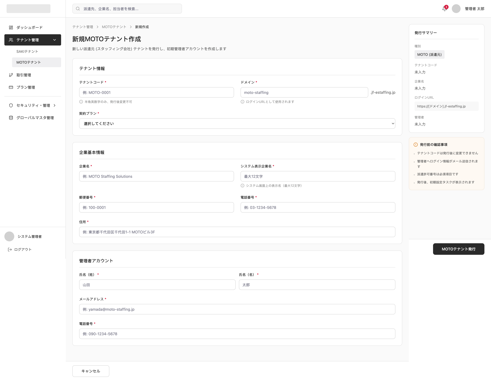

# 派遣元テナント作成

System: Platform SaaS Admin
Menu: Tenant Management
メニュー: テナント管理
Screen ID: PA-TEN-003
Screen (VI): Create MOTO Tenant
Giải thích tính năng: Tạo tenant MOTO mới
機能説明: 新規派遣元テナントを作成する。
Thông tin hiển thị trên màn hình: Company info, domain, initial plan, admin account
画面表示情報: 会社情報、ドメイン、初期プラン、管理者アカウント
URL: /admin/moto-tenants/create
システム: プラットフォーム管理
API List: PA-TEN-003-API-01-Create moto tenant (https://www.notion.so/PA-TEN-003-API-01-Create-moto-tenant-368f02c407dd8069b90ffae6ad89dee7?pvs=21)
Combined: No
Screen Specs: No
Status: In progress

# SCREEN SPECIFICATION

---

# 1. Thông tin màn hình

| Item | Nội dung |
| --- | --- |
| Screen ID | PA-TEN-003 |
| Tên màn hình | Tạo Tenant MOTO mới |
| Tên tiếng Nhật | 新規MOTOテナント作成 |
| Module | Tenant Management (テナント管理) |
| URL | /admin/moto-tenants/create |
| Actor | Platform SaaS Admin |
| Priority | P1 |

---

# 2. Mục đích

Cho phép người dùng (Platform SaaS Admin) tạo mới một Tenant MOTO (doanh nghiệp phái cử) trên hệ thống SaaS Platform Admin.

Sau khi lưu thành công:
- Khởi tạo Tenant MOTO trên hệ thống.
- Hệ thống tự động chạy migrations và seed dữ liệu mặc định để tạo Database riêng cho Tenant mới.
- Gửi email kích hoạt tài khoản tự động chứa liên kết đặt mật khẩu cho Quản trị viên (Admin) của Tenant MOTO vừa tạo.
- Ghi Audit Log hệ thống.

---

# 3. Điều kiện truy cập

## Điều kiện trước

- Đã đăng nhập vào hệ thống SaaS Platform Admin.
- Có quyền quản trị tương ứng (`platform.tenant.create_moto_tenant.create`).

## Điều kiện sau

- Tạo mới Tenant MOTO thành công.

---

# 4. Di chuyển màn hình

## Màn hình nguồn

| Screen ID | Tên màn hình |
| --- | --- |
| PA-TEN-001 | 派遣元テナント一覧 (MOTO Tenant List) |

---

## Màn hình đích

| Action | Screen |
| --- | --- |
| Save Success | MOTO Tenant List (PA-TEN-001) |
| Cancel | MOTO Tenant List (PA-TEN-001) |

---

# 5. UI/UX Layout



---

# 6. Quy tắc UI/UX

## Mã Tenant (テナントコード)

- Chỉ cho phép nhập chữ cái tiếng Anh nửa dòng và số, không khoảng trắng, không ký tự đặc biệt.
- Readonly và không được phép chỉnh sửa sau khi đã lưu thành công.

## Tên miền (ドメイン)

- Nhập Subdomain đăng nhập cho tenant.
- Suffix hiển thị tĩnh phía sau textbox: `.jf-estaffing.jp`.

## Nút MOTOテナント発行 (Phát hành)

- Disable khi còn lỗi validation trên form.
- Hiển thị trạng thái loading khi đang thực hiện submit lên Server.

## Required Field

Hiển thị:
```
*
```
màu đỏ phía sau label của các trường bắt buộc nhập.

---

# 7. Định nghĩa Item

## Thông tin Tenant (テナント情報)

| No | Item | Type | Required | Format | DB Column |
| --- | --- | --- | --- | --- | --- |
| 1 | Mã Tenant (テナントコード) | Textbox | Yes | varchar(50) | tenant_code |
| 2 | Tên miền (ドメイン) | Textbox | Yes | varchar(50) | domain |
| 3 | Gói hợp đồng (契約プラン) | Dropdown | Yes | tinyint | contract_plan |

## Thông tin cơ bản doanh nghiệp (企業基本情報)

| No | Item | Type | Required | Format | DB Column |
| --- | --- | --- | --- | --- | --- |
| 4 | Tên công ty (企業名) | Textbox | Yes | varchar(100) | official_name_ja |
| 5 | Tên hiển thị hệ thống (システム表示企業名) | Textbox | Yes | varchar(24) | display_name_ja |
| 6 | Mã bưu điện (郵便番号) | Textbox | Yes | char(7) | postal_code |
| 7 | Số điện thoại công ty (電話番号) | Textbox | Yes | varchar(15) | tel |
| 8 | Địa chỉ (住所) | Textbox | Yes | varchar(100) | address_ja |

## Tài khoản quản trị (管理者アカウント)

| No | Item | Type | Required | Format | DB Column |
| --- | --- | --- | --- | --- | --- |
| 9 | Họ quản trị viên (氏名（姓）) | Textbox | Yes | varchar(24) | last_name_ja |
| 10 | Tên quản trị viên (氏名（名）) | Textbox | Yes | varchar(24) | first_name_ja |
| 11 | Địa chỉ Email (メールアドレス) | Textbox | Yes | varchar(128) | email |
| 12 | Số điện thoại admin (電話番号) | Textbox | Yes | varchar(15) | admin_tel |

---

# 8. Validation

## Tất cả các trường bắt buộc

| Rule | Message Code | Message |
| --- | --- | --- |
| Required | CMS-VAL-23 | {0}を入力してください。 (Vui lòng không để trống {0}) |

## Mã Tenant & Tên miền

| Rule | Message Code | Message |
| --- | --- | --- |
| Format | CMS-VAL-24 | {0}に正しい形式を指定してください。 (Vui lòng nhập {0} đúng định dạng) |
| Duplicate | CMS-VAL-11 | {0}の値は既に存在しています。 ({0} đã tồn tại trong hệ thống) |

## Tên hiển thị hệ thống

| Rule | Message Code | Message |
| --- | --- | --- |
| Max 24 | CMS-VAL-6 | {0}は{1}文字以内で入力してください。 (Tối đa 24 ký tự - tương đương 12 chữ toàn dòng) |

## Mã bưu điện

| Rule | Message Code | Message |
| --- | --- | --- |
| Format (7 số) | CMS-VAL-24 | {0}に正しい形式を指定してください。 (Phải nhập đúng định dạng 7 chữ số) |
| Only numbers | CMS-VAL-27 | {0}は数値で入力してください。 (Vui lòng nhập {0} dưới dạng số Hankaku) |

## Số điện thoại công ty & admin

| Rule | Message Code | Message |
| --- | --- | --- |
| Tel Format | CMS-VAL-9 | {0}は有効な電話番号を入力してください。 (Vui lòng nhập số điện thoại hợp lệ) |

## Email admin

| Rule | Message Code | Message |
| --- | --- | --- |
| Email Format | CMS-VAL-48 | {0}には、有効なメールアドレスを指定してください。 (Định dạng email không hợp lệ) |

---

# 9. Event Definition

## Initial Load

### Trigger

Mở màn hình.

### Process

1. Load Master Plan ("Lite", "Standard", "Pro", "Enterprise") vào dropdown Gói hợp đồng.

---

## Cancel

### Trigger

Click Cancel (キャンセル).

### Process

1. Hiển thị popup xác nhận:
   ```
   Dữ liệu chưa lưu sẽ bị mất.
   Bạn có muốn thoát không?
   ```
2. Nếu người dùng chọn Đồng ý (OK), điều hướng quay trở lại màn hình MOTO Tenant List (PA-TEN-001).
3. Nếu chọn Hủy (Cancel), giữ nguyên trạng thái màn hình hiện tại.

---

## Create MOTO Tenant (Save)

### Trigger

Click MOTOテナント発行 (Phát hành).

### Process

1. Thực hiện validate toàn bộ form nhập liệu ở client-side. Nếu có lỗi, dừng xử lý và hiển thị thông báo inline tương ứng.
2. Hiển thị popup xác nhận hành động: `CMS-VAL-85` (Target: "MOTOテナントの発行").
   - Lời thoại: "MOTOテナントの発行を更新します。よろしいですか。"
3. Nếu người dùng chọn OK:
   - Kích hoạt gọi API `POST /api/v1/admin/moto-tenants/`.
   - Server thực hiện thêm mới Tenant vào `central_db.mst_tenant`.
   - Khởi tạo Database riêng của Tenant mới: Tạo các bảng `mst_moto_company`, `mst_moto_user` và ghi dữ liệu ban đầu.
   - Kích hoạt tiến trình gửi Email tự động chứa liên kết kích hoạt và đặt mật khẩu đến Email quản trị viên đã khai báo.
   - Ghi nhận Audit Log.
   - Hiển thị Toast thông báo thành công `CMS-VAL-79` ("MOTOテナントを更新しました。").
   - Điều hướng về màn hình danh sách `PA-TEN-001`.

---

# 10. Mapping Database

## central_db.mst_tenant (Bảng dùng chung quản lý Tenant)

| Column | Type | Value / Mapping | Mô tả |
| --- | --- | --- | --- |
| tenant_type | tinyint | `1` | 1: MOTO, 2: SAKI |
| tenant_code | varchar(50) | `tenant_code` | Mã Tenant định danh |
| company_name | varchar(255) | `official_name_ja` | Tên doanh nghiệp phái cử |
| phone_number | varchar(20) | `tel` | SĐT doanh nghiệp |
| domain | varchar(100) | `domain` | Subdomain con |
| contract_plan | tinyint | `contract_plan` | Gói dịch vụ đăng ký |
| status | tinyint | `1` | Mặc định hoạt động sau khi tạo |

---

## tenant_db.mst_moto_company (Database riêng của Tenant mới)

| Column | Type | Value / Mapping | Mô tả |
| --- | --- | --- | --- |
| company_id | varchar(16) | *System Generated* | Mã doanh nghiệp tự động phát sinh |
| official_name_ja | varchar(100) | `official_name_ja` | Tên chính thức |
| display_name_ja | varchar(24) | `display_name_ja` | Tên hiển thị hệ thống |
| postal_code | char(7) | `postal_code` | Mã bưu điện |
| address_ja | varchar(100) | `address_ja` | Địa chỉ |
| status | tinyint | `1` | Mặc định kích hoạt hoạt động |

---

## tenant_db.mst_moto_user (Tài khoản admin ban đầu của Tenant)

| Column | Type | Value / Mapping | Mô tả |
| --- | --- | --- | --- |
| user_id | varchar(100) | *System Generated* | ID người dùng quản trị ban đầu |
| company_id | varchar(16) | `mst_moto_company.company_id` | Liên kết doanh nghiệp vừa tạo |
| last_name_ja | varchar(24) | `last_name_ja` | Họ quản trị viên |
| first_name_ja | varchar(24) | `first_name_ja` | Tên quản trị viên |
| email | varchar(128) | `email` | Email quản trị viên |
| tel | varchar(15) | `admin_tel` | Số điện thoại liên lạc của admin |
| status | tinyint | `1` | Mặc định kích hoạt |
| reference_scope | tinyint | `5` | Toàn quyền kiểm soát và xem dữ liệu |
| execution_role | tinyint | `1` | Nhóm quyền Administrator cao nhất |

---

# 11. API Mapping

## Create MOTO Tenant

```
POST /api/v1/admin/moto-tenants/
```

Request

```json
{
  "tenant_code": "MOTO-0001",
  "domain": "moto-staffing",
  "contract_plan": 4,
  "official_name_ja": "MOTO Staffing Solutions",
  "display_name_ja": "MOTO Staffing",
  "postal_code": "1000001",
  "tel": "03-1234-5678",
  "address_ja": "東京都千代田区千代田1-1 MOTOビル3F",
  "admin_user": {
    "last_name_ja": "山田",
    "first_name_ja": "太郎",
    "email": "yamada@moto-staffing.jp",
    "tel": "090-1234-5678"
  }
}
```

Response

```json
{
  "status": "success",
  "message": "create_moto_tenant_success",
  "data": {
    "id": 10,
    "tenant_code": "MOTO-0001",
    "company_name": "MOTO Staffing Solutions",
    "created_at": "2026-06-11 09:53:00"
  }
}
```

---

# 12. Notification

## Trigger

Create Tenant Success.

### Receiver

- Quản trị viên Tenant MOTO mới (`admin_user.email`).

### Channel

- Email (Gửi tự động chứa liên kết kích hoạt đặt mật khẩu cho tài khoản).

---

# 13. Approval Flow

Không áp dụng cho màn hình này. Việc tạo Tenant được phê duyệt trực tiếp bởi Platform SaaS Admin.

---

# 14. Permission

| Action | Platform SaaS Admin | Platform SaaS Staff |
| --- | --- | --- |
| Access Screen | O | X |
| Issue MOTO Tenant | O | X |

---

# 15. Audit Log

| Action | Log |
| --- | --- |
| Create Tenant | Yes |

---

# 16. Error Handling

| Code | Message (Tiếng Nhật) | Message (Tiếng Việt) |
| --- | --- | --- |
| VAL001 | 入力データが不正です。 | Dữ liệu đầu vào không hợp lệ. |
| VAL002 | テナントコードは既に存在しています。 | Mã Tenant đã tồn tại. |
| VAL003 | ドメインは既に存在しています。 | Domain đã tồn tại. |
| SYS001 | システムエラーが発生しました。 | Lỗi hệ thống. |

---

# 17. Related Documents

- Business Flow
- ERD
- API Specification
- Role Matrix
- Wireframe