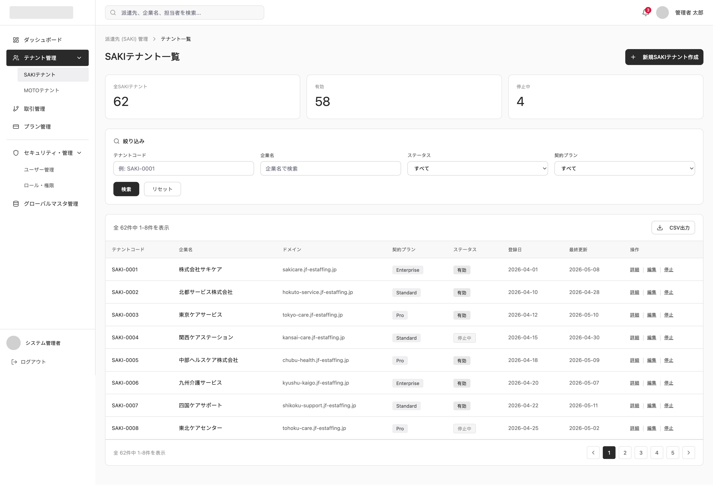

# 派遣先テナント一覧

System: Platform SaaS Admin
Menu: Tenant Management
メニュー: テナント管理
Screen ID: PA-TEN-007
Screen (VI): SAKI Tenant List
Giải thích tính năng: Danh sách tenant SAKI
機能説明: 派遣先テナント一覧を表示する。
Thông tin hiển thị trên màn hình: Company name, connected MOTO count, active contract count, approval user count, billing status, tenant status
画面表示情報: 会社名、接続MOTO数、稼働契約数、承認ユーザ数、請求状況、テナントステータス
URL: /admin/saki-tenants
システム: プラットフォーム管理
API List: PA-TEN-007-API-01-Saki tenant list (https://www.notion.so/PA-TEN-007-API-01-Saki-tenant-list-368f02c407dd80448c2ce93688b04b3e?pvs=21), PA-TEN-007-API-02-Export saki tenant list (https://www.notion.so/PA-TEN-007-API-02-Export-saki-tenant-list-368f02c407dd80a29c13fe3908e34685?pvs=21)
Combined: No
Screen Specs: No
Status: In progress

# SCREEN SPECIFICATION

---

# 1. Thông tin màn hình

| Item | Nội dung |
| --- | --- |
| Screen ID | PA-TEN-007 |
| Tên màn hình | Danh sách Tenant SAKI |
| Tên tiếng Nhật | 派遣先テナント一覧 |
| Module | Tenant Management (テナント管理) |
| Chức năng | Hiển thị danh sách các tenant SAKI (doanh nghiệp tiếp nhận phái cử), hỗ trợ tìm kiếm lọc, xuất dữ liệu và tạm ngưng/khôi phục hoạt động của tenant |
| Actor | Platform SaaS Admin |
| URL | /admin/saki-tenants |
| Priority | P1 |
| Phiên bản | v1.0 |

---

# 2. Mục đích màn hình

Cho phép quản trị viên hệ thống (Platform SaaS Admin):

- Lọc tìm kiếm và hiển thị danh sách các doanh nghiệp tiếp nhận phái cử SAKI (Tenant) đã đăng ký sử dụng hệ thống.
- Theo dõi nhanh quy mô hoạt động của từng tenant qua: số lượng doanh nghiệp phái cử (MOTO) kết nối, số lượng hợp đồng phái cử đang chạy, số lượng tài khoản phê duyệt và trạng thái hóa đơn thanh toán.
- Xuất danh sách thông tin tenant SAKI ra file CSV.
- Chuyển tiếp nhanh tới các màn hình Xem chi tiết (`PA-TEN-008`), Tạo mới tenant (`PA-TEN-009`), hoặc Chỉnh sửa thông tin tenant (`PA-TEN-010`).
- Tạm ngưng (`PA-TEN-011`) hoặc Khôi phục hoạt động (`PA-TEN-012`) của tenant SAKI trực tiếp từ danh sách.

---

# 3. Điều kiện truy cập

## Điều kiện trước

- Đã đăng nhập vào hệ thống quản trị SaaS Platform Admin.
- Tài khoản người dùng có quyền quản trị tương ứng (`platform.tenant.saki_tenant_list.view`).

## Điều kiện sau

- Hiển thị danh sách các SAKI Tenant theo bộ lọc tìm kiếm.

---

# 4. Di chuyển màn hình

## Màn hình nguồn

| Screen ID | Tên màn hình |
| --- | --- |
| PA-DB-001 | プラットフォームダッシュボード (Platform Dashboard) |
| PA-TEN-008 | 派遣先テナント詳細 (SAKI Tenant Detail) - Quay lại |
| PA-TEN-009 | 派遣先テナント作成 (Create SAKI Tenant) - Quay lại |
| PA-TEN-010 | 派遣先テナント編集 (SAKI Tenant Edit) - Quay lại |

---

## Màn hình đích

| Action | Screen ID | Tên màn hình |
| --- | --- | --- |
| Tạo mới tenant | PA-TEN-009 | 派遣先テナント作成 (Create SAKI Tenant) |
| Click Mã Tenant / Chi tiết | PA-TEN-008 | 派遣先テナント詳細 (SAKI Tenant Detail) |
| Chỉnh sửa thông tin | PA-TEN-010 | 派遣先テナント編集 (SAKI Tenant Edit) |

---

# 5. UI/UX Layout



---

## Nguyên tắc UI/UX

> [!NOTE]
> Giao diện màn hình này KHÔNG bao gồm thanh Menu điều hướng bên trái (Sidebar) và Header/Footer dùng chung của Platform SaaS Admin để đảm bảo độc lập thiết kế logic trang.

### **Search Area (Khu vực lọc tìm kiếm)**
- Nằm ở trên cùng khu vực nội dung chính, dạng panel mở rộng/thu gọn.
- Các điều kiện tìm kiếm sắp xếp theo dạng lưới gọn gàng.
- Cung cấp nút "Lọc" (Primary) và link "Reset bộ lọc" (Secondary).

### **Data Table (Bảng dữ liệu)**
- Hỗ trợ sắp xếp (Sort) tại tiêu đề các cột chính.
- Cột trạng thái tenant hiển thị dưới dạng các Badge màu sắc rõ ràng (ví dụ: `有効` (Hoạt động) - Xanh lá, `停止中` (Tạm ngưng) - Màu đỏ/Xám).
- Cột trạng thái thanh toán hiển thị Badge cảnh báo (ví dụ: `未払い` (Chưa thanh toán/Quá hạn) - Màu cam/Đỏ, `支払い済` (Đã thanh toán) - Màu xanh).
- Cột thao tác (Thao tác cuối cùng bên phải) gồm nút Xem chi tiết, Chỉnh sửa, và nút thay đổi trạng thái (Tạm ngưng/Khôi phục) tùy theo trạng thái hiện hành của tenant.

### **Action Button (Nút hành động)**
- **Tạo mới (新規テナント作成):** Màu đen (Primary), nằm ở góc trên bên phải màn hình.
- **Xuất dữ liệu (エクスポート):** Viền đen, nền trắng (Secondary), xuất file CSV dựa theo danh sách lọc.

---

# 6. Danh sách Item màn hình

## Khu vực tìm kiếm

| No | Item | Loại | Format | Bắt buộc | Mô tả |
| --- | --- | --- | --- | --- | --- |
| 1 | Mã Tenant (テナントコード) | Textbox | varchar(50) | No | Tìm kiếm tương đối/chính xác mã Tenant. Placeholder: "例: SAKI-0001" |
| 2 | Tên công ty (企業名) | Textbox | varchar(255) | No | Tìm kiếm tương đối tên doanh nghiệp tiếp nhận SAKI. Placeholder: "企業名で検索" |
| 3 | Trạng thái (ステータス) | Dropdown | tinyint | No | Lọc theo trạng thái hoạt động (0: Tạm ngưng, 1: Hoạt động) |
| 4 | Gói hợp đồng (契約プラン) | Dropdown | tinyint | No | Lọc theo gói dịch vụ (1: Lite, 2: Standard, 3: Pro, 4: Enterprise) |
| 5 | Tìm kiếm (検索) | Button | - | - | Áp dụng bộ lọc tìm kiếm |
| 6 | Làm mới bộ lọc (リセット) | Button | - | - | Reset toàn bộ các bộ lọc đang chọn về mặc định |

## Các nút hành động (Action Buttons)

| No | Item | Loại | Format | Bắt buộc | Mô tả |
| --- | --- | --- | --- | --- | --- |
| 7 | Tạo mới tenant (新規SAKIテナント作成) | Button | - | - | Chuyển tiếp sang màn hình tạo tenant mới (`PA-TEN-009`) |
| 8 | Xuất dữ liệu (CSV出力) | Button | - | - | Kích hoạt xuất dữ liệu tenant ra file CSV (`PA-TEN-007-API-02`) |

---

# 7. Định nghĩa Data Table

## Table hiển thị

### **central_db.mst_tenant**

| STT | Item | DB Column | Type | Width | Mô tả |
| --- | --- | --- | --- | --- | --- |
| 1 | Mã Tenant (テナントコード) | tenant_code | varchar | 120px | Hiển thị mã tenant (Link chuyển tiếp tới chi tiết `PA-TEN-008`) |
| 2 | Tên công ty (企業名) | company_name | varchar | 220px | Tên công ty tiếp nhận SAKI |
| 3 | Số MOTO kết nối (接続MOTO数) | connected_moto_count | int | 120px | Số lượng doanh nghiệp phái cử MOTO đang kết nối (Tính toán động) |
| 4 | Số hợp đồng hoạt động (稼働契約数) | active_contract_count | int | 120px | Số lượng hợp đồng phái cử đang có hiệu lực (Tính toán động) |
| 5 | Số người phê duyệt (承認ユーザ数) | approval_user_count | int | 120px | Số lượng tài khoản người dùng có quyền phê duyệt (Tính toán động) |
| 6 | Trạng thái thanh toán (請求状況) | billing_status | tinyint | 120px | Badge trạng thái thanh toán (未払い: Chưa thanh toán / 支払い済: Đã thanh toán) |
| 7 | Trạng thái (ステータス) | status | tinyint | 100px | Badge trạng thái hoạt động của tenant (有効: Hoạt động / 停止中: Tạm ngưng) |
| 8 | Thao tác (操作) | - | action | 180px | Gồm các nút liên kết nhanh: "詳細" (Xem chi tiết), "編集" (Chỉnh sửa), và nút "停止" (Tạm ngưng - nếu đang hoạt động) hoặc "復旧" (Khôi phục - nếu đang tạm ngưng) |

---

## Sorting

Cho phép sắp xếp (Sort) 2 chiều tăng/giảm dần tại các cột:

- Mã Tenant (`tenant_code`)
- Tên công ty (`company_name`)
- Số MOTO kết nối (`connected_moto_count`)
- Số hợp đồng hoạt động (`active_contract_count`)
- Số người phê duyệt (`approval_user_count`)
- Trạng thái thanh toán (`billing_status`)
- Trạng thái tenant (`status`)

---

## Paging

| Item | Value |
| --- | --- |
| Default | 20 |
| Options | 20, 50, 100 |
| Server Side | Yes |

---

# 8. Mapping Database

## Table sử dụng

### **central_db.mst_tenant**

Bảng cơ sở lưu trữ dữ liệu các Tenant đăng ký trên Platform (loại `tenant_type` = 2 cho SAKI Tenant):

| Column | Type | Description |
| --- | --- | --- |
| id | bigint | PK - ID tự tăng của Tenant |
| tenant_type | tinyint(1) | Loại tenant (1: MOTO, 2: SAKI) |
| tenant_code | varchar(50) | UQ - Mã định danh duy nhất của tenant (Hankaku, ví dụ: subdomain) |
| company_name | varchar(255) | Tên doanh nghiệp tiếp nhận SAKI |
| domain | varchar(100) | UQ - Tên miền hoặc subdomain định danh |
| phone_number | varchar(20) | Số điện thoại liên lạc chính của tenant (vật lý) |
| contract_plan | tinyint(1) | Gói hợp đồng dịch vụ (1: Lite, 2: Standard, 3: Pro, 4: Enterprise) |
| status | tinyint(1) | Trạng thái hoạt động của tenant (0: Tạm ngưng, 1: Hoạt động) |
| created_at | datetime | Thời điểm đăng ký tenant |
| updated_at | datetime | Thời điểm cập nhật thông tin cuối cùng |

---

# 9. Validation

| Item | Rule | Message Code | Mô tả |
| --- | --- | --- | --- |
| Tenant Code | Chiều dài <= 50 ký tự | CMS-VAL-6 | Mã tenant tối đa 50 ký tự |

---

# 10. Event Definition

## **Initial Load (Tải danh sách)**

### **Trigger**
Người dùng truy cập vào URL `/admin/saki-tenants`.

### **Flow**
1. Gửi Request gọi API `GET /api/v1/admin/saki-tenants/` với các tham số phân trang mặc định (`page = 1`, `limit = 20`).
2. Nhận Response trả về từ Server:
    - Thành công: Render danh sách tenant lên Data Table và cập nhật tổng số trang.
    - Thất bại: Hiển thị Toast báo lỗi hệ thống (`CMS-VAL-99`).

---

## **Search (Tìm kiếm)**

### **Trigger**
Người dùng thay đổi bộ lọc tìm kiếm (nhấn nút 検索 hoặc đổi các bộ lọc dropdown).

### **Flow**
1. Gửi Request gọi API `GET /api/v1/admin/saki-tenants/` kèm theo các tham số bộ lọc.
2. Nhận Response trả về từ Server:
    - Thành công: Cập nhật lại Grid dữ liệu bảng tenant và thông tin phân trang.
    - Thất bại: Hiển thị Toast báo lỗi hệ thống (`CMS-VAL-99`).

---

## **Reset (Làm mới bộ lọc)**

### **Trigger**
Người dùng click nút "リセット".

### **Flow**
1. Xóa các điều kiện lọc đang nhập trên panel tìm kiếm về mặc định.
2. Tự động gọi lại API lấy danh sách mặc định ở trang 1.

---

## **Export CSV (Xuất dữ liệu)**

### **Trigger**
Người dùng click nút "CSV出力".

### **Flow**
1. Hệ thống mặc định xuất toàn bộ dữ liệu theo bộ lọc lọc hiện hành.
2. Kích hoạt gọi API `GET /api/v1/admin/saki-tenants/export` kèm theo tham số lọc.
3. Server xử lý tạo file CSV và gửi trả về file stream.
4. Trình duyệt thực hiện download file tự động. Hiển thị Toast thông báo thành công `CMS-VAL-80` ("CSV file exported successfully.").

---

## **Suspend Tenant (Tạm ngưng hoạt động)**

### **Trigger**
Quản trị viên click chọn nút "停止" (Tạm ngưng) tại cột thao tác của một tenant đang hoạt động (`status = 1`).

### **Flow**
1. Hiển thị Popup/Dialog xác nhận hành động: `CMS-VAL-85` (với Target là "SAKIテナントを停止").
   - Lời thoại hiển thị: "SAKIテナントを停止を更新します。よろしいですか。" (Sẽ tiến hành tạm ngưng hoạt động của SAKI Tenant này. Bạn có chắc chắn không?).
2. Quản trị viên click Xác nhận:
   - Gửi yêu cầu gọi API `PATCH /api/v1/admin/saki-tenants/{id}/suspend/`.
   - Server thực hiện cập nhật `status = 0` (Tạm ngưng) cho tenant trong cơ sở dữ liệu.
   - Nhận Response phản hồi:
     - Thành công: Hiển thị Toast thông báo thành công `CMS-VAL-79` ("SAKIテナントを更新しました。" / "Đã cập nhật SAKI Tenant thành công."). Tải lại danh sách để cập nhật trạng thái mới trên Grid.
     - Thất bại: Hiển thị Toast báo lỗi hệ thống (`CMS-VAL-99`) hoặc lỗi không có quyền (`CMS-VAL-95`).

---

## **Restore Tenant (Khôi phục hoạt động)**

### **Trigger**
Quản trị viên click chọn nút "復旧" (Khôi phục) tại cột thao tác của một tenant đang bị tạm ngưng (`status = 0`).

### **Flow**
1. Hiển thị Popup/Dialog xác nhận hành động: `CMS-VAL-85` (với Target là "SAKIテナントを復旧").
   - Lời thoại hiển thị: "SAKIテナントを復旧を更新します。よろしいですか。" (Sẽ tiến hành khôi phục hoạt động của SAKI Tenant này. Bạn có chắc chắn không?).
2. Quản trị viên click Xác nhận:
   - Gửi yêu cầu gọi API `PATCH /api/v1/admin/saki-tenants/{id}/restore/`.
   - Server cập nhật `status = 1` (Hoạt động) cho tenant.
   - Nhận Response phản hồi:
     - Thành công: Hiển thị Toast thông báo thành công `CMS-VAL-79` ("SAKIテナントを更新しました。" / "Đã cập nhật SAKI Tenant thành công."). Tải lại danh sách trên Grid.
     - Thất bại: Hiển thị Toast báo lỗi hệ thống (`CMS-VAL-99`).

---

# 11. API Mapping

## **Get SAKI Tenant List**

### Endpoint
```
GET /api/v1/admin/saki-tenants/
```

### Request Parameters (Query String)
| Parameter | Type | Required | Mô tả |
| --- | --- | --- | --- |
| company_name | string | No | Tên doanh nghiệp SAKI |
| tenant_code | string | No | Mã Tenant |
| contract_plan | tinyint | No | Gói dịch vụ (1: Lite, 2: Standard, 3: Pro, 4: Enterprise) |
| status | tinyint | No | Trạng thái hoạt động của tenant (0: Tạm ngưng, 1: Hoạt động) |
| page | int | No | Trang hiện tại (Mặc định: 1) |
| limit | int | No | Số bản ghi trên trang (Mặc định: 20) |
| sort_column | string | No | Cột sắp xếp (Mặc định: created_at) |
| sort_direction | string | No | Hướng sắp xếp (asc/desc, Mặc định: desc) |

### Response (Success 200 OK)
```json
{
  "status": "success",
  "message": "get_saki_tenants_success",
  "data": {
    "items": [
      {
        "id": 2,
        "tenant_code": "SAKI-0001",
        "company_name": "株式会社サキケア",
        "domain": "sakicare.jf-estaffing.jp",
        "contract_plan": 4,
        "connected_moto_count": 5,
        "active_contract_count": 12,
        "approval_user_count": 8,
        "billing_status": 1,
        "status": 1,
        "created_at": "2026-04-01 00:00:00",
        "updated_at": "2026-05-08 00:00:00"
      }
    ],
    "total": 62,
    "current_page": 1,
    "last_page": 4,
    "per_page": 20
  }
}
```

---

## **Export SAKI Tenant List**

### Endpoint
```
GET /api/v1/admin/saki-tenants/export
```

### Request Parameters (Query String)
*(Các tham số lọc giống như API lấy danh sách để hỗ trợ export dữ liệu theo điều kiện lọc)*

### Response (Success 200 OK)
- Trả về tệp tin dưới dạng File Stream (`text/csv`).

---

## **Suspend SAKI Tenant**

### Endpoint
```
PATCH /api/v1/admin/saki-tenants/{id}/suspend/
```

### Response (Success 200 OK)
```json
{
  "status": "success",
  "message": "suspend_tenant_success"
}
```

---

## **Restore SAKI Tenant**

### Endpoint
```
PATCH /api/v1/admin/saki-tenants/{id}/restore/
```

### Response (Success 200 OK)
```json
{
  "status": "success",
  "message": "restore_tenant_success"
}
```

---

# 12. Permission

| Action | Platform SaaS Admin | Platform SaaS Staff |
| --- | --- | --- |
| View (Xem danh sách) | O | O |
| Export (Xuất dữ liệu) | O | O |
| Suspend / Restore (Tạm ngưng / Khôi phục) | O | X |

---

# 13. Message Definition

| Code | Message (Tiếng Nhật) | Message (Tiếng Việt) | Loại hiển thị |
| --- | --- | --- | --- |
| **CMS-VAL-6** | {0}は{1}文字以内で入力してください。 | Vui lòng nhập {0} trong vòng {1} ký tự trở xuống. | Inline Validation |
| **CMS-VAL-79** | {Screen name}を更新しました。 | Đã cập nhật {Screen name}. | Toast Success |
| **CMS-VAL-80** | CSVファイルを出力しました。 | Đã xuất file CSV thành công. | Toast Success |
| **CMS-VAL-85** | {Target}を更新します。よろしいですか。 | Sẽ tiến hành cập nhật {Target}. Bạn có chắc chắn không? | Dialog Confirm |
| **CMS-VAL-95** | この機能・リソースへのアクセス権限がありません。 | Bạn không có quyền truy cập vào chức năng/tài nguyên này. | Toast Error |
| **CMS-VAL-99** | システムエラーが発生しました。管理者へお問い合わせください。 | Đã xảy ra lỗi hệ thống. Vui lòng liên hệ với người quản trị. | Toast Error / Popup |

---

# 14. Error Handling

| HTTP Code | Action | Message ID hiển thị |
| --- | --- | --- |
| 400 | Hiển thị thông báo dữ liệu không hợp lệ tại popup/toast. | CMS-VAL-93 |
| 401 | Xóa token tại LocalStorage và tự động chuyển hướng về trang Đăng nhập Platform (/admin/login). | CMS-VAL-94 |
| 403 | Chặn hành động và hiển thị Toast báo lỗi không có quyền truy cập. | CMS-VAL-95 |
| 404 | Hiển thị Toast thông báo dữ liệu không tồn tại. | CMS-VAL-96 |
| 422 | Hiển thị chi tiết lỗi validate nghiệp vụ từ Server tại từng ô nhập liệu tương ứng. | CMS-VAL-98 |
| 500 | Hiển thị Popup thông báo lỗi hệ thống nghiêm trọng. | CMS-VAL-99 |

---

# 15. Audit Log

| Action | Log | Nội dung lưu |
| --- | --- | --- |
| Search | No | - |
| Export CSV | Yes | [User] đã xuất file CSV danh sách SAKI Tenants. |
| Suspend Tenant | Yes | [User] đã tạm ngưng hoạt động của SAKI Tenant [tenant_code]. |
| Restore Tenant | Yes | [User] đã khôi phục hoạt động của SAKI Tenant [tenant_code]. |

---

# 16. Related Documents

- Business Flow Diagram
- ERD
- API Specification
- Role Matrix
- Wireframe
- NFR