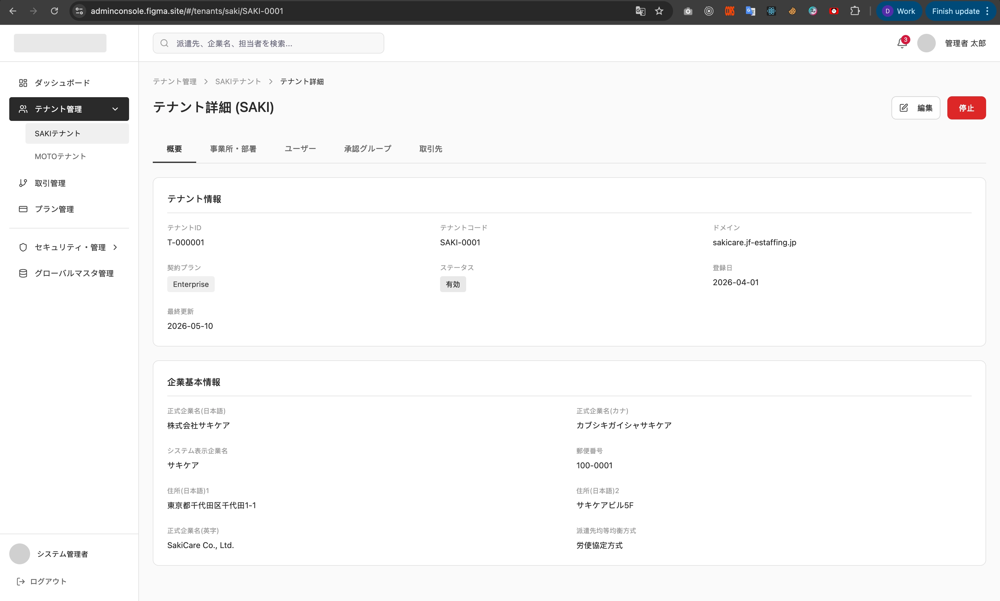
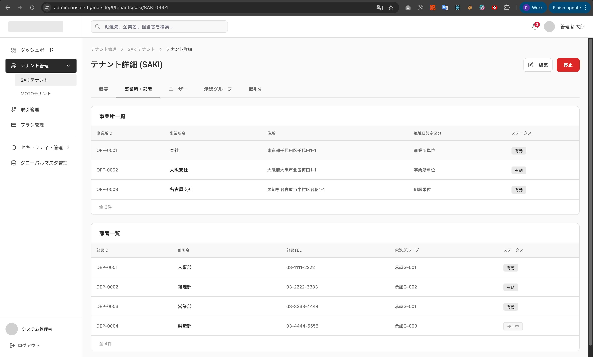
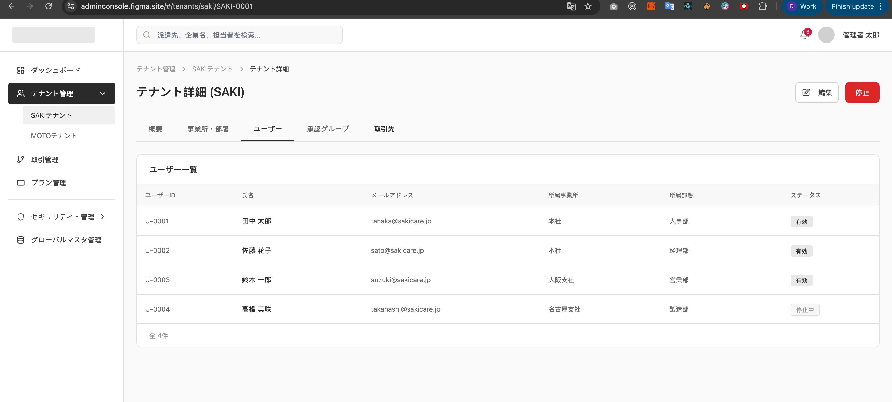
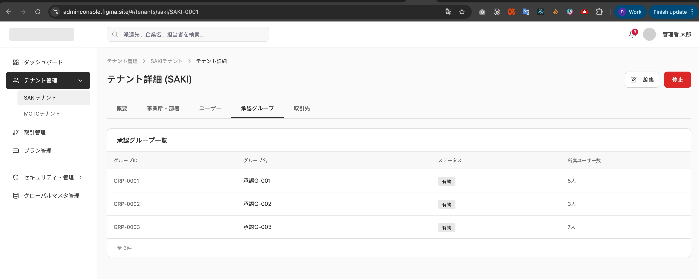
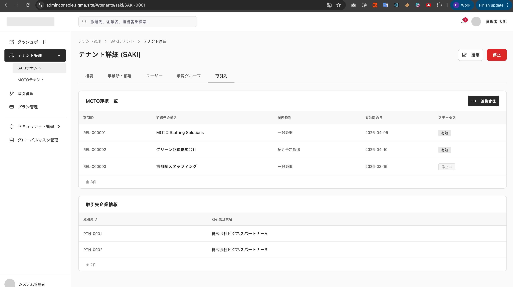

# 派遣先テナント詳細

System: Platform SaaS Admin
Menu: Tenant Management
メニュー: テナント管理
Screen ID: PA-TEN-008
Screen (VI): SAKI Tenant Detail
Giải thích tính năng: Chi tiết tenant SAKI.
機能説明: 派遣先テナント詳細および承認状況を表示する。
Thông tin hiển thị trên màn hình: Company profile, connected MOTO tenants, approval workflow, active contracts, attendance approvals.
画面表示情報: 会社情報、接続派遣元、承認フロー、稼働契約、勤怠承認状況
URL: /admin/saki-tenants/:id
시스템: プラットフォーム管理
API List: PA-TEN-008-API-01-Saki tenant detail (https://www.notion.so/PA-TEN-008-API-01-Saki-tenant-detail-368f02c407dd8060b7bde32232b06201?pvs=21)
Combined: No
Screen Specs: Yes
Status: Under Review

# SCREEN SPECIFICATION

# Màn hình Chi tiết SAKI Tenant

---

# 1. Thông tin màn hình

| Item | Nội dung |
| --- | --- |
| Screen ID | PA-TEN-008 |
| Tên màn hình | SAKI Tenant Detail |
| Tên tiếng Nhật | 派遣先テナント詳細 |
| Module | Tenant Management |
| Chức năng | Xem chi tiết tenant SAKI |
| Actor | Platform SaaS Admin |
| URL | /admin/saki-tenants/:id |
| Priority | P1 |
| Phiên bản | v1.0 |

---

# 2. Mục đích màn hình

Cho phép Platform SaaS Admin xem toàn bộ thông tin của SAKI Tenant.

Người dùng có thể:

- Xem thông tin tenant
- Xem thông tin doanh nghiệp
- Xem danh sách chi nhánh
- Xem danh sách phòng ban
- Xem danh sách người dùng
- Xem danh sách nhóm phê duyệt
- Xem thông tin liên kết MOTO
- Xem cấu hình đối tác giao dịch
- Chuyển sang màn hình chỉnh sửa tenant
- Tạm dừng hoạt động tenant
- Khôi phục hoạt động tenant

Sau khi truy cập thành công:

- Hiển thị đầy đủ dữ liệu tenant
- Hiển thị trạng thái tenant hiện tại
- Hiển thị dữ liệu liên quan của tenant

---

# 3. Điều kiện truy cập

## Điều kiện trước

- Đã đăng nhập hệ thống Platform Admin
- Có quyền TENANT_VIEW
- Tenant tồn tại trong hệ thống

## Điều kiện sau

- Hiển thị thông tin tenant
- Hiển thị các tab liên quan
- Cho phép thực hiện các action theo quyền

---

# 4. Di chuyển màn hình

## Màn hình nguồn

| Screen ID | Tên màn hình |
| --- | --- |
| PA-TEN-007 | SAKI Tenant List |

---

## Màn hình đích

| Action | Screen |
| --- | --- |
| Edit | PA-TEN-010 SAKI Tenant Edit |
| Stop Tenant | Stay Current Screen |
| Back | PA-TEN-007 |

---

# 5. UI/UX Layout

    

Tabs:

- 概要
- 事業所・部署
- ユーザー
- 承認グループ
- 取引先

---

# 6. Quy tắc UI/UX

## Tenant Information

- Hiển thị readonly
- Không cho phép chỉnh sửa trực tiếp

## Status

| Status | Display |
| --- | --- |
| Active | 有効 |
| Suspended | 停止中 |

## Edit Button

- Hiển thị khi có quyền TENANT_UPDATE

## Stop Button

- Hiển thị khi có quyền TENANT_SUSPEND
- Hiển thị popup xác nhận trước khi xử lý

## Tab

- Giữ trạng thái tab hiện tại khi reload dữ liệu
- Load dữ liệu theo từng tab

---

# 7. Định nghĩa Item màn hình

## Tab 概要

### テナント情報

| No | Item | Type | DB |
| --- | --- | --- | --- |
| 1 | テナントID | Label | mst_tenant.tenant_id |
| 2 | テナントコード | Label | mst_tenant.tenant_code |
| 3 | ドメイン | Label | mst_tenant.domain |
| 4 | 契約プラン | Label | mst_tenant.contract_plan |
| 5 | ステータス | Badge | mst_tenant.status |
| 6 | 登録日 | Label | mst_tenant.created_at |
| 7 | 最終更新 | Label | mst_tenant.updated_at |

### 企業基本情報

| No | Item | Type | DB |
| --- | --- | --- | --- |
| 1 | 正式企業名（日本語） | Label | mst_saki_company.official_name_ja |
| 2 | 正式企業名（カナ） | Label | mst_saki_company.official_name_kana |
| 3 | 正式企業名（英字） | Label | mst_saki_company.official_name_en |
| 4 | システム表示企業名 | Label | mst_saki_company.display_name_ja |
| 5 | 郵便番号 | Label | mst_saki_company.postal_code |
| 6 | 住所（日本語）1 | Label | mst_saki_company.address_ja |
| 7 | 住所（日本語）2 | Label | mst_saki_company.address2_ja |
| 8 | 派遣先均等均衡方式 | Label | mst_saki_company.equal_pay_method |

---

## Tab 事業所・部署

### 事業所一覧

| Item | DB |
| --- | --- |
| 事業所ID | mst_saki_office.office_id |
| 事業所名 | mst_saki_office.official_name_ja |
| 住所 | mst_saki_office.address_ja |
| 抵触日設定区分 | mst_saki_office.conflict_date_type |
| ステータス | mst_saki_office.status |

### 部署一覧

| Item | DB |
| --- | --- |
| 部署ID | mst_saki_department.department_id |
| 部署名 | mst_saki_department.official_name_ja |
| 部署TEL | mst_saki_department.tel |
| 承認グループ | mst_saki_department.approval_group_id |
| ステータス | mst_saki_department.status |

---

## Tab ユーザー

### ユーザー一覧

| Item | DB |
| --- | --- |
| ユーザーID | mst_saki_user.user_id |
| 氏名 | mst_saki_user.last_name_ja + first_name_ja |
| メールアドレス | mst_saki_user.email |
| 所属事業所 | mst_saki_user.office_id |
| 所属部署 | mst_saki_user.department_id |
| ステータス | mst_saki_user.status |

---

## Tab 承認グループ

### 承認グループ一覧

| Item | DB |
| --- | --- |
| グループID | mst_saki_approval_group.approval_group_id |
| グループ名 | mst_saki_approval_group.group_name_ja |
| 所属ユーザー数 | COUNT(mst_saki_approval_group_user.user_id) |
| ステータス | mst_saki_approval_group.status |

---

## Tab 取引先

### MOTO連携一覧

| Item | DB |
| --- | --- |
| 取引ID | cfg_moto_client_company.id / r_deal_moto_saki.id |
| 派遣元企業名 | mst_moto_company.official_name_ja |
| 業務種別 | cfg_moto_client_company.business_type |
| 有効開始日 | cfg_moto_client_company.start_date |
| ステータス | r_deal_moto_saki.status |

### 取引先企業情報

| Item | DB |
| --- | --- |
| 取引先ID | mst_saki_business_partner.partner_id |
| 取引先企業名 | mst_saki_business_partner.partner_company_name |
| 連携管理 | mst_saki_business_partner.status |

---

# 8. Mapping Database

## central_db.mst_tenant

| Column | Type |
| --- | --- |
| id | bigint |
| tenant_id | varchar |
| tenant_code | varchar |
| tenant_type | varchar |
| contract_plan | varchar |
| domain | varchar |
| status | tinyint |
| created_at | datetime |
| updated_at | datetime |

---

## tenant_db.mst_saki_company

| Column | Type |
| --- | --- |
| company_id | varchar(16) |
| official_name_ja | varchar |
| official_name_kana | varchar |
| display_name_ja | varchar |
| postal_code | char(7) |
| address_ja | varchar |
| address2_ja | varchar |
| official_name_en | varchar |
| equal_pay_method | text |

---

## tenant_db.mst_saki_office

| Column | Type |
| --- | --- |
| company_id | varchar(16) |
| office_id | varchar(16) |
| official_name_ja | varchar |
| address_ja | varchar |
| conflict_date_type | tinyint |
| status | tinyint |

---

## tenant_db.mst_saki_department

| Column | Type |
| --- | --- |
| company_id | varchar(16) |
| department_id | varchar(16) |
| official_name_ja | varchar |
| tel | varchar |
| approval_group_id | varchar(16) |
| status | tinyint |

---

## tenant_db.mst_saki_user

| Column | Type |
| --- | --- |
| user_id | varchar(100) |
| company_id | varchar(16) |
| office_id | varchar(16) |
| department_id | varchar(16) |
| last_name_ja | varchar |
| first_name_ja | varchar |
| email | varchar |
| status | tinyint |

---

## tenant_db.mst_saki_approval_group

| Column | Type |
| --- | --- |
| company_id | varchar(16) |
| approval_group_id | varchar(16) |
| group_name_ja | varchar |
| status | tinyint |

---

## central_db.r_deal_moto_saki

| Column | Type |
| --- | --- |
| moto_company_id | varchar(16) |
| saki_company_id | varchar(16) |
| status | tinyint |

---

# 9. Validation

Màn hình Detail là màn hình readonly.

| Item | Rule | Message |
| --- | --- | --- |
| Tenant ID | Required | Tenant không tồn tại |
| Permission | TENANT_VIEW | Không có quyền truy cập |
| Status | Valid Status | Trạng thái không hợp lệ |

---

# 10. Event Definition

## Initial Load

### Trigger

Mở màn hình

### Process

1. Load Tenant Detail
2. Load Company Information
3. Load Office List
4. Load Department List
5. Load User List
6. Load Approval Group List
7. Load Client Relation List

---

## Edit

### Trigger

Click Edit

### Process

1. Kiểm tra quyền
2. Chuyển sang màn hình Edit

---

## Stop Tenant

### Trigger

Click Stop

### Process

1. Hiển thị popup xác nhận
2. Call API Suspend Tenant
3. Refresh dữ liệu

---

## Restore Tenant

### Trigger

Click Restore

### Process

1. Hiển thị popup xác nhận
2. Call API Restore Tenant
3. Refresh dữ liệu

---

## Change Tab

### Trigger

Click Tab

### Process

1. Load dữ liệu tab tương ứng
2. Render dữ liệu

---

# 11. API Mapping

## Get Tenant Detail

```
GET /api/v1/admin/saki-tenants/:id/
```

Response

```json
{
  "status": "success",
  "data": {
    "tenant_id": "T-000001",
    "tenant_code": "SAKI-0001",
    "contract_plan": "Enterprise",
    "domain": "sakicare.jf-estaffing.jp",
    "status": "active",
    "created_at": "2026-04-01",
    "updated_at": "2026-05-10",
    "company": {
      "official_name_ja": "株式会社サキケア",
      "official_name_kana": "カブシキガイシャサキケア",
      "official_name_en": "sakiCare Co., Ltd.",
      "display_name_ja": "サキケア",
      "postal_code": "100-0001",
      "address_ja": "東京都千代田区千代田1-1",
      "address2_ja": "サキケアビル5F",
      "equal_pay_method": "労使協定方式"
    }
  }
}
```

---

## Suspend Tenant

```
PATCH /api/v1/admin/saki-tenants/:id/suspend/
```

Response

```json
{
  "status": "success",
  "message": "tenant_suspended_successfully"
}
```

---

## Restore Tenant

```
PATCH /api/v1/admin/saki-tenants/:id/restore/
```

Response

```json
{
  "status": "success",
  "message": "tenant_restored_successfully"
}
```

---

# 12. Notification

## Trigger

Suspend Tenant Success

### Receiver

- Platform SaaS Admin

### Channel

- In-App Notification
- Audit Log

---

# 13. Approval Flow

Không áp dụng.

Tenant được cập nhật trực tiếp bởi Platform SaaS Admin.

---

# 14. Permission

| Action | Platform SaaS Admin |
| --- | --- |
| View | O |
| Edit | O |
| Suspend | O |

---

# 15. Audit Log

| Action | Log |
| --- | --- |
| View Tenant Detail | No |
| Edit Tenant | Yes |
| Suspend Tenant | Yes |
| Restore Tenant | Yes |

---

# 16. Error Handling

| Code | Message |
| --- | --- |
| TEN001 | Tenant not found |
| TEN002 | Tenant suspended |
| AUTH001 | Permission denied |
| SYS001 | System error |

---

# 17. Related Documents

- BF-003 Tenant Management Flow
- PA-TEN-007 SAKI Tenant List
- PA-TEN-010 SAKI Tenant Edit
- Tenant ERD
- API Specification
- Role Matrix
- Audit Log Specification