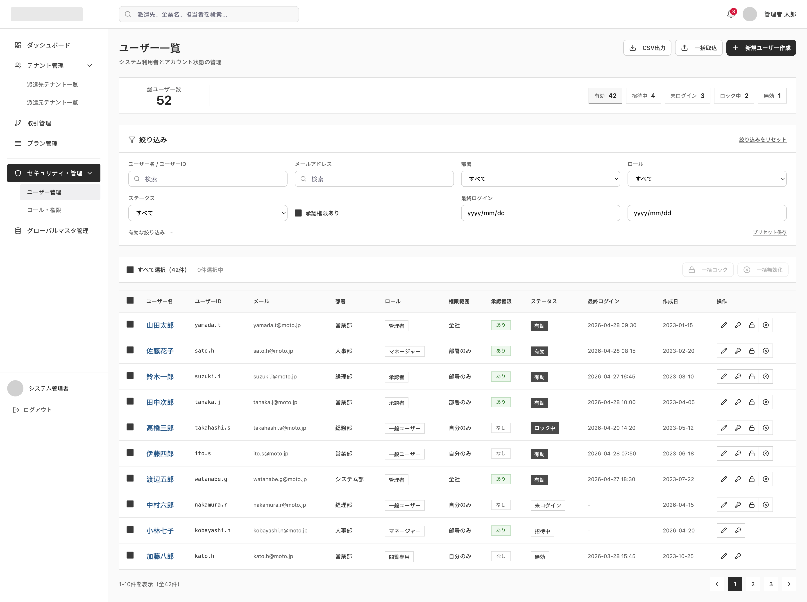

# SCREEN SPECIFICATION

---

# 1. Thông tin màn hình

| Item | Nội dung |
| --- | --- |
| Screen ID | PA-USER-001 |
| Tên màn hình | Danh sách quản trị viên Platform |
| Tên tiếng Nhật | 管理ユーザー一覧 |
| Module | User Management |
| Chức năng | Hiển thị danh sách các tài khoản quản trị viên Platform |
| Actor | Platform SaaS Admin |
| URL | /admin/users |
| Priority | P1 |
| Phiên bản | v1.0 |

---

# 2. Mục đích màn hình

Cho phép quản trị viên:
- Xem danh sách người dùng hệ thống với đầy đủ thông tin về vai trò, phòng ban, phạm vi quyền hạn và trạng thái tài khoản.
- Thực hiện tìm kiếm và lọc nâng cao theo tên, email, phòng ban, vai trò, trạng thái, quyền phê duyệt, thời gian đăng nhập.
- Thực hiện các thao tác nhanh (Xem/Sửa, Reset mật khẩu, Khóa/Mở khóa, Vô hiệu hóa/Kích hoạt) trực tiếp trên từng dòng dữ liệu.
- Thực hiện các thao tác hàng loạt (Bulk Lock, Bulk Disable) hoặc xuất CSV, import dữ liệu từ file.
- Điều hướng nhanh sang màn hình tạo mới người dùng (`PA-USER-002`).

---

# 3. Điều kiện truy cập

## Điều kiện trước

- Đã đăng nhập vào hệ thống Platform SaaS Admin.
- Có quyền xem danh sách người dùng (platform.user.platform_user_list.view).

## Điều kiện sau

- Hiển thị danh sách quản trị viên Platform theo điều kiện tìm kiếm.

---

# 4. Di chuyển màn hình

## Màn hình nguồn

| Screen ID | Tên màn hình |
| --- | --- |
| PA-DB-001 | Dashboard |

---

## Màn hình đích

| Action | Screen ID | Tên màn hình |
| --- | --- | --- |
| Tạo mới | PA-USER-002 | Tạo quản trị viên Platform mới |
| Đặt lại mật khẩu | PA-USER-004 | Khởi tạo lại mật khẩu (Modal) |
| Khóa/Mở khóa | PA-USER-005 | Khóa/Mở khóa tài khoản (Modal) |

---

# 5. UI/UX Layout



---

# 6. Định nghĩa Item màn hình

## Khu vực thống kê & lọc nhanh (Quick Filter Badges)

| No | Item | Loại | Format | Bắt buộc | Mô tả |
| --- | --- | --- | --- | --- | --- |
| 1 | Tổng số người dùng | Label | number | No | Hiển thị tổng số người dùng hiện tại (Ví dụ: 52) |
| 2 | Hữu hiệu | Badge/Button | Action | No | Click để lọc nhanh các tài khoản có trạng thái là "有効" |
| 3 | Đang mời | Badge/Button | Action | No | Click để lọc nhanh các tài khoản có trạng thái là "招待中" |
| 4 | Chưa đăng nhập | Badge/Button | Action | No | Click để lọc nhanh các tài khoản có trạng thái là "未ログイン" |
| 5 | Đang khóa | Badge/Button | Action | No | Click để lọc nhanh các tài khoản có trạng thái là "ロック中" |
| 6 | Vô hiệu | Badge/Button | Action | No | Click để lọc nhanh các tài khoản có trạng thái là "無効" |

## Khu vực bộ lọc tìm kiếm (絞り込み)

| No | Item | Loại | Format | Bắt buộc | Mô tả |
| --- | --- | --- | --- | --- | --- |
| 7 | Tên/User ID | Textbox | varchar | No | Tìm kiếm theo Tên hoặc User ID |
| 8 | Địa chỉ Email | Textbox | varchar | No | Tìm kiếm theo Email |
| 9 | Bộ phận | Dropdown | bigint | No | Lọc theo phòng ban (営業部, 人事部, 経理部, 総務部, システム部...) |
| 10 | Vai trò (ロール) | Dropdown | bigint | No | Lọc theo vai trò (管理者, マネージャー, 承認者, 一般ユーザー, 閲覧専用) |
| 11 | Trạng thái | Dropdown | smallint | No | Lọc theo trạng thái tài khoản |
| 12 | Có quyền phê duyệt | Checkbox | boolean | No | Tích chọn để lọc tài khoản có quyền phê duyệt (`承認権限あり`) |
| 13 | Đăng nhập cuối cùng | Date Range | date (from-to) | No | Lọc theo khoảng ngày đăng nhập cuối cùng |
| 14 | Reset bộ lọc | Link | Action | No | Click để reset toàn bộ điều kiện lọc về mặc định |
| 15 | Lưu bộ lọc mẫu | Link | Action | No | Click để lưu bộ lọc hiện tại thành bộ lọc mẫu (Preset) |

## Khu vực thao tác hàng loạt & chức năng phụ

| No | Item | Loại | Format | Bắt buộc | Mô tả |
| --- | --- | --- | --- | --- | --- |
| 16 | Xuất CSV | Button | Action | No | Xuất danh sách đang hiển thị ra file CSV |
| 17 | Import hàng loạt | Button | Action | No | Import danh sách người dùng từ file excel/csv |
| 18 | Tạo người dùng mới | Button | Action | Yes | Click để sang trang tạo mới `PA-USER-002` |
| 19 | Checkbox chọn tất cả | Checkbox | boolean | No | Chọn toàn bộ user đang hiển thị trên trang hiện tại |
| 20 | Khóa hàng loạt | Button | Action | No | Chỉ active khi tích chọn ít nhất 1 dòng. Khóa toàn bộ tài khoản được chọn. |
| 21 | Vô hiệu hóa hàng loạt | Button | Action | No | Chỉ active khi tích chọn ít nhất 1 dòng. Vô hiệu hóa toàn bộ tài khoản được chọn. |

## Bảng danh sách người dùng

| No | Item | Loại | Format | Bắt buộc | Mô tả |
| --- | --- | --- | --- | --- | --- |
| 22 | Checkbox chọn dòng | Checkbox | boolean | No | Tích chọn dòng để thực hiện thao tác hàng loạt |
| 23 | Tên người dùng | Link | varchar | No | Click vào tên người dùng màu xanh dương để chuyển sang trang chi tiết/chỉnh sửa |
| 24 | User ID | Label | varchar | No | ID tài khoản người dùng |
| 25 | Email | Label | varchar | No | Email của người dùng |
| 26 | Bộ phận | Label | varchar | No | Tên bộ phận trực thuộc |
| 27 | Vai trò | Badge | varchar | No | Tên vai trò (Có màu nền tương ứng) |
| 28 | Phạm vi quyền hạn | Label | varchar | No | Phạm vi (全社, 部署のみ, 自分のみ) |
| 29 | Quyền phê duyệt | Badge | varchar | No | Trạng thái có quyền phê duyệt (あり: xanh lá, なし: xám) |
| 30 | Trạng thái | Badge | varchar | No | Trạng thái tài khoản (有効: đen, ロック中: xám đậm, 未ログイン: viền xám, 招待中: viền xám, 無効: viền xám) |
| 31 | Đăng nhập cuối | Label | datetime | No | Thời gian đăng nhập cuối cùng |
| 32 | Ngày tạo | Label | date | No | Ngày tạo tài khoản |
| 33 | Icon Sửa (Edit) | Button | Action | No | Chuyển sang màn hình xem/chỉnh sửa người dùng |
| 34 | Icon Đặt lại mật khẩu | Button | Action | No | Click để mở modal đặt lại mật khẩu `PA-USER-004` |
| 35 | Icon Khóa / Mở khóa | Button | Action | No | Click để mở modal Khóa/Mở khóa tài khoản `PA-USER-005`. Chỉ hiển thị với các tài khoản không ở trạng thái `招待中` hoặc `無効`. |
| 36 | Icon Vô hiệu hóa / Kích hoạt | Button | Action | No | Dấu X để vô hiệu hóa tài khoản hoạt động. Chỉ hiển thị với các tài khoản không ở trạng thái `招待中` hoặc `無効`. |

---

# 7. Validation

[Reference Link](https://app.notion.com/p/Validation-Rule-378f02c407dd805aae8acbb637c995d5?source=copy_link)

---

# 8. Event Definition

| **Type** | **Event** | **Trigger** | **Permission Key** | **Process/Flow** |
| --- | --- | --- | --- | --- |
| api | Initial Load | Mở màn hình | platform.user.platform_user_list.view | 1. Gọi API GET `/api/v1/admin/users` để lấy danh sách mặc định và tổng số liệu theo trạng thái.<br>2. Load danh sách bộ phận, vai trò vào Dropdown tương ứng. |
| api | Search & Filter | Click Search, đổi Dropdown, hoặc click Badge thống kê nhanh | platform.user.platform_user_list.view | 1. Thu thập các giá trị lọc trên form.<br>2. Gọi API GET `/api/v1/admin/users` kèm các tham số query tương ứng.<br>3. Hiển thị kết quả tìm kiếm lên bảng. |
| screen | Reset Filter | Click "絞り込みをリセット" | platform.user.platform_user_list.view | 1. Xóa toàn bộ điều kiện lọc trên form về mặc định.<br>2. Gọi lại API Initial Load để lấy danh sách ban đầu. |
| api | Export CSV | Click CSV出力 | platform.user.platform_user_list.export | Gọi API xuất dữ liệu CSV với các tham số lọc hiện tại của danh sách. |
| screen | Create User | Click 新規ユーザー作成 | platform.user.platform_user.create | Điều hướng sang màn hình PA-USER-002. |
| screen | Open Reset PW | Click icon Reset Password | platform.user.password_reset.reset | Truyền ID người dùng được chọn và hiển thị Modal Reset Password (`PA-USER-004`). |
| screen | Open Lock/Unlock | Click icon Lock/Unlock | platform.user.account_lock_unlock.view | Truyền ID người dùng được chọn và hiển thị Modal Lock/Unlock (`PA-USER-005`). |
| api | Quick Disable | Click icon Vô hiệu hóa (dấu X) | platform.user.platform_user.delete | 1. Hiển thị popup xác nhận vô hiệu hóa tài khoản.<br>2. Gọi API POST `/api/v1/admin/users/{id}/disable`.<br>3. Hiển thị Toast thông báo thành công và reload danh sách. |
| api | Bulk Lock | Chọn nhiều dòng + Click 一括ロック | platform.user.account_lock_unlock.lock | 1. Hiển thị popup xác nhận khóa hàng loạt.<br>2. Gọi API POST `/api/v1/admin/users/bulk-lock` kèm danh sách ID.<br>3. Reload danh sách. |
| api | Bulk Disable | Chọn nhiều dòng + Click 一括無効化 | platform.user.platform_user.delete | 1. Hiển thị popup xác nhận vô hiệu hóa hàng loạt.<br>2. Gọi API POST `/api/v1/admin/users/bulk-disable` kèm danh sách ID.<br>3. Reload danh sách. |

# 9. API Mapping

## 1. Get Platform Users List

### Endpoint

```
GET /api/v1/admin/users
```

Request Query Parameters

| Parameter | Type | Required | Description |
| --- | --- | --- | --- |
| search_query | string | No | Tìm kiếm theo Tên (`full_name`) hoặc User ID (`login_id`) |
| email | string | No | Địa chỉ email (`email`) |
| department_id | number | No | ID bộ phận |
| role_id | number | No | ID vai trò |
| status | number | No | Trạng thái (1:有効, 2:招待中, 3:未ログイン, 4:ロック中, 5:無効) |
| has_approval_authority | boolean | No | Có quyền phê duyệt không |
| last_login_from | string | No | Ngày đăng nhập cuối cùng (Từ ngày, định dạng YYYY-MM-DD) |
| last_login_to | string | No | Ngày đăng nhập cuối cùng (Đến ngày, định dạng YYYY-MM-DD) |
| page | number | Yes | Số trang hiển thị |
| limit | number | Yes | Số dòng tối đa trên 1 trang |

Response

```json
{
  "data": [
    {
      "id": 1001,
      "login_id": "yamada.t",
      "full_name": "山田太郎",
      "email": "yamada.t@moto.jp",
      "department_name": "営業部",
      "role_name": "管理者",
      "permission_scope": "全社",
      "has_approval_authority": true,
      "status": 1,
      "account_locked_flg": 0,
      "pwd_change_required_flg": 0,
      "last_login_at": "2026-04-28 09:30:00",
      "created_at": "2023-01-15"
    }
  ],
  "meta": {
    "total": 42,
    "page": 1,
    "limit": 10,
    "status_counts": {
      "total": 52,
      "active": 42,
      "invited": 4,
      "not_logged_in": 3,
      "locked": 2,
      "disabled": 1
    }
  }
}
```

---

## 2. Export CSV

### Endpoint

```
GET /api/v1/admin/users/export
```

*(Các tham số lọc giống như API lấy danh sách để hỗ trợ export dữ liệu theo điều kiện lọc)*

Response: Trả về file định dạng CSV chứa danh sách người dùng.

---

## 3. Bulk Lock Accounts

### Endpoint

```
POST /api/v1/admin/users/bulk-lock
```

Request Body

```json
{
  "ids": [1001, 1002]
}
```

Response

```json
{
  "message": "選択したアカウントをロックしました"
}
```

---

## 4. Bulk Disable Accounts

### Endpoint

```
POST /api/v1/admin/users/bulk-disable
```

Request Body

```json
{
  "ids": [1001, 1002]
}
```

Response

```json
{
  "message": "選択したアカウントを無効化しました"
}
```

---

# 10. Message Definition

[Reference Link](https://app.notion.com/p/Message-list-374f02c407dd8037808eea01e93be8aa?source=copy_link)

---

# 11. Error Handling

[Reference Link](https://app.notion.com/p/Common-Error-Handling-37af02c407dd802093eac2ec6dd5a000?source=copy_link)

---

# 12. Related Documents

- Business Flow Diagram
- ERD
- API Specification
- Role Matrix
- Wireframe
- NFR
