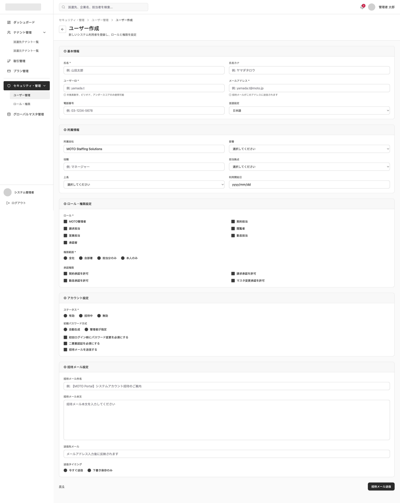

# SCREEN SPECIFICATION

---

# 1. Thông tin màn hình

| Item | Nội dung |
| --- | --- |
| Screen ID | PA-USER-002 |
| Tên màn hình | Tạo quản trị viên Platform mới |
| Tên tiếng Nhật | 管理ユーザー登録 |
| Module | User Management |
| Chức năng | Thêm mới một tài khoản quản trị viên Platform |
| Actor | Platform SaaS Admin |
| URL | /admin/users/create |
| Priority | P1 |
| Phiên bản | v1.0 |

---

# 2. Mục đích màn hình

Cho phép quản trị viên Platform tạo mới tài khoản quản trị viên khác.

---

# 3. Điều kiện truy cập

## Điều kiện trước

- Đã đăng nhập vào hệ thống Platform SaaS Admin.
- Có quyền tạo mới người dùng (platform.user.platform_user.create).

## Điều kiện sau

- Tạo mới tài khoản quản trị viên thành công.

---

# 4. Di chuyển màn hình

## Màn hình nguồn

| Screen ID | Tên màn hình |
| --- | --- |
| PA-USER-001 | Platform User List |

---

## Màn hình đích

| Action | Screen ID | Tên màn hình |
| --- | --- | --- |
| Đăng ký thành công | PA-USER-001 | Platform User List |
| Hủy bỏ | PA-USER-001 | Platform User List |

---

# 5. UI/UX Layout



---

# 6. Định nghĩa Item màn hình

## 1. Thông tin cơ bản

| No | Item | Loại | Format | Bắt buộc | Mô tả |
| --- | --- | --- | --- | --- | --- |
| 1 | Họ và tên | Textbox | varchar | Yes | Tên đầy đủ của người dùng (Ví dụ: 山田太郎) |
| 2 | Họ tên Kana | Textbox | varchar | No | Họ tên phiên âm Katakana (Ví dụ: ヤマダタロウ) |
| 3 | User ID | Textbox | varchar | Yes | Tên đăng nhập (Chỉ nhập alphanumeric, dấu chấm, gạch dưới. Ví dụ: yamada.t) |
| 4 | Email Address | Textbox | varchar | Yes | Email nhận link kích hoạt tài khoản |
| 5 | Số điện thoại | Textbox | varchar | No | Số điện thoại liên hệ (Ví dụ: 03-1234-5678) |
| 6 | Ngôn ngữ | Dropdown | varchar | Yes | Chọn ngôn ngữ mặc định (日本語, English...) |

## 2. Thông tin trực thuộc

| No | Item | Loại | Format | Bắt buộc | Mô tả |
| --- | --- | --- | --- | --- | --- |
| 7 | Công ty (所属会社) | Label | varchar | No | Readonly, tự động hiển thị công ty hiện tại (Ví dụ: MOTO Staffing Solutions) |
| 8 | Bộ phận (部署) | Dropdown | bigint | No | Chọn bộ phận làm việc |
| 9 | Chức vụ (役職) | Textbox | varchar | No | Nhập chức danh/chức vụ (Ví dụ: マネージャー) |
| 10 | Chi nhánh (担当拠点) | Dropdown | bigint | No | Chọn chi nhánh phụ trách |
| 11 | Cấp trên trực tiếp (上長) | Dropdown | bigint | No | Chọn người quản lý trực tiếp |
| 12 | Ngày bắt đầu sử dụng | Datepicker | date | No | Ngày bắt đầu kích hoạt sử dụng tài khoản |

## 3. Thiết lập vai trò & quyền hạn

| No | Item | Loại | Format | Bắt buộc | Mô tả |
| --- | --- | --- | --- | --- | --- |
| 13 | Vai trò (ロール) | Checkbox | bigint | Yes | Đa chọn các vai trò (MOTO管理者, 契約担当, 請求担当, 閲覧者, 営業担当, 勤怠担当, 承認者) |
| 14 | Phạm vi quyền hạn | Radio | smallint | Yes | Chọn phạm vi (全社, 自部署, 担当分のみ, 本人のみ) |
| 15 | Quyền phê duyệt | Checkbox | smallint | No | Chọn các loại quyền phê duyệt được phép (契約承認を許可, 請求承認を許可, 勤怠承認を許可, マスタ変更承認を許可) |

## 4. Cấu hình tài khoản

| No | Item | Loại | Format | Bắt buộc | Mô tả |
| --- | --- | --- | --- | --- | --- |
| 16 | Trạng thái (ステータス) | Radio | smallint | Yes | Chọn trạng thái ban đầu (有効: hoạt động, 招待中: đang mời, 無効: vô hiệu) |
| 17 | Phương thức mật khẩu ban đầu | Radio | smallint | Yes | Tự động tạo (`自動生成`) hoặc quản trị viên chỉ định (`管理者が指定`) |
| 18 | Mật khẩu chỉ định | Textbox | varchar | No | Chỉ hiển thị nếu chọn `管理者が指定` ở Item 17 |
| 19 | Yêu cầu đổi mật khẩu | Checkbox | boolean | No | Bắt buộc đổi mật khẩu khi đăng nhập lần đầu |
| 20 | Bắt buộc 2FA | Checkbox | boolean | No | Kích hoạt xác thực 2 yếu tố |
| 21 | Gửi email mời | Checkbox | boolean | No | Tích chọn để gửi email mời sử dụng hệ thống |

## 5. Cấu hình email mời
*(Chỉ hiển thị nếu Item 21 "Gửi email mời" được tích chọn)*

| No | Item | Loại | Format | Bắt buộc | Mô tả |
| --- | --- | --- | --- | --- | --- |
| 22 | Tiêu đề Email mời | Textbox | varchar | Yes | Tiêu đề thư mời (Ví dụ: 【MOTO Portal】システムアカウント招待のご案内) |
| 23 | Nội dung Email mời | Textarea | text | Yes | Nội dung chi tiết bức thư gửi đi |
| 24 | Email nhận | Label | varchar | No | Hiển thị readonly, tự động map từ Email Address ở Item 4 |
| 25 | Thời điểm gửi | Radio | smallint | Yes | Gửi ngay lập tức (`今すぐ送信`) hoặc Lưu nháp (`下書き保存のみ`) |

## 6. Các nút hành động

| No | Item | Loại | Format | Bắt buộc | Mô tả |
| --- | --- | --- | --- | --- | --- |
| 26 | Nút quay lại (Mũi tên) | Button | Action | No | Quay lại trang danh sách người dùng `PA-USER-001` |
| 27 | Gửi mail mời / Đăng ký | Button | Action | Yes | Thực hiện lưu thông tin và gửi email mời (hoặc tạo tài khoản) |

---

# 7. Validation

[Reference Link](https://app.notion.com/p/Validation-Rule-378f02c407dd805aae8acbb637c995d5?source=copy_link)

---

# 8. Event Definition

| **Type** | **Event** | **Trigger** | **Permission Key** | **Process/Flow** |
| --- | --- | --- | --- | --- |
| api | Initial Load | Mở màn hình | platform.user.platform_user.view | 1. Tự động hiển thị tên công ty ở dạng readonly hoặc cho phép chọn.<br>2. Load dữ liệu master cho các dropdown: 部署 (Bộ phận), 担当拠点 (Chi nhánh), 上長 (Cấp trên). |
| screen | Toggle Invite Email | Tích/bỏ tích "招待メールを送信する" | platform.user.platform_user.create | Hiển thị hoặc ẩn khối "招待メール設定" tương ứng. |
| screen | Back / Cancel | Click icon Mũi tên trái hoặc link "戻る" | - | Quay lại màn hình danh sách PA-USER-001. |
| api | Submit Create | Click button "招待メール送信" (hoặc "登録する") | platform.user.platform_user.create | 1. Thực hiện validate toàn bộ các trường bắt buộc trên Form.<br>2. Gọi API POST `/api/v1/admin/users`.<br>3. Hệ thống tạo tài khoản mới và gửi email mời/thiết lập mật khẩu tùy theo cấu hình chọn.<br>4. Quay lại màn hình danh sách PA-USER-001 và hiển thị Toast thông báo thành công. |

---

# 9. API Mapping

## Create Platform User

### Endpoint

```
POST /api/v1/admin/users
```

Request Body

```json
{
  "full_name": "山田太郎",
  "full_name_kana": "ヤマダタロウ",
  "login_id": "yamada.t",
  "email": "yamada.t@moto.jp",
  "phone_number": "03-1234-5678",
  "mail_language": "ja",
  "company_id": "MOTO_STF_001",
  "department_id": "DEPT_101",
  "position": "マネージャー",
  "office_id": "OFFICE_201",
  "supervisor_id": "USER_1005",
  "start_date": "2026-07-01",
  "role_ids": [1, 2],
  "reference_scope": 1,
  "approval_permissions": [1, 2],
  "status": 2,
  "initial_password_method": 1,
  "specified_password": null,
  "pwd_change_required_flg": 1,
  "require_2fa_flg": 0,
  "send_invitation_email": true,
}
```

Response

```json
{
  "data": {
    "id": 1002,
    "login_id": "yamada.t",
    "full_name": "山田太郎",
    "email": "yamada.t@moto.jp",
    "status": 2,
    "created_at": "2026-07-01T14:50:00Z"
  }
}
```

# 9. Notification

## Trigger

Tạo mới người dùng thành công hoặc Gửi thư mời thành công.

### Receiver

- Người dùng được tạo (Nhận email kích hoạt tài khoản/thiết lập mật khẩu).

### Channel

- Email (Thư mời kích hoạt tài khoản).

---

# 10. Approval Flow

{Reference Link}

# 11. Error Handling

[Reference Link](https://app.notion.com/p/Common-Error-Handling-37af02c407dd802093eac2ec6dd5a000?source=copy_link)

---

# 12. Related Documents

- Business Flow Diagram
- ERD
- API Specification
- Role Matrix
- Wireframe
- NFR