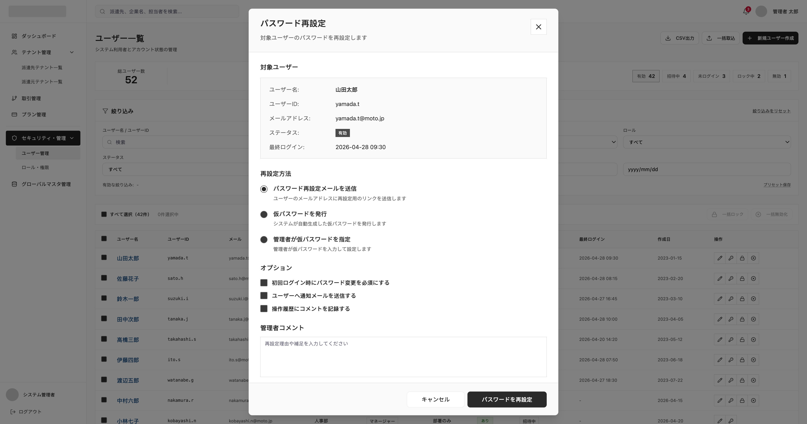

# SCREEN SPECIFICATION

---

# 1. Thông tin màn hình

| Item | Nội dung |
| --- | --- |
| Screen ID | PA-USER-004 |
| Tên màn hình | Password Reset |
| Tên tiếng Nhật | パスワード初期化 |
| Module | User Management |
| Chức năng | Password Reset |
| Actor | Platform SaaS Admin |
| URL | /admin/users/password-reset |
| Priority | P1 |
| Phiên bản | v1.0 |

---

# 2. Mục đích màn hình

Cho phép quản trị viên Platform khởi tạo lại mật khẩu cho một tài khoản quản trị viên khác khi họ quên mật khẩu hoặc cần thiết lập lại.

---

# 3. Điều kiện truy cập

## Điều kiện trước

- Đã đăng nhập vào hệ thống Platform SaaS Admin.
- Có quyền khởi tạo lại mật khẩu (platform.user.password_reset.reset).
- Đã chọn một quản trị viên từ màn hình danh sách.

## Điều kiện sau

- Gửi yêu cầu khởi tạo lại mật khẩu thành công.

---

# 4. Di chuyển màn hình

## Màn hình nguồn

| Screen ID | Tên màn hình |
| --- | --- |
| PA-USER-001 | Platform User List |

---

## Màn hình đích

| Action | Screen ID | Tên màn hình |
| --- | --- | --- |
| Reset thành công | PA-USER-001 | Platform User List |
| Hủy bỏ | PA-USER-001 | Platform User List |

---

# 5. UI/UX Layout



---

# 6. Định nghĩa Item màn hình

## 1. Thông tin người dùng mục tiêu 

| No | Item | Loại | Format | Bắt buộc | Mô tả |
| --- | --- | --- | --- | --- | --- |
| 1 | Họ và tên | Label | varchar | No | Họ và tên của người dùng |
| 2 | User ID | Label | varchar | No | ID tài khoản của người dùng |
| 3 | Email Address | Label | varchar | No | Địa chỉ email |
| 4 | Trạng thái | Badge | varchar | No | Trạng thái hiện tại |
| 5 | Đăng nhập cuối cùng | Label | datetime | No | Thời gian đăng nhập cuối cùng |

## 2. Phương thức đặt lại mật khẩu 

| No | Item | Loại | Format | Bắt buộc | Mô tả |
| --- | --- | --- | --- | --- | --- |
| 6 | Gửi mail đặt lại mật khẩu | Radio | smallint | Yes | Chọn để gửi link đặt lại mật khẩu qua email cho user |
| 7 | Phát hành mật khẩu tạm thời | Radio | smallint | Yes | Hệ thống tự động tạo mật khẩu tạm thời hiển thị trên màn hình |
| 8 | Quản trị chỉ định mật khẩu | Radio | smallint | Yes | Nhập mật khẩu tạm thời do Admin tự chỉ định |
| 9 | Textbox nhập mật khẩu | Textbox | varchar | No | Chỉ hiển thị và bắt buộc nhập nếu chọn Item 8 |

## 3. Tùy chọn nâng cao 

| No | Item | Loại | Format | Bắt buộc | Mô tả |
| --- | --- | --- | --- | --- | --- |
| 10 | Bắt buộc đổi mật khẩu | Checkbox | boolean | No | Bắt buộc đổi mật khẩu ở lần đăng nhập tiếp theo |
| 11 | Gửi mail thông báo | Checkbox | boolean | No | Gửi thông báo về việc thay đổi mật khẩu qua email cho user |
| 12 | Ghi nhận comment | Checkbox | boolean | No | Tích chọn để hiển thị textarea ghi nhận lý do đổi mật khẩu |
| 13 | Comment của quản trị viên | Textarea | text | No | Nhập lý do thay đổi mật khẩu (Chỉ hiển thị nếu tích Item 12) |

## 4. Các nút thao tác

| No | Item | Loại | Format | Bắt buộc | Mô tả |
| --- | --- | --- | --- | --- | --- |
| 14 | Nút đóng | Button | Action | No | Click để đóng Modal và quay lại trang `PA-USER-001` |
| 15 | Hủy bỏ | Button | Action | Yes | Click để đóng Modal và quay lại trang `PA-USER-001` |
| 16 | Đặt lại mật khẩu | Button | Action | Yes | Thực hiện đặt lại mật khẩu với các thông tin đã chọn |

---

# 7. Validation

[Reference Link](https://app.notion.com/p/Validation-Rule-378f02c407dd805aae8acbb637c995d5?source=copy_link)

---

# 8. Event Definition

| **Type** | **Event** | **Trigger** | **Permission Key** | **Process/Flow** |
| --- | --- | --- | --- | --- |
| api | Initial Load | Mở modal | platform.user.password_reset.reset | 1. Nhận ID người dùng được chọn từ màn hình danh sách.<br>2. Gọi API để hiển thị thông tin readonly tương ứng. |
| screen | Close / Cancel | Click nút X hoặc click nút キャンセル | platform.user.password_reset.reset | Đóng modal và quay về màn hình danh sách `PA-USER-001`. |
| screen | Toggle Comment Area | Tích/bỏ tích checkbox "操作履歴にコメントを記録する" | platform.user.password_reset.reset | Ẩn hoặc hiển thị textarea. |
| api | Reset Password | Click button | platform.user.password_reset.reset | 1. Thực hiện validate form.<br>2. Gọi API reset password.<br>3. Hiển thị Toast thông báo thành công.<br>4. Đóng modal và reload danh sách `PA-USER-001`. |

---

# 9. API Mapping

## 1. Get Platform User Detail

### Endpoint

```
GET /api/v1/admin/users/{id}
```

Response

```json
{
  "data": {
    "id": 1001,
    "full_name": "山田太郎",
    "login_id": "yamada.t",
    "email": "yamada.t@moto.jp",
    "status": 1,
    "last_login_at": "2026-04-28 09:30:00"
  }
}
```

---

## 2. Password Reset

### Endpoint

```
POST /api/v1/admin/users/{id}/password-reset
```

Request Body

```json
{
  "reset_method": 1,
  "specified_password": null,
  "force_change_on_next_login": true,
  "send_notification_email": true,
  "record_comment_log": true,
  "admin_comment": "Nhập lý do đặt lại mật khẩu theo yêu cầu"
}
```

Response

```json
{
  "data" : {
    "temporary_password": "TEMP_PWD_ABC123"
  }
}
```

---

# 10. Message Definition

[Reference Link](https://app.notion.com/p/Message-list-374f02c407dd8037808eea01e93be8aa?source=copy_link)

---

# 11. Error Handling

[Reference Link](https://app.notion.com/p/Common-Error-Handling-37af02c407dd802093eac2ec6dd5a000?source=copy_link)

---

# 12. Related Documents

- Business Flow Diagram
- ERD
- API Specification
- Role Matrix
- Wireframe
- NFR
