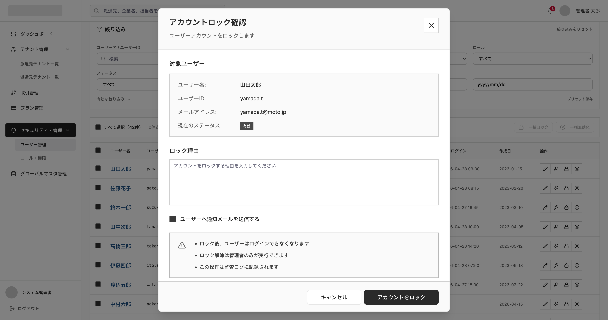

# SCREEN SPECIFICATION

---

# 1. Thông tin màn hình

| Item | Nội dung |
| --- | --- |
| Screen ID | PA-USER-005 |
| Tên màn hình | Khóa/Mở khóa tài khoản |
| Tên tiếng Nhật | ロック解除 |
| Module | User Management |
| Chức năng | Xem trạng thái khóa tài khoản, khóa và mở khóa tài khoản quản trị viên Platform |
| Actor | Platform SaaS Admin |
| URL | /admin/users/lock-management |
| Priority | P1 |
| Phiên bản | v1.0 |

---

# 2. Mục đích màn hình

Cho phép quản trị viên Platform kiểm tra số lần đăng nhập sai và thực hiện thao tác khóa hoặc mở khóa cho một tài khoản quản trị viên khác để kiểm soát an ninh truy cập.

---

# 3. Điều kiện truy cập

## Điều kiện trước

- Đã đăng nhập vào hệ thống Platform SaaS Admin.
- Có quyền xem trạng thái khóa/mở khóa tài khoản (platform.user.account_lock_unlock.view).
- Đã chọn một quản trị viên từ màn hình danh sách.

## Điều kiện sau

- Thay đổi trạng thái khóa/mở khóa của tài khoản thành công.

---

# 4. Di chuyển màn hình

## Màn hình nguồn

| Screen ID | Tên màn hình |
| --- | --- |
| PA-USER-001 | Platform User List |

---

## Màn hình đích

| Action | Screen ID | Tên màn hình |
| --- | --- | --- |
| Thay đổi thành công | PA-USER-001 | Platform User List |
| Hủy bỏ | PA-USER-001 | Platform User List |

---

# 5. UI/UX Layout



---

# 6. Định nghĩa Item màn hình

## 1. Thông tin người dùng mục tiêu

| No | Item | Loại | Format | Bắt buộc | Mô tả |
| --- | --- | --- | --- | --- | --- |
| 1 | Họ và tên | Label | varchar | No | Họ và tên của người dùng |
| 2 | User ID | Label | varchar | No | ID tài khoản của người dùng |
| 3 | Email Address | Label | varchar | No | Địa chỉ email |
| 4 | Trạng thái hiện tại | Badge | varchar | No | Trạng thái hiện tại |

## 2. Thông tin thao tác

| No | Item | Loại | Format | Bắt buộc | Mô tả |
| --- | --- | --- | --- | --- | --- |
| 5 | Lý do khóa/mở khóa | Textarea | text | Yes | Lý do thực hiện khóa/mở khóa tài khoản |
| 6 | Gửi mail thông báo | Checkbox | boolean | No | Tích chọn để gửi thông báo về hành động khóa/mở khóa này đến email của user |

## 3. Khối cảnh báo

| No | Item | Loại | Format | Bắt buộc | Mô tả |
| --- | --- | --- | --- | --- | --- |
| 7 | Thông điệp cảnh báo | Label | text | No | Hiển thị các lưu ý tương ứng |

## 4. Các nút thao tác

| No | Item | Loại | Format | Bắt buộc | Mô tả |
| --- | --- | --- | --- | --- | --- |
| 8 | Nút đóng | Button | Action | No | Click để đóng Modal và quay lại trang danh sách |
| 9 | Hủy bỏ | Button | Action | Yes | Click để đóng Modal và quay lại trang danh sách |
| 10 | Xác nhận Khóa / Mở khóa | Button | Action | Yes | Nút thực thi tương ứng với trạng thái hiện tại |

---

# 7. Validation

[Reference Link](https://app.notion.com/p/Validation-Rule-378f02c407dd805aae8acbb637c995d5?source=copy_link)

---

# 8. Event Definition

| **Type** | **Event** | **Trigger** | **Permission Key** | **Process/Flow** |
| --- | --- | --- | --- | --- |
| api | Initial Load | Mở modal | platform.user.account_lock_unlock.view | 1. Nhận ID người dùng được chọn từ màn hình danh sách.<br>2. Gọi API để hiển thị thông tin readonly và trạng thái hiện tại. |
| screen | Close / Cancel | Click nút X hoặc click nút キャンセル | platform.user.account_lock_unlock.view | Đóng modal và quay về màn hình danh sách. |
| api | Submit Action | Click button "アカウントをロック" hoặc "アカウントロック解除" | platform.user.account_lock_unlock.unlock | 1. Thực hiện validate form.<br>2. Kiểm tra trạng thái hiện tại của user và gọi API tương ứng.<br>3. Hiển thị Toast thông báo thành công.<br>4. Đóng modal và reload danh sách. |

---

# 9. API Mapping

## 1. Get Platform User Detail

### Endpoint

```
GET /api/v1/admin/users/{id}
```

Response

```json
{
  "data": {
    "id": 1001,
    "full_name": "山田太郎",
    "login_id": "yamada.t",
    "email": "yamada.t@moto.jp",
    "status": 1
  }
}
```

---

## 2. Lock Platform User

### Endpoint

```
POST /api/v1/admin/users/{id}/lock
```

Request Body

```json
{
  "reason": "Nhập lý do khóa tài khoản do vi phạm quy định",
  "send_notification_email": true
}
```

Response

```json
{
  "data": null
}
```

---

## 3. Unlock Platform User

### Endpoint

```
POST /api/v1/admin/users/{id}/unlock
```

Request Body

```json
{
  "reason": "Nhập lý do mở khóa tài khoản theo yêu cầu từ phòng ban",
  "send_notification_email": true
}
```

Response

```json
{
  "data": null
}
```

---

# 10. Message Definition

[Reference Link](https://app.notion.com/p/Message-list-374f02c407dd8037808eea01e93be8aa?source=copy_link)

---

# 11. Error Handling

[Reference Link](https://app.notion.com/p/Common-Error-Handling-37af02c407dd802093eac2ec6dd5a000?source=copy_link)

---

# 12. Related Documents

- Business Flow Diagram
- ERD
- API Specification
- Role Matrix
- Wireframe
- NFR
