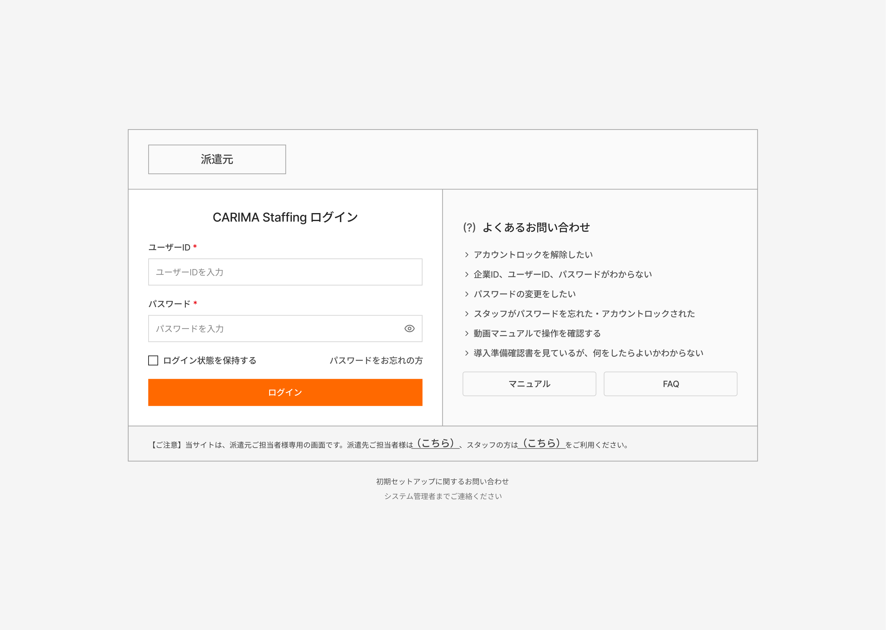

# SCREEN SPECIFICATION

---

# 1. Thông tin màn hình

| Item | Nội dung |
| --- | --- |
| Screen ID | MO-AUTH-001 |
| Tên màn hình | Login |
| Tên tiếng Nhật | ログイン |
| Module | Authentication |
| Chức năng | Đăng nhập hệ thống bằng account/password; hỗ trợ lock control và remember session |
| Actor | Common User |
| URL | /moto/login |
| Priority | P1 |
| Phiên bản | v1.0 |

---

# 2. Mục đích màn hình

Cho phép người dùng:

- Đăng nhập vào hệ thống bằng User ID và Password
- Duy trì trạng thái đăng nhập (Remember Login)
- Thực hiện xác thực người dùng
- Truy cập hệ thống theo quyền được cấp
- Xem thông báo lỗi đăng nhập
- Truy cập chức năng quên mật khẩu
- Tham khảo FAQ và Manual hỗ trợ

---

# 3. Điều kiện truy cập

## Điều kiện trước

- Người dùng chưa đăng nhập hoặc phiên đăng nhập đã hết hạn
- Có tài khoản hợp lệ trong hệ thống
- Truy cập đúng URL đăng nhập

## Điều kiện sau

- Đăng nhập thành công và chuyển đến Dashboard
- Khởi tạo Session đăng nhập
- Lưu trạng thái đăng nhập nếu chọn "ログイン状態を保持する"
- Hiển thị thông báo lỗi khi xác thực thất bại
- Ghi nhận số lần đăng nhập thất bại phục vụ Account Lock Control

---

# 4. Di chuyển màn hình

## Màn hình nguồn

- Direct URL
- Session Timeout
- Logout

## Màn hình đích

| Action | Screen ID | Tên màn hình |
| --- | --- | --- |
| Đăng nhập thành công | MO-HOME-001 | Dashboard |
| Quên mật khẩu | MO-AUTH-002 | Password Reset |
| FAQ | MO-HELP-001 | FAQ |
| Manual | MO-HELP-002 | User Manual |

---

# 5. UI/UX Layout



## Login Area

- Hiển thị User ID và Password
- Password được che ký tự
- Hỗ trợ Show / Hide Password
- Hỗ trợ Remember Login
- Hiển thị thông báo lỗi validation
- Nút Login là Primary Button

## Security

- Hỗ trợ Session Management
- Hỗ trợ Account Lock Control
- Hỗ trợ Remember Login
- Không hiển thị thông tin lỗi hệ thống chi tiết

---

# 6. Danh sách Item màn hình

## Khu vực đăng nhập

| No | Item | Loại | Format | Bắt buộc | Mô tả |
| --- | --- | --- | --- | --- | --- |
| 1 | User ID | Textbox | varchar(255) | Yes | ID đăng nhập |
| 2 | Password | Password Textbox | varchar(255) | Yes | Mật khẩu đăng nhập |
| 3 | Show Password | Icon Button | Boolean | No | Hiển thị / Ẩn mật khẩu |
| 4 | Login Button | Button | Action | Yes | Thực hiện đăng nhập |
| 5 | Forgot Password Link | Link | URL | No | Chuyển sang màn hình quên mật khẩu |
| 6 | Error Message | Label | Text | No | Hiển thị lỗi đăng nhập |

---

# 7. Validation

| Item | Rule | Message |
| --- | --- | --- |
| User ID | Required | User IDを入力してください |
| Password | Required | パスワードを入力してください |
| User ID | Max 255 ký tự | User IDは255文字以内で入力してください |
| Password | Max 255 ký tự | パスワードは255文字以内で入力してください |
| Login | Tài khoản hoặc mật khẩu không đúng | ユーザーIDまたはパスワードが正しくありません |
| Account Lock | Vượt quá số lần đăng nhập sai cho phép | アカウントがロックされています |

---

# 8. Mapping Database

## Table sử dụng

- **central_db.mst_tenant**
    
    
    | Column | Type | Description |
    | --- | --- | --- |
    | tenant_id | varchar | Tenant ID |
    | tenant_code | varchar | Tenant Code |
    | tenant_name | varchar | Tenant Name |
    | status | tinyint | Trạng thái Tenant |
    | auth_policy_id | bigint | Chính sách xác thực |
    | created_at | datetime | Ngày tạo |
    | updated_at | datetime | Ngày cập nhật |
- **tenant_db.mst_moto_user**
    
    
    | Column | Type | Description |
    | --- | --- | --- |
    | user_id | varchar | Login ID |
    | password_hash | varchar | Password Hash |
    | company_id | varchar | Company ID |
    | email | varchar | Email |
    | status | tinyint | Trạng thái tài khoản |
    | failed_login_count | int | Số lần đăng nhập sai |
    | locked_at | datetime | Thời điểm khóa |
    | last_login_at | datetime | Đăng nhập cuối |
    | created_at | datetime | Ngày tạo |
    | updated_at | datetime | Ngày cập nhật |
- **tenant_db.login_history**
    
    
    | Column | Type | Description |
    | --- | --- | --- |
    | id | bigint | PK |
    | user_id | varchar | User ID |
    | login_at | datetime | Thời gian login |
    | ip_address | varchar | IP Address |
    | user_agent | text | User Agent |
    | result | tinyint | Success / Fail |
- 

---

# 9. Event Definition

## Login

### Trigger

Click nút ログイン

### Flow

1. Validate User ID
2. Validate Password
3. Call API Login
4. Kiểm tra trạng thái tài khoản
5. Tạo Session
6. Chuyển Dashboard

---

## Remember Login

### Trigger

Tick checkbox ログイン状態を保持する

### Flow

1. Lưu thông tin Remember Login
2. Tự động đăng nhập ở lần truy cập tiếp theo

---

## Forgot Password

### Trigger

Click パスワードをお忘れの方

### Flow

1. Chuyển màn hình Password Reset
2. Người dùng thực hiện quy trình đặt lại mật khẩu

---

# 10. API Mapping

## Login

### Endpoint

```
POST /api/auth/login
```

Request

```json
{
  "user_id": "user001",
  "password": "******",
  "remember_login": true
}
```

Response

```json
{
  "token": "jwt-token",
  "user": {
    "id": 1,
    "user_id": "user001"
  }
}
```

---

## Logout

```
POST /api/auth/logout
```

---

## Forgot Password

```
POST /api/auth/password-reset
```

---

# 11. Permission

| Action | Guest | User |
| --- | --- | --- |
| View Login Screen | O | O |
| Login | O | O |
| Forgot Password | O | O |
| Access Dashboard | X | O |

---

# 12. Message Definition

| Code | Message |
| --- | --- |
| MSG001 | User IDを入力してください |
| MSG002 | パスワードを入力してください |
| MSG003 | ユーザーIDまたはパスワードが正しくありません |
| MSG004 | アカウントがロックされています |
| MSG005 | ログインに成功しました |
| MSG006 | システムエラーが発生しました |

---

# 13. Error Handling

| HTTP Code | Action |
| --- | --- |
| 400 | Hiển thị lỗi validate |
| 401 | Hiển thị lỗi đăng nhập |
| 403 | Hiển thị tài khoản bị khóa |
| 500 | Hiển thị System Error |

---

# 14. Audit Log

| Action | Log |
| --- | --- |
| Login Success | Yes |
| Login Failed | Yes |
| Logout | Yes |
| Password Reset Request | Yes |

---

# 15. Security Requirement

- Password không được lưu dạng Plain Text
- Session Token phải được mã hóa
- Hỗ trợ Account Lock Control
- Hỗ trợ Session Timeout
- Hỗ trợ Remember Login
- Ghi nhận lịch sử đăng nhập
- Chống Brute Force Attack

---

# 16. Related Documents

- BF-001 ログインフロー
- API Specification
- Authentication Design
- Session Management Design
- Password Policy
- Account Lock Policy
- Wireframe

---