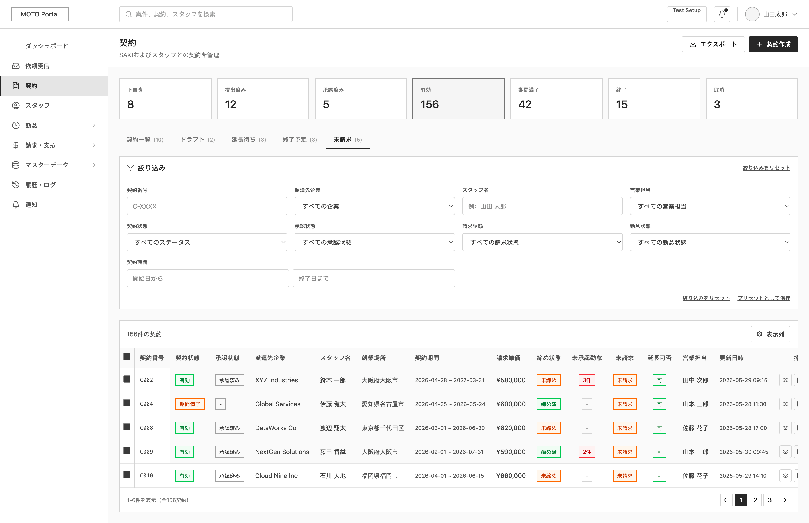

# 作成中契約一覧

System: MOTO Portal
Menu: Contract Management
メニュー: 契約管理
Screen ID: MO-CON-005
Screen (VI): Draft Contract List
Giải thích tính năng: Danh sách contract draft
機能説明: 下書き契約一覧を表示する
Thông tin hiển thị trên màn hình: Draft contract, updated date, draft owner
画面表示情報: 下書き契約、更新日、作成者
URL: /moto/contracts/drafts
Business Flow: Diagram 2 — 派遣照会〜契約成立フロー (https://www.notion.so/Diagram-2-364f02c407dd806a8429dd8ff501068b?pvs=21), 契約作成フロー (https://www.notion.so/362f02c407dd80f3a10cfe645cd590f4?pvs=21)
システム: 派遣元ポータル
API List: MO-CON-005-API-01-Get Draft Contract List (https://www.notion.so/MO-CON-005-API-01-Get-Draft-Contract-List-36bf02c407dd805a9af5c5c65f890230?pvs=21)
Status: In progress

# SCREEN SPECIFICATION

---

# 1. Thông tin màn hình

| Item | Nội dung |
| --- | --- |
| Screen ID | MO-CON-005 |
| Tên màn hình | Danh sách Hợp đồng nháp |
| Tên tiếng Nhật | 作成中契約一覧 |
| Module | Contract Management |
| Chức năng | Hiển thị danh sách các hợp đồng nháp đang soạn thảo, hỗ trợ lọc tìm kiếm, xóa nháp hoặc khôi phục để tiếp tục chỉnh sửa |
| Actor | MOTO User (MOTO Admin, MOTO Sales, MOTO Operation) |
| URL | /moto/contracts/drafts |
| Priority | P1 |
| Phiên bản | v1.0 |

---

# 2. Mục đích màn hình

Cho phép người dùng phía doanh nghiệp phái cử (MOTO Portal):

- Tìm kiếm các bản nháp hợp đồng đang trong quá trình soạn thảo dựa trên các tiêu chí lọc (Mã hợp đồng nháp, doanh nghiệp tiếp nhận SAKI, nhân viên Staff phái cử, người tạo nháp, thời gian cập nhật nháp).
- Xem danh sách hợp đồng nháp kèm các thông tin chính: Mã hợp đồng, tên khách hàng, tên nhân viên, người tạo nháp, ngày cập nhật cuối cùng.
- Thực hiện khôi phục bản nháp (tiếp tục chỉnh sửa/hoàn thiện việc tạo hợp đồng) bằng cách chuyển tiếp sang màn hình khôi phục nháp `MO-CON-020`.
- Xóa bỏ bản nháp hợp đồng không sử dụng nữa (xóa đơn lẻ hoặc xóa hàng loạt).

---

# 3. Điều kiện truy cập

## Điều kiện trước

- Đã đăng nhập vào hệ thống MOTO Portal.
- Tài khoản người dùng có quyền xem danh sách hợp đồng (`contract.view`).

## Điều kiện sau

- Hiển thị danh sách hợp đồng nháp theo bộ lọc tìm kiếm mặc định.

---

# 4. Di chuyển màn hình

## Màn hình nguồn

| Screen ID | Tên màn hình |
| --- | --- |
| MO-CON-001 | 契約一覧 (Contract List) - Click chọn tab "ドラフト" |
| MO-CON-024 | 未提出契約一覧 (Unsubmitted Contract List) - Click chọn tab "ドラフト" |

---

## Màn hình đích

| Action | Screen ID | Tên màn hình |
| --- | --- | --- |
| Tiếp tục soạn thảo (編集) / Click mã hợp đồng | MO-CON-020 | 一時保存契約から作成 (Draft Contract Restore) |
| Tạo mới (新規起票) | MO-CON-003 | 契約作成 (Create Contract) |
| Click tab "契約一覧" | MO-CON-001 | 契約一覧 (Contract List) |
| Click tab "未請求" | MO-CON-024 | 未提出契約一覧 (Unsubmitted Contract List) |

---

# 5. UI/UX Layout



---

## Nguyên tắc UI/UX

### **Menu Tab Điều hướng nhanh**

- Gồm 5 tab nằm ngay trên khu vực bộ lọc:
    - **契約一覧 (Danh sách hợp đồng):** URL `/moto/contracts` (`MO-CON-001`).
    - **ドラフト (Draft/Nháp):** URL `/moto/contracts/drafts` (`MO-CON-005`). **Mặc định active ở màn hình này (gạch chân đen, in đậm).**
    - **延長待ち (Chờ gia hạn):** Chỉ hiển thị hợp đồng chờ gia hạn.
    - **終了予定 (Sắp kết thúc):** Chỉ hiển thị hợp đồng sắp kết thúc hiệu lực.
    - **未請求 (Chưa xuất hóa đơn):** URL `/moto/contracts/unsubmitted` (`MO-CON-024`).

### **Search Area (Khu vực tìm kiếm)**

- Hiển thị dạng panel có thể thu gọn/mở rộng với tiêu đề "絞り込み" (Bộ lọc).
- Các tiêu chí được sắp xếp gọn gàng theo lưới 4 cột.
- Cung cấp link "絞り込みをリセット" (Reset bộ lọc).

### **Data Table (Bảng dữ liệu)**

- Có checkbox ở cột đầu tiên để chọn hàng loạt (Bulk Action).
- Hỗ trợ sắp xếp (Sort) bằng cách click vào tiêu đề cột có biểu tượng ⇅.
- Cột thao tác gồm nút "編集" (chuyển tiếp tới `MO-CON-020`) và nút "削除" (xóa nháp).
- Phân trang (Pagination) cố định dưới chân trang, responsive linh hoạt.

### **Action Button (Nút hành động)**

- **Tạo mới (新規起票 / 契約作成):** Màu đen (Primary), nằm ở góc trên bên phải màn hình.
- **Xóa hàng loạt (一括削除):** Nút màu đỏ (Danger), chỉ hiển thị/hoạt động khi chọn ít nhất 1 bản ghi qua Checkbox.
- **Làm mới bộ lọc (絞り込みをリセット):** Link text reset các bộ lọc về mặc định.

---

# 6. Danh sách Item màn hình

## Khu vực tìm kiếm

| No | Item | Loại | Format | Bắt buộc | Mô tả |
| --- | --- | --- | --- | --- | --- |
| 1 | Mã hợp đồng (契約番号) | Textbox | varchar(50) | No | Nhập mã hợp đồng phái cử nháp. Placeholder: "C-XXXX" |
| 2 | Doanh nghiệp tiếp nhận (派遣先企業) | Dropdown | varchar(16) | No | Danh sách các doanh nghiệp khách hàng SAKI. Mặc định: "すべての企業" |
| 3 | Họ tên nhân viên (スタッフ名) | Textbox | varchar(255) | No | Nhập tên nhân viên. Placeholder: "例：山田 太郎" |
| 4 | Người tạo nháp (作成者) | Dropdown | varchar(16) | No | Danh sách tài khoản người dùng MOTO Portal. Mặc định: "すべての作成者" |
| 5 | Ngày cập nhật (更新日 - Từ) | DatePicker | YYYY/MM/DD | No | Ngày bắt đầu khoảng thời gian cập nhật. Placeholder: "更新日から" |
| 6 | Ngày cập nhật (更新日 - Đến) | DatePicker | YYYY/MM/DD | No | Ngày kết thúc khoảng thời gian cập nhật. Placeholder: "更新日まで" |
| 7 | Làm mới bộ lọc (絞り込みをリセット) | Link | - | - | Reset toàn bộ các bộ lọc đang chọn về mặc định |

## Các nút hành động (Action Buttons)

| No | Item | Loại | Format | Bắt buộc | Mô tả |
| --- | --- | --- | --- | --- | --- |
| 8 | Tạo mới (新規起票 / 契約作成) | Button | - | - | Chuyển tiếp sang màn hình tạo hợp đồng mới (`MO-CON-003`) |
| 9 | Xóa hàng loạt (一括削除) | Button | - | - | Xóa các bản nháp hợp đồng đã chọn qua Checkbox |

---

# 7. Định nghĩa Data Table

## Table hiển thị

### **t_contract**

| STT | Item | DB Column | Type | Width | Mô tả |
| --- | --- | --- | --- | --- | --- |
| 1 | Checkbox | - | boolean | 40px | Chọn dòng để thực hiện xóa hàng loạt |
| 2 | Mã hợp đồng (契約番号) | contract_no | varchar | 120px | Mã số hợp đồng phái cử nháp (Link tới màn hình khôi phục nháp `MO-CON-020`) |
| 3 | Doanh nghiệp tiếp nhận (派遣先企業) | client_name | varchar | 220px | Tên chính thức của doanh nghiệp tiếp nhận SAKI |
| 4 | Tên nhân viên (スタッフ名) | staff_name | varchar | 150px | Họ tên nhân viên phái cử |
| 5 | Người tạo nháp (作成者) | creator_name | varchar | 150px | Họ tên tài khoản MOTO tạo bản nháp |
| 6 | Ngày cập nhật cuối (更新日時) | updated_at | datetime | 180px | Ngày giờ cập nhật bản nháp cuối cùng |
| 7 | Thao tác (操作) | - | action | 150px | Gồm 2 nút hành động: "編集" (Khôi phục nháp) và "削除" (Xóa nháp) |

---

## Sorting

Cho phép sắp xếp (Sort) theo cả hai chiều tăng/giảm dần tại các cột:

- Mã hợp đồng (`contract_no`)
- Doanh nghiệp tiếp nhận (`client_name`)
- Tên nhân viên (`staff_name`)
- Ngày cập nhật (`updated_at`)

---

## Paging

| Item | Value |
| --- | --- |
| Default | 20 |
| Options | 20, 50, 100 |
| Server Side | Yes |

---

# 8. Mapping Database

## Table sử dụng

### **t_contract**

Bảng thông tin hợp đồng phái cử cốt lõi (Kiểm tra trạng thái bản nháp và lấy thông tin cơ bản):

| Column | Type | Description |
| --- | --- | --- |
| contract_no | varchar(14) | PK - Mã số hợp đồng phái cử |
| saki_company_id | varchar(20) | FK - ID doanh nghiệp tiếp nhận (SAKI Company ID) |
| staff_code | varchar(16) | FK - Mã nhân viên phái cử |
| status | tinyint(1) | Trạng thái hợp đồng (1: 派遣先入力中 - Bản nháp đang soạn thảo) |
| created_by | varchar(100) | FK - ID tài khoản người tạo nháp (mst_moto_user.user_id) |
| created_at | datetime | Ngày giờ tạo bản nháp |
| updated_at | datetime | Ngày giờ cập nhật bản nháp cuối cùng |

---

### **mst_saki_company**

Bảng thông tin doanh nghiệp tiếp nhận (SAKI Company):

| Column | Type | Description |
| --- | --- | --- |
| company_id | varchar(16) | PK - ID doanh nghiệp tiếp nhận |
| official_name_ja | varchar(100) | Tên chính thức của doanh nghiệp (tiếng Nhật) |

---

### **mst_staff**

Bảng thông tin nhân viên phái cử (Staff):

| Column | Type | Description |
| --- | --- | --- |
| staff_code | varchar(16) | PK - Mã nhân viên |
| last_name_ja | varchar(24) | Họ nhân viên (tiếng Nhật) |
| first_name_ja | varchar(24) | Tên nhân viên (tiếng Nhật) |

---

### **mst_moto_user**

Bảng thông tin tài khoản người dùng phía MOTO Portal:

| Column | Type | Description |
| --- | --- | --- |
| user_id | varchar(16) | PK - ID người dùng |
| last_name_ja | varchar(24) | Họ người dùng (tiếng Nhật) |
| first_name_ja | varchar(24) | Tên người dùng (tiếng Nhật) |

---

# 9. Validation

| Item | Rule | Message Code | Mô tả |
| --- | --- | --- | --- |
| Contract No | Chiều dài <= 50 ký tự | CMS-VAL-6 | Mã hợp đồng tối đa 50 ký tự |
| Date Format | Định dạng YYYY/MM/DD | CMS-VAL-54 | Vui lòng chỉ định ngày theo đúng định dạng YYYY/MM/DD |
| Updated Period (From - To) | Date From <= Date To | CMS-VAL-69 | Ngày bắt đầu phải nhỏ hơn hoặc bằng ngày kết thúc |
| Row Selection | Chọn ít nhất 1 bản ghi khi xóa hàng loạt | CMS-VAL-103 | Vui lòng chọn ít nhất 1 dữ liệu. |

---

# 10. Event Definition

## **Initial Load (Tải danh sách nháp)**

### **Trigger**

Người dùng truy cập URL `/moto/contracts/drafts` hoặc click vào tab "ドラフト".

### **Flow**

1. Gửi Request gọi API `GET /api/v1/moto/contracts/draft-contract-list` với các điều kiện mặc định và tham số phân trang (`page = 1`, `limit = 20`).
2. Nhận Response trả về từ Server:
    - Thành công: Hiển thị danh sách hợp đồng nháp lên bảng dữ liệu và cập nhật tổng số bản ghi phân trang.
    - Thất bại: Hiển thị Toast thông báo lỗi hệ thống (`CMS-VAL-99`).

---

## **Search (Tìm kiếm)**

### **Trigger**

Người dùng thay đổi điều kiện lọc (chọn giá trị dropdown, nhập text vào ô tìm kiếm rồi nhấn Enter hoặc click chuột ra ngoài).

### **Flow**

1. Validate các dữ liệu nhập tại panel lọc (kiểm tra khoảng ngày cập nhật hợp lệ).
    - Nếu không hợp lệ: Hiển thị lỗi validation tương ứng và dừng luồng.
2. Gửi Request gọi API `GET /api/v1/moto/contracts/draft-contract-list` kèm các tham số lọc hoạt động.
3. Nhận Response trả về từ Server:
    - Thành công: Cập nhật lại Grid dữ liệu bảng nháp và phân trang.
    - Thất bại: Hiển thị Toast thông báo lỗi hệ thống (`CMS-VAL-99`).

---

## **Reset (Làm mới bộ lọc)**

### **Trigger**

Người dùng click link "絞り込みをリセット".

### **Flow**

1. Xóa (clear) toàn bộ dữ liệu đang nhập trên các ô lọc của bộ lọc.
2. Tự động gọi lại API `GET /api/v1/moto/contracts/draft-contract-list` với tham số trống để tải lại danh sách nháp mặc định ở trang 1.

---

## **Xóa bản nháp (Xóa đơn lẻ hoặc Xóa hàng loạt)**

### **Trigger**

Người dùng click chọn nút "削除" của một bản ghi nháp trên bảng, hoặc tick chọn nhiều checkbox và click nút "一括削除" (Xóa hàng loạt).

### **Flow**

1. Hiển thị popup xác nhận:
    - Nếu xóa đơn lẻ: Hiển thị dialog `CMS-VAL-CONFIRM-DELETE` ("下書き契約を削除します。よろしいですか。" / "Sẽ tiến hành xóa bản nháp hợp đồng. Bạn có chắc chắn không?").
    - Nếu xóa hàng loạt: Hiển thị dialog `CMS-VAL-CONFIRM-BULK-DELETE` ("選択した下書き契約を一括削除します。よろしいですか。" / "Sẽ tiến hành xóa hàng loạt các bản nháp hợp đồng đã chọn. Bạn có chắc chắn không?").
2. Người dùng click Xác nhận:
    - Gửi Request gọi API `DELETE /api/v1/moto/contracts/draft-contract-list` gửi danh sách mã hợp đồng nháp cần xóa.
    - Server thực hiện xóa bản ghi nháp khỏi hệ thống DB.
    - Trả về kết quả:
        - Thành công: Hiển thị Toast thông báo thành công `CMS-VAL-DELETE` ("下書き契約を削除しました。" / "Đã xóa bản nháp hợp đồng thành công."). Load lại danh sách bản nháp và cập nhật phân trang.
        - Thất bại: Hiển thị Toast thông báo không có quyền (`CMS-VAL-95`) hoặc lỗi hệ thống (`CMS-VAL-99`).

---

# 11. API Mapping

## **Get Draft Contract List**

### Endpoint

```
GET /api/v1/moto/contracts/draft-contract-list
```

### Request Parameters (Query String)

| Parameter | Type | Required | Mô tả |
| --- | --- | --- | --- |
| contract_no | string | No | Mã hợp đồng phái cử nháp |
| client_id | string | No | ID doanh nghiệp tiếp nhận SAKI |
| staff_name | string | No | Tên nhân viên phái cử |
| creator_id | string | No | ID tài khoản người tạo nháp (MOTO User ID) |
| updated_from | date | No | Khoảng ngày cập nhật - từ (YYYY-MM-DD) |
| updated_to | date | No | Khoảng ngày cập nhật - đến (YYYY-MM-DD) |
| page | int | No | Trang hiện tại (Mặc định: 1) |
| limit | int | No | Số bản ghi trên trang (Mặc định: 20) |
| sort_column | string | No | Cột sắp xếp (Mặc định: updated_at) |
| sort_direction | string | No | Hướng sắp xếp (asc/desc, Mặc định: desc) |

### Response (Success 200 OK)

```json
{
  "status": "success",
  "message": "get_draft_contracts_success",
  "data": {
    "items": [
      {
        "contract_no": "C00000000-000",
        "client_name": "Doanh nghiệp tiếp nhận A",
        "staff_name": "山田 太郎",
        "creator_name": "鈴木 一郎",
        "updated_at": "2026/06/09 10:00:00"
      }
    ],
    "total": 12,
    "current_page": 1,
    "last_page": 1,
    "per_page": 20
  }
}
```

---

## **Delete Draft Contract**

### Endpoint

```
DELETE /api/v1/moto/contracts/draft-contract-list
```

### Request (Body JSON)

```json
{
  "contract_nos": [
    "C00000000-000"
  ]
}
```

### Response (Success 200 OK)

```json
{
  "status": "success",
  "message": "delete_draft_contracts_success"
}
```

---

# 12. Permission

| Action | MOTO Admin | MOTO Sales | MOTO Operation |
| --- | --- | --- | --- |
| View (Xem danh sách nháp) | O | O | O |
| Restore (Khôi phục soạn thảo) | O | O | X |
| Delete (Xóa nháp) | O | O | X |

---

# 13. Message Definition

| Code | Message (Tiếng Nhật) | Message (Tiếng Việt) | Loại hiển thị |
| --- | --- | --- | --- |
| **CMS-VAL-6** | {0}は{1}文字以内で入力してください。 | Vui lòng nhập {0} trong vòng {1} ký tự trở xuống. | Inline Validation |
| **CMS-VAL-54** | {0}は日付形式(YYYY/MM/DD)で入力してください。 | Vui lòng nhập ngày {0} theo định dạng YYYY/MM/DD. | Inline Validation |
| **CMS-VAL-69** | {0}は{1}から{2}の間で指定してください。 | Vui lòng chỉ định {0} trong khoảng từ {1} đến {2}. | Inline Validation |
| **CMS-VAL-95** | この機能・リソースへのアクセス権限がありません。 | Bạn không có quyền truy cập vào chức năng/tài nguyên này. | Toast Error |
| **CMS-VAL-99** | システムエラーが発生しました。管理者へお問い合わせください。 | Đã xảy ra lỗi hệ thống. Vui lòng liên hệ với người quản trị. | Toast Error / Popup |
| **CMS-VAL-103** | 1件以上選択してください。 | Vui lòng chọn ít nhất 1 dữ liệu. | Toast Warning |
| **CMS-VAL-DELETE** (Custom) | 下書き契約を削除しました。 | Đã xóa bản nháp hợp đồng thành công. | Toast Success |
| **CMS-VAL-CONFIRM-DELETE** (Custom) | 下書き契約を削除します。よろしいですか。 | Sẽ tiến hành xóa bản nháp hợp đồng. Bạn có chắc chắn không? | Dialog Confirm |
| **CMS-VAL-CONFIRM-BULK-DELETE** (Custom) | 選択した下書き契約を一括削除します。よろしいですか。 | Sẽ tiến hành xóa hàng loạt các bản nháp hợp đồng đã chọn. Bạn có chắc chắn không? | Dialog Confirm |

---

# 14. Error Handling

| HTTP Code | Action | Message ID hiển thị |
| --- | --- | --- |
| 400 | Hiển thị thông báo dữ liệu không hợp lệ tại popup/toast. | CMS-VAL-93 |
| 401 | Xóa token tại LocalStorage và tự động chuyển hướng về trang Đăng nhập (/login). | CMS-VAL-94 |
| 403 | Chặn hành động và hiển thị Toast báo lỗi không có quyền truy cập. | CMS-VAL-95 |
| 404 | Hiển thị Toast thông báo dữ liệu không tồn tại. | CMS-VAL-96 |
| 422 | Hiển thị chi tiết lỗi validate nghiệp vụ từ Server tại từng ô nhập liệu tương ứng. | CMS-VAL-98 |
| 500 | Hiển thị Popup thông báo lỗi hệ thống nghiêm trọng. | CMS-VAL-99 |

---

# 15. Audit Log

| Action | Log | Nội dung lưu |
| --- | --- | --- |
| Search | No | - |
| Restore Draft | Yes | [User] đã khôi phục bản nháp hợp đồng [contract_no]. |
| Delete Draft | Yes | [User] đã xóa bản nháp hợp đồng [contract_nos]. |

---

# 16. Related Documents

- Business Flow Diagram
- ERD
- API Specification
- Role Matrix
- Wireframe
- NFR