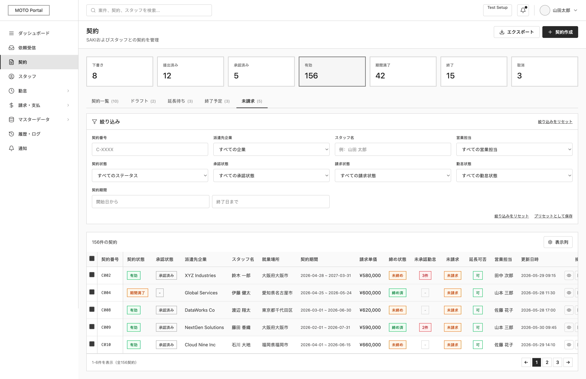

# 未提出契約一覧

System: MOTO Portal
Menu: Contract Management
メニュー: 契約管理
Screen ID: MO-CON-024
Screen (VI): Unsubmitted Contract List
Giải thích tính năng: Danh sách contract chưa submit hoặc pending submit.
機能説明: 未提出契約一覧を表示する。
Thông tin hiển thị trên màn hình: Contract No, client, staff, contract period, status
画面表示情報: 契約番号、取引先、スタッフ、契約期間、ステータス
URL: /moto/contracts/unsubmitted
Business Flow: 契約承認フロー (https://www.notion.so/362f02c407dd80d9a3fef628f1cf05f6?pvs=21)
システム: 派遣元ポータル
API List: MO-CON-024-API-01-Submit/Process Unsubmitted Contract List (https://www.notion.so/MO-CON-024-API-01-Submit-Process-Unsubmitted-Contract-List-36bf02c407dd8043854df8e94157e980?pvs=21)
Status: In progress

# SCREEN SPECIFICATION

---

# 1. Thông tin màn hình

| Item | Nội dung |
| --- | --- |
| Screen ID | MO-CON-024 |
| Tên màn hình | Danh sách Hợp đồng chưa gửi |
| Tên tiếng Nhật | 未提出契約一覧 |
| Module | Contract Management |
| Chức năng | Tìm kiếm, xem danh sách hợp đồng chưa xuất hóa đơn (hoặc chưa gửi), kết thúc hợp đồng, copy và xuất dữ liệu hợp đồng phái cử |
| Actor | MOTO User (Admin, Sales, Operation) |
| URL | /moto/contracts/unsubmitted |

---

# 2. Mục đích màn hình

Cho phép người dùng:

- Tìm kiếm hợp đồng phái cử chưa gửi dựa trên các tiêu chí lọc (Mã hợp đồng, công ty tiếp nhận SAKI, nhân viên Staff, người phụ trách Sales, trạng thái hợp đồng, trạng thái phê duyệt, trạng thái hóa đơn, trạng thái chấm công, thời hạn hợp đồng). Hệ thống mặc định filter sẵn các hợp đồng ở trạng thái chưa xuất hóa đơn.
- Xem thống kê nhanh các trạng thái hợp đồng thông qua 7 thẻ KPI (Hợp đồng nháp, Đã gửi, Đã phê duyệt, Đang hiệu lực, Hết hạn hiệu lực, Kết thúc, Hủy bỏ).
- Chuyển tiếp sang màn hình Tạo mới, Xem chi tiết, Sao chép (Copy) hoặc Chỉnh sửa hợp đồng.
- Thực hiện kết thúc các hợp đồng đang hoạt động (Active).
- Xuất dữ liệu danh sách hợp đồng dưới dạng file CSV/Excel hoặc PDF.

---

# 3. Điều kiện truy cập

## Điều kiện trước

- Đã đăng nhập vào hệ thống MOTO Portal.
- Tài khoản người dùng có quyền `contract.view`.

## Điều kiện sau

- Hiển thị danh sách hợp đồng phái cử chưa gửi theo bộ lọc mặc định (filter sẵn trạng thái chưa xuất hóa đơn).

---

# 4. Di chuyển màn hình

## Màn hình nguồn

| Screen ID | Tên màn hình |
| --- | --- |
| MO-CON-001 | 契約一覧 (Contract List) |
| MO-CON-002 | 契約詳細・編集 (Contract Detail・Edit) - Quay lại |

---

## Màn hình đích

| Action | Screen ID | Tên màn hình |
| --- | --- | --- |
| Tạo mới (Trực tiếp) | MO-CON-003 | 契約作成 (Create Contract) |
| Xem chi tiết & Chỉnh sửa | MO-CON-002 | 契約詳細・編集 (Contract Detail・Edit) |
| Xem danh sách Nháp | MO-CON-005 | 作成中契約一覧 (Draft Contract List) |
| Quay lại danh sách chính | MO-CON-001 | 契約一覧 (Contract List) |

---

# 5. UI/UX Layout



---

## Nguyên tắc UI/UX

### **Thống kê nhanh (KPI Summary Cards)**

- Giao diện giống hoàn toàn màn hình `MO-CON-001`.
- Nằm dưới header và trên khu vực tìm kiếm.
- Bao gồm 7 thẻ thống kê động:
    - **Hợp đồng nháp (下書き):** Tổng số hợp đồng nháp.
    - **Đã gửi (提出済み):** Tổng số hợp đồng đã gửi đi chờ duyệt.
    - **Đã phê duyệt (承認済み):** Tổng số hợp đồng đã duyệt.
    - **Đang hiệu lực (有効):** Tổng số hợp đồng đang có hiệu lực.
    - **Hết hạn hiệu lực (期間満了):** Tổng số hợp đồng đã hết hạn.
    - **Kết thúc (終了):** Tổng số hợp đồng đã đóng/kết thúc.
    - **Hủy bỏ (取消):** Tổng số hợp đồng đã hủy.
- Click vào các thẻ này sẽ tự động lọc danh sách theo trạng thái tương ứng.

### **Menu Tab Điều hướng nhanh**

- Gồm 5 tab nằm ngay trên khu vực bộ lọc:
    - **契約一覧 (Danh sách hợp đồng):** Hiển thị toàn bộ hợp đồng.
    - **ドラフト (Draft/Nháp):** Chỉ hiển thị các hợp đồng nháp.
    - **延長待ち (Chờ gia hạn):** Chỉ hiển thị hợp đồng chờ gia hạn.
    - **終了予定 (Sắp kết thúc):** Chỉ hiển thị hợp đồng sắp kết thúc hiệu lực.
    - **未請求 (Chưa xuất hóa đơn):** Chỉ hiển thị các hợp đồng chưa lập hóa đơn. **Mặc định active ở màn hình này (gạch chân đen, in đậm) để hiển thị danh sách các hợp đồng chưa xuất hóa đơn.**

### **Search Area (Khu vực tìm kiếm)**

- Hiển thị dạng panel có thể thu gọn/mở rộng với tiêu đề "絞り込み" (Bộ lọc).
- Các tiêu chí được sắp xếp gọn gàng theo lưới 4 cột.
- Cung cấp link "絞り込みをリセット" (Reset bộ lọc) và "プリセットとして保存" (Lưu bộ lọc mẫu).

### **Data Table (Bảng dữ liệu)**

- Có checkbox ở cột đầu tiên để chọn hàng loạt (Bulk Action).
- Hỗ trợ sắp xếp (Sort) bằng cách click vào tiêu đề cột có biểu tượng ⇅.
- Cột trạng thái hiển thị dạng Badge màu sắc trực quan (ví dụ: `有効` - xanh lá, `期間満了` - cam, `終了` - đen).
- Cột thao tác (Thao tác cuối cùng bên phải) gồm icon Xem (Eye icon) và Menu phụ ba chấm dọc (More actions).
- Phân trang (Pagination) cố định dưới chân trang, responsive linh hoạt.

### **Action Button (Nút hành động)**

- **Tạo mới (新規起票 / 契約作成):** Màu đen (Primary), nằm ở góc trên bên phải màn hình.
- **Xuất dữ liệu (エクスポート):** Viền đen, nền trắng (Secondary), nằm cạnh nút Tạo mới.
- **Làm mới bộ lọc (絞り込みをリセット):** Link text xuất hiện ở góc trên bên phải và góc dưới bên phải panel lọc.
- **Lưu bộ lọc mẫu (プリセットとして保存):** Link text nằm cạnh link reset ở dưới panel lọc.
- **Quay lại (戻る):** Người dùng có thể quay lại danh sách hợp đồng chính `MO-CON-001` bằng cách click vào tab "契約一覧 (10)".

---

# 6. Danh sách Item màn hình

## **Khu vực tìm kiếm**

| No | Item | Loại | Format | Bắt buộc | Mô tả |
| --- | --- | --- | --- | --- | --- |
| 1 | Mã hợp đồng (契約番号) | Textbox | varchar(50) | No | Nhập mã hợp đồng dạng nửa dòng (Hankaku). Placeholder: "C-XXXX" |
| 2 | Doanh nghiệp tiếp nhận (派遣先企業) | Dropdown | bigint | No | Danh sách các doanh nghiệp khách hàng SAKI. Mặc định: "すべての企業" |
| 3 | Họ tên nhân viên (スタッフ名) | Textbox | varchar(255) | No | Nhập tên nhân viên. Placeholder: "例：山田 太郎" |
| 4 | Người phụ trách Sales (営業担当) | Dropdown | bigint | No | Danh sách sales phụ trách. Mặc định: "すべての営業担当" |
| 5 | Trạng thái hợp đồng (契約状態) | Dropdown | enum | No | Trạng thái hiệu lực (有効, 期間満了, 終了...). Mặc định: "すべてのステータス" |
| 6 | Trạng thái phê duyệt (承認状態) | Dropdown | enum | No | Trạng thái duyệt (承認待ち, 承認済み, 未送信...). Mặc định: "すべての承認状態" |
| 7 | Trạng thái hóa đơn (請求状態) | Dropdown | enum | No | Trạng thái xuất hóa đơn (未請求, 請求済み...). Mặc định: "すべての請求状態" (Mặc định filter sẵn "未請求") |
| 8 | Trạng thái chấm công (勤怠状態) | Dropdown | enum | No | Trạng thái chấm công (未承認, 承認済み...). Mặc định: "すべての勤怠状態" |
| 9 | Thời hạn hợp đồng (契約期間 - Từ) | DatePicker | YYYY/MM/DD | No | Ngày bắt đầu khoảng thời gian hiệu lực hợp đồng. Placeholder: "開始日から" |
| 10 | Thời hạn hợp đồng (契約期間 - Đến) | DatePicker | YYYY/MM/DD | No | Ngày kết thúc khoảng thời gian hiệu lực hợp đồng. Placeholder: "終了日まで" |
| 11 | Làm mới bộ lọc (絞り込みをリセット) | Link | - | - | Reset toàn bộ các bộ lọc đang chọn về mặc định (xuất hiện ở cả góc trên bên phải và góc dưới bên phải panel lọc) |
| 12 | Lưu bộ lọc mẫu (プリセットとして保存) | Link | - | - | Lưu cấu hình lọc hiện hành thành cấu hình lọc mẫu (nằm cạnh link reset ở dưới panel) |

## **Các nút hành động (Action Buttons)**

| No | Item | Loại | Format | Bắt buộc | Mô tả |
| --- | --- | --- | --- | --- | --- |
| 13 | Tạo mới (新規起票 / 契約作成) | Button | - | - | Chuyển tiếp sang màn hình tạo hợp đồng mới (`MO-CON-003`) |
| 14 | Xuất dữ liệu (エクスポート) | Button | - | - | Xuất danh sách hợp đồng chưa thanh toán hiện tại theo bộ lọc ra file CSV |

---

# 7. Định nghĩa Data Table

## Table hiển thị

### <t_contract>

| STT | Item | DB Column | Type | Width | Mô tả |
| --- | --- | --- | --- | --- | --- |
| 1 | Checkbox | - | boolean | 40px | Chọn dòng để thực hiện bulk action |
| 2 | Mã hợp đồng (契約番号) | contract_no | varchar | 100px | Hiển thị mã hợp đồng (Link tới chi tiết `MO-CON-002`) |
| 3 | Trạng thái hợp đồng (契約状態) | status | enum | 100px | Badge trạng thái hiệu lực (有効, 期間満了, 終了...) |
| 4 | Trạng thái phê duyệt (承認状態) | approval_status | enum | 100px | Badge trạng thái duyệt (承認済み, 承認待ち, 未送信...) |
| 5 | Doanh nghiệp tiếp nhận (派遣先企業) | client_name | varchar | 180px | Tên doanh nghiệp tiếp nhận SAKI |
| 6 | Tên nhân viên (スタッフ名) | staff_name | varchar | 120px | Họ tên nhân viên phái cử |
| 7 | Nơi làm việc (就業場所) | workplace | varchar | 150px | Địa điểm/Nơi làm việc |
| 8 | Thời hạn hợp đồng (契約期間) | start_date, end_date | date | 200px | Định dạng: YYYY-MM-DD ~ YYYY-MM-DD |
| 9 | Đơn giá hóa đơn (請求単価) | billing_unit_price | decimal | 120px | Đơn giá (Ví dụ: ¥640,000 / 時) |
| 10 | Trạng thái chốt (締め状態) | closing_status | enum | 100px | Badge trạng thái chốt công (締め済, 未締め) |
| 11 | Chấm công chưa duyệt (未承認勤怠) | unapproved_attendance_count | int | 100px | Badge số lượng chấm công chưa duyệt màu đỏ (Ví dụ: 3件) hoặc hiển thị "-" nếu không có |
| 12 | Chưa xuất hóa đơn (未請求) | unbilled_status | enum | 100px | Badge trạng thái chưa xuất hóa đơn màu cam (未請求) hoặc hiển thị "-" nếu không có |
| 13 | Có thể gia hạn (延長可否) | extension_allowed | boolean | 80px | Badge màu xanh lá (可) hoặc xám (否) |
| 14 | Sales phụ trách (営業担当) | sales_pic | varchar | 120px | Họ tên người phụ trách sales |
| 15 | Ngày cập nhật (更新日時) | updated_at | datetime | 180px | Ngày giờ cập nhật cuối cùng |
| 16 | Thao tác (操作) | - | action | 120px | Icon Xem (Eye icon) và Menu phụ ba chấm dọc (More actions) |

---

## **Sorting**

Cho phép sắp xếp (Sort) theo cả hai chiều tăng/giảm dần tại các cột:

- Mã hợp đồng (`contract_no`)
- Doanh nghiệp tiếp nhận (`client_name`)
- Tên nhân viên (`staff_name`)
- Thời hạn hợp đồng (`start_date`)
- Ngày cập nhật (`updated_at`)

---

## Paging

| Item | Value |
| --- | --- |
| Default | 20 |
| Options | 20, 50, 100 |
| Server Side | Yes |

---

# 8. Mapping Database

## Table sử dụng

### **t_contract**

Bảng thông tin hợp đồng phái cử cốt lõi (chứa thông tin trạng thái hiệu lực, thời hạn hợp đồng, nhân viên, doanh nghiệp):

| Column | Type | Description |
| --- | --- | --- |
| contract_no | varchar(14) | PK - Mã số hợp đồng phái cử (Định dạng: C00000000-000) |
| original_contract_no | varchar(14) | FK - Mã hợp đồng gốc (nếu là gia hạn/sửa đổi) |
| saki_company_id | varchar(20) | FK - ID doanh nghiệp tiếp nhận (mst_saki_company.company_id) |
| saki_office_id | varchar(20) | FK - ID văn phòng làm việc (mst_saki_office.office_id) |
| saki_department_id | varchar(20) | FK - ID bộ phận tiếp nhận (mst_saki_department.department_id) |
| moto_company_id | varchar(20) | FK - ID doanh nghiệp phái cử (mst_moto_company.company_id) |
| moto_office_id | varchar(20) | FK - ID chi nhánh phái cử (mst_moto_office.office_id) |
| staff_code | varchar(16) | FK - Mã nhân viên phái cử (mst_staff.staff_code) |
| contract_type | tinyint(1) | Phân loại hợp đồng (1: Tân quy, 2: Gia hạn, 3: Sửa đổi, 4: Kết thúc) |
| contract_category | tinyint(1) | Kiểu hợp đồng (1: Thường, 2: Ngoài hạn chế, 3: Sản xuất...) |
| period_start | date | Ngày bắt đầu hợp đồng |
| period_end | date | Ngày kết thúc hợp đồng |
| status | tinyint(1) | Trạng thái hợp đồng (1: 派遣先入力中, 2: 派遣先確認中, 3: 差戻, 4: 取下済, 5: 確定, 6: 取消) |
| requestor_user_id | varchar(16) | FK - Người tạo hợp đồng (mst_moto_user.user_id) |
| submitted_at | datetime | Ngày giờ gửi hợp đồng |
| created_at | datetime | Ngày giờ tạo |
| updated_at | datetime | Ngày giờ cập nhật |

---

### **t_contract_moto_detail**

Bảng chi tiết thông tin hợp đồng do bên phái cử (MOTO) nhập (chứa đơn giá, loại đơn giá):

| Column | Type | Description |
| --- | --- | --- |
| detail_moto_id | bigint | PK - ID chi tiết tự tăng |
| contract_no | varchar(14) | FK - Mã số hợp đồng phái cử |
| billing_unit_price | decimal(10,2) | Đơn giá hóa đơn |
| billing_unit_type | tinyint(1) | Đơn vị tính giá (1: Giờ, 2: Ngày, 3: Tháng) |

---

### **mst_saki_company**

Bảng thông tin doanh nghiệp tiếp nhận SAKI:

| Column | Type | Description |
| --- | --- | --- |
| company_id | varchar(16) | PK - ID doanh nghiệp tiếp nhận |
| official_name_ja | varchar(100) | Tên chính thức của doanh nghiệp (tiếng Nhật) |

---

### **mst_saki_office**

Bảng thông tin chi nhánh/văn phòng làm việc của SAKI (Nơi làm việc):

| Column | Type | Description |
| --- | --- | --- |
| office_id | varchar(16) | PK - ID văn phòng làm việc |
| official_name_ja | varchar(100) | Tên văn phòng làm việc (địa điểm làm việc) |
| address_ja | varchar(100) | Địa điểm/Địa chỉ cụ thể |

---

### **mst_staff**

Bảng thông tin nhân viên phái cử:

| Column | Type | Description |
| --- | --- | --- |
| staff_code | varchar(16) | PK - Mã nhân viên phái cử |
| last_name_ja | varchar(24) | Họ nhân viên |
| first_name_ja | varchar(24) | Tên nhân viên |

---

### **mst_moto_user**

Bảng thông tin tài khoản người dùng của doanh nghiệp phái cử MOTO:

| Column | Type | Description |
| --- | --- | --- |
| user_id | varchar(16) | PK - ID người dùng quản trị/sales |
| last_name_ja | varchar(24) | Họ người dùng |
| first_name_ja | varchar(24) | Tên người dùng |

---

### **Trạng thái logic (TBD)**

Các trường sau đây không có cột vật lý trực tiếp mà là giá trị logic/tính toán từ các bảng liên quan:
- `closing_status` (Trạng thái chốt công): Tính toán dựa trên trạng thái bảng chấm công `t_attendance_close`.
- `unapproved_attendance_count` (Số chấm công chưa phê duyệt): Đếm các bản ghi chấm công có trạng thái chưa duyệt từ `t_attendance`.
- `unbilled_status` (Trạng thái hóa đơn): Dựa trên dữ liệu hóa đơn `t_billing` tương ứng.
- `extension_allowed` (Có thể gia hạn): Trạng thái logic xác định hợp đồng có thể gia hạn hay không.

---

# 9. Validation

| Item | Rule | Message |  |
| --- | --- | --- | --- |
| Contract No | Chiều dài <= 50 ký tự | CMS-VAL-6 | Mã hợp đồng tối đa 50 ký tự |
| Date Format | Định dạng YYYY/MM/DD | CMS-VAL-54 | Vui lòng chỉ định ngày theo đúng định dạng YYYY/MM/DD |
| Contract Period (From - To) | Date From <= Date To | CMS-VAL-69 | Ngày bắt đầu phải nhỏ hơn hoặc bằng ngày kết thúc |
| Row Selection | Chọn ít nhất 1 bản ghi khi export hàng loạt | CMS-VAL-103 | Vui lòng chọn ít nhất 1 dữ liệu. |

---

# 10. Event Definition

## **Search (Tìm kiếm tự động)**

### **Trigger**

Người dùng thay đổi điều kiện lọc (chọn giá trị dropdown, nhập text vào ô tìm kiếm rồi nhấn Enter hoặc click chuột ra ngoài), hoặc click vào một thẻ KPI, hoặc click chọn một Menu Tab ở trên cùng.

### **Flow**

1. Validate dữ liệu nhập tại các ô tìm kiếm trên Form lọc (Kiểm tra định dạng ngày, khoảng ngày hợp lệ).
    - Nếu có lỗi: Hiển thị thông báo validation tương ứng tại trường nhập liệu và dừng luồng.
2. Thiết lập tham số tìm kiếm (gồm số trang `page = 1`, hạn mức `limit` và các điều kiện lọc hiện tại).
3. Gửi Request gọi API `POST /api/v1/moto/contracts/unsubmitted-contract-list/submit` với action `search` lên Server.
4. Nhận Response trả về từ Server:
    - Thành công: Cập nhật lại Grid dữ liệu bảng `<t_contract>` và thông tin phân trang.
    - Thất bại: Hiển thị thông báo lỗi hệ thống (`CMS-VAL-84`).

---

## **Reset (Làm mới bộ lọc)**

### **Trigger**

Người dùng click link text "絞り込みをリセット".

### **Flow**

1. Xóa (clear) toàn bộ dữ liệu đang nhập và các lựa chọn trên các trường lọc của panel tìm kiếm.
2. Thiết lập lại trạng thái active mặc định cho thẻ thống kê nhanh "Tổng hợp đồng" và menu tab "未請求".
3. Gọi lại API với action `search` không kèm điều kiện để tải lại danh sách hợp đồng mặc định (trang 1).

---

## **End Contract**

### **Trigger**

Người dùng click chọn nút "Kết thúc hợp đồng" trong menu phụ (ba chấm) của một hợp đồng đang hoạt động (`Active`).

### **Flow**

1. Kiểm tra trạng thái của hợp đồng:
    - Nếu hợp đồng ở trạng thái không thể kết thúc (ví dụ: đã `Closed`), hiển thị thông báo lỗi `CMS-VAL-104` ("Không thể thực hiện thao tác với trạng thái hiện tại") và dừng luồng.
2. Hiển thị popup xác nhận: "Bạn có chắc chắn muốn kết thúc hợp đồng này không?" (Dựa trên `CMS-VAL-85` / Custom).
3. Người dùng chọn Xác nhận:
    - Gửi yêu cầu gọi API `GET /api/v1/moto/contracts/contract-end` để lấy thông tin thủ tục kết thúc (lý do kết thúc, ngày kết thúc, chấm công chưa phê duyệt, thông tin hóa đơn cuối cùng).
    - Hiển thị màn hình/form kết thúc hợp đồng (`MO-CON-007`).
    - Sau khi điền lý do và xác nhận kết thúc, hệ thống cập nhật trạng thái hợp đồng thành `closed`.
    - Reload lại danh sách hợp đồng.

---

## **Export CSV**

### **Trigger**

Người dùng click nút "エクスポート" (Export) ở góc trên bên phải màn hình.

### **Flow**

1. Kiểm tra xem người dùng có tick chọn checkbox của bản ghi nào hay không:
    - **Nếu có chọn bản ghi:** Hiển thị popup xác nhận `CMS-VAL-81` ("Sẽ xuất hàng loạt file CSV cho Hợp đồng đã chọn. Bạn có chắc chắn không?").
    - **Nếu không chọn bản ghi nào:** Mặc định hệ thống sẽ xuất toàn bộ dữ liệu đang hiển thị theo bộ lọc tìm kiếm hiện hành.
2. Gọi API `GET /api/v1/moto/contracts/contract-document-download/export` kèm theo danh sách ID đã chọn hoặc filter params.
3. Server tạo file CSV chứa thông tin danh sách hợp đồng và trả về file stream.
4. Trình duyệt tải xuống file CSV tự động. Hiển thị Toast thông báo thành công `CMS-VAL-80` ("Đã xuất file CSV thành công.").

---

# 11. API Mapping

## Search Contract (Unsubmitted)

### Endpoint

```
POST /api/v1/moto/contracts/unsubmitted-contract-list/submit
```

Request

```json
{
  "action": "search",
  "keyword": "Webエンジニア",
  "contract_no": "C002",
  "client_id": 12,
  "staff_name": "鈴木 一郎",
  "sales_pic_id": 3,
  "status": "active",
  "approval_status": "approved",
  "closing_status": "",
  "unbilled_status": "unbilled",
  "contract_period_from": "2026/06/01",
  "contract_period_to": "2027/06/01",
  "page": 1,
  "limit": 20,
  "sort_column": "updated_at",
  "sort_direction": "desc"
}
```

Response

```json
{
  "status": "success",
  "message": "get_unsubmitted_contracts_success",
  "data": {
    "items": [
      {
        "id": 83,
        "contract_no": "C002",
        "status": "active",
        "approval_status": "approved",
        "client_name": "XYZ Industries",
        "staff_name": "鈴木 一郎",
        "workplace": "大阪府大阪市",
        "start_date": "2026/04/28",
        "end_date": "2027/03/31",
        "billing_unit_price": 580000,
        "closing_status": "unclosed",
        "unapproved_attendance_count": 3,
        "unbilled_status": "unbilled",
        "extension_allowed": true,
        "sales_pic": "田中 次郎",
        "updated_at": "2026-05-29 09:15:00"
      }
    ],
    "total": 5,
    "current_page": 1,
    "last_page": 1,
    "per_page": 20
  }
}
```

---

## End Contract

```
GET /api/v1/moto/contracts/contract-end
```

Request

```json

```

Response

```json
{
  "status": "success",
  "message": "get_contract_end_info_success",
  "data": {
    "contract_no": "C002",
    "end_date": "2026/11/30",
    "pending_attendance_count": 2,
    "final_billing_amount": 150000
  }
}
```

---

# 12. Permission

| Action | Admin | Sales | Operation |
| --- | --- | --- | --- |
| View | O | O | O |
| Export | O | O | O |
| Create | O | O | X |
| Edit | O | O | X |

---

# 13. Message Definition

| Code | Message (Tiếng Nhật) | Message (Tiếng Việt) |
| --- | --- | --- |
| [CMS-VAL-23](https://www.notion.so/required-374f02c407dd80f3a40fee38f7e59abe?pvs=21) | {0}を入力してください。 | Vui lòng không để trống trường {0}. |
| [CMS-VAL-69](https://www.notion.so/between_date-374f02c407dd80f9a66dc4c9f94fc469?pvs=21) | {0}は{1}から{2}の間で指定してください。 | Vui lòng chỉ định {0} trong khoảng từ {1} đến {2}. |
| [CMS-VAL-79](https://www.notion.so/screen_updated-374f02c407dd801988dae1fdf27463db?pvs=21) | {Screen name}を更新しました。 | Đã cập nhật {Screen name}. |
| [CMS-VAL-80](https://www.notion.so/csv_exported-374f02c407dd80b4b4e0ff828dd6dbd8?pvs=21) | CSVファイルを出力しました。 | Đã xuất file CSV thành công. |
| [CMS-VAL-81](https://www.notion.so/confirm_csv_export-374f02c407dd80f28317fbab17ad0576?pvs=21) | 選択した{Target}のCSVを一括出力します。よろしいですか。 | Sẽ xuất hàng loạt file CSV cho {Target} đã chọn. Bạn có chắc chắn không? |
| [CMS-VAL-85](https://www.notion.so/confirm_update-374f02c407dd80c1b967e43dff49cc52?pvs=21) | {Target}を更新します。よろしいですか。 | Sẽ tiến hành cập nhật {Target}. Bạn có chắc chắn không? |
| [CMS-VAL-103](https://www.notion.so/row_selection_required-378f02c407dd80e5bc95e1c0173891d7?pvs=21) | 1件以上選択してください。 | Vui lòng chọn ít nhất 1 dữ liệu. |
| [CMS-VAL-104](https://www.notion.so/action_not_allowed-378f02c407dd80eba988c502c59e96b7?pvs=21) | このステータスでは実行できません。 | Không thể thực hiện thao tác với trạng thái hiện tại. |
| [CMS-VAL-106](https://www.notion.so/record_not_found-378f02c407dd806b9f44d1778b6ee71c?pvs=21) | データが存在しません。 | Dữ liệu không tồn tại. |

---

# 14. Error Handling

| HTTP Code | Action |
| --- | --- |
| [400](https://www.notion.so/400_error-375f02c407dd8006bee3c33e8004e79b?pvs=21) | Hiển thị thông báo dữ liệu không hợp lệ tại popup/toast. |
| [401](https://www.notion.so/401_error-375f02c407dd80aea829c1ffe8cbda12?pvs=21) | Xóa token tại LocalStorage và tự động chuyển hướng về trang Đăng nhập (/login). |
| [403](https://www.notion.so/403_error-375f02c407dd80d09aeddc55fc350375?pvs=21) | Chặn hành động và hiển thị thông báo không có quyền thực thi. |
| [404](https://www.notion.so/404_error-375f02c407dd80b2b2c0c5a01920dbeb?pvs=21) | Hiển thị Toast thông báo dữ liệu yêu cầu không tồn tại hoặc đã bị xóa. |
| [422](https://www.notion.so/422_error-375f02c407dd80bca2c7e45b2318b546?pvs=21) | Hiển thị chi tiết lỗi validate nghiệp vụ trả về từ Server tại từng ô nhập liệu tương ứng. |
| [500](https://www.notion.so/500_error-375f02c407dd8079805acd9b762e578c?pvs=21) | Hiển thị Popup thông báo lỗi hệ thống nghiêm trọng. |

---

# 15. Audit Log

| Action | Log |
| --- | --- |
| Search | No |
| Export | Yes |
| Create | Yes |
| Update | Yes |
| End contract | Yes |

---

# 16. Related Documents

- Business Flow Diagram
- ERD
- API Specification
- Role Matrix
- Wireframe
- NFR