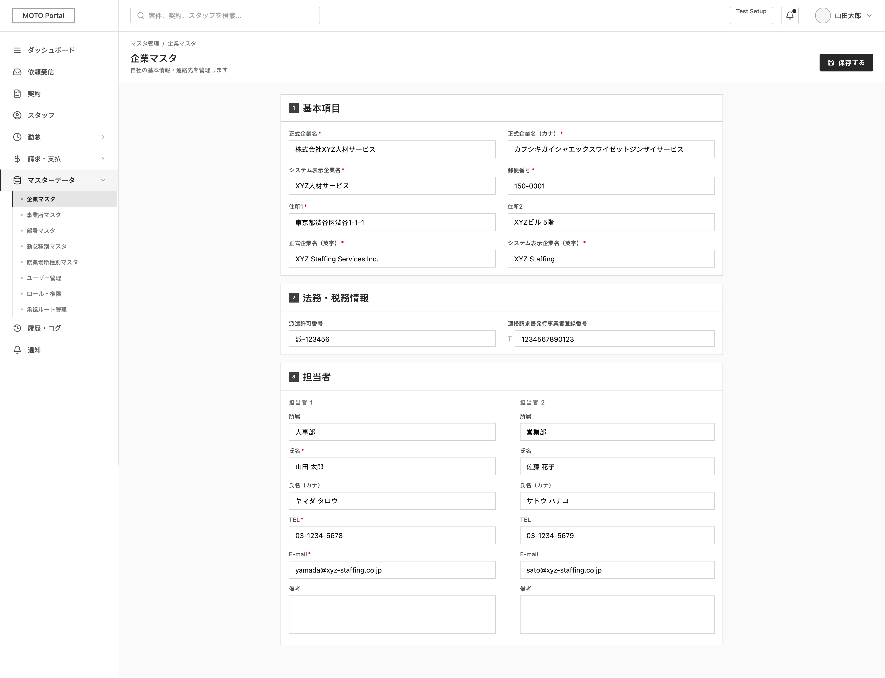

# SCREEN SPECIFICATION

---

# 1. Thông tin màn hình

| Item | Nội dung |
| --- | --- |
| Screen ID | MO-SET-001 |
| Tên màn hình | Cài đặt thông tin công ty (Company Master) |
| Tên tiếng Nhật | 企業マスタ |
| Module | Company Settings |
| Chức năng | Quản lý thông tin công ty |
| Actor | MOTO Admin (Xem và Cập nhật), MOTO Staff (Chỉ xem) |
| URL | /moto/settings/company |
| Priority | P1 |
| Phiên bản | v1.0 |

---

# 2. Mục đích màn hình

Cho phép người dùng xem và chỉnh sửa trực tiếp thông tin master của công ty MOTO (doanh nghiệp cung ứng nhân lực) trên một biểu mẫu duy nhất, sau đó lưu lại các thay đổi bằng nút Lưu ở góc phải màn hình.

---

# 3. Điều kiện truy cập

## Điều kiện trước
- Đã đăng nhập vào hệ thống MOTO Portal.
- Tài khoản người dùng sở hữu quyền company_master.view.

## Điều kiện sau
- Hiển thị thông tin công ty hiện tại và cho phép chỉnh sửa trực tiếp trên form.
- Nút Lưu (Save) hiển thị ở góc phải màn hình để thực hiện ghi nhận thay đổi (chỉ cho phép hoạt động nếu người dùng có quyền company_master.update).

---

# 4. Di chuyển màn hình

## Màn hình nguồn
| Screen ID | Tên màn hình |
| --- | --- |
| MOTO-DASHBOARD | Trang chủ Dashboard |

## Màn hình đích
| Action | Screen ID | Tên màn hình |
| --- | --- | --- |
| Lưu thành công | MO-SET-001 | Cài đặt thông tin công ty |

---

# 5. UI/UX Layout



---

## Nguyên tắc UI/UX

## Action Button
| Button | Type | Điều kiện hiển thị |
| --- | --- | --- |
| Lưu (Save) | Primary Button | Có quyền company_master.update |

## Form Area
- Màn hình luôn ở trạng thái biểu mẫu (Form) nhập liệu cho phép chỉnh sửa trực tiếp các trường thông tin.
- Mã công ty (Company ID) hiển thị dưới dạng nhãn Readonly, không cho phép chỉnh sửa.
- Các trường bắt buộc nhập hiển thị dấu * màu đỏ phía sau Label.

## Quy tắc UI/UX cụ thể

### Định dạng hiển thị dữ liệu
- Mã bưu chính (Postal Code): Định dạng 7 chữ số, tự động validate không cho nhập gạch ngang.
- Số điện thoại (Tel): Định dạng ký tự half-width (ví dụ: 03-1234-5678).
- Email: Định dạng text half-width.
- Số đăng ký hóa đơn (Qualified Invoice No): Hiển thị kèm tiền tố T phía trước chuỗi 13 chữ số.

### Logic kiểm soát hiển thị
- Khi Cờ quản lý số giấy phép theo sự nghiệp sở (Manage Permit by Office) = 1 (Quản lý ở sự nghiệp sở):
  - Khóa (disable) khu vực nhập Số giấy phép phái cử (phần đầu) và (phần sau).
- Khi Trạng thái đăng ký hóa đơn hợp lệ (Qualified Invoice Status) = 0 (Không có số đăng ký):
  - Khóa (disable) trường nhập Số đăng ký doanh nghiệp phát hành hóa đơn hợp lệ. Bắt buộc nhập khi chọn 1 (Có số đăng ký).

---

# 6. Định nghĩa Item màn hình

## 6.1 Thông tin công ty

| No | Item | Type | Required | Format / Options | DB Column |
| --- | --- | --- | --- | --- | --- |
| 1 | Mã công ty | Label | - | COM + 20 ký tự | company_id |
| 2 | Tên công ty chính thức (tiếng Nhật) | Textbox | Yes | Max 100 ký tự | official_name_ja |
| 3 | Tên công ty chính thức (Katakana) | Textbox | Yes | Max 200 ký tự, chữ Katakana toàn giác | official_name_kana |
| 4 | Tên công ty hiển thị (tiếng Nhật) | Textbox | Yes | Max 24 ký tự | display_name_ja |
| 5 | Tên công ty chính thức (tiếng Anh) | Textbox | Yes | Max 100 ký tự, Half-width alphanumeric | official_name_en |
| 6 | Tên công ty hiển thị (tiếng Anh) | Textbox | Yes | Max 24 ký tự, Half-width alphanumeric | display_name_en |
| 7 | Mã bưu chính | Textbox | Yes | 7 chữ số Half-width, không gạch nối | postal_code |
| 8 | Địa chỉ 1 (tiếng Nhật) | Textbox | Yes | Max 50 ký tự | address_ja |
| 9 | Địa chỉ 2 (tiếng Nhật) | Textbox | No | Max 50 ký tự | address2_ja |
| 10 | Quản lý số giấy phép theo sự nghiệp sở | Radio / Dropdown | Yes | 0: Quản lý ở công ty<br>1: Quản lý ở sự nghiệp sở | manage_permit_by_office_flg |
| 11 | Số giấy phép phái cử (phần đầu) | Textbox | No | Max 2 ký tự (chữ/số, ví dụ: 派) | dispatch_permit_first |
| 12 | Số giấy phép phái cử (phần sau) | Textbox | No | 6 chữ số Half-width | dispatch_permit_last |
| 13 | Đăng ký hóa đơn hợp lệ | Radio / Dropdown | Yes | 0: Không có số đăng ký<br>1: Có số đăng ký | qualified_invoice_status |
| 14 | Số đăng ký hóa đơn hợp lệ | Textbox | No | 13 chữ số Half-width | qualified_invoice_no |

## 6.2 Danh sách người phụ trách liên hệ (Tối đa 2 người)

*Các trường thông tin dưới đây áp dụng cho cả Người phụ trách 1 (seq_no = 1) và Người phụ trách 2 (seq_no = 2).*

| No | Item | Type | Required | Format / Options | DB Column |
| --- | --- | --- | --- | --- | --- |
| 15 | Phòng ban / Đơn vị trực thuộc | Textbox | No | Max 100 ký tự | department |
| 16 | Họ tên người phụ trách (tiếng Nhật) | Textbox | Yes | Max 48 ký tự | name_ja |
| 17 | Họ tên người phụ trách (Katakana) | Textbox | No | Max 48 ký tự, chữ Katakana | name_kana |
| 18 | Số điện thoại liên hệ | Textbox | Yes | Max 15 ký tự, chữ số và gạch ngang Half-width | tel |
| 19 | Địa chỉ email liên hệ | Textbox | Yes | Max 128 ký tự, định dạng Email hợp lệ | email |
| 20 | Ghi chú thêm | Textarea | No | Max 500 ký tự | remarks |

---

# 7. Định nghĩa Data Table

Không áp dụng (Màn hình này sử diện giao diện Single Resource Form để cấu hình thực thể duy nhất, không dùng bảng danh sách).

---

# 8. Mapping Database

## Table sử dụng
- tenant_db.mst_moto_company (Chứa thông tin cấu hình công ty)
- tenant_db.mst_moto_company_contact (Chứa thông tin liên hệ của tối đa 2 người phụ trách)

## Cụ thể Mapping các trường

| Màn hình (Item) | Table | Column | Type | Ràng buộc |
| --- | --- | --- | --- | --- |
| Mã công ty | mst_moto_company | company_id | VARCHAR(20) | PK |
| Tên công ty chính thức (tiếng Nhật) | mst_moto_company | official_name_ja | VARCHAR(100) | Not Null |
| Tên công ty chính thức (Katakana) | mst_moto_company | official_name_kana | VARCHAR(200) | Not Null |
| Tên công ty hiển thị (tiếng Nhật) | mst_moto_company | display_name_ja | VARCHAR(24) | Not Null |
| Mã bưu chính | mst_moto_company | postal_code | CHAR(7) | Not Null |
| Địa chỉ 1 (tiếng Nhật) | mst_moto_company | address_ja | VARCHAR(50) | Not Null |
| Địa chỉ 2 (tiếng Nhật) | mst_moto_company | address2_ja | VARCHAR(50) | Nullable |
| Tên công ty chính thức (tiếng Anh) | mst_moto_company | official_name_en | VARCHAR(100) | Not Null |
| Tên công ty hiển thị (tiếng Anh) | mst_moto_company | display_name_en | VARCHAR(24) | Not Null |
| Số giấy phép phái cử (phần đầu) | mst_moto_company | dispatch_permit_first | CHAR(2) | Nullable |
| Số giấy phép phái cử (phần sau) | mst_moto_company | dispatch_permit_last | CHAR(6) | Nullable |
| Quản lý số giấy phép theo sự nghiệp sở | mst_moto_company | manage_permit_by_office_flg | SMALLINT | Nullable (Default 0) |
| Đăng ký hóa đơn hợp lệ | mst_moto_company | qualified_invoice_status | SMALLINT | Not Null (Default 0) |
| Số đăng ký hóa đơn hợp lệ | mst_moto_company | qualified_invoice_no | CHAR(13) | Nullable |
| Người phụ trách (Thứ tự) | mst_moto_company_contact | seq_no | SMALLINT | PK (1 hoặc 2) |
| Phòng ban / Đơn vị | mst_moto_company_contact | department | VARCHAR(100) | Nullable |
| Họ tên (tiếng Nhật) | mst_moto_company_contact | name_ja | VARCHAR(48) | Not Null |
| Họ tên (Katakana) | mst_moto_company_contact | name_kana | VARCHAR(48) | Nullable |
| Số điện thoại | mst_moto_company_contact | tel | VARCHAR(15) | Not Null |
| Email | mst_moto_company_contact | email | VARCHAR(128) | Not Null |
| Ghi chú thêm | mst_moto_company_contact | remarks | VARCHAR(500) | Nullable |

---

# 9. Validation

Các quy tắc kiểm tra tính hợp lệ của dữ liệu đầu vào (áp dụng khi nhấn nút Lưu):

## 9.1 Thông tin công ty

| Item | Validation Rule | Message Code | Error Message | Ghi chú |
| --- | --- | --- | --- | --- |
| Tên công ty chính thức (tiếng Nhật) | Bắt buộc nhập | MSG-VAL-001 | Vui lòng nhập Tên công ty chính thức (tiếng Nhật). | |
| | Tối đa 100 ký tự | MSG-VAL-002 | Tên công ty chính thức (tiếng Nhật) tối đa 100 ký tự. | |
| Tên công ty chính thức (Katakana) | Bắt buộc nhập | MSG-VAL-001 | Vui lòng nhập Tên công ty chính thức (Katakana). | |
| | Định dạng Katakana | MSG-VAL-003 | Vui lòng chỉ nhập ký tự Katakana cho Tên công ty chính thức (Katakana). | Kiểm tra regex chữ Katakana toàn giác |
| | Tối đa 200 ký tự | MSG-VAL-002 | Tên công ty chính thức (Katakana) tối đa 200 ký tự. | |
| Tên công ty hiển thị (tiếng Nhật) | Bắt buộc nhập | MSG-VAL-001 | Vui lòng nhập Tên công ty hiển thị (tiếng Nhật). | |
| | Tối đa 24 ký tự | MSG-VAL-002 | Tên công ty hiển thị (tiếng Nhật) tối đa 24 ký tự. | |
| Tên công ty chính thức (tiếng Anh) | Bắt buộc nhập | MSG-VAL-001 | Vui lòng nhập Tên công ty chính thức (tiếng Anh). | |
| | Chữ-số Half-width | MSG-VAL-004 | Vui lòng chỉ nhập các chữ cái tiếng Anh, chữ số và ký tự half-width. | |
| | Tối đa 100 ký tự | MSG-VAL-002 | Tên công ty chính thức (tiếng Anh) tối đa 100 ký tự. | |
| Tên công ty hiển thị (tiếng Anh) | Bắt buộc nhập | MSG-VAL-001 | Vui lòng nhập Tên công ty hiển thị (tiếng Anh). | |
| | Chữ-số Half-width | MSG-VAL-004 | Vui lòng chỉ nhập các chữ cái tiếng Anh, chữ số và ký tự half-width. | |
| | Tối đa 24 ký tự | MSG-VAL-002 | Tên công ty hiển thị (tiếng Anh) tối đa 24 ký tự. | |
| Mã bưu chính | Bắt buộc nhập | MSG-VAL-001 | Vui lòng nhập Mã bưu chính. | |
| | Định dạng mã bưu chính | MSG-VAL-005 | Mã bưu chính phải gồm đúng 7 chữ số half-width và không bao gồm dấu gạch ngang. | Regex: ^[0-9]{7}$ |
| Địa chỉ 1 (tiếng Nhật) | Bắt buộc nhập | MSG-VAL-001 | Vui lòng nhập Địa chỉ. | |
| | Tối đa 50 ký tự | MSG-VAL-002 | Địa chỉ tối đa 50 ký tự. | |
| Địa chỉ 2 (tiếng Nhật) | Tối đa 50 ký tự | MSG-VAL-002 | Địa chỉ bổ sung tối đa 50 ký tự. | |
| Số giấy phép phái cử (phần đầu) | Tối đa 2 ký tự | MSG-VAL-002 | Phần đầu số giấy phép phái cử tối đa 2 ký tự. | Bắt buộc khi manage_permit_by_office_flg = 0 |
| Số giấy phép phái cử (phần sau) | Định dạng chữ số | MSG-VAL-006 | Số giấy phép phái cử (phần sau) phải gồm đúng 6 chữ số half-width. | Regex: ^[0-9]{6}$. Bắt buộc khi manage_permit_by_office_flg = 0 |
| Số đăng ký hóa đơn hợp lệ | Bắt buộc khi đăng ký hóa đơn | MSG-VAL-007 | Vui lòng nhập Số đăng ký hóa đơn hợp lệ khi chọn Có đăng ký hóa đơn. | Kiểm tra khi qualified_invoice_status = 1 |
| | Định dạng số đăng ký | MSG-VAL-008 | Số đăng ký hóa đơn hợp lệ phải gồm đúng 13 chữ số half-width. | Regex: ^[0-9]{13}$ |

## 9.2 Danh sách người phụ trách liên hệ

| Item | Validation Rule | Message Code | Error Message |
| --- | --- | --- | --- |
| Phòng ban / Đơn vị | Tối đa 100 ký tự | MSG-VAL-002 | Phòng ban/Đơn vị phụ trách tối đa 100 ký tự. |
| Họ tên (tiếng Nhật) | Bắt buộc nhập | MSG-VAL-001 | Vui lòng nhập Họ tên người phụ trách. |
| | Tối đa 48 ký tự | MSG-VAL-002 | Họ tên người phụ trách tối đa 48 ký tự. |
| Họ tên (Katakana) | Định dạng Katakana | MSG-VAL-003 | Vui lòng chỉ nhập ký tự Katakana cho Họ tên người phụ trách (Katakana). |
| | Tối đa 48 ký tự | MSG-VAL-002 | Họ tên người phụ trách (Katakana) tối đa 48 ký tự. |
| Số điện thoại | Bắt buộc nhập | MSG-VAL-001 | Vui lòng nhập Số điện thoại liên hệ. |
| | Định dạng số điện thoại | MSG-VAL-009 | Số điện thoại liên hệ không hợp lệ. | Chỉ chữ số half-width và gạch ngang, max 15 ký tự |
| Email | Bắt buộc nhập | MSG-VAL-001 | Vui lòng nhập Địa chỉ email liên hệ. |
| | Định dạng email | MSG-VAL-010 | Địa chỉ email không đúng định dạng. | |
| | Tối đa 128 ký tự | MSG-VAL-002 | Địa chỉ email tối đa 128 ký tự. |
| Ghi chú thêm | Tối đa 500 ký tự | MSG-VAL-002 | Ghi chú người phụ trách tối đa 500 ký tự. |

---

# 10. Event Definition

## 10.1 Mở màn hình (Initial Load)
- **Trigger**: Người dùng truy cập URL /moto/settings/company từ Menu.
- **Xử lý**:
  1. Gửi request GET /api/v1/moto/settings/company-master để lấy thông tin cấu hình công ty.
  2. Khi nhận response thành công (HTTP 200 OK):
     - Điền các dữ liệu lấy được vào các trường nhập liệu tương ứng trên Form.
     - Kiểm tra quyền company_master.update của user đăng nhập. Nếu có quyền, hiển thị và enable nút Lưu ở góc phải màn hình. Nếu không có quyền, disable nút Lưu hoặc chỉ hiển thị form dạng Readonly.
  3. Nếu có lỗi xảy ra:
     - Giao diện hiển thị thông báo lỗi tương ứng và disable nút Lưu.

## 10.2 Thay đổi trạng thái Hóa đơn hợp lệ (Qualified Invoice Status Change)
- **Trigger**: Người dùng thay đổi lựa chọn "Đăng ký hóa đơn hợp lệ".
- **Xử lý**:
  - Nếu chọn 1 (Có đăng ký): Enable ô nhập liệu "Số đăng ký hóa đơn hợp lệ".
  - Nếu chọn 0 (Không đăng ký): Clear giá trị và disable ô nhập liệu "Số đăng ký hóa đơn hợp lệ".

## 10.3 Thay đổi trạng thái Quản lý giấy phép (Manage Permit Flag Change)
- **Trigger**: Người dùng thay đổi lựa chọn "Quản lý số giấy phép theo sự nghiệp sở".
- **Xử lý**:
  - Nếu chọn 1 (Quản lý ở sự nghiệp sở): Clear giá trị và khóa (disable) 2 ô nhập liệu "Số giấy phép phái cử (phần đầu)" và "(phần sau)".
  - Nếu chọn 0 (Quản lý ở công ty): Mở khóa (enable) 2 ô nhập "Số giấy phép phái cử (phần đầu)" và "(phần sau)".

## 10.4 Bấm nút Lưu (Save Click)
- **Trigger**: Click nút Lưu (Save) ở góc phải màn hình.
- **Xử lý**:
  1. Kích hoạt validation phía Client đối với toàn bộ các trường thông tin theo quy định tại Mục 9.
  2. Nếu có trường không hợp lệ:
     - Hiển thị thông báo lỗi dưới chân trường tương ứng và di chuyển focus tới trường lỗi đầu tiên.
     - Dừng xử lý tiếp.
  3. Nếu tất cả dữ liệu hợp lệ, hiển thị trạng thái loading trên nút Save và gửi request PATCH /api/v1/moto/settings/company-master.
     - Request body chứa cấu trúc dữ liệu cập nhật khớp với API định nghĩa.
  4. Khi API trả về response thành công (HTTP 200 OK):
     - Hiển thị Toast Message: "Cập nhật thông tin công ty thành công.".
     - Tải lại dữ liệu mới nhất hiển thị trên form.
  5. Khi API trả về lỗi:
     - Nếu là lỗi validation phía Server (HTTP 422 Unprocessable Entity): Hiển thị danh sách lỗi tương ứng dưới chân các trường bị lỗi.
     - Nếu là lỗi khác: Hiển thị popup thông báo lỗi hệ thống.

---

# 11. API Mapping

## 11.1 Get Company Master
- **Endpoint**: GET /api/v1/moto/settings/company-master
- **Request**: Không nhận tham số.
- **Response**:
  ```json
  {
    "data": {
      "company_id": "COM0000000000000000001",
      "official_name_ja": "株式会社XYZ人材サービス",
      "official_name_kana": "カブシキガイシャエックスワイゼットジンザイサービス",
      "display_name_ja": "XYZ人材サービス",
      "postal_code": "1500001",
      "address_ja": "東京都渋谷区渋谷1-1-1",
      "address2_ja": "XYZビル 5階",
      "official_name_en": "XYZ Staffing Services Inc.",
      "display_name_en": "XYZ Staffing",
      "dispatch_permit_first": "派",
      "dispatch_permit_last": "123456",
      "manage_permit_by_office_flg": 0,
      "qualified_invoice_status": 1,
      "qualified_invoice_no": "1234567890123",
      "created_at": "2026-06-23T08:00:00+09:00",
      "updated_at": "2026-06-23T08:00:00+09:00",
      "contacts": [
        {
          "seq_no": 1,
          "department": "人事部",
          "name_ja": "山田 太郎",
          "name_kana": "ヤマダ タロウ",
          "tel": "03-1234-5678",
          "email": "yamada@xyz-staffing.co.jp",
          "remarks": null
        },
        {
          "seq_no": 2,
          "department": "営業部",
          "name_ja": "佐藤 花子",
          "name_kana": "サトウ ハナコ",
          "tel": "03-1234-5679",
          "email": "sato@xyz-staffing.co.jp",
          "remarks": null
        }
      ]
    }
  }
  ```

## 11.2 Update Company Master
- **Endpoint**: PATCH /api/v1/moto/settings/company-master
- **Request Body**:
  ```json
  {
    "official_name_ja": "株式会社XYZ人材サービス",
    "official_name_kana": "カブシキガイシャエックスワイゼットジンザイサービス",
    "display_name_ja": "XYZ人材サービス",
    "postal_code": "1500001",
    "address_ja": "東京都渋谷区渋谷1-1-1",
    "address2_ja": "XYZビル 5階",
    "official_name_en": "XYZ Staffing Services Inc.",
    "display_name_en": "XYZ Staffing",
    "dispatch_permit_first": "派",
    "dispatch_permit_last": "123456",
    "manage_permit_by_office_flg": 0,
    "qualified_invoice_status": 1,
    "qualified_invoice_no": "1234567890123",
    "contacts": [
      {
        "seq_no": 1,
        "department": "人事部",
        "name_ja": "山田 太郎",
        "name_kana": "ヤマダ タロウ",
        "tel": "03-1234-5678",
        "email": "yamada@xyz-staffing.co.jp",
        "remarks": null
      },
      {
        "seq_no": 2,
        "department": "営業部",
        "name_ja": "佐藤 花子",
        "name_kana": "サトウ ハナコ",
        "tel": "03-1234-5679",
        "email": "sato@xyz-staffing.co.jp",
        "remarks": null
      }
    ]
  }
  ```
- **Response (HTTP 200 OK)**:
  ```json
  {
    "data": {
      "company_id": "COM0000000000000000001",
      "updated_at": "2026-06-23T08:15:00+09:00"
    }
  }
  ```

---

# 12. Permission

Ma trận phân quyền đối với màn hình MO-SET-001:

| Action | MOTO Admin | MOTO Staff | SAKI Admin | Staff User | Ghi chú |
| --- | --- | --- | --- | --- | --- |
| View (Xem thông tin) | O | O | X | X | Quyền company_master.view |
| Save (Lưu cập nhật) | O | X | X | X | Quyền company_master.update |

---

# 13. Message Definition

| Code | Message | Mô tả |
| --- | --- | --- |
| MSG-VAL-001 | Vui lòng nhập {fieldName}. | Lỗi bắt buộc nhập |
| MSG-VAL-002 | {fieldName} tối đa {maxSize} ký tự. | Lỗi quá độ dài cho phép |
| MSG-VAL-003 | Vui lòng chỉ nhập ký tự Katakana cho {fieldName}. | Lỗi không đúng kiểu chữ Katakana |
| MSG-VAL-004 | Vui lòng chỉ nhập các chữ cái tiếng Anh, chữ số và ký tự half-width. | Lỗi không đúng kiểu ký tự tiếng Anh half-width |
| MSG-VAL-005 | Mã bưu chính phải gồm đúng 7 chữ số half-width và không bao gồm dấu gạch ngang. | Lỗi định dạng mã bưu chính |
| MSG-VAL-006 | Số giấy phép phái cử (phần sau) phải gồm đúng 6 chữ số half-width. | Lỗi định dạng phần số của giấy phép |
| MSG-VAL-007 | Vui lòng nhập Số đăng ký hóa đơn hợp lệ khi chọn Có đăng ký hóa đơn. | Lỗi ràng buộc số hóa đơn |
| MSG-VAL-008 | Số đăng ký hóa đơn hợp lệ phải gồm đúng 13 chữ số half-width. | Lỗi định dạng số hóa đơn |
| MSG-VAL-009 | Số điện thoại liên hệ không hợp lệ. | Lỗi định dạng số điện thoại |
| MSG-VAL-010 | Địa chỉ email không đúng định dạng. | Lỗi định dạng email |
| MSG-SYS-001 | Cập nhật thông tin công ty thành công. | Toast thông báo lưu thành công |

---

# 14. Error Handling

Phân loại xử lý các mã lỗi HTTP khi giao tiếp API:

| HTTP Status | Xử lý trên UI |
| --- | --- |
| 400 Bad Request | Hiển thị thông báo lỗi định dạng dữ liệu gửi lên. |
| 401 Unauthorized | Chuyển hướng người dùng về màn hình Đăng nhập MO-AUTH-001. |
| 403 Forbidden | Hiển thị màn hình Access Denied (Không có quyền thao tác). |
| 404 Not Found | Hiển thị thông báo: Không tìm thấy thông tin cấu hình công ty. |
| 422 Unprocessable Entity | Hiển thị thông báo lỗi validation chi tiết phía Server tương ứng dưới chân mỗi ô nhập liệu bị lỗi. |
| 500 Internal Server Error | Hiển thị thông báo hệ thống gặp sự cố và yêu cầu thử lại sau. |

---

# 15. Audit Log

Các thao tác được ghi nhận vào nhật ký hệ thống:

| Hành động | Điều kiện ghi | Mô tả nội dung Log |
| --- | --- | --- |
| Xem cấu hình | Không ghi | |
| Cập nhật thông tin công ty | Có | Ghi nhận sự thay đổi các trường dữ liệu so với trước đó (Ví dụ: Official name changed from Old to New). Ghi nhận User ID thực hiện và thời gian cập nhật. |

---

# 16. Related Documents

- Business Flow Diagram: Tenant Master Management Flow (BF-032)
- Database Dictionary: mst_moto_company, mst_moto_company_contact
- API Specification:
  - MO-SET-001-API-01-Get Company Master
  - MO-SET-001-API-02-Update Company Master
- Role Matrix of MOTO Portal