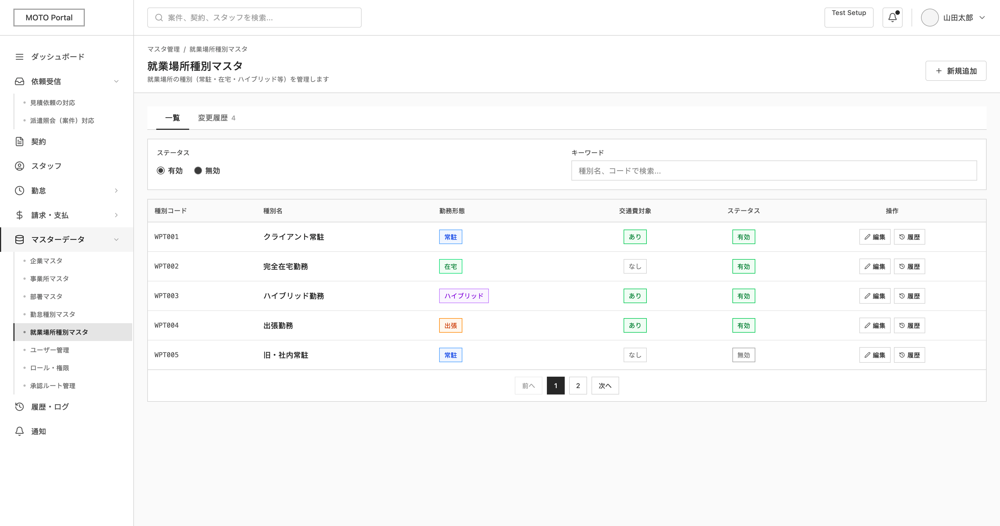
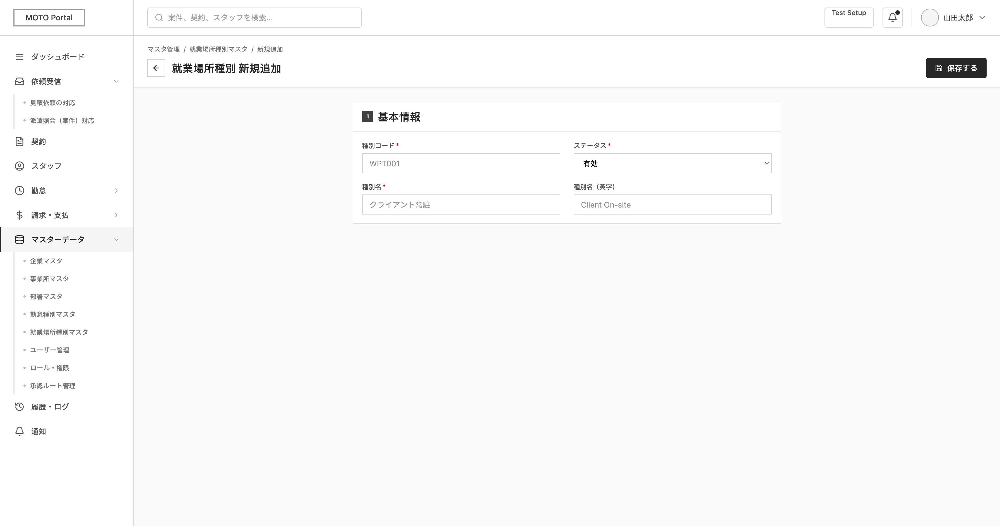

# SCREEN SPECIFICATION

# Màn hình Loại nơi làm việc Master

---

# 1. Thông tin màn hình

| Item | Nội dung |
| --- | --- |
| Screen ID | MO-SET-007 |
| Tên màn hình | Quản lý loại nơi làm việc |
| Tên tiếng Nhật | 就業場所区分マスタ |
| Module | Company Settings |
| URL | /moto/settings/workplace-types |
| Actor | Admin, Sales, Operation |
| Priority | P1 |

---

# 2. Mục đích

Cho phép người dùng quản lý, tìm kiếm, thêm mới, xem lịch sử thay đổi và cập nhật danh mục loại nơi làm việc.

Sau khi lưu thành công:

- Cập nhật/Thêm mới bản ghi loại nơi làm việc vào Database
- Ghi log hệ thống (Audit Log)
- Hiển thị Toast thông báo thành công và reload danh sách.

---

# 3. Điều kiện truy cập

## Điều kiện trước

- Đã đăng nhập MOTO Portal
- Có quyền workplace_type.view

## Điều kiện sau

- Hiển thị danh sách loại nơi làm việc thành công

---

# 4. Di chuyển màn hình

## Màn hình nguồn

| Screen ID | Tên |
| --- | --- |
| MO-SET-007 | Workplace Type Master |

---

## Màn hình đích

| Action | Screen ID | Screen Name |
| --- | --- | --- |
| Create | MO-SET-007 | Workplace Type Master |
| Update | MO-SET-007 | Workplace Type Master |
| Cancel | MO-SET-007 | Workplace Type Master |

---

# 5. UI/UX Layout





---

# 6. Quy tắc UI/UX

## Tab điều hướng
- Tab Danh sách: Hiển thị danh mục chính.
- Tab Lịch sử thay đổi: Hiển thị log cập nhật master.

---

## Bộ lọc tìm kiếm
- Trạng thái: Lọc theo Trạng thái. Mặc định chọn "Hoạt động".
- Từ khóa: Tìm kiếm tương đối theo Mã loại hoặc Tên hiển thị PC.

---

## Bảng dữ liệu
- Cột hiển thị: Mã loại, Tên hiển thị PC, Tên hiển thị PC (Tiếng Anh), Tên hiển thị Mobile, Tên hiển thị Mobile (Tiếng Anh), Tháng bắt đầu, Tháng kết thúc, FAX, Trạng thái.
- FAX: Hiển thị "Có" (nếu flg = 1) hoặc "Không" (nếu flg = 0).
- Trạng thái hiệu lực: Badge màu xanh (Hoạt động) hoặc màu xám.

---

## Form nhập liệu (Thêm mới/Cập nhật)
- Mã loại: Cho phép nhập khi thêm mới; Readonly khi chỉnh sửa. Chỉ cho phép chữ và số Half-width.
- Các tên hiển thị: Tên hiển thị PC/Mobile bằng tiếng Nhật và tiếng Anh.
- Khoảng áp dụng: Tháng bắt đầu (bắt buộc) và Tháng kết thúc (tùy chọn) định dạng YYYY-MM.
- Bật/tắt sử dụng: Bật/tắt cho hệ thống WebTimeCard (mặc định Bật) và hệ thống FAX (mặc định Tắt).
- Trường bắt buộc: Hiển thị dấu * đỏ sau nhãn.

---

# 7. Định nghĩa Item

## Bộ lọc tìm kiếm

| No | Item | Type | Required | Format | DB |
| --- | --- | --- | --- | --- | --- |
| 1 | Trạng thái | Radio | No | Hoạt động / Hết hiệu lực / Tất cả | (Tính toán động từ valid_from_month và valid_to_month) |
| 2 | Từ khóa | Textbox | No | 100 ký tự | workplace_code / pc_display_name |

---

## Thông tin cơ bản (Form Thêm mới / Cập nhật)

| No | Item | Type | Required | Format | DB |
| --- | --- | --- | --- | --- | --- |
| 3 | Mã loại | Textbox | Yes | 20 ký tự, Half-width | workplace_code |
| 4 | Tên hiển thị PC | Textbox | Yes | 50 ký tự | pc_display_name |
| 5 | Tên hiển thị PC (English) | Textbox | No | 50 ký tự | pc_display_name_en |
| 6 | Tên hiển thị Mobile | Textbox | Yes | 20 ký tự | mobile_display_name |
| 7 | Tên hiển thị Mobile (English) | Textbox | No | 20 ký tự | mobile_display_name_en |
| 8 | Tháng bắt đầu áp dụng | Textbox (DatePicker YYYY-MM) | Yes | YYYY-MM | valid_from_month |
| 9 | Tháng kết thúc áp dụng | Textbox (DatePicker YYYY-MM) | No | YYYY-MM | valid_to_month |
| 10 | Sử dụng WebTimeCard | Toggle/Checkbox | Yes | 1: Có, 0: Không (Mặc định 1) | use_webtc_flg |
| 11 | Sử dụng FAX | Toggle/Checkbox | Yes | 1: Có, 0: Không (Mặc định 0) | use_fax_flg |

---

## Các nút hành động

| Item | Type | Required | Mô tả |
| --- | --- | --- | --- |
| Create | Button | - | Chuyển hướng sang màn hình Thêm mới |
| Save | Button | - | Submit dữ liệu |
| Update | Button | - | Chuyển tiếp sang màn hình Chỉnh sửa |
| Lịch sử (履歴) | Button | - | Xem popup lịch sử thay đổi dòng tương ứng |
| Quay lại (<-) | Link/Button | - | Hủy bỏ và quay lại danh sách |


---

# 8. Validation

## workplace_code

| Rule | Message Code | Message |
| --- | --- | --- |
| Required | CMS-VAL-23 | 区分コードを入力してください。 (Vui lòng không để trống trường Mã loại.) |
| Max 20 | CMS-VAL-6 | 区分コードは20文字以内で入力してください。 (Vui lòng nhập Mã loại trong vòng 20 ký tự trở xuống.) |
| Format | CMS-VAL-24 | 区分コードに正しい形式を指定してください。 (Vui lòng nhập Mã loại đúng định dạng yêu cầu.) |
| Unique | CMS-VAL-11 | 区分コードの値は既に存在しています。 (Giá trị của Mã loại đã tồn tại trong hệ thống (không được trùng lặp).) |

---

## pc_display_name

| Rule | Message Code | Message |
| --- | --- | --- |
| Required | CMS-VAL-23 | PC表示名を入力してください。 (Vui lòng không để trống trường Tên hiển thị PC.) |
| Max 50 | CMS-VAL-6 | PC表示名は50文字以内で入力してください。 (Vui lòng nhập Tên hiển thị PC trong vòng 50 ký tự trở xuống.) |

---

## pc_display_name_en

| Rule | Message Code | Message |
| --- | --- | --- |
| Max 50 | CMS-VAL-6 | PC表示名（英語）は50文字以内で入力してください。 (Vui lòng nhập Tên hiển thị PC (Tiếng Anh) trong vòng 50 ký tự trở xuống.) |

---

## Tên hiển thị Mobile (mobile_display_name)

| Rule | Message Code | Message |
| --- | --- | --- |
| Required | CMS-VAL-23 | モバイル表示名を入力してください。 (Vui lòng không để trống trường Tên hiển thị Mobile.) |
| Max 20 | CMS-VAL-6 | モバイル表示名は20文字以内で入力してください。 (Vui lòng nhập Tên hiển thị Mobile trong vòng 20 ký tự trở xuống.) |

---

## Tên hiển thị Mobile English (mobile_display_name_en)

| Rule | Message Code | Message |
| --- | --- | --- |
| Max 20 | CMS-VAL-6 | モバイル表示名（英語）は20文字以内で入力してください。 (Vui lòng nhập Tên hiển thị Mobile (Tiếng Anh) trong vòng 20 ký tự trở xuống.) |

---

## valid_from_month

| Rule | Message Code | Message |
| --- | --- | --- |
| Required | CMS-VAL-23 | 適用開始月を入力してください。 (Vui lòng không để trống trường Tháng bắt đầu áp dụng.) |
| Format | CMS-VAL-24 | 適用開始月に正しい形式を指定してください。 (Tháng bắt đầu áp dụng không đúng định dạng YYYY-MM.) |

---

## valid_to_month

| Rule | Message Code | Message |
| --- | --- | --- |
| Format | CMS-VAL-24 | 適用終了月に正しい形式を指定してください。 (Tháng kết thúc áp dụng không đúng định dạng YYYY-MM.) |
| Min | CMS-VAL-41 | 適用終了月は適用開始月以降を指定してください。 (Tháng kết thúc áp dụng phải lớn hơn hoặc bằng Tháng bắt đầu áp dụng.) |

---

## use_fax_flg

| Rule | Message Code | Message |
| --- | --- | --- |
| Required | CMS-VAL-23 | FAX利用フラグを入力してください。 (Vui lòng không để trống cờ Sử dụng FAX.) |
| In | CMS-VAL-41 | 選択されたFAX利用フラグは正しくありません。 (Giá trị cờ Sử dụng FAX không hợp lệ.) |


---

# 9. Event Definition

## Initial Load

### Trigger

Mở màn hình danh sách 

### Process

1. Gọi API Get Workplace Type Master.
2. Mặc định tải trang 1, lọc theo trạng thái hoạt động.
3. Hiển thị Grid danh sách.

---

## Search

### Trigger

Thay đổi bộ lọc Trạng thái hoặc nhập Từ khóa.

### Process

1. Gửi tham số tìm kiếm qua API MO-SET-007-API-01.
2. Cập nhật dữ liệu hiển thị trên Grid và phân trang.

---

## Save 

### Trigger

Click 保存する trên form thêm mới / cập nhật.

### Process

1. Validate toàn bộ các trường dữ liệu trên form.
2. Hiển thị popup xác nhận cập nhật (CMS-VAL-85).
3. Call API Update MO-SET-007-API-02 (PATCH) hoặc API Create (POST).
4. Ghi Audit Log.
5. Hiển thị Toast thông báo thành công (CMS-VAL-79).
6. Chuyển hướng quay lại màn hình danh sách và reload.

---

## Back

### Trigger

Click nút Back

### Process

Quay lại màn hình danh sách, hủy bỏ mọi thay đổi chưa lưu.

---

# 10. Mapping Database

## mst_moto_workplace_type

| Column | Type |
| --- | --- |
| id | bigint |
| company_id | varchar(20) |
| workplace_code | varchar(20) |
| pc_display_name | varchar(50) |
| mobile_display_name | varchar(20) |
| pc_display_name_en | varchar(50) |
| mobile_display_name_en | varchar(20) |
| valid_from_month | varchar(7) |
| valid_to_month | varchar(7) |
| use_fax_flg | smallint |
| created_at | timestamptz |
| updated_at | timestamptz |
| deleted_at | timestamptz |
| created_by | varchar(100) |
| updated_by | varchar(100) |

---

# 11. API Mapping

## Get Workplace Type Master

```
GET /api/v1/moto/settings/workplace-type-master
```

Request

```json
{
  "page": 1,
  "limit": 20,
  "keyword": "オフィス",
  "status": 1
}
```

Response

```json
{
  "data": [
    {
      "id": 1,
      "workplace_code": "OFFICE",
      "pc_display_name": "オフィス",
      "pc_display_name_en": "Office",
      "mobile_display_name": "オ",
      "mobile_display_name_en": "Off",
      "valid_from_month": "2026-01",
      "valid_to_month": null,
      "use_fax_flg": 0,
      "created_at": "2026-06-23T08:00:00+09:00",
      "updated_at": "2026-06-23T08:00:00+09:00"
    }
  ]
}
```

---

## Update Workplace Type Master

```
PATCH /api/v1/moto/settings/workplace-type-master/{workplace_code}
```

Request

```json
{
  "pc_display_name": "オフィス(更新)",
  "pc_display_name_en": "Office (Updated)",
  "mobile_display_name": "オウ",
  "mobile_display_name_en": "Off-U",
  "valid_from_month": "2026-01",
  "valid_to_month": "2027-12",
  "use_fax_flg": 1
}
```

Response

```json
{
  "data": {
    "id": 1,
    "workplace_code": "OFFICE",
    "pc_display_name": "オフィス(更新)",
    "pc_display_name_en": "Office (Updated)",
    "mobile_display_name": "オウ",
    "mobile_display_name_en": "Off-U",
    "valid_from_month": "2026-01",
    "valid_to_month": "2027-12",
    "use_fax_flg": 1,
    "created_at": "2026-06-23T08:00:00+09:00",
    "updated_at": "2026-06-24T17:08:00+09:00"
  }
}
```

---

# 12. Notification

## Trigger

Không áp dụng.

---

# 13. Message Definition

| Code | Message (Tiếng Nhật) | Message (Tiếng Việt) | Loại hiển thị |
| --- | --- | --- | --- |
| **CMS-VAL-23** | {0}を入力してください。 | Vui lòng không để trống trường {0}. | Inline Validation |
| **CMS-VAL-6** | {0}は{1}文字以内で入力してください。 | Vui lòng nhập {0} trong vòng {1} ký tự trở xuống. | Inline Validation |
| **CMS-VAL-24** | {0}に正しい形式を指定してください。 | Vui lòng nhập {0} đúng định dạng yêu cầu. | Inline Validation |
| **CMS-VAL-11** | {0}の値は既に存在しています。 | Giá trị của {0} đã tồn tại trong hệ thống (không được trùng lặp). | Inline Validation |
| **CMS-VAL-40** | {0}は整数で指定してください。 | Vui lòng chỉ định {0} là một số nguyên. | Inline Validation |
| **CMS-VAL-41** | 選択された{0}は正しくありません。 | {0} được chọn không hợp lệ. | Inline Validation |
| **CMS-VAL-79** | {Screen name}を更新しました。 | Đã cập nhật {Screen name}. | Toast Success |
| **CMS-VAL-85** | {Target}を更新します。よろしいですか。 | Sẽ tiến hành cập nhật {Target}. Bạn có chắc chắn không? | Dialog Confirm |
| **CMS-VAL-95** | この機能・リソースへのアクセス権限がありません。 | Bạn không có quyền truy cập vào chức năng/tài nguyên này. | Toast Error |
| **CMS-VAL-99** | システムエラーが発生しました。管理者へお問い合わせください。 | Đã xảy ra lỗi hệ thống. Vui lòng liên hệ với người quản trị. | Toast Error / Popup |

---

# 14. Permission

| Action | Admin | Sales | Operation |
| --- | --- | --- | --- |
| Create | O | X | X |
| Update | O | X | X |
| View | O | O | O |

---

# 15. Audit Log

| Action | Log |
| --- | --- |
| Create | Yes |
| Update | Yes |

---

# 16. Error Handling

| HTTP Code | Message |
| --- | --- |
| 401 | Phiên đăng nhập đã hết hạn |
| 403 | Bạn không có quyền thực hiện thao tác này |
| 404 | Không tìm thấy dữ liệu |
| 409 | Dữ liệu đã tồn tại |
| 422 | Dữ liệu không hợp lệ |
| 500 | Hệ thống đang gặp sự cố |

---

# 17. Related Documents

- Business Flow 
- ERD 
- API Specification 
- Portal Permission Matrix
