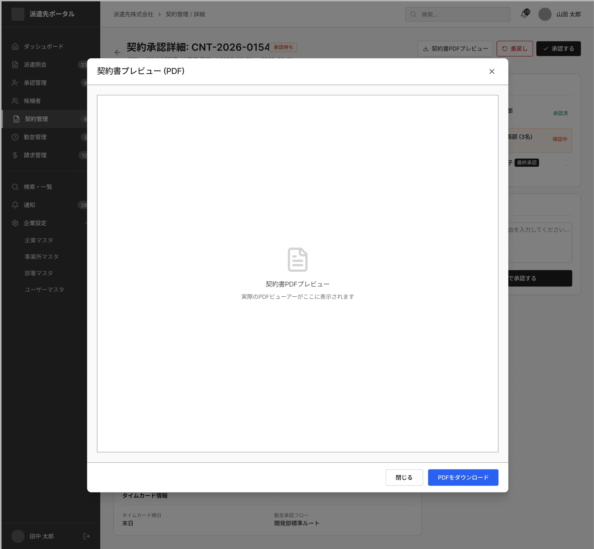

# 契約書DL

System: SAKI Portal
Menu: Contract Management
メニュー: 契約管理
Screen ID: SA-CON-006
Screen (VI): Tải xuống hợp đồng PDF
Giải thích tính năng: Download contract PDF.
機能説明: 契約書PDFをダウンロードする。
Thông tin hiển thị trên màn hình: PDF file, generated datetime
画面表示情報: PDFファイル、生成日時
URL: /saki/contracts/:id/pdf
Business Flow: Diagram 2 — 派遣照会〜契約成立フロー (https://www.notion.so/Diagram-2-364f02c407dd806a8429dd8ff501068b?pvs=21)
システム: 派遣先ポータル
API List: SA-CON-006-API-01-Contract PDF Download (https://www.notion.so/SA-CON-006-API-01-Contract-PDF-Download-36bf02c407dd801fb043e4f290116c17?pvs=21)
Status: In progress

# SCREEN SPECIFICATION

---

# 1. Thông tin màn hình

| Item | Nội dung |
| --- | --- |
| Screen ID | SA-CON-006 |
| Tên màn hình | Tải xuống hợp đồng PDF |
| Tên tiếng Nhật | 契約書DL |
| Module | Contract Management |
| Chức năng | Xem trước (Preview) và Tải xuống (Download) hợp đồng phái cử dưới dạng file PDF |
| Actor | SAKI User (SAKI Admin, SAKI Manager, SAKI Staff) |
| URL | /saki/contracts/:id/pdf |

---

# 2. Mục đích màn hình

Cho phép người dùng phía doanh nghiệp tiếp nhận (SAKI Portal):
- Xem trước trực quan (Preview) nội dung hợp đồng phái cử đã ký kết/phê duyệt dưới dạng tệp PDF.
- Tải xuống (Download) tệp PDF hợp đồng này về máy tính để lưu trữ.

---

# 3. Điều kiện truy cập

## Điều kiện trước

- Đã đăng nhập vào hệ thống SAKI Portal.
- Tài khoản người dùng có quyền xem hợp đồng tương ứng (thuộc doanh nghiệp tiếp nhận SAKI của hợp đồng đó).
- Hợp đồng có ID trùng với `:id` trên URL và đã được tạo lập tệp PDF trên hệ thống.

## Điều kiện sau

- Hiển thị màn hình xem trước PDF và thông tin tệp PDF.

---

# 4. Di chuyển màn hình

## Màn hình nguồn

| Screen ID | Tên màn hình |
| --- | --- |
| SA-CON-001 | 契約一覧 (Contract List) |
| SA-CON-002 | 契約詳細 (Contract Detail) |

---

## Màn hình đích

| Action | Screen ID | Tên màn hình |
| --- | --- | --- |
| Đóng modal (閉じる) / Click X | SA-CON-001 | 契約一覧 (Contract List) |

---

# 5. UI/UX Layout



---

## Nguyên tắc UI/UX

Màn hình này hiển thị dưới dạng **Popup Modal** nổi đè lên màn hình Chi tiết hợp đồng hoặc Phê duyệt hợp đồng khi người dùng click chọn xem trước tệp PDF.

### **Header Popup**
- Tiêu đề modal: "契約書プレビュー (PDF)".
- Có nút đóng nhanh (icon X) ở góc trên bên phải của modal.

### **Body Popup (Khu vực hiển thị PDF)**
- Chiếm phần lớn diện tích của modal.
- Hiển thị trình xem trước tệp PDF (PDF Viewer) trực quan, cho phép cuộn xem nội dung.

### **Footer Popup (Nút hành động)**
- Nằm ở góc dưới bên phải modal, bao gồm 2 nút:
  - **閉じる (Đóng):** Nút viền xám, nền trắng (Secondary). Click vào để đóng modal và chuyển hướng về màn hình danh sách hợp đồng `SA-CON-001`.
  - **PDFをダウンロード (Tải xuống PDF):** Nút màu xanh dương (Primary). Click vào để tải trực tiếp file PDF hợp đồng về máy tính.

---

# 6. Danh sách Item màn hình

## **Popup Content**

| No | Item | Loại | Format | Bắt buộc | Mô tả |
| --- | --- | --- | --- | --- | --- |
| 1 | Tiêu đề modal | Label | - | - | Hiển thị "契約書プレビュー (PDF)" |
| 2 | Nút đóng nhanh (X) | Button / Icon | - | - | Nằm ở góc trên bên phải modal, đóng modal và về SA-CON-001 |
| 3 | PDF Preview | Component | - | - | Trình hiển thị nội dung tệp PDF |

## **Các nút ở Footer (Action Buttons)**

| No | Item | Loại | Format | Bắt buộc | Mô tả |
| --- | --- | --- | --- | --- | --- |
| 4 | Đóng (閉じる) | Button | - | - | Đóng modal và chuyển hướng về màn hình danh sách hợp đồng SA-CON-001 |
| 5 | Tải xuống PDF (PDFをダウンロード) | Button | - | - | Tải tệp PDF hợp đồng về máy tính |

---

# 7. Định nghĩa Data Table

Màn hình này không hiển thị bảng dữ liệu (Grid/Table) dạng danh sách, do đó không định nghĩa Data Table.

---

# 8. Mapping Database

## Table sử dụng

### **tenant_db.contract_documents**
Bảng quản lý file tài liệu hợp đồng:

| Column | Type | Description |
| --- | --- | --- |
| id | bigint | PK |
| contract_id | bigint | FK - Liên kết tới bảng contract |
| file_name | varchar(255) | Tên file PDF |
| file_path | varchar(255) | Đường dẫn vật lý lưu file (S3 / Local Storage) |
| file_size | int | Kích thước file (bytes) |
| created_at | datetime | Ngày giờ tạo file |
| updated_at | datetime | Ngày giờ cập nhật |

### **tenant_db.contract**
Bảng thông tin hợp đồng phái cử (Dùng để kiểm tra `client_id` liên kết):

| Column | Type | Description |
| --- | --- | --- |
| id | bigint | PK |
| contract_no | varchar(50) | Mã hợp đồng phái cử |
| client_id | bigint | FK - Liên kết tới khách hàng SAKI |

### **central_db.r_deal_moto_saki**
Bảng quản lý quan hệ giao dịch giữa MOTO và SAKI (Kiểm tra quyền truy cập):

| Column | Type | Description |
| --- | --- | --- |
| id | bigint | PK |
| client_id | bigint | ID khách hàng SAKI |

### **tenant_db.contract_download_histories**
Bảng lưu lịch sử tải file của người dùng:

| Column | Type | Description |
| --- | --- | --- |
| id | bigint | PK |
| contract_id | bigint | FK - Liên kết tới bảng contract |
| account_id | bigint | FK - Người thực hiện download |
| file_name | varchar(255) | Tên file PDF đã tải |
| created_at | datetime | Ngày giờ tải file |

---

# 9. Validation

Vì đây là màn hình xem chi tiết và tải xuống tài liệu (readonly), không có input form, nên không có Validation dữ liệu đầu vào.
Tuy nhiên, hệ thống cần kiểm tra các điều kiện nghiệp vụ sau trước khi hiển thị:

| Item | Rule | Message Code | Mô tả |
| --- | --- | --- | --- |
| Permission | Tài khoản thuộc client_id của hợp đồng | CMS-VAL-95 | Chỉ cho phép user thuộc SAKI client liên quan đến hợp đồng truy cập. Nếu sai, báo lỗi 403 Forbidden. |
| File Exist | Tệp tin phải tồn tại vật lý trên storage | CMS-VAL-106 | Kiểm tra file PDF trên S3/Server. Nếu không tồn tại, báo lỗi không tìm thấy tệp. |

---

# 10. Event Definition

## **Initial Load (Xem trước PDF)**

### **Trigger**
Người dùng click nút "契約書PDFプレビュー" trên màn hình Chi tiết/Phê duyệt hợp đồng.

### **Flow**
1. Lấy `id` (Contract ID) từ URL hoặc tham số màn hình nền.
2. Gửi Request gọi API `GET /api/v1/saki/contracts/{id}/pdf` lên Server.
3. Server thực hiện validate:
   - Kiểm tra xem người dùng hiện tại có thuộc về doanh nghiệp tiếp nhận (SAKI Client) của hợp đồng này hay không.
     - Nếu không: Trả về HTTP 403 Forbidden.
   - Kiểm tra tệp tin PDF hợp đồng có tồn tại trên Storage hay không.
     - Nếu không: Trả về HTTP 404 Not Found.
4. Nhận Response trả về từ Server:
   - Thành công (200 OK): Cập nhật thông tin file và render file PDF stream lên PDF Viewer Component.
   - Thất bại:
     - Lỗi 403: Hiển thị Toast báo lỗi không có quyền truy cập (`CMS-VAL-95`).
     - Lỗi 404: Hiển thị Toast thông báo tệp tin không tồn tại (`CMS-VAL-106`).

---

## **Download PDF (Tải xuống hợp đồng)**

### **Trigger**
Người dùng click nút "PDFをダウンロード" ở footer modal.

### **Flow**
1. Kích hoạt gọi API `GET /api/v1/saki/contracts/{id}/pdf` với header yêu cầu tải file hoặc click vào link download trực tiếp (S3 Signed URL).
2. Trình duyệt thực hiện tải xuống tệp PDF tương ứng.
3. Hiển thị thông báo Toast thành công `CMS-VAL-80` ("Đã xuất file CSV thành công." - Áp dụng chung cho thông báo xuất file/tải file thành công).

## **Đóng modal (閉じる) / Quay lại**

### **Trigger**
Người dùng click nút "閉じる", click nút đóng nhanh (X) ở góc trên bên phải modal.

### **Flow**
1. Đóng modal popup xem trước PDF.
2. Điều hướng người dùng quay lại màn hình danh sách hợp đồng SAKI (`SA-CON-001`).

---

# 11. API Mapping

## **Contract PDF Download**

### Endpoint
```
GET /api/v1/saki/contracts/{id}/pdf
```

### Request Path Parameter
| Parameter | Type | Required | Mô tả |
| --- | --- | --- | --- |
| id | bigint | Yes | Contract ID |

### Response (Success 200 OK)
```json
{
  "status": "success",
  "message": "get_contract_pdf_success",
  "data": {
    "contract_no": "CTR-202606-0001",
    "file_name": "CTR-202606-0001.pdf",
    "file_size": "2.4 MB",
    "download_url": "https://saki-bucket.s3.ap-northeast-1.amazonaws.com/contracts/CTR-202606-0001.pdf?signature=...",
    "generated_at": "2026/06/01 10:00:00"
  }
}
```

---

# 12. Permission

| Action | SAKI Admin | SAKI Manager | SAKI Staff |
| --- | --- | --- | --- |
| View (Xem trước PDF) | O | O | O |
| Download (Tải file PDF) | O | O | O |

---

# 13. Message Definition

| Code | Message (Tiếng Nhật) | Message (Tiếng Việt) | Loại hiển thị |
| --- | --- | --- | --- |
| **CMS-VAL-95** | この機能・リソースへのアクセス権限がありません。 | Bạn không có quyền truy cập vào chức năng/tài nguyên này. | Toast Error |
| **CMS-VAL-106** | データが存在しません。 | Dữ liệu không tồn tại. | Toast Error |
| **CMS-VAL-80** | CSVファイルを出力しました。 | Đã xuất file CSV thành công. | Toast Success |

---

# 14. Error Handling

| HTTP Code | Action | Message ID hiển thị |
| --- | --- | --- |
| 400 | Hiển thị thông báo dữ liệu không hợp lệ tại popup/toast. | CMS-VAL-93 |
| 401 | Xóa token tại LocalStorage và tự động chuyển hướng về trang Đăng nhập SAKI (/saki/login). | CMS-VAL-94 |
| 403 | Chặn hành động và hiển thị Toast báo lỗi không có quyền truy cập. | CMS-VAL-95 |
| 404 | Hiển thị Toast thông báo file hợp đồng không tồn tại. | CMS-VAL-106 |
| 500 | Hiển thị Popup thông báo lỗi hệ thống nghiêm trọng. | CMS-VAL-99 |

---

# 15. Audit Log

| Action | Log | Nội dung lưu |
| --- | --- | --- |
| View PDF | Yes | [User] đã xem trước hợp đồng PDF [contract_no]. |
| Download PDF | Yes | [User] đã tải xuống hợp đồng PDF [contract_no]. |

---

# 16. Related Documents

- Business Flow Diagram
- ERD
- API Specification
- Role Matrix
- Wireframe
- NFR