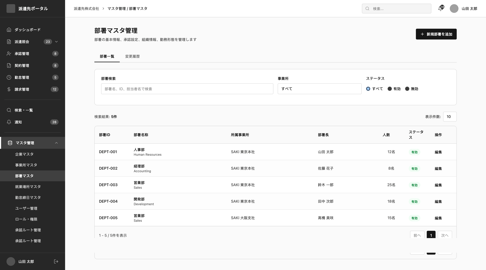
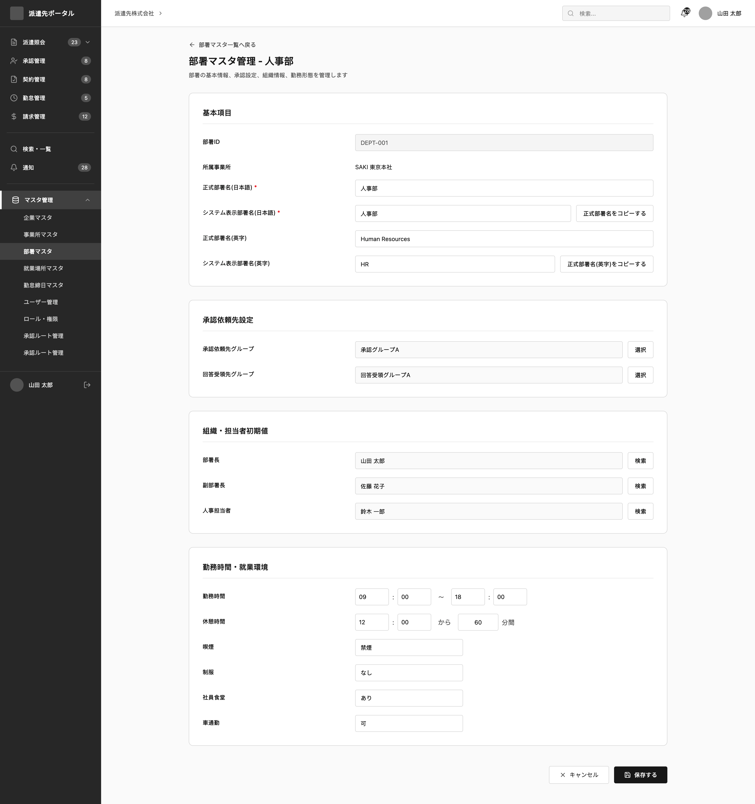
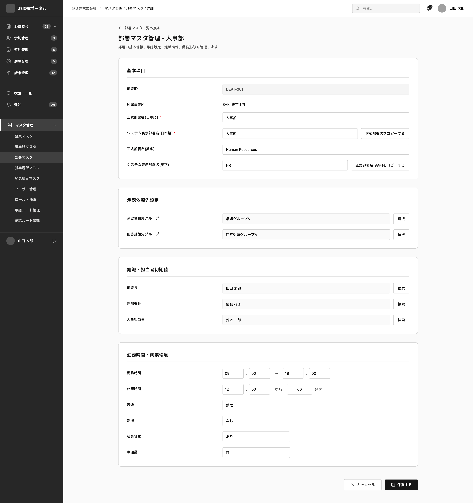
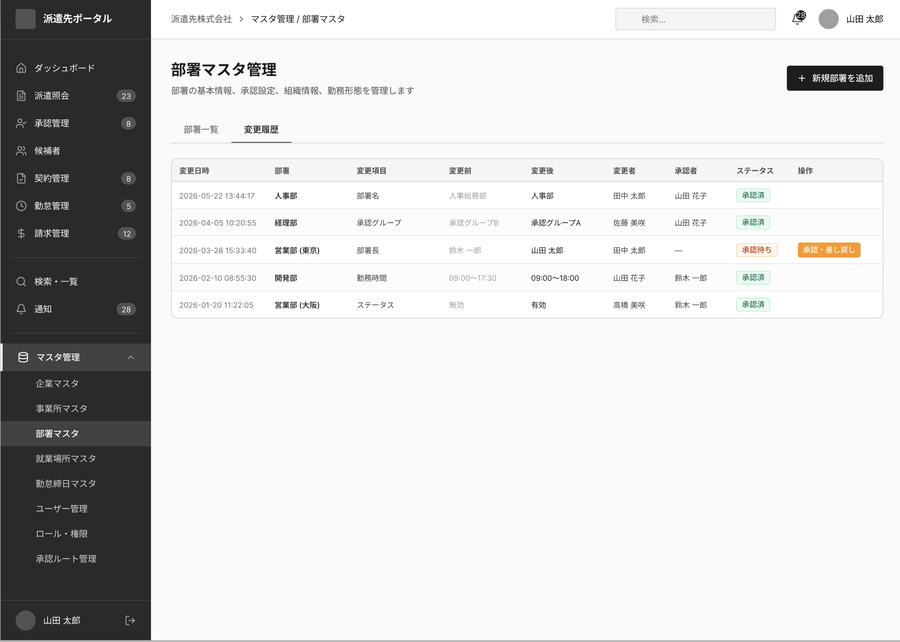

# SCREEN SPECIFICATION

# Màn hình Quản lý phòng ban SAKI

---

# 1. Thông tin màn hình

| Item | Nội dung |
| --- | --- |
| Screen ID | SA-SET-002 |
| Tên màn hình | Quản lý phòng ban |
| Tên tiếng Nhật | 部署マスタ |
| Module | Company Settings |
| URL | /saki/settings/departments |
| Actor | SAKI Admin, SAKI User tùy thuộc quyền hạn |
| Priority | P1 |

---

# 2. Mục đích

Cho phép Admin của đối tác SAKI Portal quản lý danh sách phòng ban bộ phận của công ty, thiết lập người phụ trách mặc định cho các vai trò phê duyệt, chỉ huy, khiếu nại, nhận hóa đơn, và cấu hình nhóm phê duyệt luồng duyệt cho từng phòng ban thuộc Tenant.

Sau khi lưu thành công:

- Cập nhật hoặc thêm mới bản ghi phòng ban vào Database
- Cập nhật nhóm phê duyệt và nhóm nhận trả lời mặc định
- Ghi log

---

# 3. Điều kiện truy cập

## Điều kiện trước

- Đã đăng nhập SAKI Portal
- Có quyền department.view

## Điều kiện sau

- Hiển thị danh sách phòng ban SAKI thành công

---

# 4. Di chuyển màn hình

## Màn hình nguồn

| Screen ID | Tên |
| --- | --- |
| SA-SET-002 | Department Master |

---

## Màn hình đích

| Action | Screen ID | Screen Name |
| --- | --- | --- |
| Create | SA-SET-002 | Department Master |
| Update | SA-SET-002 | Department Master |
| View Detail | SA-SET-002 | Department Master |

---

# 5. UI/UX Layout







---

# 6. Quy tắc UI/UX

## 6.1 Màn hình Danh sách

### Bộ lọc tìm kiếm
- Bộ lọc cho phép mở rộng hoặc thu gọn.
- Hỗ trợ các tiêu chí lọc:
  - Từ khóa tìm kiếm: Nhập mã phòng ban, tên phòng ban hoặc tên trưởng phòng
  - Trạng thái: Dropdown chọn 有効 / 無効
- Nút リセット: Xóa toàn bộ điều kiện lọc và quay về trạng thái mặc định.

### Bảng dữ liệu
- Các cột: Mã phòng ban, Tên phòng ban chính thức, Tên phòng ban hiển thị, Văn phòng trực thuộc, Trưởng phòng ban, Số lượng thành viên, Trạng thái, Thao tác.
- Cột Thao tác:
  - Nút 編集: Mở màn hình cập nhật chi tiết phòng ban.
  - Icon Ba chấm dọc: Click để hiển thị các tùy chọn thao tác phụ như xem lịch sử thay đổi, vô hiệu hóa phòng ban.
  - Đối với phòng ban đang vô hiệu: Cột thao tác hiển thị nút 有効化 để kích hoạt lại.

---

## 6.2 Màn hình Chi tiết, Cập nhật, Thêm mới

### Breadcrumb & Header
- Hiển thị đường dẫn điều hướng: 派遣先株式会社 > 部署マスタ > 詳細 / 編集 / 新規登録.
- Bấm 部署マスタに戻る để hủy bỏ và quay lại danh sách.
- Header hiển thị Badge trạng thái hiện tại, Mã phòng ban và Tên phòng ban.

### Panel Thao tác bên phải
- Panel Thao tác:
  - 変更を保存: Submit form cập nhật dữ liệu.
  - 部署無効化: Vô hiệu hóa phòng ban.
  - 部署有効化: Kích hoạt lại phòng ban.
- Panel Tóm tắt phòng ban:
  - Hiển thị tóm tắt Trạng thái, Văn phòng trực thuộc, Trưởng phòng ban, Số lượng thành viên.
- Panel Thao tác nhanh:
  - Link xem lịch sử thao tác của phòng ban.

### Form thông tin chi tiết
Form được chia làm các khối thông tin rõ ràng:
1. **基本情報 (Thông tin cơ bản):**
   - Mã phòng ban: Bắt buộc, không được chỉnh sửa ở chế độ cập nhật.
   - Tên phòng ban chính thức tiếng Nhật: Bắt buộc.
   - Tên phòng ban hiển thị tiếng Nhật: Bắt buộc.
   - Tên phòng ban chính thức tiếng Anh.
   - Tên phòng ban hiển thị tiếng Anh.
   - Số điện thoại phòng ban.
   - Mã phụ.
   - Trạng thái.
2. **組織・責任者設定 (Thiết lập tổ chức và người chịu trách nhiệm):**
   - Tên đơn vị tổ chức.
   - Chức danh người đứng đầu tổ chức.
   - Người phụ trách hợp đồng mặc định: Chọn từ danh sách người dùng SAKI.
   - Người phụ trách SAKI mặc định (Trưởng phòng ban): Chọn từ danh sách người dùng SAKI.
   - Người chỉ huy mặc định: Chọn từ danh sách người dùng SAKI.
   - Nơi nhận hóa đơn mặc định: Chọn từ danh sách người dùng SAKI.
   - Nơi tiếp nhận khiếu nại mặc định: Chọn từ danh sách người dùng SAKI.
3. **承認ルート・送信先設定 (Cấu hình nhóm phê duyệt và nơi nhận trả lời):**
   - Nhóm nhận yêu cầu phê duyệt: Dropdown chọn từ danh sách nhóm phê duyệt có sẵn.
   - Nhóm nhận trả lời: Dropdown chọn từ danh sách nhóm phê duyệt có sẵn.

---

# 7. Định nghĩa Item

## 7.1 Bộ lọc tìm kiếm (Màn hình Danh sách)

| No | Item | Type | Required | Format | DB |
| --- | --- | --- | --- | --- | --- |
| 1 | Từ khóa tìm kiếm | Textbox | No | 100 ký tự | keyword |
| 2 | Trạng thái | Select | No | 有効 / 無効 | status |

---

## 7.2 Khối Thông tin cơ bản (Form Nhập liệu / Chi tiết)

| No | Item | Type | Required | Format | DB |
| --- | --- | --- | --- | --- | --- |
| 3 | Mã phòng ban | Textbox | Yes | 20 ký tự, Half-width | department_id |
| 4 | Tên phòng ban chính thức tiếng Nhật | Textbox | Yes | 400 ký tự | official_name_ja |
| 5 | Tên phòng ban hiển thị tiếng Nhật | Textbox | Yes | 24 ký tự | display_name_ja |
| 6 | Tên phòng ban chính thức tiếng Anh | Textbox | No | 100 ký tự, Half-width | official_name_en |
| 7 | Tên phòng ban hiển thị tiếng Anh | Textbox | No | 24 ký tự, Half-width | display_name_en |
| 8 | Số điện thoại phòng ban | Textbox | No | 15 ký tự, Half-width | tel |
| 9 | Mã phụ | Textbox | No | 16 ký tự, Half-width | sub_code |
| 10 | Trạng thái | Dropdown | Yes | 1: 有効, 0: 無効 | status |

---

## 7.3 Khối Thiết lập tổ chức và người chịu trách nhiệm (Form Nhập liệu / Chi tiết)

| No | Item | Type | Required | Format | DB |
| --- | --- | --- | --- | --- | --- |
| 11 | Tên đơn vị tổ chức | Textbox | No | 400 ký tự | org_unit_name |
| 12 | Chức danh người đứng đầu tổ chức | Textbox | No | 200 ký tự | org_head_title |
| 13 | Người phụ trách hợp đồng mặc định | Select | No | Chọn từ danh sách người dùng | default_contract_person_id |
| 14 | Người phụ trách SAKI mặc định | Select | No | Chọn từ danh sách người dùng | default_dispatch_supervisor_id |
| 15 | Người chỉ huy mặc định | Select | No | Chọn từ danh sách người dùng | default_commander_id |
| 16 | Nơi nhận hóa đơn mặc định | Select | No | Chọn từ danh sách người dùng | default_invoice_recipient_id |
| 17 | Nơi tiếp nhận khiếu nại mặc định | Select | No | Chọn từ danh sách người dùng | default_complaint_person_id |

---

## 7.4 Khối Cấu hình nhóm phê duyệt và nơi nhận trả lời (Form Nhập liệu / Chi tiết)

| No | Item | Type | Required | Format | DB |
| --- | --- | --- | --- | --- | --- |
| 18 | Nhóm nhận yêu cầu phê duyệt | Select | Yes | Chọn từ danh sách nhóm phê duyệt | approval_group_id |
| 19 | Nhóm nhận trả lời | Select | Yes | Chọn từ danh sách nhóm phê duyệt | reply_group_id |

---

## 7.5 Các nút hành động

| Item | Type | Required | Mô tả |
| --- | --- | --- | --- |
| 新規登録 | Button | - | Mở form thêm mới phòng ban |
| 変更を保存 | Button | - | Lưu toàn bộ thông tin cập nhật trên form |
| 部署無効化 | Button | - | Đổi trạng thái status về 0 |
| 部署有効化 | Button | - | Đổi trạng thái status về 1 |

---

# 8. Validation

## department_id

| Rule | Message Code | Message |
| --- | --- | --- |
| Required | CMS-VAL-23 | 部署IDを入力してください。 |
| Min 3 | CMS-VAL-6 | 部署IDは3文字以上で入力してください。 |
| Max 20 | CMS-VAL-6 | 部署IDは20文字以内で入力してください。 |
| Format | CMS-VAL-24 | 部署IDに正しい形式を指定してください。 |
| Unique | CMS-VAL-11 | 部署IDの値は既に存在しています。 |

---

## official_name_ja

| Rule | Message Code | Message |
| --- | --- | --- |
| Required | CMS-VAL-23 | 正式部署名を入力してください。 |
| Max 400 | CMS-VAL-6 | 正式部署名は400文字以内で入力してください。 |

---

## display_name_ja

| Rule | Message Code | Message |
| --- | --- | --- |
| Required | CMS-VAL-23 | 部署名を入力してください。 |
| Max 24 | CMS-VAL-6 | 部署名は24文字以内で入力してください。 |

---

## official_name_en

| Rule | Message Code | Message |
| --- | --- | --- |
| Max 100 | CMS-VAL-6 | 正式部署名（英語）は100文字以内で入力してください。 |
| Format | CMS-VAL-24 | 正式部署名（英語）に正しい形式を指定してください。 |

---

## display_name_en

| Rule | Message Code | Message |
| --- | --- | --- |
| Max 24 | CMS-VAL-6 | 部署名（英語）は24文字以内で入力してください。 |

---

## tel

| Rule | Message Code | Message |
| --- | --- | --- |
| Max 15 | CMS-VAL-6 | 電話番号は15文字以内で入力してください。 |
| Format | CMS-VAL-24 | 電話番号に正しい形式を指定してください。 |

---

## sub_code

| Rule | Message Code | Message |
| --- | --- | --- |
| Max 16 | CMS-VAL-6 | サブコードは16文字以内で入力してください。 |
| Format | CMS-VAL-24 | サブコードに正しい形式を指定してください。 |

---

# 9. Event Definition

## Initial Load (Màn hình danh sách)

### Trigger
Người dùng click vào menu "部署マスタ" (Department Master).

### Process
1. Gọi API Get Saki Department (GET `/api/v1/saki/settings/departments`).
2. Mặc định tải trang 1, sắp xếp theo thời gian tạo mới nhất.
3. Hiển thị Grid danh sách phòng ban và thông tin phân trang.

---

## Search & Filter

### Trigger
Admin nhập từ khóa, chọn trạng thái và bấm tìm kiếm.

### Process
1. Thu thập tham số tìm kiếm keyword, status trên UI.
2. Gọi API Get Saki Department với các tham số này.
3. Cập nhật Grid hiển thị và phân trang.

---

## Vô hiệu hóa phòng ban (Suspend Department)

### Trigger
Admin click nút 部署無効化 trên panel Thao tác bên phải.

### Process
1. Hiển thị Popup xác nhận vô hiệu hóa.
2. Khi xác nhận, gọi API cập nhật trạng thái phòng ban (PUT `/api/v1/saki/settings/departments/{id}` hoặc API Suspend chuyên dụng) truyền status = 0.
3. Trả về thông báo thành công và reload lại trang danh sách/chi tiết.

---

## Save

### Trigger
Admin click 変更を保存 (Lưu thay đổi) trên form cập nhật/thêm mới.

### Process
1. Thực hiện validate toàn bộ trường nhập liệu. Nếu có lỗi, hiển thị thông báo lỗi inline tại trường tương ứng và dừng xử lý.
2. Hiển thị popup xác nhận lưu.
3. Gọi API cập nhật hoặc tạo mới phòng ban (PUT/POST `/api/v1/saki/settings/departments`).
4. Hệ thống thực hiện cập nhật database trong Transaction.
5. Ghi Audit Log.
6. Hiển thị Toast thông báo thành công.
7. Reload dữ liệu và cập nhật giao diện.

---

# 10. Mapping Database

## mst_saki_department

| Column | Type | Description |
| --- | --- | --- |
| company_id | varchar | Mã công ty |
| department_id | varchar | Mã phòng ban |
| official_name_ja | varchar | Tên phòng ban chính thức tiếng Nhật |
| display_name_ja | varchar | Tên phòng ban hiển thị tiếng Nhật |
| official_name_en | varchar | Tên phòng ban chính thức tiếng Anh |
| display_name_en | varchar | Tên phòng ban hiển thị tiếng Anh |
| tel | varchar | Số điện thoại phòng ban |
| sub_code | varchar | Mã phụ |
| status | smallint | Trạng thái (0: vô hiệu, 1: hiệu lực) |
| approval_group_id | varchar | Mã nhóm nhận yêu cầu phê duyệt |
| reply_group_id | varchar | Mã nhóm nhận trả lời |
| org_unit_name | varchar | Tên đơn vị tổ chức |
| org_head_title | varchar | Chức danh người đứng đầu tổ chức |
| default_contract_person_id | varchar | Người phụ trách hợp đồng mặc định |
| default_dispatch_supervisor_id | varchar | Người phụ trách SAKI mặc định |
| default_commander_id | varchar | Người chỉ huy mặc định |
| default_invoice_recipient_id | varchar | Nơi nhận hóa đơn mặc định |
| default_complaint_person_id | varchar | Nơi tiếp nhận khiếu nại mặc định |
| created_at | timestamptz | Thời điểm tạo |
| updated_at | timestamptz | Thời điểm cập nhật |
| created_by | varchar | Người tạo |
| updated_by | varchar | Người cập nhật |

---

# 11. API Mapping

## 11.1 Get Saki Department

```
GET /api/v1/saki/settings/departments
```

Request Query

```json
{
  "page": 1,
  "limit": 10,
  "keyword": "人事",
  "status": 1
}
```

Response

```json
{
  "success": true,
  "data": [
    {
      "department_id": "DEPT-001",
      "official_name_ja": "人事部",
      "display_name_ja": "人事部",
      "official_name_en": "Human Resources",
      "display_name_en": "Human Resources",
      "office_id": "OFF-001",
      "office_name": "SAKI 東京本社",
      "manager_user_id": "yamada.taro",
      "manager_name": "山田 太郎",
      "member_count": 12,
      "status": 1,
      "created_at": "2026-04-01T08:00:00+09:00",
      "updated_at": "2026-06-22T10:00:00+09:00"
    }
  ],
  "meta": {
    "current_page": 1,
    "per_page": 10,
    "total": 1
  }
}
```

---

# 12. Notification

## Trigger
Không áp dụng cho màn hình này.

---

# 13. Message Definition

| Code | Message tiếng Nhật | Message tiếng Việt | Loại hiển thị |
| --- | --- | --- | --- |
| CMS-VAL-23 | {0}を入力してください。 | Vui lòng không để trống trường {0}. | Inline Validation |
| CMS-VAL-6 | {0}は{1}文字以内で入力してください。 | Vui lòng nhập {0} trong vòng {1} ký tự trở xuống. | Inline Validation |
| CMS-VAL-24 | {0}に正しい形式を指定してください。 | Vui lòng nhập {0} đúng định dạng yêu cầu. | Inline Validation |
| CMS-VAL-11 | {0}の値は既に存在しています。 | Giá trị của {0} đã tồn tại trong hệ thống, không được trùng lặp. | Inline Validation |
| CMS-VAL-79 | {Screen name}を更新しました/登録しました。 | Đã cập nhật/đăng ký {Screen name}. | Toast Success |
| CMS-VAL-85 | {Target}を更新します/登録します。よろしいですか。 | Sẽ tiến hành cập nhật/đăng ký {Target}. Bạn có chắc chắn không? | Dialog Confirm |
| CMS-VAL-99 | システムエラーが発生しました。 | Đã xảy ra lỗi hệ thống. Vui lòng liên hệ với người quản trị. | Toast Error / Popup |

---

# 14. Permission

| Action | Admin | Approver | Staff | Viewer |
| --- | --- | --- | --- | --- |
| Create | O | X | X | X |
| Update | O | X | X | X |
| View List | O | O | O | O |
| View Detail | O | O | O | O |

---

# 15. Audit Log

| Action | Log |
| --- | --- |
| Create | Yes |
| Update | Yes |
| Suspend / Enable | Yes |

---

# 16. Error Handling

| HTTP Code | Message |
| --- | --- |
| 401 | Phiên đăng nhập đã hết hạn |
| 403 | Bạn không có quyền thực hiện thao tác này |
| 404 | Không tìm thấy dữ liệu |
| 422 | Dữ liệu không hợp lệ |
| 500 | Hệ thống đang gặp sự cố |

---

# 17. Related Documents

- Business Flow
- ERD
- API Specification SA-SET-002-API-01
- Portal Permission Matrix
