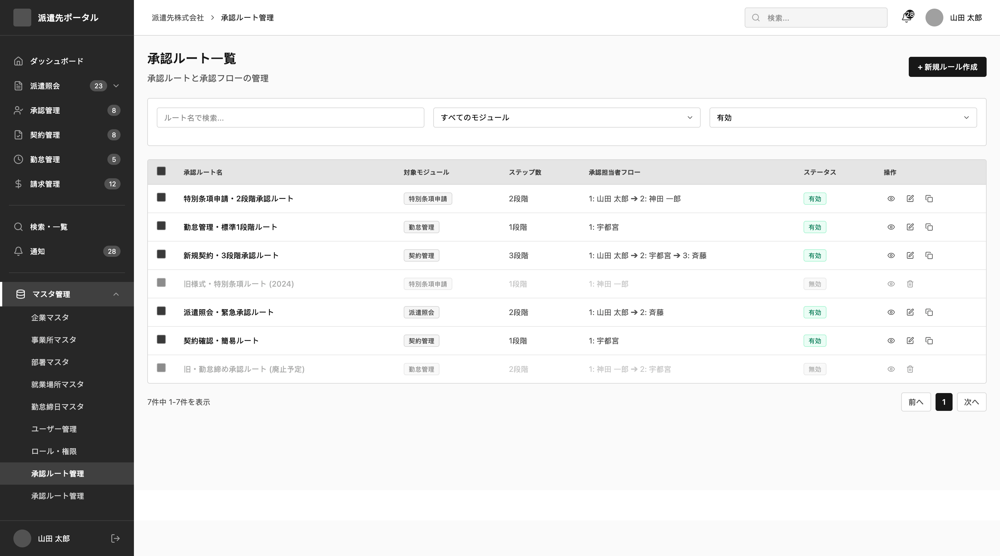
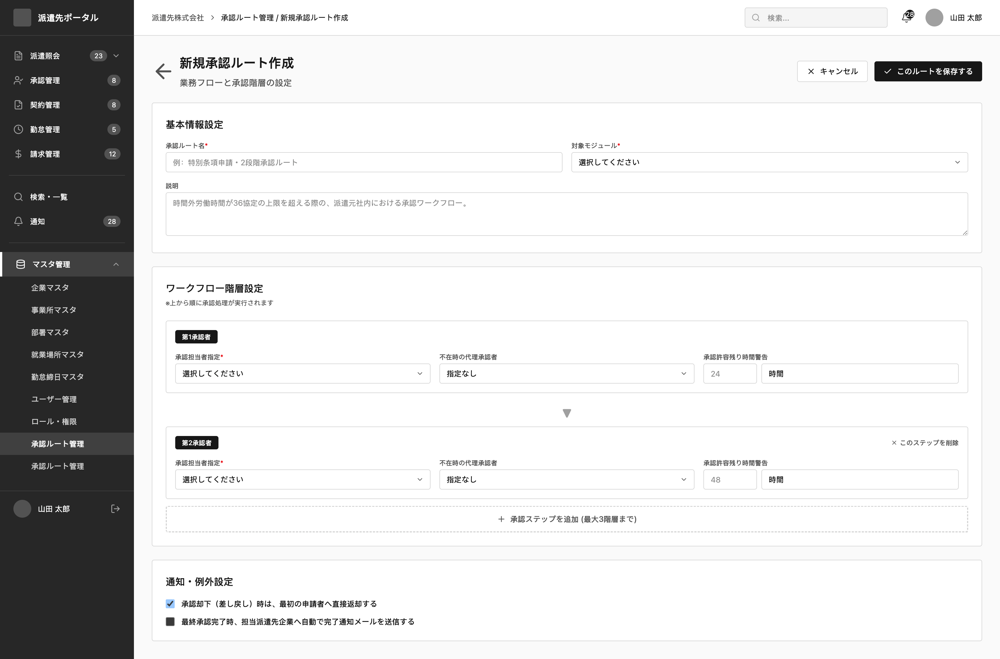
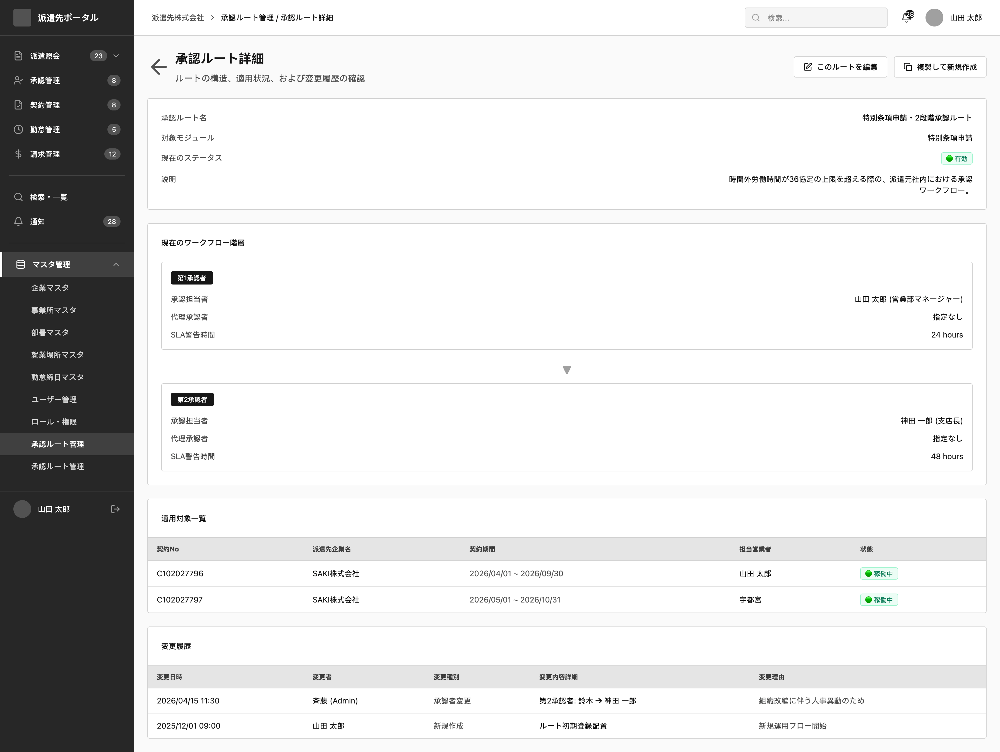

# SCREEN SPECIFICATION

# Màn hình Quản lý tuyến phê duyệt SAKI

---

# 1. Thông tin màn hình

| Item | Nội dung |
| --- | --- |
| Screen ID | SA-SET-003 |
| Tên màn hình | Quản lý tuyến phê duyệt |
| Tên tiếng Nhật | 承認ルート管理 |
| Module | Company Settings |
| URL | /saki/settings/approval-groups |
| Actor | SAKI Admin, SAKI User tùy thuộc quyền hạn |
| Priority | P1 |

---

# 2. Mục đích

Cho phép Admin của đối tác SAKI Portal quản lý danh sách các tuyến phê duyệt, thiết lập trình tự các bước duyệt, gán người phê duyệt tương ứng cho từng bước của luồng duyệt yêu cầu phái cử, hợp đồng hoặc chấm công trong Tenant.

Sau khi lưu thành công:

- Cập nhật hoặc thêm mới bản ghi nhóm phê duyệt và thành viên nhóm phê duyệt vào Database
- Ghi log

---

# 3. Điều kiện truy cập

## Điều kiện trước

- Đã đăng nhập SAKI Portal
- Có quyền approval.view

## Điều kiện sau

- Hiển thị danh sách tuyến phê duyệt SAKI thành công

---

# 4. Di chuyển màn hình

## Màn hình nguồn

| Screen ID | Tên |
| --- | --- |
| SA-SET-003 | Approval Group Master |

---

## Màn hình đích

| Action | Screen ID | Screen Name |
| --- | --- | --- |
| Create | SA-SET-003 | Approval Group Master |
| Update | SA-SET-003 | Approval Group Master |
| View Detail | SA-SET-003 | Approval Group Master |

---

# 5. UI/UX Layout





---

# 6. Quy tắc UI/UX

## 6.1 Màn hình Danh sách

### Bộ lọc tìm kiếm
- Bộ lọc cho phép mở rộng hoặc thu gọn.
- Hỗ trợ các tiêu chí lọc:
  - Tên tuyến phê duyệt: Nhập từ khóa tìm kiếm tên tuyến
  - Trạng thái: Dropdown chọn 有効 / 無効
- Nút リセット: Xóa toàn bộ điều kiện lọc và quay về trạng thái mặc định.

### Bảng dữ liệu
- Các cột: Mã tuyến phê duyệt, Tên tuyến phê duyệt, Số bước duyệt, Trình tự duyệt, Trạng thái, Thao tác.
- Trình tự duyệt: Hiển thị chuỗi tên người duyệt theo thứ tự, ví dụ: 山田 太郎 ➔ 神田 一郎.
- Cột Thao tác:
  - Nút 編集: Mở màn hình cập nhật chi tiết tuyến phê duyệt.
  - Icon Ba chấm dọc: Click để hiển thị các tùy chọn thao tác phụ như xem chi tiết, vô hiệu hóa tuyến phê duyệt.
  - Đối với tuyến phê duyệt đang vô hiệu: Cột thao tác hiển thị nút 有効化 để kích hoạt lại.

---

## 6.2 Màn hình Chi tiết, Cập nhật, Thêm mới

### Breadcrumb & Header
- Hiển thị đường dẫn điều hướng: 派遣先株式会社 > 承認ルート管理 > 詳細 / 編集 / 新規登録.
- Bấm 承認ルート一覧に戻る để hủy bỏ và quay lại danh sách.
- Header hiển thị Badge trạng thái hiện tại, Mã tuyến phê duyệt và Tên tuyến phê duyệt.

### Panel Thao tác bên phải
- Panel Thao tác:
  - 変更を保存: Submit form cập nhật dữ liệu.
  - 承認ルート無効化: Vô hiệu hóa tuyến phê duyệt.
  - 承認ルート有効化: Kích hoạt lại tuyến phê duyệt.
- Panel Tóm tắt tuyến phê duyệt:
  - Hiển thị tóm tắt Trạng thái, Số bước duyệt, Ngày tạo, Cập nhật gần nhất.

### Form thông tin chi tiết
Form được chia làm các khối thông tin rõ ràng:
1. **基本情報 (Thông tin cơ bản):**
   - Mã tuyến phê duyệt: Bắt buộc, không được chỉnh sửa ở chế độ cập nhật.
   - Tên tuyến phê duyệt tiếng Nhật: Bắt buộc.
   - Tên tuyến phê duyệt tiếng Anh.
   - Trạng thái.
2. **承認ステップ設定 (Cấu hình bước phê duyệt):**
   - Danh sách các bước duyệt được sắp xếp theo thứ tự (Bước 1, Bước 2, Bước 3...).
   - Ở mỗi bước:
     - Cho phép chọn người duyệt từ danh sách người dùng SAKI có quyền phê duyệt.
     - Cho phép xóa bước duyệt.
   - Nút ステップを追加: Bấm để thêm một bước phê duyệt mới vào cuối danh sách.
   - Hỗ trợ thao tác kéo thả (Drag & Drop) để thay đổi thứ tự các bước duyệt.

---

# 7. Định nghĩa Item

## 7.1 Bộ lọc tìm kiếm (Màn hình Danh sách)

| No | Item | Type | Required | Format | DB |
| --- | --- | --- | --- | --- | --- |
| 1 | Tên tuyến phê duyệt | Textbox | No | 100 ký tự | keyword |
| 2 | Trạng thái | Select | No | 有効 / 無効 | status |

---

## 7.2 Khối Thông tin cơ bản (Form Nhập liệu / Chi tiết)

| No | Item | Type | Required | Format | DB |
| --- | --- | --- | --- | --- | --- |
| 3 | Mã tuyến phê duyệt | Textbox | Yes | 16 ký tự, Half-width | approval_group_id |
| 4 | Tên tuyến phê duyệt tiếng Nhật | Textbox | Yes | 24 ký tự | group_name_ja |
| 5 | Tên tuyến phê duyệt tiếng Anh | Textbox | No | 24 ký tự, Half-width | group_name_en |
| 6 | Trạng thái | Dropdown | Yes | 1: 有効, 0: 無効 | status |

---

## 7.3 Khối Cấu hình bước phê duyệt (Form Nhập liệu / Chi tiết)

| No | Item | Type | Required | Format | DB |
| --- | --- | --- | --- | --- | --- |
| 7 | Người phê duyệt bước | Select | Yes | Chọn từ danh sách người dùng SAKI | user_id |

---

## 7.4 Các nút hành động

| Item | Type | Required | Mô tả |
| --- | --- | --- | --- |
| 新規登録 | Button | - | Mở form thêm mới tuyến phê duyệt |
| 変更を保存 | Button | - | Lưu toàn bộ thông tin cập nhật trên form |
| ステップを追加 | Button | - | Thêm một dòng bước duyệt mới vào form |
| 承認ルート無効化 | Button | - | Đổi trạng thái status về 0 |
| 承認ルート有効化 | Button | - | Đổi trạng thái status về 1 |

---

# 8. Validation

## approval_group_id

| Rule | Message Code | Message |
| --- | --- | --- |
| Required | CMS-VAL-23 | 承認ルートIDを入力してください。 |
| Max 16 | CMS-VAL-6 | 承認ルートIDは16文字以内で入力してください。 |
| Format | CMS-VAL-24 | 承認ルートIDに正しい形式を指定してください。 |
| Unique | CMS-VAL-11 | 承認ルートIDの値は既に存在しています。 |

---

## group_name_ja

| Rule | Message Code | Message |
| --- | --- | --- |
| Required | CMS-VAL-23 | 承認ルート名を入力してください。 |
| Max 24 | CMS-VAL-6 | 承認ルート名は24文字以内で入力してください. |

---

## group_name_en

| Rule | Message Code | Message |
| --- | --- | --- |
| Max 24 | CMS-VAL-6 | 承認ルート名（英語）は24文字以内で入力してください。 |

---

## user_id (Các bước phê duyệt)

| Rule | Message Code | Message |
| --- | --- | --- |
| Required | CMS-VAL-23 | 承認者を指定してください。 |
| Duplicate Check | CMS-VAL-41 | 同一の承認ルート内で同じ承認者を複数回指定することはできません。 |

---

# 9. Event Definition

## Initial Load (Màn hình danh sách)

### Trigger
Người dùng click vào menu "承認ルート管理" (Approval Route Master).

### Process
1. Gọi API Get Approval Group Master (GET `/api/v1/saki/settings/approval-groups`).
2. Mặc định tải trang 1, sắp xếp theo thời gian tạo mới nhất.
3. Hiển thị Grid danh sách tuyến phê duyệt và thông tin phân trang.

---

## Search & Filter

### Trigger
Admin nhập tên tuyến, chọn trạng thái và bấm tìm kiếm.

### Process
1. Thu thập tham số tìm kiếm keyword, status trên UI.
2. Gọi API Get Approval Group Master với các tham số này.
3. Cập nhật Grid hiển thị và phân trang.

---

## Vô hiệu hóa tuyến phê duyệt (Suspend Approval Group)

### Trigger
Admin click nút 承認ルート無効化 trên panel Thao tác bên phải.

### Process
1. Hiển thị Popup xác nhận vô hiệu hóa.
2. Khi xác nhận, gọi API cập nhật trạng thái nhóm phê duyệt (PUT `/api/v1/saki/settings/approval-groups/{id}` hoặc API Suspend chuyên dụng) truyền status = 0.
3. Trả về thông báo thành công và reload lại danh sách.

---

## Save

### Trigger
Admin click 変更を保存 (Lưu thay đổi) trên form cập nhật/thêm mới.

### Process
1. Thực hiện validate toàn bộ trường nhập liệu và kiểm tra trùng lặp người duyệt giữa các bước. Nếu có lỗi, hiển thị thông báo lỗi inline và dừng xử lý.
2. Hiển thị popup xác nhận lưu.
3. Gọi API Create/Update Approval Group tương ứng (POST `/api/v1/saki/settings/approval-groups` hoặc PUT `/api/v1/saki/settings/approval-groups/{id}`).
4. Hệ thống thực hiện cập nhật các bảng `mst_saki_approval_group` và `mst_saki_approval_group_user` trong cùng một Transaction ở Backend.
5. Ghi Audit Log.
6. Hiển thị Toast thông báo thành công.
7. Reload dữ liệu và cập nhật giao diện.

---

# 10. Mapping Database

## mst_saki_approval_group

| Column | Type | Description |
| --- | --- | --- |
| company_id | varchar | Mã công ty |
| approval_group_id | varchar | Mã nhóm phê duyệt |
| group_name_ja | varchar | Tên nhóm phê duyệt tiếng Nhật |
| group_name_en | varchar | Tên nhóm phê duyệt tiếng Anh |
| status | smallint | Trạng thái (0: vô hiệu, 1: hiệu lực) |
| created_at | timestamptz | Thời điểm tạo |
| updated_at | timestamptz | Thời điểm cập nhật |
| created_by | varchar | Người tạo |
| updated_by | varchar | Người cập nhật |

---

## mst_saki_approval_group_user

| Column | Type | Description |
| --- | --- | --- |
| company_id | varchar | Mã công ty |
| approval_group_id | varchar | Mã nhóm phê duyệt |
| user_id | varchar | Mã người dùng được gán làm người duyệt |
| created_at | timestamptz | Thời điểm gán |
| updated_at | timestamptz | Thời điểm cập nhật |
| created_by | varchar | Người tạo |
| updated_by | varchar | Người cập nhật |

---

# 11. API Mapping

## 11.1 Get Approval Group Master

```
GET /api/v1/saki/settings/approval-groups
```

Request Query

```json
{
  "page": 1,
  "limit": 20,
  "keyword": "特別条項",
  "status": 1
}
```

Response

```json
{
  "success": true,
  "data": [
    {
      "approval_group_id": "APG-001",
      "group_name_ja": "特別条項申請・2段階承認ルート",
      "group_name_en": null,
      "steps_count": 2,
      "approver_flow": "山田 太郎 ➔ 神田 一郎",
      "status": 1,
      "created_at": "2026-06-15T10:00:00+09:00",
      "updated_at": "2026-06-20T12:00:00+09:00"
    }
  ],
  "meta": {
    "current_page": 1,
    "per_page": 20,
    "total": 1
  }
}
```

---

## 11.2 Create Approval Group

```
POST /api/v1/saki/settings/approval-groups
```

Request Body

```json
{
  "approval_group_id": "APG-003",
  "group_name_ja": "新しい承認ルート",
  "group_name_en": "New Route",
  "status": 1,
  "approver_ids": [
    "yamada.taro",
    "kanda.ichiro"
  ]
}
```

Response

```json
{
  "success": true,
  "data": {
    "approval_group_id": "APG-003",
    "status": 1,
    "created_at": "2026-06-25T17:20:00+09:00"
  }
}
```

---

## 11.3 Update Approval Group

```
PUT /api/v1/saki/settings/approval-groups/{id}
```

Request Body

```json
{
  "group_name_ja": "更新された承認ルート",
  "group_name_en": "Updated Route",
  "status": 1,
  "approver_ids": [
    "yamada.taro",
    "utsunomiya.ken"
  ]
}
```

Response

```json
{
  "success": true,
  "data": {
    "approval_group_id": "APG-003",
    "status": 1,
    "updated_at": "2026-06-25T17:25:00+09:00"
  }
}
```

---

# 12. Notification

## Trigger
Không áp dụng cho màn hình này.

---

# 13. Message Definition

| Code | Message tiếng Nhật | Message tiếng Việt | Loại hiển thị |
| --- | --- | --- | --- |
| CMS-VAL-23 | {0}を入力してください。 | Vui lòng không để trống trường {0}. | Inline Validation |
| CMS-VAL-6 | {0}は{1}文字以内で入力してください。 | Vui lòng nhập {0} trong vòng {1} ký tự trở xuống. | Inline Validation |
| CMS-VAL-24 | {0}に正しい形式を指定してください。 | Vui lòng nhập {0} đúng định dạng yêu cầu. | Inline Validation |
| CMS-VAL-11 | {0}の値は既に存在しています。 | Giá trị của {0} đã tồn tại trong hệ thống, không được trùng lặp. | Inline Validation |
| CMS-VAL-41 | 選択された{0}は正しくありません。 | {0} được chọn không hợp lệ hoặc bị lặp. | Inline Validation |
| CMS-VAL-79 | {Screen name}を更新しました/登録しました。 | Đã cập nhật/đăng ký {Screen name}. | Toast Success |
| CMS-VAL-85 | {Target}を更新します/登録します。よろしいですか。 | Sẽ tiến hành cập nhật/đăng ký {Target}. Bạn có chắc chắn không? | Dialog Confirm |
| CMS-VAL-99 | システムエラーが発生しました。 | Đã xảy ra lỗi hệ thống. Vui lòng liên hệ với người quản trị. | Toast Error / Popup |

---

# 14. Permission

| Action | Admin | Approver | Staff | Viewer |
| --- | --- | --- | --- | --- |
| Create | O | X | X | X |
| Update | O | X | X | X |
| View List | O | O | O | O |
| View Detail | O | O | O | O |

---

# 15. Audit Log

| Action | Log |
| --- | --- |
| Create | Yes |
| Update | Yes |
| Suspend / Enable | Yes |

---

# 16. Error Handling

| HTTP Code | Message |
| --- | --- |
| 401 | Phiên đăng nhập đã hết hạn |
| 403 | Bạn không có quyền thực hiện thao tác này |
| 404 | Không tìm thấy dữ liệu |
| 422 | Dữ liệu không hợp lệ |
| 500 | Hệ thống đang gặp sự cố |

---

# 17. Related Documents

- Business Flow
- ERD
- API Specification SA-SET-003-API-01 / SA-SET-003-API-02 / SA-SET-003-API-03
- Portal Permission Matrix
