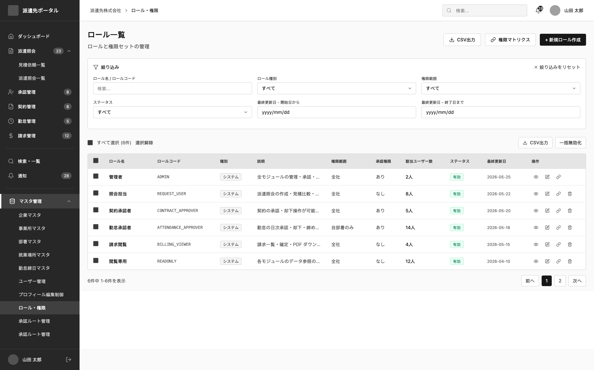
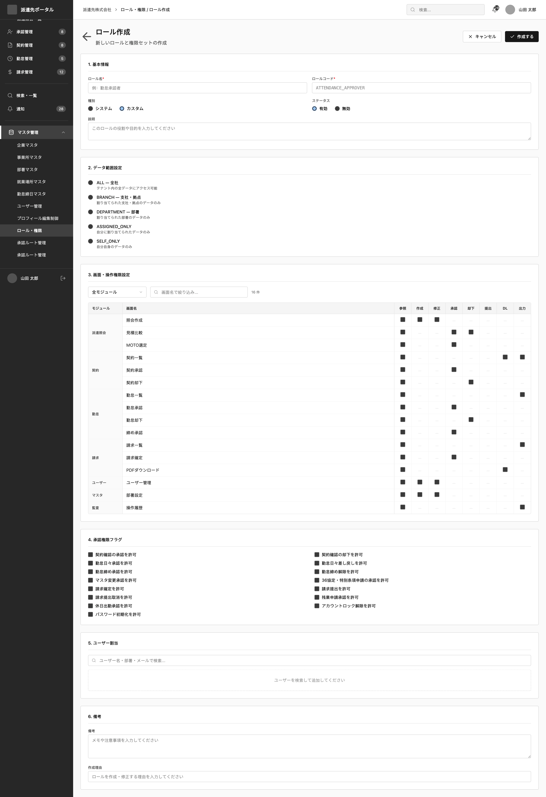

# SCREEN SPECIFICATION

---

# 1. Thông tin màn hình

| Item | Nội dung |
| --- | --- |
| Screen ID | SA-SET-004 |
| Tên màn hình | Role Master |
| Tên tiếng Nhật | 権限マスタ |
| Module | Company Settings (企業設定) |
| Chức năng | Quản lý RBAC role |
| Actor | SAKI Admin, SAKI Operator có quyền tương ứng |
| URL | /saki/settings/roles |
| Priority | P1 |
| Phiên bản | v1.0 |

---

# 2. Mục đích màn hình

Cho phép người dùng:

- Tìm kiếm và xem danh sách các vai trò trong hệ thống SAKI Portal.
- Xem chi tiết vai trò và các quyền hạn được gán.
- Tạo mới vai trò và gán các quyền hệ thống.
- Chỉnh sửa tên, mô tả và thay đổi các quyền của vai trò.
- Xóa vai trò.
- Xuất dữ liệu vai trò ra file CSV.

---

# 3. Điều kiện truy cập

## Điều kiện trước

- Đã đăng nhập vào hệ thống SAKI Portal.
- Có quyền xem vai trò (saki.settings.role_master.view).

## Điều kiện sau

- Hiển thị danh sách vai trò theo điều kiện tìm kiếm.

---

# 4. Di chuyển màn hình

## Màn hình nguồn

| Screen ID | Tên màn hình |
| --- | --- |
| SA-SET-004 | Role Master |

---

## Màn hình đích

| Action | Screen ID | Tên màn hình |
| --- | --- | --- |
| Click Tạo mới | SA-SET-004 | Popup Tạo mới Vai trò (Modal) |
| Click Chỉnh sửa | SA-SET-004 | Popup Chỉnh sửa Vai trò (Modal) |

---

# 5. UI/UX Layout






---

# 6. Định nghĩa Item màn hình

## Khu vực tìm kiếm & Thao tác danh sách

| No | Item | Loại | Format | Bắt buộc | Mô tả |
| --- | --- | --- | --- | --- | --- |
| 1 | Từ khóa | Textbox | varchar(100) | No | Lọc theo tên vai trò hoặc mô tả |
| 2 | 新規登録 | Button | - | - | Mở popup tạo mới vai trò |
| 2a | Export | Button | - | - | Xuất dữ liệu vai trò ra file CSV |

## Bảng dữ liệu vai trò

| No | Item | Loại | Format | Bắt buộc | Mô tả |
| --- | --- | --- | --- | --- | --- |
| 3 | ID | Label | bigint | - | Khóa chính vai trò |
| 4 | Tên vai trò | Label | varchar(100) | - | Tên vai trò |
| 5 | Số lượng quyền | Label | int | - | Tổng số quyền hạn được gán |
| 6 | Mô tả | Label | varchar(255) | - | Mô tả vai trò |
| 7 | 編集 | Button | - | - | Mở popup chỉnh sửa vai trò |
| 8 | 削除 | Button | - | - | Xóa vai trò |

## Popup Form Nhập liệu 

| No | Item | Loại | Format | Bắt buộc | Mô tả |
| --- | --- | --- | --- | --- | --- |
| 9 | Tên vai trò | Textbox | varchar(100) | Yes | Nhập tên vai trò |
| 10 | Mô tả | Textarea | varchar(255) | No | Nhập mô tả vai trò |
| 11 | Danh sách quyền hạn | Checkbox List | array | Yes | Chọn các quyền hạn hệ thống gán cho vai trò |
| 12 | 保存 | Button | - | - | Lưu thông tin vai trò |
| 13 | キャンセル | Button | - | - | Đóng popup và hủy bỏ thay đổi |

---

# 7. Validation

[Reference Link](https://app.notion.com/p/Validation-Rule-378f02c407dd805aae8acbb637c995d5?source=copy_link)

---

# 8. Event Definition

| **Type** | **Event** | **Trigger** | **Permission Key** | **Process/Flow** |
| --- | --- | --- | --- | --- |
| api | Initial Load | Mở màn hình | saki.settings.role_master.view | 1. Gọi API GET `/api/v1/saki/settings/roles` để lấy danh sách vai trò.<br>2. Hiển thị danh sách lên bảng dữ liệu. |
| api | Search | Click Tìm kiếm | saki.settings.role_master.view | Gọi API GET `/api/v1/saki/settings/roles` kèm tham số lọc keyword. |
| screen | Open Create Popup | Click 新規登録 | saki.settings.role_master.create | 1. Gọi API GET `/api/v1/saki/settings/permissions` để lấy toàn bộ danh mục quyền.<br>2. Mở Popup/Modal với form trống. |
| screen | Open Edit Popup | Click 編集 | saki.settings.role_master.edit | 1. Gọi API GET `/api/v1/saki/settings/permissions` để lấy danh mục quyền.<br>2. Gọi API GET `/api/v1/saki/settings/roles/{id}` để lấy chi tiết vai trò.<br>3. Mở Popup và điền dữ liệu sẵn vào form. |
| api | Submit Save | Click 保存 | saki.settings.role_master.edit | 1. Validate form nhập liệu.<br>2. Nếu tạo mới: Gọi API POST `/api/v1/saki/settings/roles`.<br>3. Nếu chỉnh sửa: Gọi API PUT `/api/v1/saki/settings/roles/{id}`.<br>4. Hiển thị Toast thành công, đóng Popup và reload danh sách. |
| api | Delete Role | Click 削除 | saki.settings.role_master.delete | 1. Hiển thị Popup xác nhận xóa: `CMS-VAL-85`.<br>2. Gọi API DELETE `/api/v1/saki/settings/roles/{id}`.<br>3. Hiển thị Toast thành công và reload danh sách. |
| api | Export Role List | Click Export | saki.settings.role_master.view | Gọi API GET `/api/v1/saki/settings/roles/export` để tải file CSV. |
| screen | Cancel | Click キャンセル | - | Đóng Modal. Dữ liệu chưa lưu sẽ bị mất. |

---

# 9. API Mapping

## Get Role List

### Endpoint
```
GET /api/v1/saki/settings/roles
```

### Request Param
| Parameter | Type | Required | Description |
| --- | --- | --- | --- |
| page | number | No | Page number |
| limit | number | No | Page size |
| keyword | string | No | Search keyword |

### Response
```json
{
  "data": [
    {
      "id": 1,
      "role_name": "管理者",
      "description": "システムすべての操作が可能です。",
      "permission_count": 48
    }
  ],
  "meta": {
    "total": 1,
    "page": 1,
    "limit": 10
  }
}
```

---

## Get Role Detail

### Endpoint
```
GET /api/v1/saki/settings/roles/{id}
```

### Response
```json
{
  "data": {
    "id": 2,
    "role_name": "一般社員",
    "role_code": "GENERAL_STAFF",
    "status": 1,
    "description": "通常業務用のロールです。",
    "job_scope": "department",
    "assignment_requirements": [
      "projects",
      "contracts"
    ],
    "permissions": [1, 2, 5, 10]
  }
}
```

---

## Create Role

### Endpoint
```
POST /api/v1/saki/settings/roles
```

### Request Body
```json
{
  "role_name": "マネージャー",
  "role_code": "MANAGER",
  "status": 1,
  "description": "部門管理用のロールです。",
  "job_scope": "department",
  "assignment_requirements": [
    "projects",
    "contracts"
  ],
  "permissions": [1, 2, 3, 4]
}
```

### Response
```json
{
  "data": {
    "id": 3,
    "role_name": "マネージャー",
    "role_code": "MANAGER",
    "status": 1,
    "description": "部門管理用のロールです。"
  }
}
```

---

## Update Role

### Endpoint
```
PUT /api/v1/saki/settings/roles/{id}
```

### Request Body
```json
{
  "role_name": "一般社員 (更新)",
  "status": 1,
  "description": "通常業務用のロールです。(更新)",
  "job_scope": "department",
  "assignment_requirements": [
    "projects",
    "contracts"
  ],
  "permissions": [1, 2, 5],
  "change_reason_id": 1,
  "change_comment": "Quyền hạn được cập nhật theo bộ phận mới."
}
```

### Response
```json
{
  "data": {
    "id": 2,
    "role_name": "一般社員 (更新)",
    "role_code": "GENERAL_STAFF",
    "status": 1,
    "description": "通常業務用のロール es。(更新)"
  }
}
```

---

## Delete Role

### Endpoint
```
DELETE /api/v1/saki/settings/roles/{id}
```

### Response
```json
{
  "message": "ロールを削除しました"
}
```

---

## Export Role List

### Endpoint
```
GET /api/v1/saki/settings/roles/export
```

### Request Parameters (Query String)
*(Các tham số lọc giống như API lấy danh sách để hỗ trợ export dữ liệu theo điều kiện lọc)*

### Response
- Trả về tệp tin dưới dạng File Stream (`text/csv`).

---

# 10. Message Definition

[Reference Link](https://app.notion.com/p/Message-list-374f02c407dd8037808eea01e93be8aa?source=copy_link)

---

# 11. Error Handling

[Reference Link](https://app.notion.com/p/Common-Error-Handling-37af02c407dd802093eac2ec6dd5a000?source=copy_link)

---

# 12. Related Documents

- Business Flow Diagram: BF-031 Tenant Permission Control, BF-032 Tenant Master Control
- ERD: SAKI SCHEMA (mst_saki_role, mst_saki_permission, mst_saki_permission_role)
- API Specification: [SA-SET-004-API-01-Get Saki Role List](api/SA-SET-004-API-01-Get%20Saki%20Role%20List.md)
- Role Matrix: platform Portal Permission Matrix
- Wireframe
- NFR
